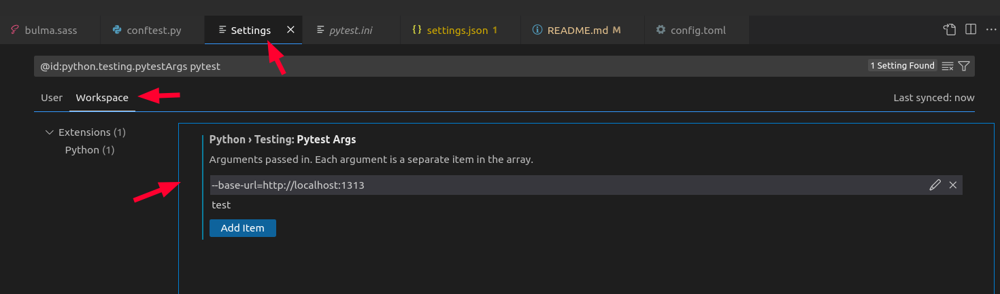
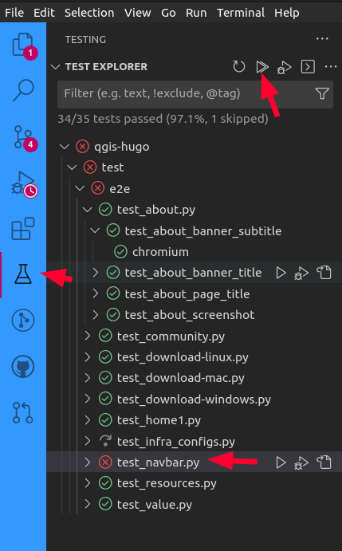
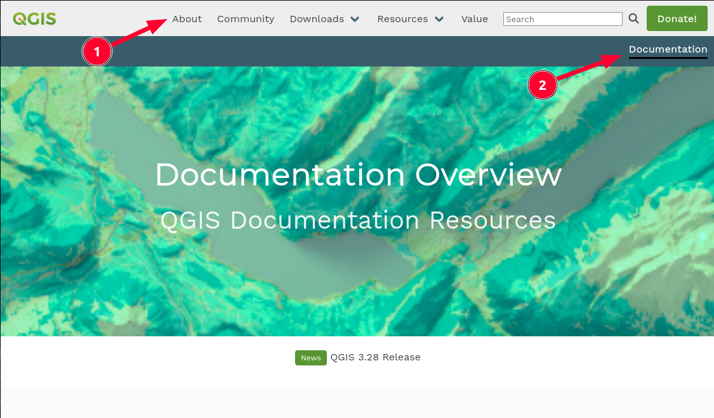

# QGIS Hugo Website


By Tim Sutton and QGIS Contributors.

## Project Status

[](https://github.com/qgis/QGIS-Hugo/actions/workflows/e2e.yml)
[](https://github.com/qgis/QGIS-Hugo/actions/workflows/hugo.yml)


Project stars:


## 🏃Before you start

This web site is a static site built using [Hugo](https://gohugo.io/).

 and using the [hugo bulma blocks theme](https://github.com/kartoza/hugo-bulma-blocks-theme).

## 🛒 Getting the Code

Navigate to your development directory

```
git clone https://github.com/qgis/QGIS-Hugo.git
cd QGIS-Hugo
git submodule add git@github.com:kartoza/hugo-bulma-blocks-theme.git themes/hugo-bulma-blocks-theme
git submodule update --init --recursive
```

## 🧑💻 Development

First install hugo for your local machine:

**📝 Note:** we need to install the 'extended' hugo version which includes a SASS compiler. If you don't install the extended version you will get errors like this when compiling:

```
ERROR 2022/12/11 07:33:37 Rebuild failed: TOCSS: failed to transform 
"css/style.scss" (text/x-scss). Check your Hugo installation; you need 
the extended version to build SCSS/SASS.: this feature is not available 
in your current Hugo version, see https://goo.gl/YMrWcn for more information
```

You can find the extended version in the [releases page](https://github.com/gohugoio/hugo/releases).


### 🐧 Linux: 

Download the deb above and then do 

``sudo dpkg -i hugo_extended_0.107.0_linux-amd64.deb``

### 🪟 Windows: 

[Follow these notes](https://gohugo.io/installation/windows/)

### 🍏 macOS: 

[Follow these notes](https://gohugo.io/installation/macos/)

## ⚙️ Setting up VSCode

If you are using VSCode, I recommend the following extensions:

* Hugo Language and Syntax Support
* Color Highlight

Clone the repo:

```
git clone https://github.com/qgis/qgis-hugo.git
```

Run the site:

Press ```Ctl-Shift-D``` then choose the following runner:

'Run dev using locally installed Hugo'

the click the green triangle next to  the runner to start it.

Once the site is running, you can open it at:

<http://localhost:1313>

The site will automatically refresh any page you have open if you edit it and save your work. Magical eh?

## Running End to End (e2e) Tests

Test files are located in ```test/e2e```.

You need to have these extras installed:

```
pip install pytest pytest-base-url playwright
```

These tests exist to make sure code changes to this repository do not break how the site currently functions.
They are intended to run on each commit to verify the site is working in expected order.

Read more on testing [here](https://github.com/qgis/QGIS-Hugo/blob/main/test/Readme.md).

## Creating and Running Tests

1. Navigate to the e2e test folder which is located in ```test/e2e```.
2. Create or edit a test file for the page or section you want to test and get coding, test files should start with the name test follow by the file name, example ```test_about_page.py```.

### Running tests in VSCode

We can enable built in pytest support in VSCode. 

**Note:** Before running the tests, you need to install the dependencies listed in REQUIREMENTS.txt:

```
pip install -r REQUIREMENTS.txt
```

And playwright:

```
pip install playwright
```

These should be set up by default when you open this project under VSCode, but if needed you can configure the VSCode settings to set the base-url (search for @id:python.testing.pytestArgs Testing in the settings filter):



Start the live debug server:


Now open the test explorer and run your tests:



Any failed tests will be marked in red as shown above.

### Running from the command line:

```
pytest --base-url=http://localhost:1313
```

### Running tests in docker

3. Start the hugo server in a terminal window ```make dev```.
4. Run test in terminal window ```make tests```

> **Note:** To run the tests as described above, you need to have docker installed on your machine and the appropriate permissions to run docker commands.

### Running as github action

There is a github action that will run the tests automatically on PR submission, merge.

See ```.github/workflows/e2e.yml```

## Content Harvesting

You can harvest data from various feeds using the fetch_feeds.py script. By default
flickr harvesting is disabled in this script so run it manually and review the content
to see if it is suitable for publication on our site.

```bash
./fetch_feeds.py --flickr=yes
```

This script is run nightly as a github action (see .github/workflows/update-feeds.yml).

## Search Functionality 
The search functionality uses both [FuseJS](https://fusejs.io/) and [MarkJS](https://markjs.io/).

The search functionality code is based on this [Blog Post](https://makewithhugo.com/add-search-to-a-hugo-site/) and [GitHub Gist](https://gist.github.com/eddiewebb/735feb48f50f0ddd65ae5606a1cb41ae) by [Eddie Webb](https://twitter.com/eddturtle).

Content folders need to be excluded from search, by making them [headless bundles](https://gohugo.io/content-management/page-bundles/#headless-bundle) - which we have done for the sustaining member and flagship user folders in content/. To make other content folders which are not rendered and included in search results, add an ```index.md``` file with the following content: ```headless = true```.

## Referencing URLs in templates

The site needs to work in production, where the links of the site are all below the root URL, and in staging, where the site is deployed to GitHub pages in a subpath. To ensure both deployment strategies work, please use the following method of constructing URLs in templates.

```html
<a class="button is-primary" href="{{ "donate/" | absURL }}">
```

**Note:** We do not use a leading slash, only an ending slash.
## 📁 File naming conventions

* Separate words in file names with hyphens e.g. windows-download.md
* Avoid abbreviations in the words of your files
* Write file names in lower case only
* No spaces in file names

## 🤝 Contributing to this project

We welcome your contributions! All contributors are expected to sign a contributor license agreement (CLA) which you can see [here](https://gist.github.com/timlinux/cc20c0b8860648da977a261d46b170d4). This process is automatically enabled when you create your first pull request via https://cla-assistant.io/.

[](https://cla-assistant.io/qgis/QGIS-Hugo)

## 💮 Changing the templates

Page type | Path
----------|---------------
Landing Page | themes/qgis/layouts/index.html
Top Level Pages | themes/qgis/layouts/_default/single.html

## 🏠 Editing the landing (home) page

The ``content/_index.md`` is the content for the landing page. Just edit whatever you like there. The blocks shortcodes are described below.

## 📃 Adding a top level page

### Create the content

Content pages are stored in the ``content`` folder. The top level documents there will be rendered with the top level page theming.

For example to add an about page, create ``content/about.md``

The page will be accessible then at /about/

### 🖼️ Referencing Images and Media

Place images and media in ```static/img```. Everything in ```static``` is referenced
from the top level of the site e.g.  ```static/img/foo.png``` would be referenced in
markdown as ```/img/foo.png```.
## 🌶️ Working with menus

There are two menus, the primary (1) menu which appears at the top of the page, and the secondary menu (2) which may appear beneath it depending on context.



### Primary Menu Pages

For pages to appear in the top menu, you need to add an entry to
``config.toml`` for example the menu for the above about page will be:

```
[[menu.main]]
  name = "About"
  url = "/about/"
  weight = -110
  # pre = "<i class='fa-solid fa-clipboard-question mr-1'></i>"
```

**Note:** The ```pre``` item is commented out. If you uncomment it, it will place a font awesome icon before the text of the menu item.


### Secondary Menu Pages

For pages to appear in the secondary menu, you need to add an entry to
``config.toml`` for example the menu for the documentation page will be:

```
[[menu.learning]]
  name = "Documentation"
  url = "/documentation/documentation-overview/"
  weight = -110
  #pre = "<i class='fa-solid fa-clipboard-question mr-1'></i>"
  [menu.learning.params]
    submenu = "documentation"
```

Use the ```submenu``` parameter to define which submenu the menu entry should be shown in. You can create as many submenu terms as you like, and then associate pages to these submenus in the front matter of your markdown documents.

### Displaying a secondary menu

In order for a secondary menu to be displayed, your content page needs to specify the submenu name in the front matter e.g.:


Example front matter listing:

```
---
type: "page"
title: "Documentation Overview"
subtitle: "QGIS Documentation Resources"
draft: false
heroImage: "img/banners/banner2.png"
submenus: documentation
---
```

**Note:** Despite the pluralised name, you should only specify one submenu name.

All of the menu entries specified in config.toml with a matching submenus term will be shown in the secondary menu when you add this to the front matter. If you specify no submenus= entry in the front matter, the secondary menu will not be rendered.

### Modifying the menu templates

The primary menu template is implemented in ```themes/qgis/layouts/partials/menu.html```.

The secondary menu template is implemented in ```themes/qgis/layouts/partials/submenu.html```.

**Note:** You typically will not need to edit the above files unless you are a developer.

