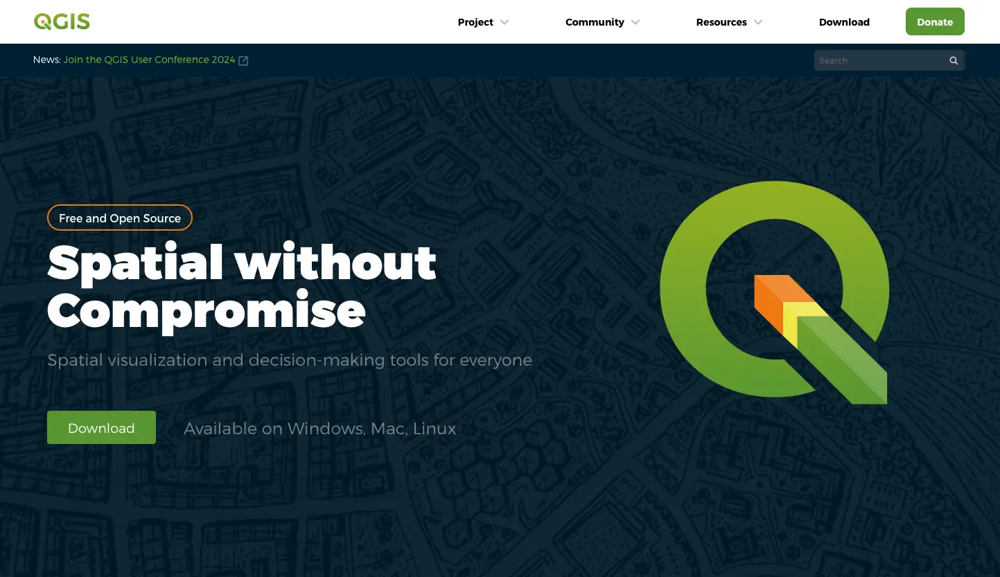
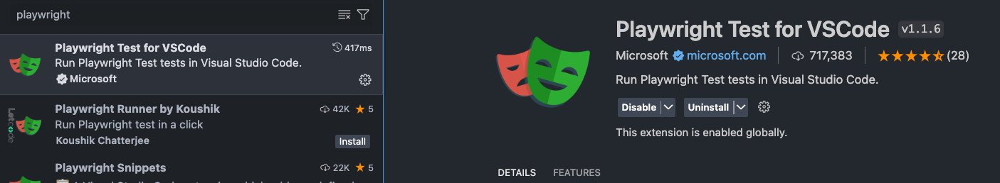
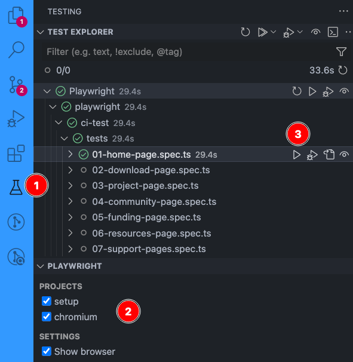

# 🌐 QGIS Website [](https://blog.qgis.org/2025/02/08/qgis-recognized-as-digital-public-good/)



> ## 👋 Welcome to QGIS.org!
>
> **This repository hosts the source code for the official QGIS Project website:**  
> 🌍 [https://qgis.org](https://qgis.org)
>
> Here you'll find everything you need to **build, develop, and contribute** to the QGIS website.
>
> ### ⚠️ Note on Subdomain Websites
>
> **This repository is _only_ for the main QGIS website ([qgis.org](https://qgis.org)).**
>
> If you are looking for the source code or want to contribute to QGIS subdomain websites, please visit their respective repositories below.  
> Each subdomain has its own codebase and contribution process:
>
> - [plugins.qgis.org](https://plugins.qgis.org) ([GitHub: QGIS-Plugins-Website](https://github.com/qgis/QGIS-Plugins-Website)) – QGIS Plugins Repository
> - [hub.qgis.org](https://hub.qgis.org) ([GitHub: QGIS-Hub-Website](https://github.com/qgis/QGIS-Hub-Website)) – QGIS Resources Hub
> - [feed.qgis.org](https://feed.qgis.org) ([GitHub: qgis-feed](https://github.com/qgis/qgis-feed)) – QGIS Feed Manager
> - [planet.qgis.org](https://planet.qgis.org) ([GitHub: QGIS-Planet-Website](https://github.com/qgis/QGIS-Planet-Website)) – QGIS Planet Blog Aggregator
> - [members.qgis.org](https://members.qgis.org) ([GitHub: QGIS-Members-Website](https://github.com/qgis/QGIS-Members-Website)) – QGIS Sustaining Members Portal
> - [certification.qgis.org](https://certification.qgis.org) ([GitHub: QGIS-Certification-Website](https://github.com/qgis/QGIS-Certification-Website)) – QGIS Certification Programme Platform
> - [changelog.qgis.org](https://changelog.qgis.org) ([GitHub: QGIS-Changelog-Website](https://github.com/qgis/QGIS-Changelog-Website)) – QGIS Changelog Manager
> - [uc2025.qgis.org](https://uc.qgis.org) ([GitHub: QGIS-UC-Website](https://github.com/qgis/QGIS-UC-Website)) – QGIS User Conference Website


<!-- TABLE OF CONTENTS -->
<h2 id="table-of-contents"> 📖 Table of Contents</h2>

<details open="open">
  <summary>Table of Contents</summary>
  <ol>
    <li><a href="#-project-overview"> 🚀 Project Overview </a></li>
    <li><a href="#-qa-status"> 🚥 QA Status </a></li>
    <li><a href="#-license"> 📜 License </a></li>
    <li><a href="#-folder-structure"> 📂 Folder Structure </a></li>
    <li><a href="#-using-ai-large-language-models"> 🤖 Using 'AI' (Large Language Models) </a></li>
    <li><a href="#-localization--build-docs"> 🌍 Localization & Build Docs </a></li>
    <li><a href="#️-scripts-overview"> 🛠️ Scripts Overview </a></li>
    <li><a href="#-using-the-nix-shell"> 🧊 Using the Nix Shell </a></li>
    <li><a href="#-contributing"> ✨ Contributing </a></li>
    <li><a href="#-have-questions"> 🙋 Have Questions? </a></li>
    <li><a href="#-contributors"> 🧑‍💻👩‍💻 Contributors </a></li>
  </ol>
</details>


## 🚀 Project Overview


## 🌍 Localization & Build Docs

- Internationalization and translation workflow: see [I18N.md](./I18N.md)
- Development and production build guide (including incremental per-language builds and media dedup): see [DEVELOPMENT.md](./DEVELOPMENT.md)


## 🚥 QA Status

### 🪪 Badges
| Badge | Description |
|-------|-------------|
| [](https://github.com/qgis/QGIS-Website/actions/workflows/playwright-e2e.yml) | End-to-end tests status (Playwright) |
| [](https://github.com/qgis/QGIS-Website/actions/workflows/github-pages.yml) | Deployment status to GitHub Pages |
|  | Website availability status |
|  | Repository license |
|  | Open issues count |
|  | Closed issues count |
|  | Open pull requests count |
|  | Closed pull requests count |

### ⭐️ Project Stars


## 📜 License

This project is licensed under the MIT License. See the [LICENSE](./LICENSE) file for details.


## 📂 Folder Structure

```plaintext
QGIS-Website/
  ├── 🖼️  assets/           # Mainly used to store the schedule.csv file
  ├── ⚙️  config/           # Hugo configuration files
  ├── 📄  content/          # Markdown content files (pages, posts)
  ├── 🗄️  data/             # Data files (YAML, JSON, TOML) for site variables
  ├── 📚  docs/             # Project documentation
  ├── 🖼️  img/              # Images files used by this README
  ├── 🧩  layouts/          # Hugo templates and partials
  ├── 🧪  playwright/       # Playwright end-to-end test scripts
  ├── 📦  public/           # Generated site output (after `hugo` build)
  ├── 🗂️  resources/        # Hugo-generated resources (e.g., minified assets)
  ├── 🛠️  scripts/          # Utility scripts for development/maintenance/harvesting
  ├── 💻  source/           # Mainly used to store the qugsneews.atom file
  ├── 📄  static/           # Static files served as-is (e.g., favicon, robots.txt)
  ├── 🎨  themes/           # Hugo themes
  ├── ⚙️  config.toml       # Main Hugo configuration file
  ├── 🤝  CONTRIBUTING.md   # Contribution guidelines
  ├── 🐍  fetch_feeds.py*   # Script to get sustaining members and other feeds to update our web site
  ├── 📜  LICENSE           # Project license
  ├── ⚙️  Makefile          # Build/Deployment automation commands
  ├── 📖  README.md         # Project overview and instructions
  ├── 📋  REQUIREMENTS.txt  # Python dependencies (pip)
  ├── 🐚  shell.nix         # Nix shell environment definition
  └── 💡  vscode.sh*        # VSCode helper script for Nix shell environment
```


## 🤖 Using 'AI' (Large Language Models)

We are fine with using LLM's and Generative Machine Learning to act as general assistants, but the following three guidelines should be followed:

1. **Repeatability:** Although we understand that repeatability is not possible generally, whenever you are verbatim using LLM or Generative Machine Learning outputs in this project, you **must** also provide the prompt that you used to generate the resource.
2. **Declaration:** Sharing the prompt above is implicit declaration that a machine learning assistant was used. If it is not obvious that a piece of work was generated, include the robot (🤖) icon next to a code snippet or text snippet.
3. **Validation:** Outputs generated by a virtual assistant should always be validated by a human and you, as contributor, take ultimate responsibility for the correct functionality of any code and the correct expression in any text or media you submit to this project.


## 🛠️ Scripts Overview

The `scripts/` folder contains utility scripts to assist with data loading, and project maintenance. Below is a summary of each script:


| Script Name                       | Description                                                                                  |
|-----------------------------------|----------------------------------------------------------------------------------------------|
| `fetch_feeds.py`                  | Simple script to get sustaining members and other feeds and update our web site with them     |
| `vscode.sh`                       | Launch VSCode with all settings and extensions needed to productively work on this project    |
| `scripts/get_commit_hash.sh`  | Get the current commit hash of this repository and write it in config/commit.toml for the website version.                                       |
| `scripts/changelog_harvest.py`  | Will create/update a visual-changelogs at content/project/visual-changelogs based on the data at data/conf.json.                                       |
| `scripts/hub_maps_harvest.py`  | Harvest maps data from https://maps.qgis.org                                       |
| `scripts/resize_image.py`  | Contains utilities to optimize images (resize, transform to webp, check validity).                                       |
| `scripts/sanitize_commercial_supports.py`  | Checks each supporter's URL at https://qgis.org/resources/support/commercial-support/ and removes each invalid ones.                                       |
| `scripts/update_donors_from_file.py`  | It will update the json file (`data/donors.json`) ordered alphabetically by the first name based on an input file.                                       |
| `scripts/update_donors.py`  | It will update the json file (`data/donors.json`) ordered alphabetically by the first name based on Stripe donations.                                       |
| `scripts/update-schedule.py`  | It will update `data/conf.json` and `content/schedule.ics`                                       |

> ✏️ **Note:** Run each script from the project root. Some scripts may require environment variables or configuration—see comments within each script for usage details.


## 🧊 Using the Nix Shell

Please refer to the [Nix section](./CONTRIBUTING.md#nix) in [CONTRIBUTING.md](./CONTRIBUTING.md).


## ✨ Contributing

We welcome contributions! Please read the [CONTRIBUTING.md](CONTRIBUTING.md) for guidelines on how to get started.


## 🙋 Have Questions?

Have questions or feedback? Feel free to open an issue or submit a Pull Request!  


## 🧑‍💻👩‍💻 Contributors

- [Tim Sutton](https://github.com/timlinux) – Original author and lead maintainer of the QGIS Website project
- [Kontur Team](https://www.kontur.io) – Responsible for the design and development of the current website version
- [Lova Andriarimalala](https://github.com/Xpirix) – Core developer and ongoing maintainer
- [QGIS Contributors](https://github.com/qgis/QGIS-Website/graphs/contributors) – See the full list of amazing contributors who have helped make this website possible.


* Hugo Language and Syntax Support
* Color Highlight

Clone the repo:

```
git clone https://github.com/qgis/QGIS-Website.git
```

Run the site:

Press ```Ctl-Shift-D``` then choose the following runner:

'Run dev using locally installed Hugo'

the click the green triangle next to  the runner to start it.

Once the site is running, you can open it at:

<http://localhost:1313>

The site will automatically refresh any page you have open if you edit it and save your work. Magical eh?

## Run in other IDEs

Use an appropriate Hugo plugin for your IDE, or run Hugo från the command line:

```shell
hugo server
```

You can then visit the hot-reloaded site in your browser at `http://localhost:1313/`

## Running Playwright End to End (e2e) Tests

Test files are located in ```playwright/ci-test/tests```.

These tests exist to make sure code changes to this repository do not break how the site currently functions.
They are intended to run on each commit to verify the site is working in the expected order.

### Run tests with VSCode

**Requirements:** NodeJS v18+

1. **Install playwright:** If you haven't already installed Playwright, you can do so by running the following commands in `playwright/ci-test` directory.

```bash
cd playwright/ci-test
npm install
```

2. **Install playwright browsers:**

```bash
npx playwright install --with-deps chromium
```

3. **Install the extension [Playwright Test for VSCode](https://marketplace.visualstudio.com/items?itemName=ms-playwright.playwright)**: This extension provides a seamless integration of Playwright testing into VSCode.



4. **Open the Testing Tab:** In VSCode, click on the Testing icon in the Activity Bar on the side of the window. This will open the Testing tab.

5. **Run Playwright Tests from the Testing Tab:**
- In the Testing tab, you should see your Playwright tests listed. If not, ensure the browser is checked under Playwright > Project menu.
- Click on the refresh button in the Testing tab to reload the tests.
- You can run individual tests by clicking the play button next to the test name.
- You can also run all tests by clicking the play button at the top of the Testing tab.



6. **Debugging Tests:**

- You can debug individual tests by clicking the debug icon (a small bug with a play button) next to the test name.
- Make sure to set breakpoints in your test files before running the debugger.

### Run tests with CLI

By default, this will run in `headless` mode just as it is in CI.

```bash
./run-tests.sh
```

**NOTE:** To run it in `UI` mode, add the `--ui` tag to the script.

```bash
$PLAYWRIGHT \
    test \
    --ui \
    --project chromium
```

Read more on testing [here](https://github.com/qgis/QGIS-Website/blob/main/playwright/ci-test/README.md).

### Running as github action

There is a github action that will run the tests automatically on PR submission, merge.

See ```.github/workflows/playwright-e2e.yml```

## Content Harvesting

You can harvest data from various feeds using the fetch_feeds.py script. By default
flickr harvesting is disabled in this script so run it manually and review the content
to see if it is suitable for publication on our site.

```bash
./fetch_feeds.py --flickr=yes
```

Flickr parsing creates new files and md pages with param `draft: true`. It can be changed to `false` after manual verification. The script will not overwrite the changes. Pictures with `draft: false` will appear on /project/overview/maps/ and /project/overview/screenshots/.

This script is run nightly as a github action (see .github/workflows/update-feeds.yml).

## Search Functionality 
The search functionality uses both [FuseJS](https://fusejs.io/) and [MarkJS](https://markjs.io/).

The search functionality code is based on this [Blog Post](https://makewithhugo.com/add-search-to-a-hugo-site/) and [GitHub Gist](https://gist.github.com/eddiewebb/735feb48f50f0ddd65ae5606a1cb41ae) by [Eddie Webb](https://twitter.com/eddturtle).

Content folders need to be excluded from search, by making them [headless bundles](https://gohugo.io/content-management/page-bundles/#headless-bundle) - which we have done for the sustaining member and flagship user folders in content/. To make other content folders which are not rendered and included in search results, add an ```index.md``` file with the following content: ```headless = true```.

## Referencing URLs in templates

The site needs to work in production, where the links of the site are all below the root URL, and in staging, where the site is deployed to GitHub pages in a subpath. To ensure both deployment strategies work, please use the following method of constructing URLs in templates.

```html
<a class="button is-primary" href="{{ "donate/" | absURL }}">
```

**Note:** We do not use a leading slash, only an ending slash.

## Styles (SASS/CSS)

SASS for most components is stored in themes/hugo-bulma-blocks-theme/assets/sass/bulma/components/

Some common styles are places in themes/hugo-bulma-blocks-theme/assets/sass/style.sass - this file is compiled as hugo template, hence has access to config.toml variables and hugo macroses

Also some bulma theme overrides are placed in themes/hugo-bulma-blocks-theme/assets/css/custom.css

## 📁 File naming conventions

* Separate words in file names with hyphens e.g. windows-download.md
* Avoid abbreviations in the words of your files
* Write file names in lower case only
* No spaces in file names

## 🤝 Contributing to this project

We welcome your contributions! All contributors are expected to sign a contributor license agreement (CLA) which you can see [here](https://gist.github.com/timlinux/cc20c0b8860648da977a261d46b170d4). This process is automatically enabled when you create your first pull request via https://cla-assistant.io/.

[](https://cla-assistant.io/qgis/QGIS-Website)

## 💮 Changing the templates

| Page type       | Path                                     |
| --------------- | ---------------------------------------- |
| Landing Page    | themes/qgis/layouts/index.html           |
| Top Level Pages | themes/qgis/layouts/_default/single.html |

## 🏠 Editing the landing (home) page

The layout of the landing page is themes/hugo-bulma-blocks-theme/layouts/index.html: the main page has many diverse blocks, that are not used anywhere else, hence its content is mostly in the partials.

The ``content/_index.md`` contains the front matter of the page and the contents for the `feature` shortcodes. Just edit whatever you like there. The blocks shortcodes are described [here](https://github.com/qgis/QGIS-Website/blob/main/docs/shortcodes.md)


## 📃 Adding a top level page

### Create the content

Content pages are stored in the ``content`` folder. The top level documents there will be rendered with the top level page theming.

For example to add an about page, create ``content/about.md``

The page will be accessible then at /about/

### 🖼️ Referencing Images and Media

Place images and media in ```static/img```. Everything in ```static``` is referenced
from the top level of the site e.g.  ```static/img/foo.png``` would be referenced in
markdown as ```/img/foo.png```.

## 📦 Blocks Shortcodes

The site uses a number of shortcodes to create reusable blocks of content. These are defined in the ```themes/hugo-bulma-blocks-theme/layouts/shortcodes/``` folder.

The shortcodes with screenshots are described [here](https://github.com/qgis/QGIS-Website/blob/main/docs/shortcodes.md)

<!-- 3rd level header with icon with title Reusable header web component -->
### Reusable header web component

TODO

### Sidebar

Sidebar is implemented in themes/hugo-bulma-blocks-theme/layouts/partials/sidebar.html

Items are retrieved from config.toml under `[menu]` section. `weight` parameter defines the order of the item.

To enable sidebar on the content page, use the following template:

```
---
type: "page"
...
sidebar: true
---


... add content here ...


```

### LT/LTR release variables

Script for parsing release schedule from the google spreadsheet is scripts/update-schedule.py. It creates data/conf.json with variables that can be used later in md/html.

Script for harvesting the visualchangelog from changelog.qgis.org is scripts/changelog_harvest.py. It will create/update a visual-changelogs at content/project/visual-changelogs based on the data at data/conf.json.

Usage:
```
$ ./scripts/changelog_harvest.py

# For a specific version
$ ./scripts/changelog_harvest.py --version 3.34 --release 21.06.2024

# Resizing the images for existing changelog
$ ./scripts/changelog_harvest.py --version 3.34 --release 21.06.2024 --use_existing
```

Example usage in md:

```
Here you will simply install the latest stable QGIS (.x ) 
```

To include param as link, use `param-link` shortcode: it correctly renders as md link, and not as plain text

```
Electronic document: 
```

Example usage in HTML:

to use params inside shortcode or partial, use wrapper:

```
{{ with index .Site.Data.conf }}
...
<a
	class="button is-primary1 mb-3"
	href="{{ .ltr_msi }}"
	onclick="thanks(this)"
	download
>Long Term Version for Windows ({{ .ltrversion }} {{ .ltrnote }})</a>

{{ end }}
```

Example usage as shortcode param:

tricky part: shortcodes can't be used as other shortcodes' params. So you need to make replacement in the outer shortcode: "tabs.html" make a replacement of `|ltrversion|` and `|version|` to the values from config.

```

```

## URL mapping from old site structure

This table represents required redirects from old URL structure to the new one:
https://docs.google.com/spreadsheets/d/12Oo761Zwgj4iLeJxdrg8I31rGzsB95z5M1PpW9pYma8/edit?usp=sharing

Notes:

- it will be more convenient to store all redirects in same file (nginx conf or else)
- hugo aliases not recommended: they work, but don't support regex. also hard to maintain: redirects are spread across content files
- use regexps to redirect from all langs
- use regexps to map between similar stuff (case studies, visual changelog) - example rewrite rules below

Bulk redirects can be done like

```
map $url $new_url {
	...
    ^/[A-Za-z-]+/site/about/case_studies/(.*).html /project/case-studies/$1/;
    ^/[A-Za-z-]+/site/forusers/visualchangelog(.*)/index.html /project/visual-changelogs/visualchangelog$1/;
	^/[A-Za-z-]+/site/forusers/usergroups.html /community/organisation/groups/;
	...
}
```

See [nginx map tutorial](https://gauravswaroop.medium.com/nginx-bulk-url-redirect-with-map-47c2cd6ad50a) and [examples with regex capture](https://dzone.com/articles/about-using-regexp-in-nginx-map)

## Stripe donations

main donation page: [https://qgis.github.io/QGIS-Website/funding/donate/](https://qgis.github.io/QGIS-Website/funding/donate/)

Stripe widget can be included to any page with the shortcode ``

Payment options are implemented with [Payment Links](https://docs.stripe.com/no-code/payment-links). Values and links can be updated in [data/stripe_products.yml](https://github.com/qgis/QGIS-Website/blob/main/data/stripe_products.yml)

**Note**: payment links also support recurring donations (subscriptions) - products with recurrent payments should be created for that matter

### Donors update from a static file
The Donors list stored in data/donors.json can be updated from one or multiple
static txt file using the script `script/update_donors_from_file.py`:

```sh
python scripts/update_donors_from_file.py <path_to_donors.txt> <path_to_donors2.txt> ...
```

### Donors scraping

Is not ported yet. Donors are stored in data/donors.json. [adddonor.pl](https://github.com/qgis/QGIS-Website/blob/master/scripts/adddonor.pl) and related scripts & webhooks should be adapted to the new format

## Auto-checking for broken links

```
docker run --rm dcycle/broken-link-checker:3 https://qgis.github.io/QGIS-Website > broken_links.csv
```

Crawls the site and reports all 404. Full run takes apout 10 mins


Made with ❤️ by Tim Sutton (@timlinux), Lova Andriarimalala (@Xpirix) and QGIS Contributors.
