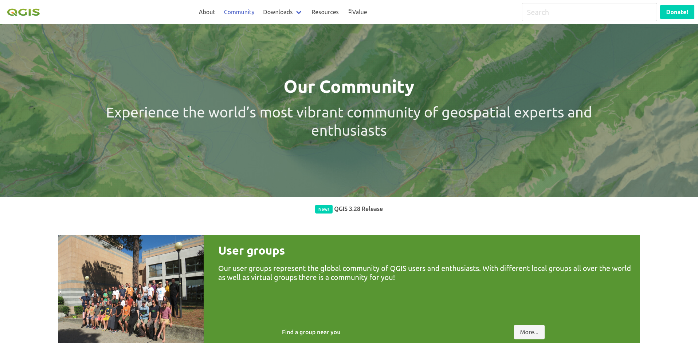
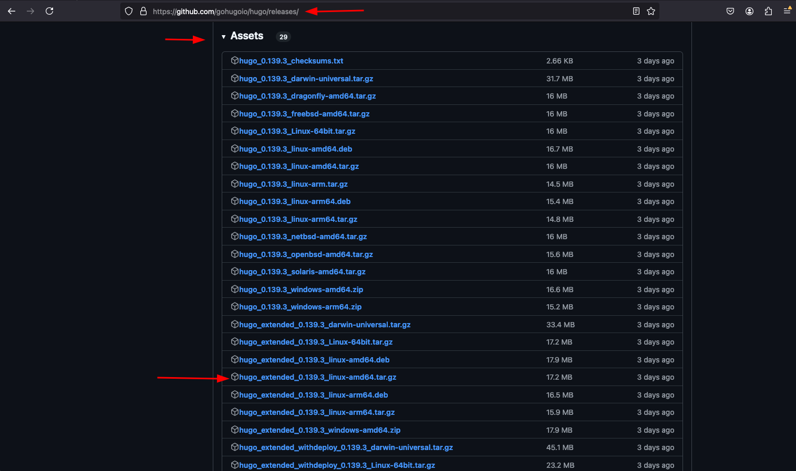
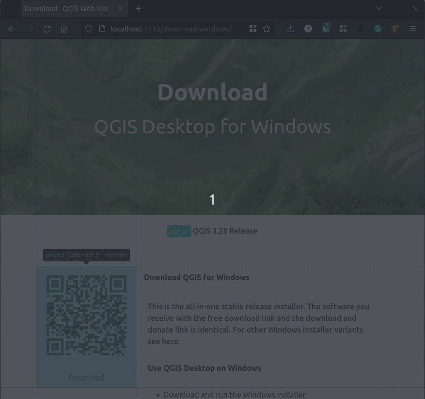
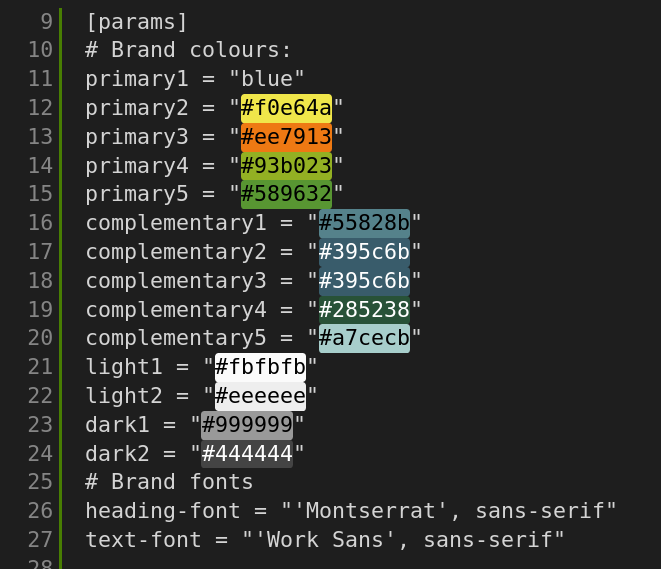
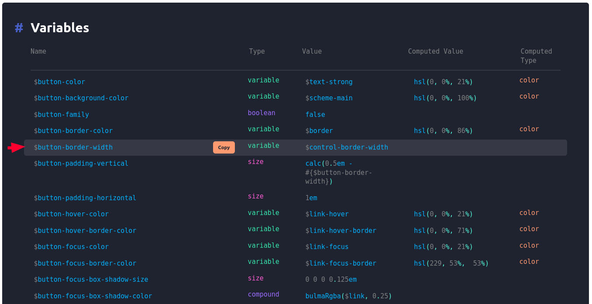

# QGIS Hugo Website



By Tim Sutton and QGIS Contributors.

## Project Status

[](https://github.com/qgis/QGIS-Hugo/actions/workflows/e2e.yml)
[](https://github.com/qgis/QGIS-Hugo/actions/workflows/hugo.yml)


Project stars:


## 🏃‍♀️Before you start

This web site is a static site built using [Hugo](https://gohugo.io/).


If you want to understand Hugo and the other technologies we used to build this site, there is some recommended reading for you below:

* Read [this article](https://cloudcannon.com/blog/the-ultimate-guide-to-hugo-sections/) on templates if you are looking to understand how templates work.

* Read [this article](https://www.regisphilibert.com/blog/2018/07/hugo-pipes-and-asset-processing-pipeline/) on hugo pipes, minifying content etc.

* Read [this article](https://blog.fullstackdigital.com/how-to-use-hugo-template-variables-in-scss-files-in-2018-b8a834accce) to see how you can use Hugo variables in your SCSS.

* Read [this article](https://versions.bulma.io/0.7.0/documentation/overview/customize/) to see the general process of customizing bulma with SASS. Note that in addition to this workflow, we also generate our SASS primary file (bulma.sass) from a Hugo template.

* This theme uses the [Bulma CSS framework](https://bulma.io/), which you should familiarise
yourself with if you want to change the theme.

* View the website design [QGIS website figma](https://www.figma.com/file/bHHUUVZ1fbQMtwSmtCSXYN/qgis-website?node-id=259%3A379)

* The relationship between some of the key concepts in Hugo is shown below:


The following key skills are needed for theme developers (DEV) and content creators (CC):

Technology | Notes | Who?
-----------|--------|-------
 | Essential skill for content creators. | DEV / CC
 | Streamlines your workflow. You can work directly in the GitHub website too. | DEV / CC
-----------|--------|-------
 | Needed for creating templates (shortcodes & partials). | DEV
 | Note that we also use Bulma. | DEV
 | We are trying to use as little javascript as possible. | DEV
 | A few utility scripts only. Mostly not needed. | DEV
 | Customising Bulma mainly. | DEV
 | Mainly Go templating via HUGO. | DEV
 | A few utility scripts only. | DEV


## 🏺 Background & Design Philosopy

The QGIS.org web site receives a **lot** of traffic so our website is designed to be fast, privacy respecting and open source, like the rest of QGIS.

* 💨 Fast: all pages are statically generated, there is no database, no bulky javascript or CSS frameworks etc.
* 🔒 Privacy respecting: as much as possible we avoid things that can be used to track you - no resources loaded from other web sites, no cookies, no trackers, no sessions etc.
* 🖊️Open source: This repository is covered by two licenses:
  * The HUGO Project and QGIS theme provided here are published under a permissive 🔑 [MIT License](LICENSE). 
  * The actual content of the web site is © QGIS.ORG amd Contributors and is made available under the [Creative Commons-NonCommercial-Share-Alike-4.0](https://creativecommons.org/licenses/by-nc-sa/4.0/) license. We chose this license to provent third parties from hosting their own, possibly malisciously altered versions of the QGIS.org web site.


**👏 A quick acknowledgement:** The starting point for this site was the web site created by the community around [jupiterbroadcasting.com](https://jupiterbroadcasting.com) . you can find their GitHub Repo [here](https://github.com/JupiterBroadcasting/jupiterbroadcasting.com) - although we have made so many changes, there probably isn't much left of the site we derived from in this repo.

## 🛒 Getting the Code

Navigate to your development directory

```
git clone https://github.com/qgis/qgis-hugo.git
```

## 🧑🏽‍💻 Development

First install hugo for your local machine:

**📝 Note:** we need to install the 'extended' hugo version which includes a SASS compiler. If you don't install the extended version you will get errors like this when compiling:

```
ERROR 2022/12/11 07:33:37 Rebuild failed: TOCSS: failed to transform 
"css/style.scss" (text/x-scss). Check your Hugo installation; you need 
the extended version to build SCSS/SASS.: this feature is not available 
in your current Hugo version, see https://goo.gl/YMrWcn for more information
```

You can find the extended version in the [releases page](https://github.com/gohugoio/hugo/releases).




### 🐧 Linux: 

Download the deb above and then do 

``sudo dpkg -i hugo_extended_0.107.0_linux-amd64.deb``

### 🪟 Windows: 

[Follow these notes](https://gohugo.io/installation/windows/)

### 🍏 macOS: 

[Follow these notes](https://gohugo.io/installation/macos/)

## ⚙️ Setting up VSCode

If you are using VSCode, I recommend the following extensions:

* Hugo Language and Syntax Support
* Color Highlight

Clone the repo:

```
git clone https://github.com/qgis/qgis-hugo.git
```

Run the site:

Press ```Ctl-Shift-D``` then choose the following runner:

'Run dev using locally installed Hugo'

the click the green triangle next to  the runner to start it.

Once the site is running, you can open it at:

<http://localhost:1313>

The site will automatically refresh any page you have open if you edit it and save your work. Magical eh?

## Running End to End (e2e) Tests

Test files are located in ```test/e2e```.

These tests exist to make sure code changes to this repository do not break how the site currently functions.
They are intended to run on each commit to verify the site is working in expected order.

Read more on testing [here](https://github.com/qgis/QGIS-Hugo/blob/main/test/Readme.md).

## Creating and Running Tests

1. Navigate to the e2e test folder which is located in ```test/e2e```.
2. Create or edit a test file for the page or section you want to test and get coding, test files should start with the name test follow by the file name, example ```test_about_page.py```.
3. Start the hugo server in a terminal window ```make dev```.
4. Run test in terminal window ```make tests```

> **Note:** To run the tests as described above, you need to have docker installed on your machine and the appropriate permissions to run docker commands.

## Search Functionality 
The search functionality uses both [FuseJS](https://fusejs.io/) and [MarkJS](https://markjs.io/).

The search functionality code is based on this [Blog Post](https://makewithhugo.com/add-search-to-a-hugo-site/) and [GitHub Gist](https://gist.github.com/eddiewebb/735feb48f50f0ddd65ae5606a1cb41ae) by [Eddie Webb](https://twitter.com/eddturtle).

Content folders need to be excluded from search, by making them [headless bundles](https://gohugo.io/content-management/page-bundles/#headless-bundle) - which we have done for the sustaining member and flagship user folders in content/. To make other content folders which are not rendererd and included in search results, add an ```index.md``` file with the following content: ```headless = true```.

## Referencing URLs in templates

The site needs to work in production, where the links of the site are all below the root URL, and in staging, where the site is deployed to GitHub pages in a subpath. To ensure both deployment strategies work, please use the following method of constructing URLs in templates.

```html
<a class="button is-primary" href="{{ "donate/" | absURL }}">
```

**Note:** We do not use a leading slash, only an ending slash.
## 📁 File naming conventions

* Separate words in file names with hyphens e.g. windows-download.md
* Avoid abbreviations in the words of your files
* Write file names in lower case only
* No spaces in file names

## 🤝 Contributing to this project

We welcome your contributions! All contributors are expected to sign a contributor license agreement (CLA) which you can see [here](https://gist.github.com/timlinux/cc20c0b8860648da977a261d46b170d4). This process is automatically enabled when you create your first pull request via https://cla-assistant.io/.

[](https://cla-assistant.io/qgis/QGIS-Hugo)

## 💮 Changing the templates

Page type | Path
----------|---------------
Landing Page | themes/qgis/layouts/index.html
Top Level Pages | themes/qgis/layouts/_default/single.html

## 🏠 Editing the landing (home) page

The ``content/_index.md`` is the content for the landing page. Just edit whatever you like there. The blocks shortcodes are described below.

## 📃 Adding a top level page

### Create the content

Content pages are stored in the ``content`` folder. The top level documents there will be rendered with the top level page theming.

For example to add an about page, create ``content/about.md``

The page will be accessible then at /about/

### 🖼️ Referencing Images and Media

Place images and media in ```static/img```. Everything in ```static``` is referenced
from the top level of the site e.g.  ```static/img/foo.png``` would be referenced in
markdown as ```/img/foo.png```.
### 🌶️ Add it to the menu

For pages to appear in the top menu, you need to add an entry to
``config.toml`` for example the menu for the above about page will be:

```
[[menu.main]]
  name = "About"
  url = "/about/"
  weight = -110
  pre = "<i class='fa-solid fa-clipboard-question mr-1'></i>"
```
## Modifying the menu template

The menu template is implemented in ```themes/qgis/layouts/partials/menu.html```.

## 🚧 Working with blocks

The different types of blocks we use are defined in ```themes/qgis/layouts/shortcodes```. The main shortcodes you will use are the ones starting with ```block```. To use a block, simply add it to your markdown as per this example:

```

```

If you want to include markdown content inside the block you can do it as inner content like this:

```

More details khdkjhksj dhjfhs dkj hsfdjkh fsd

```

The options for a block are:

Name | Description
-----|-------------
title | Title for the block
subtitle | Subtitled for the block
text-color | Use a CSS colour e.g. white or #FFFFFF
background-color | Use a CSS colour e.g. white or #FFFFFF
image | Place your images into static/img and then references it like this "img/some-image.png". **Note:** Do not include a leading slash in the image path!

## 🪪 Working with Cards

The content you write should use the card metaphor (based on Bulma CSS cards) to enclose your content in rectangular blocks so they layout in our grid nicely. Here is an example from the download page showing a QR code block and a content card side by side in the grid.



### 🎬 Starting a card

Before starting your markdown content, start a card using the ```card-start``` shortcode so it lays out nicely in our grid:

```


This is the all-in-one stable release installer. The software 
you receive with the free download link and the download and
donate link is identical. For other Windows installer variants 
see here.
```

A ```card-start``` shortcode can take the following parameters:

Name | Description
-----|-------------
header | A short piece of text to display in the card header
classes | (Optional) Any bulma classes you want to have applied to the internal content section of the card.


### 🔚 Ending a card

When you are done writing your content section, end a card using the ```card-end``` shortcode:

```

```

A ```card-end``` shortcode can take the following parameters:

Name | Description
-----|-------------
text | A short piece of (optional) text to display in the card footer
link | A URL that the user can access by clicking on the link

## Info Bar

The ```info-bar``` shortcode is a way to put a infographic style element onto your page:


```

```

To use info-bar, pass it a collection of key-value pairs separated by ``:`` colons as
illustrated above.


## Icon Bar

The ```info-icons``` shortcode is a way to put a row of circular fontawesome icon elements onto your page:


```

```

To use icon-bar, pass it a collection of key-value pairs separated by ``:`` colons as illustrated above. The second value should be a [fontawesome image name](https://fontawesome.com/search).


## Image Bar

The ```image-bar``` shortcode is a way to put a row of circular image elements onto your page:


```

```

To use image-bar, pass it a collection of key-value pairs separated by ``:`` colons as
illustrated above. The secnd value should be a path to an image.

## 🩳 Customising CSS

### Brand Identity

Brand colours are established in ```config.toml```.



These are compiled into the SASS theme when Hugo builds the site. You can further
modify the branding by overriding bulma variables. To do this, edit ```themes/qgis/assets/sass/bulma.sass``` and add your variables. Each bulma page includes a list of variables at the bottom of the page which can be used to override the default bulma styling for the various elements they provide. For example, we can to the [variable list](https://bulma.io/documentation/elements/button/#variables) for bulma buttons and choose a property to modify:



Next, set a value for that variable in ``themes/qgis/assets/sass/bulma.sass```:


Put your customizations in ```themes/qgis/assets/css/custom.css```.

We use a hugo minification and combining  workflow - see the header layout in ```themes/qgis/layouts/partials/header.html```.
