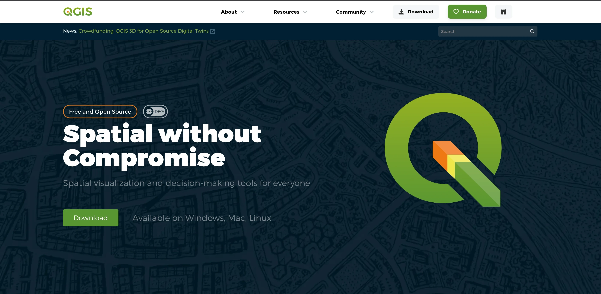

# QGIS Website
[](https://blog.qgis.org/2025/02/08/qgis-recognized-as-digital-public-good/)



By Tim Sutton and QGIS Contributors.

## Project Status

[](https://github.com/qgis/QGIS-Website/actions/workflows/playwright-e2e.yml)
[](https://github.com/qgis/QGIS-Website/actions/workflows/github-pages.yml)


Project stars:


## 🏃Before you start

This web site is a static site built using [Hugo](https://gohugo.io/).

 and using the [hugo bulma blocks theme](https://github.com/kartoza/hugo-bulma-blocks-theme).

## 🛒 Getting the Code

development
```
git clone https://github.com/qgis/QGIS-Website.git
cd QGIS-Website
```


## 🧑💻 Development

For Nix based development environment, please skip directly to the [Nix](#nix) section.

First install hugo for your local machine:

**📝 Note:** we need to install the 'extended' hugo version which includes a SASS compiler. If you don't install the extended version you will get errors like this when compiling:

```
ERROR 2022/12/11 07:33:37 Rebuild failed: TOCSS: failed to transform 
"css/style.scss" (text/x-scss). Check your Hugo installation; you need 
the extended version to build SCSS/SASS.: this feature is not available 
in your current Hugo version, see https://goo.gl/YMrWcn for more information
```

Currently, the website requires Hugo with a minimum version of `v0.139.0`. Ensure you have a compatible version installed to avoid any build issues.

You can find the extended version `v0.139.0` [here](https://github.com/gohugoio/hugo/releases/tag/v0.139.0).


### 🐧 Linux: 

Download the latest version and then do 

``sudo dpkg -i hugo_extended_<latest>_linux-amd64.deb``

**📝 Note:** if your system has another version of Hugo, no need to mess up with docker, snap, nix. Just extract the binaries somewhere with `dpkg -x` .
Example, assuming that you use a dedicated directory for your local binaries :

```sh
mkdir -p ~/apps/hugo_139/
wget https://github.com/gohugoio/hugo/releases/download/v0.139.0/hugo_extended_0.139.3_linux-amd64.deb --output-document ~/apps/hugo_128/hugo_extended_0.139.3_linux-amd64.deb 
dpkg -x hugo_extended_0.139.3_linux-amd64.deb
~/apps/hugo_128/usr/local/bin/hugo server  
```

### 🪟 Windows

[Follow these notes](https://gohugo.io/installation/windows/#prebuilt-binaries)

### 🍏 macOS: 

[Follow these notes](https://gohugo.io/installation/macos/#prebuilt-binaries)

### Nix

Run the following command on this project root folder:

```sh
nix-shell # It will install all the dependecies
hugo server # To run the local server
```

## ⚙️ Setting up VSCode

If you are using VSCode, I recommend the following extensions:

* Hugo Language and Syntax Support
* Color Highlight

Clone the repo:

```
git clone https://github.com/qgis/QGIS-Website.git
```

Run the site:

Press ```Ctl-Shift-D``` then choose the following runner:

'Run dev using locally installed Hugo'

the click the green triangle next to  the runner to start it.

Once the site is running, you can open it at:

<http://localhost:1313>

The site will automatically refresh any page you have open if you edit it and save your work. Magical eh?

## Run in other IDEs

Use an appropriate Hugo plugin for your IDE, or run Hugo från the command line:

```shell
hugo server
```

You can then visit the hot-reloaded site in your browser at `http://localhost:1313/`

## Running Playwright End to End (e2e) Tests

Test files are located in ```playwright/ci-test/tests```.

These tests exist to make sure code changes to this repository do not break how the site currently functions.
They are intended to run on each commit to verify the site is working in the expected order.

### Run tests with VSCode

**Requirements:** NodeJS v18+

1. **Install playwright:** If you haven't already installed Playwright, you can do so by running the following commands in `playwright/ci-test` directory.

```bash
cd playwright/ci-test
npm install
```

2. **Install playwright browsers:**

```bash
npx playwright install --with-deps chromium
```

3. **Install the extension [Playwright Test for VSCode](https://marketplace.visualstudio.com/items?itemName=ms-playwright.playwright)**: This extension provides a seamless integration of Playwright testing into VSCode.


4. **Open the Testing Tab:** In VSCode, click on the Testing icon in the Activity Bar on the side of the window. This will open the Testing tab.

5. **Run Playwright Tests from the Testing Tab:**
- In the Testing tab, you should see your Playwright tests listed. If not, ensure the browser is checked under Playwright > Project menu.
- Click on the refresh button in the Testing tab to reload the tests.
- You can run individual tests by clicking the play button next to the test name.
- You can also run all tests by clicking the play button at the top of the Testing tab.


6. **Debugging Tests:**

- You can debug individual tests by clicking the debug icon (a small bug with a play button) next to the test name.
- Make sure to set breakpoints in your test files before running the debugger.

### Run tests with CLI

By default, this will run in `headless` mode just as it is in CI.

```bash
./run-tests.sh
```

**NOTE:** To run it in `UI` mode, add the `--ui` tag to the script.

```bash
$PLAYWRIGHT \
    test \
    --ui \
    --project chromium
```

Read more on testing [here](https://github.com/qgis/QGIS-Website/blob/main/playwright/ci-test/README.md).

### Running as github action

There is a github action that will run the tests automatically on PR submission, merge.

See ```.github/workflows/playwright-e2e.yml```

## Content Harvesting

You can harvest data from various feeds using the fetch_feeds.py script. By default
flickr harvesting is disabled in this script so run it manually and review the content
to see if it is suitable for publication on our site.

```bash
./fetch_feeds.py --flickr=yes
```

Flickr parsing creates new files and md pages with param `draft: true`. It can be changed to `false` after manual verification. The script will not overwrite the changes. Pictures with `draft: false` will appear on /project/overview/maps/ and /project/overview/screenshots/.

This script is run nightly as a github action (see .github/workflows/update-feeds.yml).

## 🌐 Internationalization (i18n) and Translation Workflow

The QGIS Website project is fully internationalized using [hugo-gettext](https://github.com/PhuNH/hugo-gettext) and [Transifex](https://www.transifex.com/). The translation workflow is fully integrated and automated via CI/CD.

### Folder Structure

- **Original content:**
  - `content/` — English (source language) content.
- **Translated content:**
  - `content-translated/de/`, `content-translated/es/`, etc. — Translated content for each language, mirroring the structure of `content/`.
- **Translation files:**
  - `translations/en/messages.pot` — Extracted source strings (template).
  - `translations/de/messages.po`, `translations/es/messages.po`, etc. — Translations for each language.
- **YAML translations:**
  - `i18n/en.yml` — Source strings for HTML templates.
  - `i18n/de.yml`, `i18n/es.yml`, etc. — Translations for HTML templates.
  - `tx-temp/` — Temporary directory for Transifex YAML files.

### Hugo and hugo-gettext Configuration

The configuration for hugo-gettext is set in `config.toml`:

```toml
[i18n]
package = "messages"
srcDir = "content"
genDir = "content-translated"
excludedKeys = "heroSize heroImage ..."
[i18n.content]
  [i18n.content.default]
    globs = ["content/**/*.md"]
[languages]
  [languages.en]
    contentDir = "content"
  [languages.de]
    contentDir = "content-translated/de"
  [languages.es]
    contentDir = "content-translated/es"
```

### Translation Workflow

The translation process is fully automated and consists of the following steps:

1. **String extraction:**
   - On each update, `hugo-gettext extract translations/en/` is run to extract all translatable strings from the source content. The output is saved to `translations/en/messages.pot`.
2. **Transifex integration:**
   - The extracted `.pot` file is automatically pushed to Transifex using the Transifex CLI (`tx push -s`).
   - Translators work on translations in Transifex.
   - Translated `.po` files are regularly pulled from Transifex (`tx pull -a`).
3. **Compilation and generation:**
   - All `.po` files are compiled to `.mo` files with `hugo-gettext compile translations`.
   - Translated content is generated for each language using `hugo-gettext generate`, producing the localized content in `content-translated/<lang>/`.
4. **CI/CD:**
   - All these steps are run automatically in the CI/CD pipeline (see `.github/workflows/i18n.yml`).

### Transifex Configuration

The project includes a preconfigured `.tx/config` with two resources:

```ini
[main]
host = https://app.transifex.com

[o:qgis:p:qgis-website:r:qgis-hugo-docs-md]
file_filter = translations/<lang>/messages.po
source_file = translations/en/messages.pot
source_lang = en
type = PO
resource_name = qgis-hugo-docs-md

[o:qgis:p:qgis-website:r:qgis-hugo-docs-yml]
file_filter = tx-temp/<lang>.yml
source_file = tx-temp/en.yml
source_lang = en
type = YML
resource_name = qgis-hugo-docs-yml
```

The configuration defines two resources:
1. `qgis-hugo-docs-md` - for markdown content translations (PO files)
2. `qgis-hugo-docs-yml` - for YAML translations used in HTML templates

The Transifex API token is stored in the CI/CD environment and in `~/.transifexrc` for local development.

### Translating Shortcode Parameters

When using shortcodes in your content, you need to specify which parameters should be translated. This is done by adding the parameters to the `i18n.shortcodes.params` section in `config.toml`.

For example, if you have a shortcode `my-shortcode` with parameters `title` and `description` that need to be translated, you would add them to the config like this:

```toml
[i18n.shortcodes.params]
  my-shortcode = ["title", "description"]
```

When you add a new shortcode or modify an existing one, make sure to add any translatable parameters to this configuration. This ensures that the parameters will be included in the translation files when you run `hugo i18n --gen`.

### YAML Translations for HTML Templates

For translations used in HTML templates (not in markdown files), we use a different approach:

1. **Translation Keys in HTML:**
   - Use the `{{ i18n "key" }}` function in HTML templates to reference translatable strings
   - Example: `{{ i18n "exploreQgis" }}` in `themes/hugo-bulma-blocks-theme/layouts/partials/explore.html`

2. **YAML Translation Files:**
   - Translations are stored in YAML files in the `i18n/` directory
   - Each language has its own file (e.g., `i18n/en.yml`, `i18n/ru.yml`)
   - Format: `key: "translated text"`

3. **Transifex Integration:**
   - Due to different YAML formats between Hugo and Transifex, we use conversion scripts:
     - `scripts/tx_convert_push.py`: Converts Hugo YAML to Transifex format
     - `scripts/tx_convert_pull.py`: Converts Transifex YAML back to Hugo format

### Example CI/CD Steps

The following steps are executed automatically:

```yaml
- name: Extract strings
  run: hugo-gettext extract
- name: Push to Transifex
  run: tx push -s
- name: Pull translations
  run: tx pull -a
- name: Compile .po to .mo
  run: hugo-gettext compile translations/
- name: Generate translated content
  run: hugo-gettext generate
```

### Makefile Commands for Translations

The following Makefile commands are available for translation management:

```bash
# Extract translatable strings from content and create/update messages.pot
# This command scans all content files and extracts strings marked for translation
make messages-extract

# Compile .po files to .mo files
# This step is necessary for Hugo to use the translations
make messages-compile

# Generate translated content from .mo files
# Creates translated versions of content in content-translated/<lang>/
make messages-generate

# Push source strings to Transifex
# Converts and uploads English strings to Transifex for translation
make txpush

# Pull translations from Transifex
# Downloads translations from Transifex and converts them to Hugo format
make txpull

# Create Python virtual environment
# Sets up Python environment needed for translation scripts
make venv
```

These commands are typically used in sequence during the translation workflow:

1. `make venv` - Set up the Python environment
2. `pip install -r requirements.txt` - Install required packages
3. `make messages-extract` - Extract strings for translation
4. `make txpush` - Upload strings to Transifex
5. `make txpull` - Download translations from Transifex
6. `make messages-compile` - Compile translations
7. `make messages-generate` - Generate translated content

The commands are used in the CI/CD pipeline and can also be run locally for development. Each command has its own target in the Makefile and can be run independently.

### Summary
- The i18n process is fully integrated and automated.
- Source content is in `content/`, translations are in `content-translated/<lang>/`.
- All translation files are managed in `translations/` and synchronized with Transifex.
- No manual steps are required for regular translation updates — everything is handled by the pipeline.

## Search Functionality 
The search functionality uses both [FuseJS](https://fusejs.io/) and [MarkJS](https://markjs.io/).

The search functionality code is based on this [Blog Post](https://makewithhugo.com/add-search-to-a-hugo-site/) and [GitHub Gist](https://gist.github.com/eddiewebb/735feb48f50f0ddd65ae5606a1cb41ae) by [Eddie Webb](https://twitter.com/eddturtle).

Content folders need to be excluded from search, by making them [headless bundles](https://gohugo.io/content-management/page-bundles/#headless-bundle) - which we have done for the sustaining member and flagship user folders in content/. To make other content folders which are not rendered and included in search results, add an ```index.md``` file with the following content: ```headless = true```.

## Referencing URLs in templates

The site needs to work in production, where the links of the site are all below the root URL, and in staging, where the site is deployed to GitHub pages in a subpath. To ensure both deployment strategies work, please use the following method of constructing URLs in templates.

```html
<a class="button is-primary" href="{{ "donate/" | absURL }}">
```

**Note:** We do not use a leading slash, only an ending slash.

## Styles (SASS/CSS)

SASS for most components is stored in themes/hugo-bulma-blocks-theme/assets/sass/bulma/components/

Some common styles are places in themes/hugo-bulma-blocks-theme/assets/sass/style.sass - this file is compiled as hugo template, hence has access to config.toml variables and hugo macroses

Also some bulma theme overrides are placed in themes/hugo-bulma-blocks-theme/assets/css/custom.css

## 📁 File naming conventions

* Separate words in file names with hyphens e.g. windows-download.md
* Avoid abbreviations in the words of your files
* Write file names in lower case only
* No spaces in file names

## 🤝 Contributing to this project

We welcome your contributions! All contributors are expected to sign a contributor license agreement (CLA) which you can see [here](https://gist.github.com/timlinux/cc20c0b8860648da977a261d46b170d4). This process is automatically enabled when you create your first pull request via https://cla-assistant.io/.

[](https://cla-assistant.io/qgis/QGIS-Website)

## 💮 Changing the templates

| Page type       | Path                                     |
| --------------- | ---------------------------------------- |
| Landing Page    | themes/qgis/layouts/index.html           |
| Top Level Pages | themes/qgis/layouts/_default/single.html |

## 🏠 Editing the landing (home) page

The layout of the landing page is themes/hugo-bulma-blocks-theme/layouts/index.html: the main page has many diverse blocks, that are not used anywhere else, hence its content is mostly in the partials.

The ``content/_index.md`` contains the front matter of the page and the contents for the `feature` shortcodes. Just edit whatever you like there. The blocks shortcodes are described [here](https://github.com/qgis/QGIS-Website/blob/main/docs/shortcodes.md)


## 📃 Adding a top level page

### Create the content

Content pages are stored in the ``content`` folder. The top level documents there will be rendered with the top level page theming.

For example to add an about page, create ``content/about.md``

The page will be accessible then at /about/

### 🖼️ Referencing Images and Media

Place images and media in ```static/img```. Everything in ```static``` is referenced
from the top level of the site e.g.  ```static/img/foo.png``` would be referenced in
markdown as ```/img/foo.png```.

## 📦 Blocks Shortcodes

The site uses a number of shortcodes to create reusable blocks of content. These are defined in the ```themes/hugo-bulma-blocks-theme/layouts/shortcodes/``` folder.

The shortcodes with screenshots are described [here](https://github.com/qgis/QGIS-Website/blob/main/docs/shortcodes.md)

<!-- 3rd level header with icon with title Reusable header web component -->
### Reusable header web component

TODO

### Sidebar

Sidebar is implemented in themes/hugo-bulma-blocks-theme/layouts/partials/sidebar.html

Items are retrieved from config.toml under `[menu]` section. `weight` parameter defines the order of the item.

To enable sidebar on the content page, use the following template:

```
---
type: "page"
...
sidebar: true
---


... add content here ...


```

### LT/LTR release variables

Script for parsing release schedule from the google spreadsheet is scripts/update-schedule.py. It creates data/conf.json with variables that can be used later in md/html.

Script for harvesting the visualchangelog from changelog.qgis.org is scripts/changelog_harvest.py. It will create/update a visual-changelogs at content/project/visual-changelogs based on the data at data/conf.json.

Usage:
```
$ ./scripts/changelog_harvest.py

# For a specific version
$ ./scripts/changelog_harvest.py --version 3.34 --release 21.06.2024

# Resizing the images for existing changelog
$ ./scripts/changelog_harvest.py --version 3.34 --release 21.06.2024 --use_existing
```

Example usage in md:

```
Here you will simply install the latest stable QGIS (.x ) 
```

To include param as link, use `param-link` shortcode: it correctly renders as md link, and not as plain text

```
Electronic document: 
```

Example usage in HTML:

to use params inside shortcode or partial, use wrapper:

```
{{ with index .Site.Data.conf }}
...
<a
	class="button is-primary1 mb-3"
	href="{{ .ltr_msi }}"
	onclick="thanks(this)"
	download
>Long Term Version for Windows ({{ .ltrversion }} {{ .ltrnote }})</a>

{{ end }}
```

Example usage as shortcode param:

tricky part: shortcodes can't be used as other shortcodes' params. So you need to make replacement in the outer shortcode: "tabs.html" make a replacement of `|ltrversion|` and `|version|` to the values from config.

```

```

## URL mapping from old site structure

This table represents required redirects from old URL structure to the new one:
https://docs.google.com/spreadsheets/d/12Oo761Zwgj4iLeJxdrg8I31rGzsB95z5M1PpW9pYma8/edit?usp=sharing

Notes:

- it will be more convenient to store all redirects in same file (nginx conf or else)
- hugo aliases not recommended: they work, but don't support regex. also hard to maintain: redirects are spread across content files
- use regexps to redirect from all langs
- use regexps to map between similar stuff (case studies, visual changelog) - example rewrite rules below

Bulk redirects can be done like

```
map $url $new_url {
	...
    ^/[A-Za-z-]+/site/about/case_studies/(.*).html /project/case-studies/$1/;
    ^/[A-Za-z-]+/site/forusers/visualchangelog(.*)/index.html /project/visual-changelogs/visualchangelog$1/;
	^/[A-Za-z-]+/site/forusers/usergroups.html /community/organisation/groups/;
	...
}
```

See [nginx map tutorial](https://gauravswaroop.medium.com/nginx-bulk-url-redirect-with-map-47c2cd6ad50a) and [examples with regex capture](https://dzone.com/articles/about-using-regexp-in-nginx-map)

## Stripe donations

main donation page: [https://qgis.github.io/QGIS-Website/funding/donate/](https://qgis.github.io/QGIS-Website/funding/donate/)

Stripe widget can be included to any page with the shortcode ``

Payment options are implemented with [Payment Links](https://docs.stripe.com/no-code/payment-links). Values and links can be updated in [data/stripe_products.yml](https://github.com/qgis/QGIS-Website/blob/main/data/stripe_products.yml)

**Note**: payment links also support recurring donations (subscriptions) - products with recurrent payments should be created for that matter

### Donors update from a static file
The Donors list stored in data/donors.json can be updated from one or multiple
static txt file using the script `script/update_donors_from_file.py`:

```sh
python scripts/update_donors_from_file.py <path_to_donors.txt> <path_to_donors2.txt> ...
```

### Donors scraping

Is not ported yet. Donors are stored in data/donors.json. [adddonor.pl](https://github.com/qgis/QGIS-Website/blob/master/scripts/adddonor.pl) and related scripts & webhooks should be adapted to the new format

## Auto-checking for broken links

```
docker run --rm dcycle/broken-link-checker:3 https://qgis.github.io/QGIS-Website > broken_links.csv
```

Crawls the site and reports all 404. Full run takes apout 10 mins
