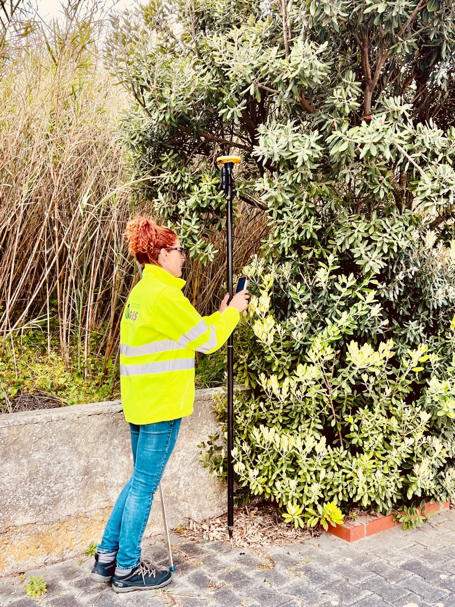
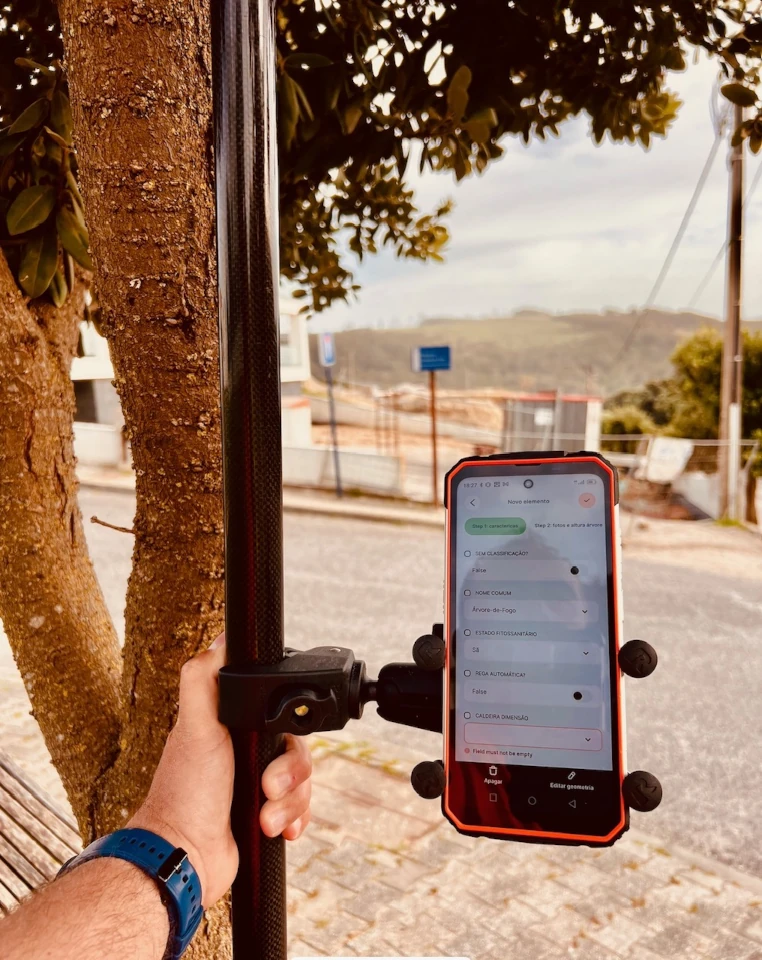
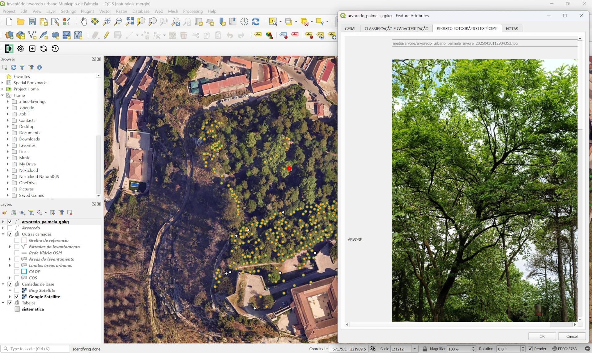



# Using QGIS and Mergin Maps for creating urban tree inventories in Portugal

NaturalGIS \[<https://www.naturalgis.pt>\] is a Portuguese company specializing in Geographic Information Systems (GIS), 
with a particular focus on QGIS and PostGIS technologies. Their core business encompasses 
providing technical support, training and development of custom GIS solutions 
including WebGIS platforms and QGIS plugins.

Mergin Maps \[<https://merginmaps.com>\] is a geospatial data platform that enables field data collection 
and synchronization using QGIS. Its core business is providing tools for 
offline mobile mapping and collaborative GIS workflows. The service is widely used 
in environmental monitoring, telecommunications, agriculture or asset management.

In 2021, the Portuguese government passed a law governing the management of 
trees in urban areas that requires municipalities to publish an inventory of 
all trees on urban public land. NaturalGIS is using QGIS Mergin Maps to 
conduct surveys to create urban tree inventories 
in several Portuguese municipalities (i.e. Mação, Palmela, Lourinhã and Soure). 
The combination of QGIS and Mergin Maps allows the creation of a custom data 
structure to match the requirements of the regulations while providing a 
simplified mobile interface for non-technical users to collect accurate survey data.

{.align-right}

## Designing a Regulatory-Compliant Tree Survey with QGIS 

The regulation dictates that the following information must be collected for each tree that is on municipal owned land:

-   Species or other special class
-   Dimensions (total height, diameter, etc.)
-   Approximate age
-   Health status
-   Geolocation
-   Reasons for protective status (if any)

In order to confirm proper identification of the trees, photographs are also taken 
of the trunk, stems, leaves and any fruit/cones. Additional details such as the type 
of soil where the tree is planted, irrigation system, canopy size, signs of disease/distress 
or defects and other information are also collected.

The project was designed using QGIS and the data was hosted on their own server 
with a deployment of Mergin Maps Community Edition (CE), a version of Mergin Maps 
published under the GNU AGPL-3 license. 

The project setup used some conditional visibility and photo attachment widgets. Due to the large number
of photos needed to collect for the project, a feature in Mergin Maps that restricts photo 
downloads for each device was used. To further save device storage, each day a script was run using the 
Mergin Maps CLI (Command Line Interface) tools to remove the photos from the project and store them on a web server. 
Then a link to the photo was stored in a dedicated field in the survey layer 
which allowed the photo to be previewed in the app.

{.align-right}

## Data collection optimised for mobile use

The data was collected by teams of 2-4 surveyors in each municipality. 
Typically they could collect data at a pace of about 150 trees per day on average. 
The mobile-optimised interface for Mergin Maps made it easy for non-technical users to 
learn the data collection methods quickly.

Once the initial inventory was collected by the team, they would carry out a handover process 
to train the local municipality team on how to manage the project in QGIS and update the data in the app as needed.
The use of QGIS and Mergin Maps for this project ensured that the tree inventory could be 
collected accurately and in a timely manner.

{.align-right}

## Author

Giovanni Manghi B.Sc. in Biology, is co-owner and CTO at NaturalGIS located in Évora, Portugal.

