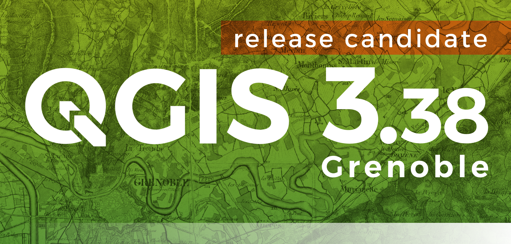
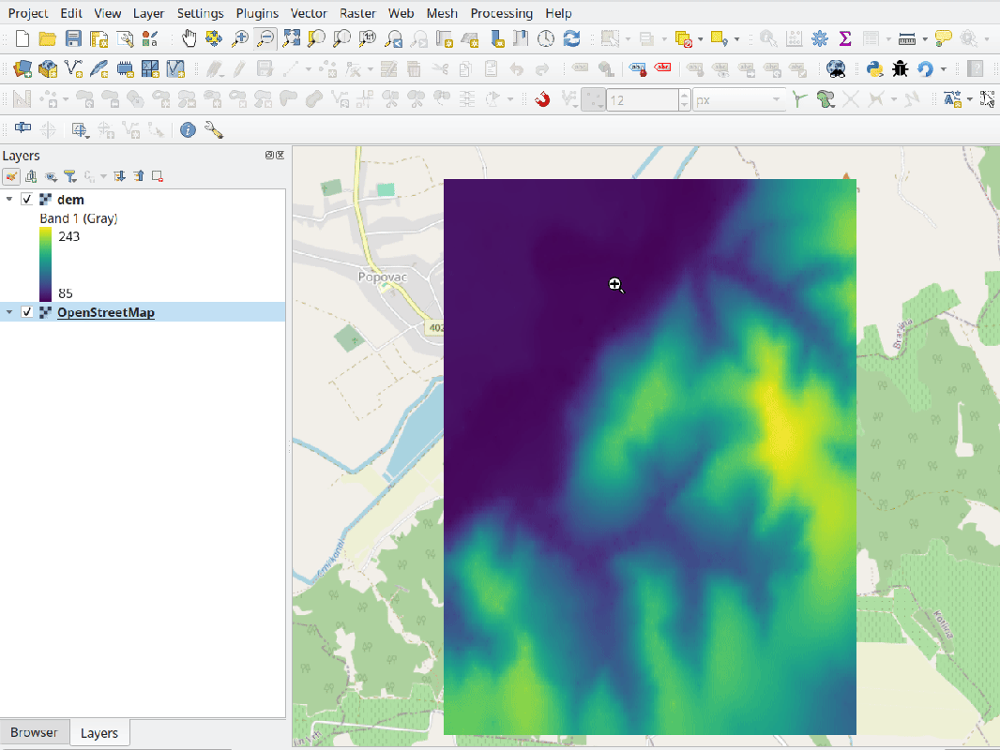
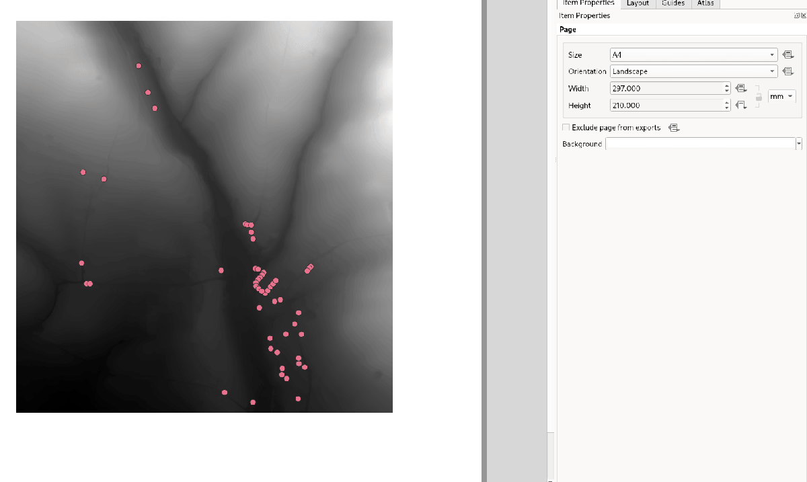
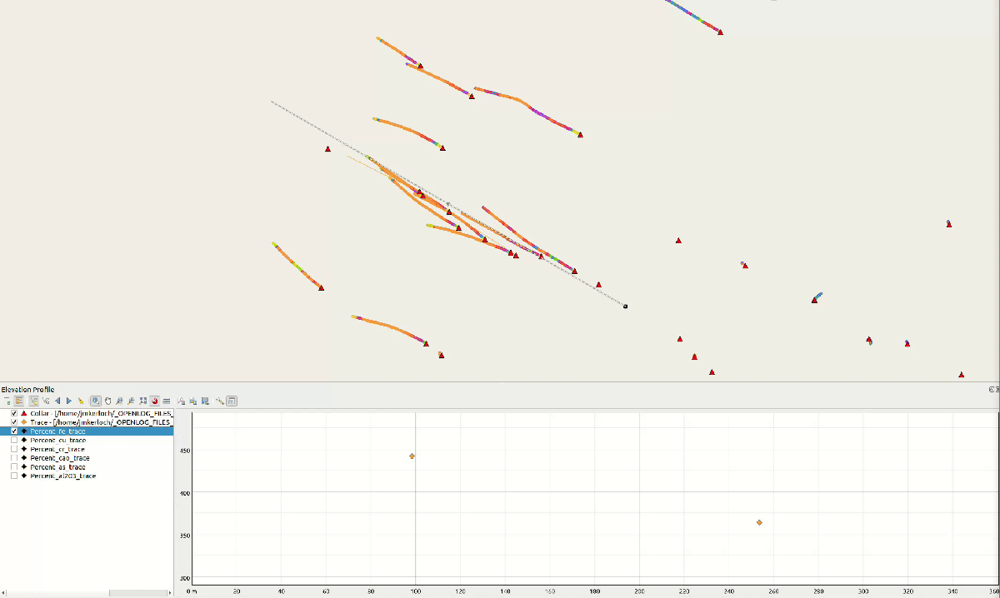



# Changelog for QGIS 3.38 {#changelog338}

Release date: 2024-06-21

The QGIS Project is proud to announce the release of QGIS 3.38 Grenoble, a landmark update brimming with advancements designed to empower users on their journey of spatial discovery. This release includes enhanced data filtering capabilities and the tight integration of filter criteria across different project elements, providing extended control to empower users in refining their data exploration processes.

Various improvements have been provided for elevation management, including the new elevation controller as well as the ability to explicitly declare a vertical CRS for your project. Previous releases actively removed vertical CRS information for technical reasons, as outlined in [QGIS Enhancement Proposal 267](https://github.com/qgis/QGIS-Enhancement-Proposals/issues/267), however, this vital aspect of spatial data management is now being reintroduced to the QGIS project.

Beyond these core improvements, QGIS 3.38 boasts a wealth of enhancements and quality-of-life improvements, including various usability enhancements, CMYK color support, improved search functionalities, and new features for data types such as DXF, Mesh, and SensorThings.

For a whirlwind tour of all the new functionalities introduced, you can view the [highlight reel video on YouTube](https://www.youtube.com/watch?v=oktjj7xBZ54).

QGIS is a community effort, and we would like to extend a big thank you to the developers, documenters, testers, and the many folks out there who volunteer their time and effort (or fund people to do so) to make these releases possible. From the QGIS community, we hope you enjoy this release! If you wish to donate time, money, or otherwise contribute towards making QGIS more awesome, please wander along to [QGIS.ORG](https://qgis.org) and lend a hand!

QGIS is supported by donors and sustaining members. A current list of donors who have made financial contributions large or small to the project can be seen on our [list of donors](https://qgis.org/en/site/about/sustaining_members.html#list-of-donors). If you would like to become an official project sustaining member, please visit our [sustaining member page](https://qgis.org/en/site/about/sustaining_members.html) for more details. Sponsoring QGIS helps us to fund our regular developer meetings, maintain project infrastructure, and fund bug-fixing efforts. A complete list of current sponsors is provided below - our very thank you to all of our sponsors!

QGIS is free software and you are under no obligation to pay anything to use it - in fact, we want to encourage people far and wide to use it regardless of their financial or social status - we believe that empowering people with spatial decision-making tools will result in a better society for all of humanity.

## Temporal 

### Feature: New temporal mode: pixel value as temporal datetime

A new temporal mode for raster layers is provided that interprets each pixel as a datetime value.

When rendering a raster layer using that temporal mode, pixels will be hidden whenever they fall outside of the temporal range attached to the render context.

Examples of some interesting temporal use cases include:

-   representation of land use change such as forest loss
-   representation of flooding over time
-   representation of movement cost (e.g. GRASS' `r.walk`)

This feature was developed by [Mathieu Pellerin](https://github.com/nirvn)

## Map Tools 

### Feature: Add Elevation Controller for filtering vertical data in 2d maps

A new Elevation Controller provides users with the ability to filter vertical data in 2D maps, providing the equivalent experience of the temporal controller for elevation z-range slicing of data in line with [QEP 201](https://github.com/qgis/QGIS-Enhancement-Proposals/issues/201).

This feature is accessed through a new "Data Filtering" submenu in the View menu, along with new menu items for the Temporal Controller.

The controller shows as a range slider on the left of the map. There's a configure action for setting the project's elevation range, which dictates the range available from the widget.

This feature was developed by [Nyall Dawson](https://github.com/nyalldawson)

### Feature: Add Z range support to map canvas / map settings items

Elevation filtering is now supported in map canvases

This feature was developed by [Mathieu Pellerin](https://github.com/nirvn)

### Feature: Add option to set a fixed elevation slice width for elevation controller

A new option is provided on the configuration menu of the elevation controller, which allows for setting a fixed elevation slice width.

It can be used when a specific elevation range width is desired, or when the range should always be zero width.

This feature was developed by [Nyall Dawson](https://github.com/nyalldawson)

## User Interface 

### Feature: Add search option for regular expression based searching

A new optional regex mode has been exposed for advanced search options, as implemented in the updated search functionality for the code editor.

This feature was developed by [Nyall Dawson](https://github.com/nyalldawson)

### Feature: Data defined override: use middle-click to open the Expression Builder dialog window

## Description

The middle-click on the Data defined override icon makes the Expression Builder dialog window open, as a convenient shortcut for right-clicking and then left-clicking on the Edit menu item.

This feature was developed by [Andrea Giudiceandrea](https://github.com/agiudiceandrea)

## Symbology 

### Feature: New single color renderer for rasters

A new single-color symbology has been added for raster layers. This allows for a super simple and friendly way to render a raster using a single color.

This feature was developed by [Mathieu Pellerin](https://github.com/nirvn)

### Feature: Add support for Wind Barb rendering for mesh vector datasets

Wind Barbs are a common way to display wind strength and direction on maps, and the new Wind Barb symbology type makes it easy for users to use this powerful visualization style for their mesh vector datasets.

Wind barbs encode the wind speed in knots (nautical miles per hour) so users must explicitly select the relevant data units for their data to display correctly, or use a custom multiplier to convert the value to knots.

This feature was developed by [Stefanos Natsis](https://github.com/uclaros)

## Labelling 

### Feature: Add maximum distance setting for point labels

A new optional setting has been added for the "Around point" and "Cartographic" placement modes to specify the maximum distance of the labels from the feature. It's used together with the existing distance setting to define a range of distances at which labels may be placed from their corresponding point features.

This adds more flexibility to the placement of these layers, ultimately allowing for more labels to be placed on busy maps.

When the layer is set to the "around point" mode, then label candidates that are closer to the point will always be preferred over those that are further away.

When the layer is set to the "cartographic" mode, then the default behavior is also to prioritize closer labels. A new combo box allows users to control the priority, with an option for preferring position ordering. If this option is set, candidates at the corresponding positions (e.g. top left) are preferred, regardless of how far they are from the point, with the labeling falling back to alternate positions only when no labels can be placed up to the maximum label distance.

This feature was funded by Rubicon Concierge Real Estate Services

This feature was developed by [Nyall Dawson](https://github.com/nyalldawson)

### Feature: Add 'over point' placement option for cartographic label mode

A new option for label placement has been added for "O" = "over point" when the label placement mode is set to the "cartographic" mode.

When a feature's data-defined placement priorities include this new 'O' option, a label can be placed directly over the corresponding point.

This feature was funded by Rubicon Concierge Real Estate Services

This feature was developed by [Nyall Dawson](https://github.com/nyalldawson)

## Rendering 

### Feature: Add data defined control over heatmap radius and maximum value

This allows users to define the radius and maximum as a value that makes sense for the current situation, e.g. the current map scale, current print atlas feature, or current temporal range.

This additionally includes the base changes required for data-defined properties at the feature renderer level, which may be useful for extending other vector renderer classes (e.g. point cluster/ displacement).

This feature was funded by Rubicon Concierge Real Estate Services

This feature was developed by [Nyall Dawson](https://github.com/nyalldawson)

## Print Layouts 

### Feature: Tab character support for QgsTextFormat and QgsTextRenderer

A [regression](https://github.com/qgis/QGIS/issues/56981) resulted in QGIS stripping tab characters and limiting the ability to use tab characters in certain contexts, such as performing character alignment in legends.

This feature was developed by [Nyall Dawson](https://github.com/nyalldawson)

### Feature: Copy composer grids

A button to copy (duplicate) the selected grid has been added to the print composer.

This simplifies the process of creating new grids which only have a few differences from an existing grid or using an existing grid as a template.

This feature was funded by [NaturalGIS](https://naturalgis.pt/)

This feature was developed by [Alexander Bruy](https://github.com/alexbruy)

### Feature: Add z range filter option for layout maps

A new setting for layout map items allows users to set a specific elevation/z range for the filtering of 2D layout maps, similar to the existing setting for temporal filters.

When set, map layers supporting 2D z-range filtering will be filtered to show only content within this range.

Additionally, the range for z-filtering can be data-defined, allowing different z-ranges for atlas or report features based on data-driven feature properties.

This feature was developed by [Nyall Dawson](https://github.com/nyalldawson)

### Feature: Add buttons to expand or collapse layout legend tree

New buttons have been added to allow users to easily expand or collapse the legend trees within print layouts.

This feature was developed by [Harrissou Sant-anna](https://github.com/DelazJ)

## Expressions 

### Feature: Add @map\_z\_range variables reflecting the map's z range values

New variables for retrieving the current `@map_z_range_lower` and `@map_z_range_upper` values have been added to QGIS Expressions that reflect the map canvas' z range value.

This feature was developed by [Mathieu Pellerin](https://github.com/nirvn)

## Data Management 

### Feature: Duplicate policy on fields when duplicating features

When duplicating a feature (and its children) a new duplication policy will be available on QgsField objects.

This behavior can be configured using the policies interface in the layers feature form definition, however, the actively defined policy will be implemented on any features duplicated using generic map tools whenever a feature is copied (e.g. "move and copy" digitizing, or copy and pasting from the canvas or attribute table).

There are three policy options currently available:

-   **Duplicate Value** (default mode): Creates a copy of the attribute value from the source feature.
-   **Default Value**: Not to be confused with the default mode, the default value setting resets new features to the feature form default as defined in the form designer (typically a QGIS Expression).
-   **Remove Value**: Unsets and removes the field value (NULL).

This feature was developed by [signedav](https://github.com/signedav)

### Feature: Add "Fixed Time Range Per Band" mode for raster temporal control

This mode can be used when each band in the raster layer is associated with a fixed time range, eg. NetCDF files.

The user can either manually populate a table with begin/end dates for each band in the raster or build the table using QGIS expressions which return datetime values

This feature was developed by [Nyall Dawson](https://github.com/nyalldawson)

### Feature: Introduce fixed elevation range for raster layers

A new option has been introduced for specifying how elevation is associated with raster layers. It permits a fixed elevation range to be set for the layer and can be used when the layer has a single fixed elevation or a range (slice) of elevation values.

Users can set the lower and upper elevation range for the layer, and whether the lower or upper limits are inclusive or exclusive.

When enabled, the layer will only be visible in 2D maps with elevation filtering active if the layer's range is included in the z range of the map.

This feature was developed by [Nyall Dawson](https://github.com/nyalldawson)

### Feature: Introduce fixed elevation range for mesh layers

A new fixed elevation range mode is available for mesh layers, equivalent to the fixed elevation range mode for raster layers which provides a new option for specifying how mesh layers have associated elevation. It permits a fixed elevation range to be set for the layer. It can be used when the layer has a single fixed elevation or a range (slice) of elevation values.

Users can set the lower and upper elevation range for the layer, and whether the lower or upper limits are inclusive or exclusive.

When enabled, the layer will only be visible in 2D maps with elevation filtering active if the layer's range is included in the z range of the map.

This feature was developed by [Nyall Dawson](https://github.com/nyalldawson)

### Feature: Add a "fixed range per band" elevation mode for rasters

In this new mode, each band in the raster can have a fixed elevation range associated with it.

This is designed for data sources that expose elevation-related data in bands, e.g. a NetCDF raster with temperate data at different ocean depths.

When rendering, the UPPERMOST matching band will be selected and used for the layer's data. The renderer configuration will be retained unchanged regardless of the matching band, so users must configure the rendering options for the layer using a representative range that covers the data from all bands.

The layer configuration is exposed as a user-editable table of raster bands with lower and upper values. Users can either populate the lower and upper values manually or use a QGIS Expression to fill all band values automatically.

Expression-based value definitions will allow users to design expressions capable of extracting useful information from file metadata that might otherwise be difficult to manipulate, such as the band names themselves, e.g. "Band 001: depth=-5500 (meters)".

This feature was developed by [Nyall Dawson](https://github.com/nyalldawson)

### Feature: Add "dynamic elevation range per band" mode for rasters

A new dynamic mode for configuration raster elevation is provided where the elevation range for raster bands is calculated using a pair of QGIS Expressions for the lower and the upper limits of the elevation range for the layer.

In this mode, the user can specify a QGIS expression for the lower and upper value corresponding to raster bands, using variables like @band, @band\_name, and @band\_description alongside standard QGIS Expression values, globals, and project variables.

For example:

    @band * 100

This can be used when each band represents a 100 m vertical slice of data.

The expression will be evaluated when required to determine the actual elevation range corresponding to each band.

This differs from the"Fixed Elevation Range Per Band" mode which requires users to manually enter an elevation for each band separately, and these values are then treated as constants. That mode works best for rasters with non-regular steps in the band elevation values, while the dynamic mode is more suitable for data that includes regular elevation steps across each band.

This feature was developed by [Nyall Dawson](https://github.com/nyalldawson)

### Feature: Add fixed elevation range per dataset group mode for mesh layers

Additional functionality to set a fixed elevation range per dataset group on mesh layers mimics the new "fixed range per band" mode raster layers but allows a per-dataset group elevation range to be set for mesh layers.

This feature was developed by [Nyall Dawson](https://github.com/nyalldawson)

### Feature: Add option to export all lines with minimal width in dxf exports

An optional setting has been added to dxf exports that will allow users to write all lines with minimal width 0 (hairline).

Lines within DXF files having zero width typically remain minimal in the CAD regardless of zoom level, so this functionality can be quite useful for compatibility with exported DXFs that are edited with other software, especially in use cases where high data density is a concern.

This feature was funded by [Stadtwerke München](http://www.swm.de/)

This feature was developed by [mhugent](https://github.com/mhugent)

### Feature: Allow users to override the layer names exported to DXF

It is now possible to override the output name of individual layers exported, with new configuration options added to the DXF export dialogs for project exports, layer exports, and the Export layers to DXF Processing algorithm.

This feature was funded by [the QGIS user group Switzerland](https://qgis.ch/)

This feature was developed by [Germán Carrillo](https://github.com/gacarrillor)

### Feature: Create DXF blocks for point symbols with data defined properties

Additional enhancements have been added to the capability of utilizing references within a DXF, especially for complex data-defined properties, providing much smaller DXF outputs for complex layers that include repeated point symbols.

A process of attribute hashing is utilized to optimize the performance and account for all possible attribute combinations. In instances where many combinations are unique, each block would only be used nearly once - resulting in a large output file. To manage such cases, the "Export Project to DXF" dialog now includes new configuration options to limit the number of blocks per symbol layer (-1 means no limitation). If the limit is set to an integer value, e.g. 5, then only the 5 blocks with the highest number of references are created and the other symbols are written inline.

This feature was funded by [Stadtwerke München](http://www.swm.de)

This feature was developed by [mhugent](https://github.com/mhugent)

### Feature: Add option 'Use only selected features' to DXF export

A new option has been added to DXF export dialogs that will allow users to export only the features active in the current selection.

By default, this setting will be set to false.

This feature was funded by [the QGIS user group Switzerland](https://www.qgis.ch/)

This feature was developed by [Germán Carrillo](https://github.com/gacarrillor)

### Feature: Import/ Export 'DXF Export' dialog settings

Users to save and restore GUI settings for the DXF Export dialog, making it possible to export any number of configurations for improved reusability or to share them with colleagues for enhanced collaboration.

Settings are exported to an XML file which can be loaded into the DXF Export configuration interface, overwriting the existing configuration values.

This feature was funded by [the QGIS user group Switzerland](https://qgis.ch/)

This feature was developed by [Germán Carrillo](https://github.com/gacarrillor)

## Forms and Widgets 

### Feature: Add CMYK support for Color Widget

CMYK color support has been added for the color widget in line with the [CMYK QEP](https://github.com/qgis/QGIS-Enhancement-Proposals/issues/283).

This feature was funded by Métropôle de Bordeaux

This feature was developed by [Julien Cabieces](https://github.com/troopa81)

### Feature: Add parent feature scope when adding/editing a child feature through the relation editor widget

A current\_parent\_\* scope is now provided when adding and editing child features through the attribute form's relation editor widget.

This is very useful in contexts where a captured feature or value may rely on the parent entity being captured at the same time, but as the parent feature has not yet been captured, the attributes and geometry cannot be retrieved.

This feature was funded by [Hansestadt Herford](https://www.herford.de/)

This feature was developed by [Mathieu Pellerin](https://github.com/nirvn)

### Feature: Add "match contains" to autocompleter in value relation widget

Previously, the autocomplete function would match from the beginning of the string only, but a new checkbox option allows users to match contained values within the entire string.

The old behavior is still the default for autocomplete, making this setting an opt-in operation.

This feature was developed by [Alessandro Pasotti](https://github.com/elpaso)

### Feature: Implement value relation's grouping functionality

Grouping functionality has been added for the value relation editor widget, allowing users to regroup items into buckets of values. Users are also given the option to show the group value as a group header name in the combo box and table widgets.

This feature was developed by [Mathieu Pellerin](https://github.com/nirvn)

## Layer Legend 

### Feature: Show a color ramp legend for vector heatmap layers

Instead of showing no legend for these layers, QGIS will now show the color ramp as a gradient bar.

Users can control the text for the min/ max labels, the direction of the bar, and the font settings.

This update also introduced changes to the internal API for vector renderers so that renderers have the flexibility to create other types of legend nodes other than `QgsSymbolLegendNodes` and provides the opportunity for future extensions to existing renderers.

This feature was funded by Rubicon Concierge Real Estate Services

This feature was developed by [Nyall Dawson](https://github.com/nyalldawson)

### Feature: Add layer tree filter for "Show Broken Layers Only"

When checked, only layers with broken sources will be shown in the tree.

This allows users to easily find broken layers in large complex projects, where they may otherwise escape notice!

This feature was developed by [Nyall Dawson](https://github.com/nyalldawson)

## Processing 

### Feature: Show more detail in history dialog

A new tree display is provided for review of processing history entries, where the root item for each entry shows the full algorithm log when clicked and the respective python or qgis\_process commands are displayed as child items.

This provides more useful information for users browsing the history, while still making all the previous information available.

This feature was developed by [Nyall Dawson](https://github.com/nyalldawson)

### Feature: Add "Run Selected Steps" option to model designer

A new action will allow users to run only the selected steps in a model, effectively allowing users to run a subset of a model.

The initial state will be taken from any previous executions of the model through the designer, so results from previous steps in the model are available for the selected steps.

This makes it possible for a user to fix parts of a large model, without having to constantly run the entire model to test. Especially\
useful when earlier steps in the model are time-consuming!

This feature was funded by City of Canning

This feature was developed by [Nyall Dawson](https://github.com/nyalldawson)

### Feature: Add "View Output Layers" option for model child algorithms

When editing a model through the designer, a new right-click context option has been added for "View Output Layers" on any child step in the model\
that has been run. Selecting this option will add the output layers from that step as new layers in the current QGIS project.

This action is available for all child algorithms in the model, even if the model is not configured to use the outputs from those children as model outputs. This action is also always available after running the model, even if the model itself fails (e.g. because of a misconfigured step later in the model).

This is designed as a helpful debugging action. If a user's model fails (or gives unexpected results), they will now be able to trace through the model and view the outputs for suspected problematic steps, avoiding the need to add temporary outputs to a model and re-run for testing purposes.

An additional "View Log" action has also been provided so that users can see the log for each child after the algorithm dialog has been closed down.

This feature was funded by City of Canning

This feature was developed by [Nyall Dawson](https://github.com/nyalldawson)

### Feature: Endpoint distance threshold for network analysis

An optional end-point distance threshold parameter has been added to the network analysis tools.

The previous (and current default) behavior is that endpoints will ALWAYS be snapped to the nearest point in the network layer, regardless of how far away from the network they are, resulting in errors where points are snapped to an edge an arbitrary distance away.

The behavior of the threshold depends on the algorithm:

-   For the “Service area (from layer)” tool an optional new output was added for “non-routable features”. This output will contain any features that were deemed too far from the network. All other features that are within tolerance distance to the network will be stored in the standard output from the tool.
-   For the “Service area (from point)” tool an error will be raised if the point is too far from the network
-   For the “Shortest path (point to point)” tool an error will be raised if either the source or destination points are too far from the network.
-   For the “Shortest path (layer to point)” and “Shortest path (point to layer)” tools:
-   An error will be raised if the **point** is too far from the network.
-   A new optional output was added for “non-routable features”. This output will contain any features that were deemed too far from the network. All other features that are within tolerance distance to the network will be stored in the standard output from the tool.

This feature was funded by City of Canning

This feature was developed by [Nyall Dawson](https://github.com/nyalldawson)

### Feature: Add support for pure date and time decorators

QGIS Processing previously provided support for generating and processing datetime values as an explicit datetime type, but this release will support the definition of datetime, time, and date objects as discrete data types.

This feature was funded by Ifremer

This feature was developed by [Jean Felder](https://github.com/ptitjano)

## Application and Project Options 

### Feature: Add vertical crs option for projects

In line with [QEP \#267](https://github.com/qgis/QGIS-Enhancement-Proposals/issues/267), a new vertical CRS option has been added to projects.

If the project CRS is a compound CRS, then the vertical CRS for the project will be the vertical component of the main project CRS. Otherwise, it will be the value explicitly set by the user.

Users can specify the vertical CRS through the Elevation Tab of the Project Properties.

If a compound CRS is defined as the active CRS for a project, the Vertical Reference System will infer the Vertical CRS definition. If the current project CRS is a 2D/ Horizontal CRS, then users will be able to define their own explicitly selected Vertical CRS.

This functionality does not impact rendering or feature handling and is currently a metadata property only.

The API for project objects has also been extended to support this functionality, and now includes methods for:

-   crs(): The existing project method for the defined project CRS
-   verticalCrs(): A new project method for fetching the Vertical Reference System
-   [crs3D()](https://github.com/qgis/QGIS/pull/57107): An explicit getter for retrieving a compound reference system (combination of crs and verticalCrs)

This feature was developed by [Nyall Dawson](https://github.com/nyalldawson)

### Feature: Add elevation range to project properties

This setting allows users to specify the upper and lower elevation limits associated with the project in line with [QEP 201](https://github.com/qgis/QGIS-Enhancement-Proposals/issues/201), providing an equivalent user experience for filtering elevation range as users may already be familiar with for configuring the temporal range settings within projects.

This can be specified through the Elevation tab (renamed from "Terrain") in the Project Properties and extends the API of the QgsProjectElevationProperties class.

This feature was developed by [Nyall Dawson](https://github.com/nyalldawson)

## Sensors 

### Feature: Support feature expansion

This change allows SensorThings entities to be expanded to contain their related child feature attributes, exposing the relational SensorThings model as a traditional "flat" GIS-friendly table structure.

For example, when selecting Location entities, users can now opt to expand to "Things &gt; Datastreams &gt; Observations". This would result in multiple "stacked" point location features, one corresponding to each observation, with the attributes for each point feature containing the location, thing, datastream, and observation attributes.

This functionality is best used when combined with some extent, feature limit, or custom filter option, as this can otherwise result in very heavy requests to the backend service!

An option to limit the number of child features returned when expanding is provided. By default, a conservative amount of features will be returned to reduce the load on services and require users to explicitly "opt-in" to fetch large amounts of features.

This feature was developed by [Nyall Dawson](https://github.com/nyalldawson)

### Feature: Add support for SensorThings Multidatastreams

This adds support for the Multidatastream entity type, as implemented in the SensorThings version 1.1 "MultiDatastream extension".

While the specification mandates that MultiDatastreams have an optional polygon geometry, many servers expose different geometry types for this entity or return errors when attempting to read the geometries from MultiDatastreams. Accordingly, QGIS now exposes an option to load MultiDatastreams as geometryless layers alongside the default option to load them as polygon layers, allowing users to handle a wider range of connections.

This feature was developed by [Nyall Dawson](https://github.com/nyalldawson)

### Feature: Serial port sensor's data frame delimiter

A new data frame delimiter option has been added to the serial port sensor configuration.

In cases where multiple data frames are found in the last chunk of data pushed by the serial port, this implementation will return all data frames. Users can then use an expression to further split the returned last data value from the sensor into individual frames (e.g. using string\_to\_array).

This feature was developed by [Mathieu Pellerin](https://github.com/nirvn)

### Feature: Add an optional feature limit setting

Allows setting a maximum number of features to request from the service, avoiding overloading services with too many requests

This feature was developed by [Nyall Dawson](https://github.com/nyalldawson)

### Feature: Implement subset string support for SensorThings

This allows setting custom filters on the layer, using the SensorThings filter syntax.

A custom layer filter GUI is provided for SensorThings layer filters, making it easier for users to craft valid filters using the SensorThings filter language.

This feature was developed by [Nyall Dawson](https://github.com/nyalldawson)

## Profile Plots 

### Feature: Add tolerance for lines and polygons

The elevation profile tool has been improved by adding tolerance support for lines and polygons (2D/ 3D), as illustrated using drillhole representations (from the [OpenLog plugin](https://plugins.qgis.org/plugins/openlog/)).

Without support for tolerances, any line or polygon feature is displayed in its entirety within the elevation profile plot as soon as it intersects the profile curve. By adding support for user-defined tolerances, only intersecting slices of the feature that fall within the defined region are rendered on the plot.

This feature was funded by CEA/DAM François Renard

This feature was developed by [Benoit D.-M. - oslandia](https://github.com/benoitdm-oslandia)

## Data Providers 

### Feature: Add extent based filtering for SensorThings layers

Allows users to set an extent limit for the layer so that features are only ever loaded within this extent.

The extent can be set using the data source manager before initially adding the layer, or modified within the source tab if the layer properties.

This feature was developed by [Nyall Dawson](https://github.com/nyalldawson)

### Feature: Web proxy prefix support for ArcGIS URLs

A new prefix field is provided in ArcGIS settings dialogs that allows users to define the URL prefix of a web proxy used to access ArcGIS Services which will be prepended to all requests.

This feature was developed by [Vytax](https://github.com/Vytax)

### Feature: Add support for fast extent estimation on SAP HANA connections

Stored extent metadata can be utilized with the new "use estimated metadata" connection, which allows for precomputed extent estimation and much faster connectivity on large tables.

Although costly aggregation functions are avoided whenever the extent is recomputed, the extent information for HANA tables is only available after a delta merge. By default, this option will leverage a fallback to the standard behavior of using aggregation functions to compute extents in cases where the data is unavailable(or has not yet been computed).

This feature was developed by [Johannes Quast](https://github.com/jatsqi)

## QGIS Server 

### Feature: Default limit for GetFeatureInfo results

A new setting allows users to set a default FEATURE\_COUNT value individually for each WMS connection, with a predefined default value of 10.

This default also works when adding WMS layers from the browser and it can be overridden for each layer when added from the datasource manager.

The default user experience has not changed when adding layers from the data source manager, so the default of 10 still applies unless it is explicitly set from the connection settings.

This feature was funded by [QGIS user group Germany (QGIS Anwendergruppe Deutschland e.V.)](https://qgis.de/)

This feature was developed by [Alessandro Pasotti](https://github.com/elpaso)

### Feature: Add crs information in WMS GetFeatureInfo output when it differs from WGS84

GeoJSON explicitly requires the use of OGC:CRS84, but when a GetFeatureInfo request that explicitly requests a CRS that is not WGS84 is sent to a QGIS Server WMS, the output will now include the CRS definition in a manner compatible with the older [GeoJSON specification format](http://wiki.geojson.org/GeoJSON_draft_version_6#Specification) that included support for multiple Coordinate Reference Systems.

This feature was funded by Eurométropole de Strasbourg

This feature was developed by [Julien Cabieces](https://github.com/troopa81)

## Programmability 

### Feature: Add replace/ replace all functionality to QgsCodeEditorWidget

The new replace functionality allows replacing matching text. If the regex find option is enabled, then captured groups from the regular expression pattern are available for use in the replacement string using the numeric identifier of the group (e.g. via `\1`).

In addition, the processing script editor has been ported to leverage the `QgsCodeEditorWidget` class and functionalities.

This feature was developed by [Nyall Dawson](https://github.com/nyalldawson)

## Notable Fixes 

### Feature: Bug fixes by Even Rouault (Spatialys)

  Bug Title                                                                                                                               URL issues.qgis.org (if reported)                      URL Commit (Github)                                         3.34 backport commit (GitHub)
  --------------------------------------------------------------------------------------------------------------------------------------- ------------------------------------------------------ ----------------------------------------------------------- -------------------------------------------------------
  QGIS cannot load feature classes from a .gdb with a 64bit ObjectID                                                                      [\#57471](https://github.com/qgis/QGIS/issues/57471)   Probably no longer a bug with GDAL 3.9                      
  QGIS crashes while Export Data from a WFS-Service as DXF-File                                                                           [\#57139](https://github.com/qgis/QGIS/issues/57139)   Cannot reproduce                                            
  WFS connection problems after QGIS Update from LTR 3.28.2 to LTR 3.34.4                                                                 [\#56931](https://github.com/qgis/QGIS/issues/56931)   Not a QGIS bug                                              
  \[GML\] asGml3() creates invalid GML for CurvePolygon                                                                                   [\#57355](https://github.com/qgis/QGIS/issues/57355)   [PR \#57476](https://github.com/qgis/QGIS/pull/57476)       [PR \#57485](https://github.com/qgis/QGIS/pull/57485)
  GDAL processing provider: "FutureWarning: Neither ogr.UseExceptions() nor ogr.DontUseExceptions() has been explicitly called" warning   [\#57344](https://github.com/qgis/QGIS/issues/57344)   [PR \#57477](https://github.com/qgis/QGIS/pull/57477)       Not appropriate
  QGIS can't create conformant geopackage files with UTC "Z" timestamps                                                                   [\#57262](https://github.com/qgis/QGIS/issues/57262)   [PR \#57483](https://github.com/qgis/QGIS/pull/57483)       [PR \#57548](https://github.com/qgis/QGIS/pull/57548)
  QGIS cannot load feature classes from a .gdb with a 64bit ObjectID                                                                      [\#57471](https://github.com/qgis/QGIS/issues/57471)   [GDAL PR 9980](https://github.com/OSGeo/gdal/pull/9980)     N/A
  \[OAPIF\] Server defined fields are not fetched when creating a new feature                                                             [\#57486](https://github.com/qgis/QGIS/issues/57486)   [PR \#57547](https://github.com/qgis/QGIS/pull/57547)       [PR \#57549](https://github.com/qgis/QGIS/pull/57549)
  QGIS3.28.15:Polygon Features from ArcGIS GDB Turn into TABLE after Editing in QGIS                                                      [\#57536](https://github.com/qgis/QGIS/issues/57536)   [GDAL PR 10008](https://github.com/OSGeo/gdal/pull/10008)   N/A

This feature was funded by [QGIS.ORG (through donations and sustaining memberships)](https://qgis.org/)

This feature was developed by [Even Rouault (Spatialys)](https://www.spatialys.com/)

### Feature: Bug fixes by Alessandro Pasotti (itOpen / qcooperative)

  Bug Title                                                                                                                        URL issues.qgis.org (if reported)                      URL Commit (Github)                                     3.34 backport commit (GitHub)
  -------------------------------------------------------------------------------------------------------------------------------- ------------------------------------------------------ ------------------------------------------------------- -------------------------------
  QGIS Server GetFeatureInfo issue on WMTS layer                                                                                   [\#57441](https://github.com/qgis/QGIS/issues/57441)   [PR \#57491](https://github.com/qgis/QGIS/pull/57491)   queued
  Cannot connect to SQL Server on QGis 3.34.3                                                                                      [\#56136](https://github.com/qgis/QGIS/issues/56136)   Cannot reproduce                                        
  Balloon annotations fails to adopt text formatting                                                                               [\#57423](https://github.com/qgis/QGIS/issues/57423)   Cannot reproduce                                        
  Generate XYZ tiles' does not render labels from ArcGIS Vector Tile Service layers                                                [\#57443](https://github.com/qgis/QGIS/issues/57443)   [PR \#57517](https://github.com/qgis/QGIS/pull/57517)   queued
  Empty space after host name in SQL server, cause inconsistent error                                                              [\#57358](https://github.com/qgis/QGIS/issues/57358)   [PR \#57518](https://github.com/qgis/QGIS/pull/57518)   queued
  GDAL/OGR processing algorithms may silently output incorrect result if an input is a vector "memory" layer with a "fid" column   [\#57343](https://github.com/qgis/QGIS/issues/57343)   [PR \#57522](https://github.com/qgis/QGIS/pull/57522)   queued
  attribute table row sorting doesn't work                                                                                         [\#57338](https://github.com/qgis/QGIS/issues/57338)   [PR \#57624](https://github.com/qgis/QGIS/pull/57624)   queued
  Unable to edit elements in the print layout after locking an element                                                             [\#57331](https://github.com/qgis/QGIS/issues/57331)   [PR \#57543](https://github.com/qgis/QGIS/pull/57543)   queued
  QGIS 3.34 LTR not loading REST services with referers                                                                            [\#57288](https://github.com/qgis/QGIS/issues/57288)   Cannot reproduce (on master)                            
  New Postgis/Postgres connection NOT saving username/password when requested                                                      [\#57284](https://github.com/qgis/QGIS/issues/57284)   [PR \#57544](https://github.com/qgis/QGIS/pull/57544)   
  setting labeling font size to less than 0.3 freezes qgis with meters units                                                       [\#57336](https://github.com/qgis/QGIS/issues/57336)   [PR \#57560](https://github.com/qgis/QGIS/pull/57560)   
  Server: OAPIF/WFS3 service collection id missmatch                                                                               [\#57556](https://github.com/qgis/QGIS/issues/57556)   [PR \#57561](https://github.com/qgis/QGIS/pull/57561)   queued
  \[Layout manager\] The wordwrap expression function fails if the legend item is set to hidden                                    [\#57589](https://github.com/qgis/QGIS/issues/57589)   Cannot reproduce (on master) - closed by OP             
  \[ux\]\[layouts\] Fix legend item style mutex                                                                                    unreported                                             [PR \#57605](https://github.com/qgis/QGIS/pull/57605)   N/A
  Expression output won't show until you open the attribute table (PostGIS layers)                                                 [\#57578](https://github.com/qgis/QGIS/issues/57578)   Cannot reproduce (on master and 3.36)                   
  QGIS Server wrongly positions the map objects in the output when there's more than one map                                       [\#57631](https://github.com/qgis/QGIS/issues/57631)   Not a bug                                               
  Current selected feature still marked as "dirty" after save in attribute table's form view                                       [\#57644](https://github.com/qgis/QGIS/issues/57644)   [PR \#57674](https://github.com/qgis/QGIS/pull/57674)   
  JSON-String not read from GPKG                                                                                                   [\#57673](https://github.com/qgis/QGIS/issues/57673)   [PR \#57707](https://github.com/qgis/QGIS/pull/57707)   N/A
  value maps ignore field length                                                                                                   [\#57634](https://github.com/qgis/QGIS/issues/57634)   [PR \#57690](https://github.com/qgis/QGIS/pull/57690)   
  Identify Results for raster data value does not use correct decimal separator                                                    [\#57765](https://github.com/qgis/QGIS/issues/57765)   [PR \#57769](https://github.com/qgis/QGIS/pull/57769)   queued
  Value relation dropdown issue -Dropdown list selection reverts to default value upon selecting subtype option                    [\#57808](https://github.com/qgis/QGIS/issues/57808)   Cannot reproduce (awaiting feedback)                    

This feature was funded by [QGIS.ORG (through donations and sustaining memberships)](https://qgis.org/)

This feature was developed by [Alessandro Pasotti (itOpen / qcooperative)](https://www.qcooperative.net/)

### Feature: Bug fixes by David Signer (OPENGIS)

  Bug Title                                                                                                                       URL issues.qgis.org (if reported)                                                                                                                                URL Commit (Github)                                     3.34 backport commit (GitHub)
  ------------------------------------------------------------------------------------------------------------------------------- ---------------------------------------------------------------------------------------------------------------------------------------------------------------- ------------------------------------------------------- -------------------------------
  Wrongly displayed action widget                                                                                                 [\#33464](https://github.com/qgis/QGIS/issues/33464),[\#57398](https://github.com/qgis/QGIS/issues/57398),[\#56966](https://github.com/qgis/QGIS/issues/56966)   [PR \#57475](https://github.com/qgis/QGIS/pull/57475)   Not appropriate
  Custom properties variableNames and variableValues are cleared when more than one layer custom variable exist                   [\#57334](https://github.com/qgis/QGIS/issues/57334)                                                                                                             [PR \#57490](https://github.com/qgis/QGIS/pull/57490)   Not appropriate
  Default values depending on other fields are not correctly applied when field not part of form made by Drag and Drop Designer   [\#57411](https://github.com/qgis/QGIS/issues/57411)                                                                                                             [PR \#57527](https://github.com/qgis/QGIS/pull/57527)   Not appropriate

This feature was funded by [QGIS.ORG (through donations and sustaining memberships)](https://qgis.org/)

This feature was developed by [David Signer (OPENGIS)](https://www.opengis.ch/)

### Feature: Bug fixes by Sandro Santilli (strk)

  Bug Title                                                                                           URL issues.qgis.org (if reported)                      URL Commit (Github)                                     3.34 backport commit (GitHub)
  --------------------------------------------------------------------------------------------------- ------------------------------------------------------ ------------------------------------------------------- -------------------------------------------------------
  Source-tree documentation improvements                                                              unreported                                             [PR \#57594](https://github.com/qgis/QGIS/pull/57594)   
  QGIS DB manager lowercase conversion is broken                                                      [\#52898](https://github.com/qgis/QGIS/issues/52898)   [PR \#57645](https://github.com/qgis/QGIS/pull/57645)   
  "money" type (postgresql) interpreted as string                                                     [\#25529](https://github.com/qgis/QGIS/issues/25529)   [PR \#57513](https://github.com/qgis/QGIS/pull/57513)   
  Fix podman run of container-based testing                                                           [\#57724](https://github.com/qgis/QGIS/issues/57724)   [PR \#57688](https://github.com/qgis/QGIS/pull/57688)   
  QGIS 3.34 is not able to figure out PostgreSQL relations when there are build using compound keys   [\#56420](https://github.com/qgis/QGIS/issues/56420)   [PR \#57653](https://github.com/qgis/QGIS/pull/57653)   [PR \#57817](https://github.com/qgis/QGIS/pull/57817)
  Fix PostgreSQL compound key discovery                                                               [\#56420](https://github.com/qgis/QGIS/issues/56420)   [PR \#57653](https://github.com/qgis/QGIS/pull/57653)   [PR \#57817](https://github.com/qgis/QGIS/pull/57817)
  Extent of data fetched from GEOGRAPHY PostGIS column can not be changed                             [\#30294](https://github.com/qgis/QGIS/issues/30294)   [PR \#57514](https://github.com/qgis/QGIS/pull/57514)   
  test\_core\_project test fail if TMPDIR is set to anything but /tmp                                 [\#57610](https://github.com/qgis/QGIS/issues/57610)   [PR \#57606](https://github.com/qgis/QGIS/pull/57606)   
  Tests create directories under \~/.local/share                                                      [\#50587](https://github.com/qgis/QGIS/issues/50587)                                                           
  Directory /tmp full of QGIS temporary files after ctest run                                         [\#48884](https://github.com/qgis/QGIS/issues/48884)                                                           
  test\_provider\_postgresprovider TestPyQgsPostgresProvider.testExtent doesn't test extent           [\#57818](https://github.com/qgis/QGIS/issues/57818)   [PR \#57829](https://github.com/qgis/QGIS/pull/57829)   

This feature was funded by [QGIS.ORG (through donations and sustaining memberships)](https://qgis.org/)

This feature was developed by [Sandro Santilli (strk)](https://strk.kbt.io/)

### Feature: Bug fixes by Julien Cabieces (Oslandia)

  Bug Title                                                           URL issues.qgis.org (if reported)                      URL Commit (Github)                                     3.34 backport commit (GitHub)
  ------------------------------------------------------------------- ------------------------------------------------------ ------------------------------------------------------- -------------------------------------------------------
  Avoid crash on summary when error list is empty                     unreported                                             [PR \#57658](https://github.com/qgis/QGIS/pull/57658)   [PR \#57661](https://github.com/qgis/QGIS/pull/57661)
  Masking symbol of current layer not listed in style panel           [\#57248](https://github.com/qgis/QGIS/issues/57248)   [PR \#57679](https://github.com/qgis/QGIS/pull/57679)   [PR \#57783](https://github.com/qgis/QGIS/pull/57783)
  Marker Line masking not working for layout prints or PDF exports    [\#57564](https://github.com/qgis/QGIS/issues/57564)   [PR \#57694](https://github.com/qgis/QGIS/pull/57694)   
  Qgis crashes while digitising lines                                 [\#57617](https://github.com/qgis/QGIS/issues/57617)   Cannot reproduce                                        
  Crash when running Topology Checker to validate corrective edits.   [\#53425](https://github.com/qgis/QGIS/issues/53425)   [PR \#57695](https://github.com/qgis/QGIS/pull/57695)   [PR \#57712](https://github.com/qgis/QGIS/pull/57712)
  Topology Checker crashes                                            [\#57627](https://github.com/qgis/QGIS/issues/57627)   [PR \#57695](https://github.com/qgis/QGIS/pull/57695)   [PR \#57712](https://github.com/qgis/QGIS/pull/57712)
  Debian sid Qt6 compile fails on sip build, python bindings          [\#57760](https://github.com/qgis/QGIS/issues/57760)   upstream issue, wait for PyQt/sip mailing list answer   

This feature was funded by [QGIS.ORG (through donations and sustaining memberships)](https://qgis.org/)

This feature was developed by [Julien Cabieces (Oslandia)](https://oslandia.com/)

### Feature: Bug fixes by Jacky Volpes (Oslandia)

  Bug Title                                                                                                               URL issues.qgis.org (if reported)                      URL Commit (Github)                                                                             3.34 backport commit (GitHub)
  ----------------------------------------------------------------------------------------------------------------------- ------------------------------------------------------ ----------------------------------------------------------------------------------------------- -------------------------------------------------------
  copy/paste feature tool sets integer/decimal fields of destination feature to 0 if the source feature fields are NULL   [\#57710](https://github.com/qgis/QGIS/issues/57710)   [PR \#57851](https://github.com/qgis/QGIS/pull/57851)                                           [PR \#57855](https://github.com/qgis/QGIS/pull/57855)
  Postgres layer with multi geometry collumns fails to export                                                             [\#57757](https://github.com/qgis/QGIS/issues/57757)   Not a bug                                                                                       
  Georeferecing tool : default name for export with an accent in french (\_modifié)                                       [\#55389](https://github.com/qgis/QGIS/issues/55389)   [Transifex](https://app.transifex.com/qgis/QGIS/translate/#fr/$/412589941?q=text%3A_modified)   

This feature was funded by [QGIS.ORG (through donations and sustaining memberships)](https://qgis.org/)

This feature was developed by [Jacky Volpes (Oslandia)](https://oslandia.com/)

### Feature: Bug fixes by Jean Felder (Oslandia)

  Bug Title                                                                URL issues.qgis.org (if reported)   URL Commit (Github)                                     3.34 backport commit (GitHub)
  ------------------------------------------------------------------------ ----------------------------------- ------------------------------------------------------- -------------------------------
  qgsabstractmaterialsettings: Handle selection in addParametersToEffect   unreported                          [PR \#57803](https://github.com/qgis/QGIS/pull/57803)   not backported
  qgs3daxis: Fix cube face picking                                         unreported                          [PR \#57848](https://github.com/qgis/QGIS/pull/57848)   

This feature was funded by [QGIS.ORG (through donations and sustaining memberships)](https://qgis.org/)

This feature was developed by [Jean Felder (Oslandia)](https://oslandia.com/)

### Feature: Bug fixes by Nyall Dawson (North Road)

  Bug Title                                                                                                URL issues.qgis.org (if reported)                       URL Commit (Github)                                     3.34 backport commit (GitHub)
  -------------------------------------------------------------------------------------------------------- ------------------------------------------------------- ------------------------------------------------------- -------------------------------------------------------
  Fix bugs relating to selective masking vector exports                                                    [\#50734](https://github.com/qgis/QGIS/issues/50734)    [PR \#57843](https://github.com/qgis/QGIS/pull/57843)   Too intrusive
  Fix bugs relating to selective masking vector exports                                                    [\#54788](https://github.com/qgis/QGIS/issues/54788)    [PR \#57703](https://github.com/qgis/QGIS/pull/57703)   Too intrusive
  Fix bugs relating to selective masking vector exports                                                    [PR \#57623](https://github.com/qgis/QGIS/pull/57623)   Too intrusive                                           
  Fix bugs relating to selective masking vector exports                                                    [PR \#57498](https://github.com/qgis/QGIS/pull/57498)   Too intrusive                                           
  Pressing escape should clear current identify results                                                    [\#47984](https://github.com/qgis/QGIS/issues/47984)    [PR \#57774](https://github.com/qgis/QGIS/pull/57774)   N/A
  Fix some grass vectors incorrectly show as datasets                                                      unreported                                              [PR \#57780](https://github.com/qgis/QGIS/pull/57780)   [PR \#57786](https://github.com/qgis/QGIS/pull/57786)
  Don't try to load extent strings as layers                                                               [\#57758](https://github.com/qgis/QGIS/issues/57758)    [PR \#57772](https://github.com/qgis/QGIS/pull/57772)   [PR \#57787](https://github.com/qgis/QGIS/pull/57787)
  Limit fixed interval classification to generate at most 999 classes                                      [PR \#50290](https://github.com/qgis/QGIS/pull/50290)   [PR \#57722](https://github.com/qgis/QGIS/pull/57722)   Not appropriate
  Don't try to connect widget to null vector tile layers                                                   unreported                                              [PR \#57721](https://github.com/qgis/QGIS/pull/57721)   N/A
  Don't show invalid "Style not found in database" warning when adding vector tile layers                  unreported                                              [PR \#57714](https://github.com/qgis/QGIS/pull/57714)   Not appropriate
  Replace processing default extension setting with string based setting                                   [\#57676](https://github.com/qgis/QGIS/issues/57676)    [PR \#57702](https://github.com/qgis/QGIS/pull/57702)   Not appropriate
  Fix incorrect attempts to load outputs from models to projects                                           [\#57698](https://github.com/qgis/QGIS/issues/57698)    [PR \#57701](https://github.com/qgis/QGIS/pull/57701)   [PR \#57715](https://github.com/qgis/QGIS/pull/57715)
  Fix add feature dialog does not restore position when shown modally                                      unreported                                              [PR \#57686](https://github.com/qgis/QGIS/pull/57686)   [PR \#57700](https://github.com/qgis/QGIS/pull/57700)
  Fix python script editor "open in external editor" action                                                unreported                                              [PR \#57682](https://github.com/qgis/QGIS/pull/57682)   Not appropriate
  Fix broken prefetch capabilities for raster layers                                                       unreported                                              [PR \#57663](https://github.com/qgis/QGIS/pull/57663)   [PR \#57667](https://github.com/qgis/QGIS/pull/57667)
  Fix missing field type information in eg the horizontal header tooltips in attribute table               unreported                                              [PR \#57621](https://github.com/qgis/QGIS/pull/57621)   Not appropriate
  Don't try to paint to indexed image                                                                      unreported                                              [PR \#57601](https://github.com/qgis/QGIS/pull/57601)   
  Clamp values for set\_color\_part function to avoid qt warnings when out of range values are specified   unreported                                              [PR \#57600](https://github.com/qgis/QGIS/pull/57600)   
  Add some tests for rendering text with RTL markers                                                       [PR \#57586](https://github.com/qgis/QGIS/pull/57586)                                                           
  Fix rotation based orientation when html labeling enabled                                                unreported                                              [PR \#57582](https://github.com/qgis/QGIS/pull/57582)   Too intrusive
  Fix data defined font size is ignored when HTML labeling is active                                       unreported                                              [PR \#57582](https://github.com/qgis/QGIS/pull/57582)   Too intrusive
  Don't set @value to line height when evaluating multi line alignment                                     unreported                                              [PR \#57582](https://github.com/qgis/QGIS/pull/57582)   Too intrusive
  Don't try to load CRS strings as map layers                                                              [\#57494](https://github.com/qgis/QGIS/issues/57494)    [PR \#57508](https://github.com/qgis/QGIS/pull/57508)   [PR \#57541](https://github.com/qgis/QGIS/pull/57541)
  Don't try to load CRS strings as map layers                                                              [\#57494](https://github.com/qgis/QGIS/issues/57494)    [PR \#57576](https://github.com/qgis/QGIS/pull/57576)   [PR \#57579](https://github.com/qgis/QGIS/pull/57579)
  Fix line extension tool when layer crs != map crs                                                        [\#49267](https://github.com/qgis/QGIS/issues/49267)    [PR \#57575](https://github.com/qgis/QGIS/pull/57575)   
  Fix incorrect buffers drawn for html label item                                                          unreported                                              [PR \#57551](https://github.com/qgis/QGIS/pull/57551)   [PR \#57571](https://github.com/qgis/QGIS/pull/57571)
  Fix label mask sizes get reset to 0                                                                      unreported                                              [PR \#57555](https://github.com/qgis/QGIS/pull/57555)   [PR \#57569](https://github.com/qgis/QGIS/pull/57569)
  Fix tab stops in legend text                                                                             [\#56981](https://github.com/qgis/QGIS/issues/56981)    [PR \#57554](https://github.com/qgis/QGIS/pull/57554)   N/A
  Fix colors for new diagram categories are not randomly picked                                            [\#56862](https://github.com/qgis/QGIS/issues/56862)    [PR \#57532](https://github.com/qgis/QGIS/pull/57532)   [PR \#57539](https://github.com/qgis/QGIS/pull/57539)
  Make brush and stroke style combo box icons visible on dark themes                                       unreported                                              [PR \#57506](https://github.com/qgis/QGIS/pull/57506)   [PR \#57510](https://github.com/qgis/QGIS/pull/57510)

This feature was funded by [QGIS.ORG (through donations and sustaining memberships)](https://qgis.org/)

This feature was developed by [Nyall Dawson (North Road)](https://north-road.com/)

