

# Changelog for QGIS 3.40 {#changelog340}

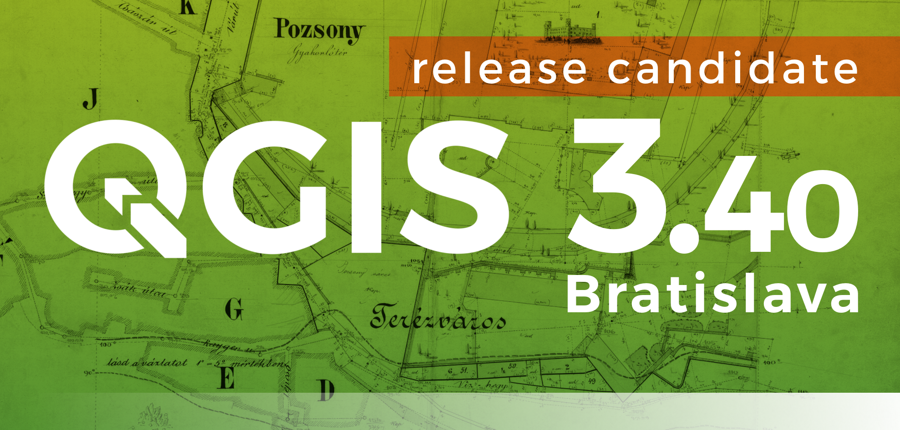

Release date: 2024-10-25

The QGIS Project is thrilled to announce the release of QGIS 3.40, refining the platform's capabilities for geospatial professionals and enthusiasts alike and underscoring the commitment to empower its users with groundbreaking tools for spatial discovery.

This release incorporates major strides in color management functionality, as described in [QEP283](https://github.com/qgis/QGIS-Enhancement-Proposals/issues/283), with the introduction of CMYK color support and the definition of International Color Consortium (ICC) color profiles for use in widgets, expressions, and cartography-oriented workflows to ensure accurate color representation across different media types.

Additionally, QGIS now includes native integration with [STAC](https://stacspec.org/en/) data sources for easier access to remote data sources through the QGIS browser. New functionality allows for the storing of custom PyQGIS Expressions and methods directly within project files, providing users with greater flexibility in their data-handling processes. This functionality will also provide new opportunities for improved automation capabilities and is sure to boost productivity and facilitate more seamless collaboration for teams.

This release also includes a wealth of other new features that include improvements to Labeling, 3D views, Networking, Attribute tables, and many others.

For a whirlwind tour of all the new functionalities introduced, you can view the [highlight reel video on YouTube](https://www.youtube.com/watch?v=2Pk-etS1HNo).

QGIS is a community effort, and we would like to extend a big thank you to the developers, documenters, testers, and the many folks out there who volunteer their time and effort (or fund people to do so) to make these releases possible. From the QGIS community, we hope you enjoy this release! If you wish to donate time, money, or otherwise contribute towards making QGIS more awesome, please wander along to [QGIS.ORG](https://qgis.org) and lend a hand!

QGIS is supported by donors and sustaining members. A current list of donors who have made financial contributions large or small to the project can be seen on our [list of donors](https://qgis.org/en/site/about/sustaining_members.html#list-of-donors). If you would like to become an official project sustaining member, please visit our [sustaining member page](https://qgis.org/en/site/about/sustaining_members.html) for more details. Sponsoring QGIS helps us to fund our regular developer meetings, maintain project infrastructure, and fund bug-fixing efforts. A complete list of current sponsors is provided below - our very big thank you to all of our sponsors!

QGIS is free software and you are under no obligation to pay anything to use it - in fact, we want to encourage people far and wide to use it regardless of their financial or social status - we believe that empowering people with spatial decision-making tools will result in a better society for all of humanity.

## Map Tools 

### Feature: Respect layer/project vert datum in identify results

When a vector layer and the project have vertical datums present, and they differ, then include the transformed Z value for the identified features in the project's datum too.

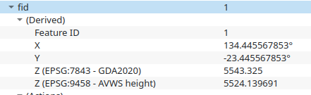

This feature was funded by [North Road](https://north-road.com)

This feature was developed by [Nyall Dawson (North Road)](https://north-road.com)

### Feature: Present referencing relations in info tool

In previous releases of QGIS, only referenced relations (related features the current feature is pointing to) were presented to users when exploring a feature with the info tool. Support for presenting referencing relations (related features the current feature is referenced by), and they are now supported on an arbitrary nesting level.

In addition, multiple updates to the handling of related features in the identify tool have been added, including:

-   prevention of duplicate relation references
-   load relations only on the unfolding of a node (preventing an 'explosion' of loading related references)
-   control toggle to enable or disable relation references
-   a contextual menu item for "Identify Feature" to load a nested related feature into the root of the identify tool context

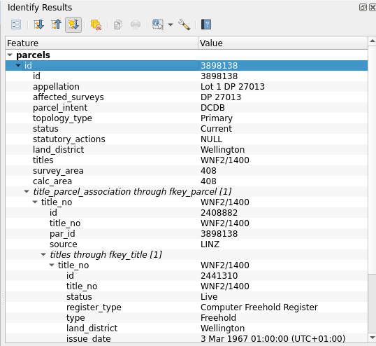

This feature was developed by [Even Rouault](https://github.com/rouault)

## User Interface 

### Feature: Optionally autosize all columns by default when opening an attribute table

A new option in the Data Sources tab of the Options Dialog (opened via the Settings menu) will configure QGIS to always resize the columns of an attribute table to fit the contents when it is opened.

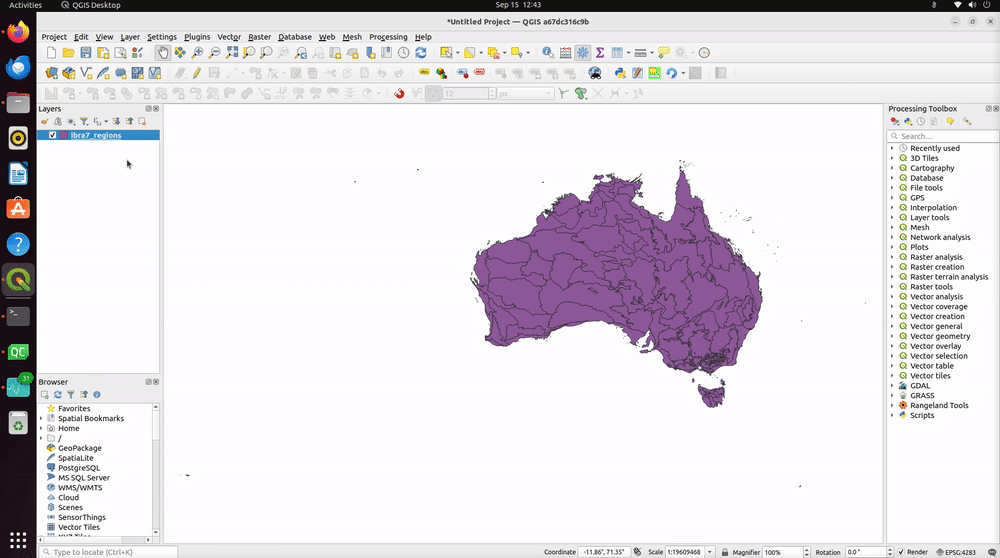

This feature was developed by [Ben Wirf](https://github.com/benwirf)

### Feature: Actions Dialogue Duplicate Button

A duplicate button has been added to the actions dialogue on layer properties.

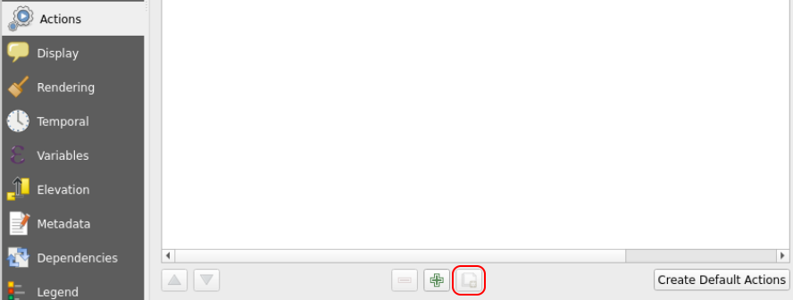

This feature was developed by [Speedrace4](https://github.com/Speedrace4)

## Symbology 

### Feature: Provide style categories for raster layers

QGIS now supports categories for copying properties and styles between raster layers (instead of simply forcing the use of `AllStyleCategories` as before), and now includes raster data categories for:

-   `LayerConfiguration`
-   `Temporal`
-   `Elevation`
-   `MapTips`
-   `Notes`
-   `CustomProperties`
-   `Symbology`
-   `Rendering`

In addition, these styles are supported in the import and export functionalities of the QML/SLD layer definition and style files, making raster layer management more consistent with the user experience for vector layers.

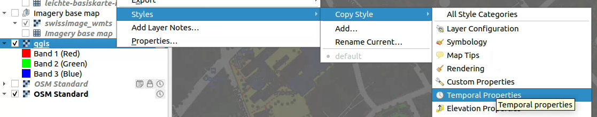

This feature was funded by the [Canton of Solothurn](https://so.ch/verwaltung/bau-und-justizdepartement/amt-fuer-geoinformation/)

This feature was developed by [Dave Signer (OPENGIS.ch)](https://opengis.ch)

### Feature: Add "Linear Referencing" symbol layer type

This new symbol layer type allows placing text labels at regular intervals along a line (or at positions corresponding to existing vertices). Positions can be calculated using Cartesian distances, or interpolated from z/m values.

Functionality includes:

-   Labels can be placed using fixed cartesian 2d distances, at regular linearly interpolated spacing calculated using the Z or M values in geometries, or at existing vertices
-   Labels can show either the running total distance, or the linearly interpolated Z/M value
-   Uses text renderer to draw labels, so the full range of functionality is available for the labels (including buffers, shadows, etc)
-   Uses the QGIS numeric format classes to format numbers as strings, so users have full range of customisation options for eg decimal places
-   An optional "skip multiples of" setting. If set, then labels which are a multiple of this value will be skipped over. This allows construction of complex referencing labels, eg where a symbol has two linear referencing symbol layers, one set to label every 100m in a small font, skipping multiples of 1000, and a second set to label every 1000m in a big bold font
-   Labels are rendered using an angle calculated by averaging the linestring, so sharp tiny jaggies don't result in unslightly label rotation
-   Optionally, markers can be placed at referenced points in the line string, using a full QGIS marker symbol (this allows eg showing a cross-hatch at the labeled point, for a "ruler" style line)
-   Data defined control over the placement intervals, skip multiples setting, marker visibility and average angle calculation length

Notes:

-   When using the distance-based placement or labels, the distances are calculated using 2D only, Cartesian calculations based on the original layer CRS. This could potentially be extended in future to expose options for 3D Cartesian distances, or ellipsoidal distance calculations.

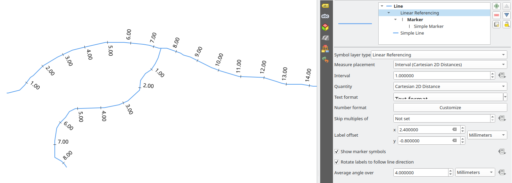

This feature was funded by the [Swiss QGIS User Group](https://www.qgis.ch/de/)

This feature was developed by [Nyall Dawson (North Road)](https://north-road.com)

### Feature: Implement color ramp interpolation for CMYK

This feature was funded by Bordeaux Métropôle

This feature was developed by [Julien Cabieces](https://github.com/troopa81)

### Feature: CMYK color preview

Color previews of CMYK colors will display the color value using a list of float values

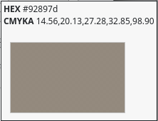

This feature was funded by Métropôle de Bordeaux

This feature was developed by [Julien Cabieces](https://github.com/troopa81)

### Feature: Select color component as float

The QGIS Color Widget now supports the selection of the color component as a float value with 2 decimals

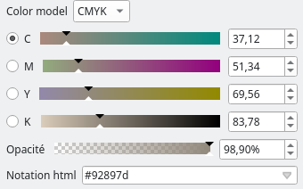

This feature was funded by Bordeaux Métropôle

This feature was developed by [Julien Cabieces](https://github.com/troopa81)

### Feature: Allow end point marker symbols for balloon callout style

Allows rendering a marker symbol below the endpoint of the balloon callout. Designed to allow balloon callouts to reproduce the same visual appearance as the older annotation framework items.

This feature was funded by [North Road](https://north-road.com)

This feature was developed by [Nyall Dawson (North Road)](https://north-road.com)

### Feature: Buffers for marker symbols

QGIS now includes "buffers" for marker symbols. Just like label buffers, marker buffers are a halo effect around marker symbols designed to make the symbol more readable against different backgrounds.

Buffers are defined on a symbol level (not per symbol-layer), and are calculated and drawn using the shape of ALL the symbol layers in the marker. This makes them super-easy to configure, as getting the same result by hand would require many duplicate symbol layers and duplicate settings across these!

This change is designed to plug on of the (very few!) remaining large symbology gaps between ArcMap and QGIS, where ArcMap has had support for solid color marker "halos" for decades.

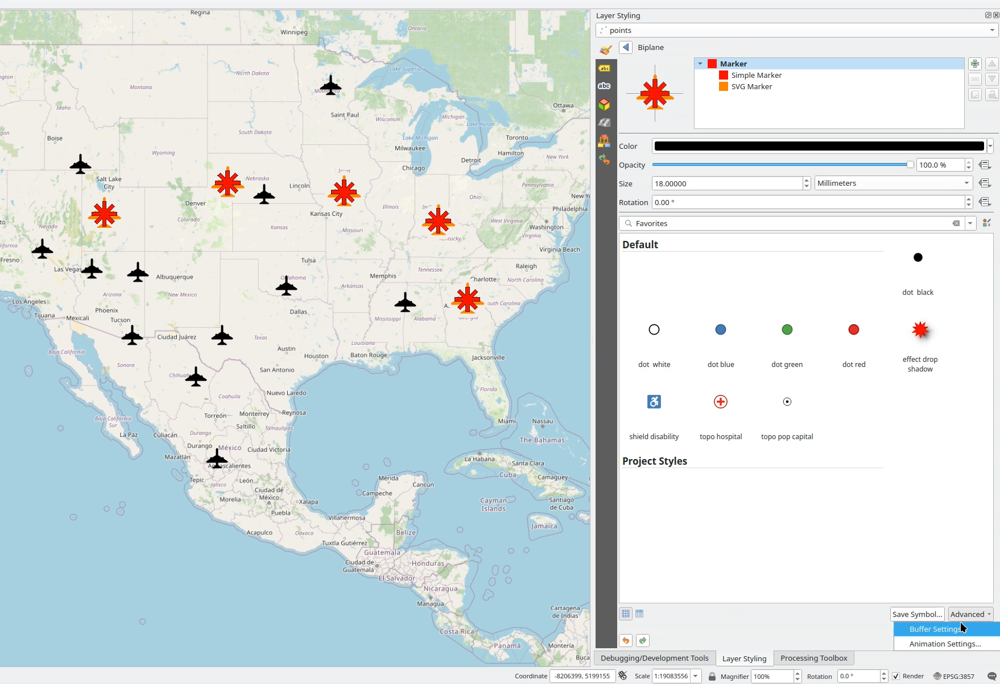

This feature was funded by [North Road, thanks to SLYR](https://north-road.com)

This feature was developed by [Nyall Dawson (North Road)](https://north-road.com)

### Feature: Support tolerances for QgsRasterTransparency pixel values

Allows pixels with color components just outside of the specified RGB values to also be treated as transparent pixels

Useful for photographs or compressed rasters where a range of color values must be made transparent.

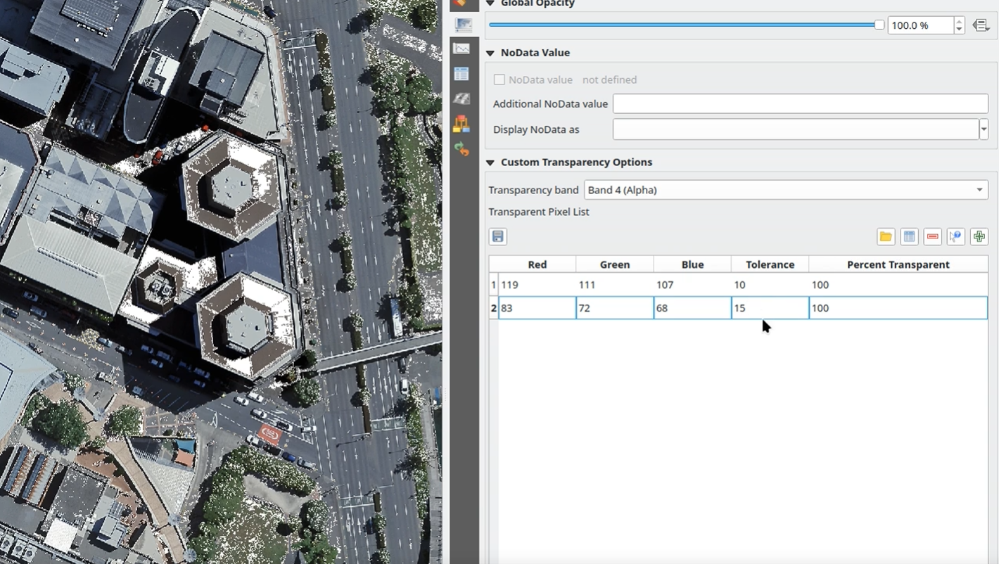

This feature was funded by [Middle Third Geological](https://www.linkedin.com/in/deryk-forster-44a415104/?original_referer=https%3A%2F%2Fwww%2Egoogle%2Ecom%2F&originalSubdomain=au)

This feature was developed by [Nyall Dawson (North Road)](https://north-road.com)

## Annotations 

### Feature: Auto upgrade SVG and text annotations to annotation layer items on project load

We improved the workflow for those projects with older annotation items. In previous QGIS versions, older annotation items (text, html, svg and form) had not been ported over to the new framework therefore impacting workflows. In 3.40, we have targeted the higher priority items, text and svg, so now the framework has been updated and the missing functionality has been added. 
Now, when loading old projects, any of the old SVG and text annotations will automatically be converted (silently) to the newer picture and rectangular text annotation item types.
- Various bugs were fixed along the way and these additional functions were added:
- Callouts for annotations including text at point, rectangular text and picture annotations.
- Marker symbol to be drawn as part of the “balloon” callout style
- Associated “visibility layer” for annotations
- Rich text editor widget to allow for interactive creation of html contant for text at point and rectangular text
- UI clean-up

This feature was funded by [QGIS Grant Programme 2024](https://github.com/qgis/PSC/issues/60)

This feature was developed by [Nyall Dawson (North Road)](https://north-road.com)

### Feature: Add support for callouts to point text, rect text and picture items

Allows creating of callout lines (or bubble callouts) which link the text to a map location. To create a callout, users select the text item and then drag out the central x node to the desired callout end point.

Callout styles can be modified through the layer styling panel.

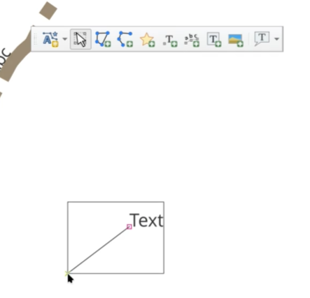

This feature was funded by [North Road](https://north-road.com)

This feature was developed by [Nyall Dawson (North Road)](https://north-road.com)

### Feature: Add linked layer option for annotation layers

In line with [QEP\#269](https://github.com/qgis/QGIS-Enhancement-Proposals/issues/269), a new "Linked layer" setting has been added to the render page for annotation layers. This allows users to optionally set a linked visibility layer for the annotation layer. If set, then the annotations will only be drawn when the linked layer is visible on the map.

This feature was funded by [North Road](https://north-road.com)

This feature was developed by [Nyall Dawson (North Road)](https://north-road.com)

### Feature: Add picture annotation item type

Can render SVG or raster images as items in an annotation layer. Options are present for:

-   Locking the picture's aspect ratio
-   Drawing with a background symbol
-   Drawing with a border symbol
-   Linked or embedded pictures
-   Rendering with scale dependent sizes or fixed sizes

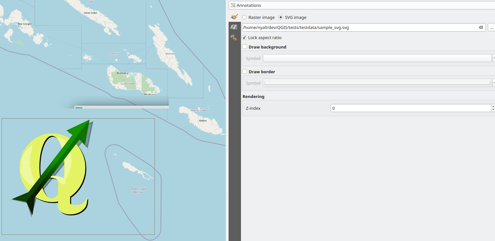

This feature was funded by [North Road](https://north-road.com)

This feature was developed by [Nyall Dawson (North Road)] (https://north-road.com)

## Labelling 

### Feature: Support horizontal alignment in HTML labels

For multi-line labels, this allows use of either:

-   HTML
    attributes
-   CSS "text-align: xxx"
-   HTML
    some text
    tags

Supported alignments are left, right, center and justify

Horizontal alignment can be used in all contexts where HTML text is rendered, EXCEPT for curved labels (since they are restricted to single-line text)

This feature was funded by City of Freiburg im Breisgau

This feature was developed by [Nyall Dawson (North Road)](https://north-road.com)

### Feature: HTML header formatting in HTML labels

Support for header tags (h1/h2/.../h6) and associated formatting in HTML labels is now supported.

This feature was funded by City of Freiburg im Breisgau

This feature was developed by [Nyall Dawson (North Road)](https://north-road.com)

### Feature: Add support for word-spacing CSS in html labels

Support for word-spacing CSS in html labels and other places HTML text formatting is accepted has been added to QGISm allowing the use of CSS rules such as "word-spacing: 12" to increase the word spacing in a section of HTML text. The word spacing is always treated as being in point units.

This feature was funded by City of Freiburg im Breisgau

This feature was developed by [Nyall Dawson (North Road)](https://north-road.com)

### Feature: Implementation of labeling engine rules

In line with [QEP\#299](https://github.com/qgis/QGIS-Enhancement-Proposals/issues/299), a new API framework has been implemented for setting advanced labeling engine rules on a project, and implements 4 initial rule types:

-   QgsLabelingEngineRuleMinimumDistanceLabelToFeature: prevents labels being placed too *close* to features from a different layer
-   QgsLabelingEngineRuleMaximumDistanceLabelToFeature: prevents labels being placed too *far* from features from a different layer
-   QgsLabelingEngineRuleMinimumDistanceLabelToLabel: prevents labels being placed too close to labels from a different layer
-   QgsLabelingEngineRuleAvoidLabelOverlapWithFeature: prevents labels being placed overlapping features from a different layer

Note that the first 3 rules require a build based on GEOS &gt;= 3.10, and they are not available for older GEOS builds.

Also implemented is a registry for storing available rule classes, and serialization of rules and configuration in QGIS projects.

This feature was funded by Rubicon Concierge Real Estate

This feature was developed by [Nyall Dawson (North Road)](https://north-road.com)

### Feature: Support img tags in HTML label text

Allows use of img tags in HTML label content. The following logic is applied:

-   Image path is set via the src="xxx" attribute. Local, HTTP, and base64 encoded paths are permitted
-   Any image format readable by QGIS can be used
-   Image sizes can be specified via the width="\#\#" and height="\#\#" attributes. If width or height is not specified it will automatically be calculated from the original image size
-   If width or height are specified, they are considered to be in POINTS
-   The css width/height settings are NOT respected (this is a Qt limitation)
-   Images are not supported for curved text labels
-   Images are placed inline only, floating images are not supported

This feature was funded by City of Freiburg im Breisgau

This feature was developed by [Nyall Dawson (North Road)](https://north-road.com)

## Diagrams 

### Feature: Introduce stacked diagrams

Stacked diagrams provide a method of structuring multiple adjacent (horizontally or vertically) stacked "Sub Diagrams" for a single feature, providing a method for creating complex diagram objects such as population pyramids.

The implementation introduces multiple new settings for stacked diagram and sub-diagram configuration, and has migrated the diagram settings modal dialog to the Styling dock widget.

This feature was funded by [Landesamt für Vermessung und Geoinformation (LVG) Vorarlberg in collaboration with the QGIS user group Switzerland.](https://vorarlberg.at/-/landesamt-fuer-vermessung-und-geoinformation-l-1)

This feature was developed by [Germán Carrillo](https://github.com/gacarrillor)

## Mesh 

### Feature: Add GUI for adding Quantized Mesh layers

New GUI elements are provided for loading Quantized Mesh data sources and layers in the QGIS Browser panel as well as the data source manager.

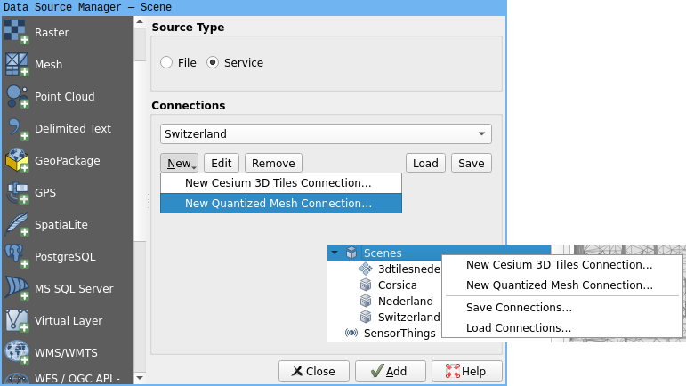

This feature was funded by Swiss QGIS user group

This feature was developed by [David Koňařík](https://github.com/dvdkon)

## Rendering 

### Feature: Support multiple sources for vector tiles

QGIS capabilities have been extended for loading vector tiles that include multiple sources/ URLs within a single style definition.

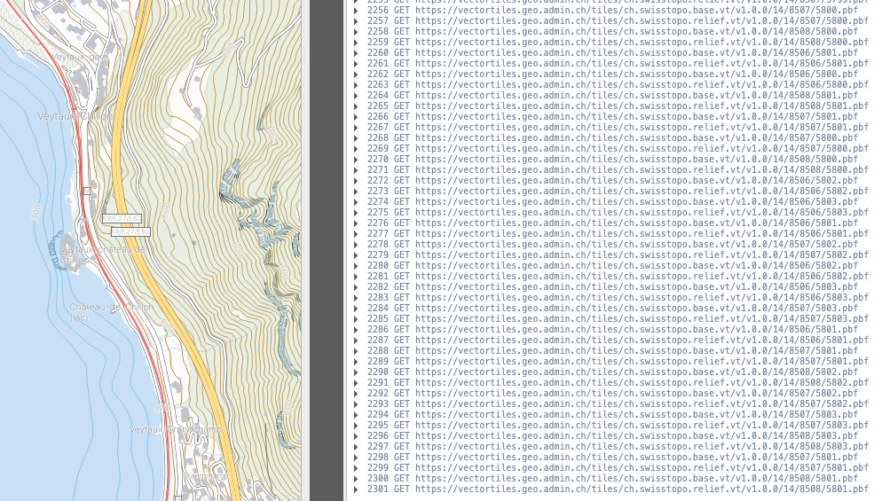

This feature was developed by [Denis Rouzaud](https://github.com/3nids)

## 3D Features 

### Feature: Respect vector layer vertical CRS settings in 3D map views

Vertical CRS configuration at the layer level will be respected in 3D map views provided that the project has a non-geographic 2D CRS set and a vertical CRS set.

Note that this will only affect newly created 3D map views and no setting is currently exposed for users to modify the CRS for existing 3D map views.

This feature was developed by [Nyall Dawson](https://github.com/nyalldawson)

### Feature: 3D Scene Clip Distance

A new option for setting `gl_clipistance` on 3D views will appropriately filter feature vertices that fall outside of the designated extent, effectively cropping the view on multiple planes.

This setting is controlled with the `enableClipping()` and `disableClipping()` methods on `Qgs3DMapScene` objects.

This feature was developed by [Jean Felder](https://github.com/ptitjano)

## Print Layouts 

### Feature: Add support merging cells in manual tables

Allows adjacent cells to be merged in layout manual table items.

From the table editor, select multiple cells in a rectangular shape and then from the Table menu, click "Merge Selected Cells". Merged cells can be un-merged via the "Split Selected Cells" menu action.

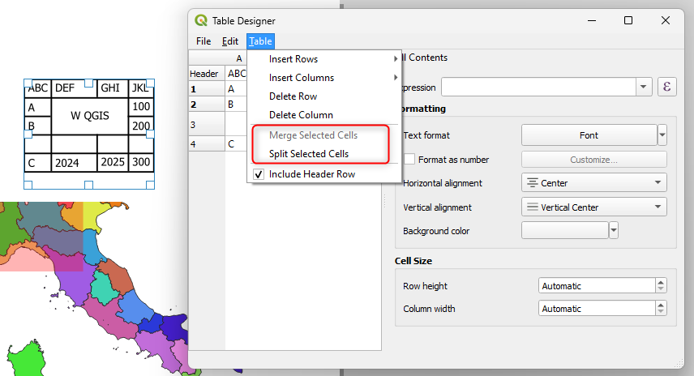

This feature was funded by FLYGHT7

This feature was developed by [Nyall Dawson](https://github.com/nyalldawson)

### Feature: Generate valid PDF/X-4 files

In line with [QEP\#283](https://github.com/qgis/QGIS-Enhancement-Proposals/issues/283), QGIS will generate a valid PDF/X-4 file if the colorspace has been set

This feature was funded by Bordeaux Métropôle

This feature was developed by [Julien Cabieces](https://github.com/troopa81)

### Feature: Add option to set geospatial PDF group name for items

This new setting, located in the layout item "Rendering" section, allows users to set an optional "group name" for use in geospatial PDF exports. When set, a matching layer tree group will be created in the exported geospatial PDF and the item will only be visible when this group is checked.

This allows content to be selectively displayed as a group by viewers of the geospatial PDF. Eg, it can allow extra layout content such as descriptive labels or legends to only be shown when layers from the group are visible, making geospatial PDF export much more flexible.

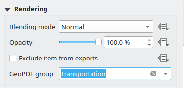

This feature was funded by Rubicon Concierge Real Estate Services

This feature was developed by [Nyall Dawson](https://github.com/nyalldawson)

### Feature: Add Page Properties to layout main menu

A menu option to open Page Properties has been added to the main menu in the Print Layout interface.

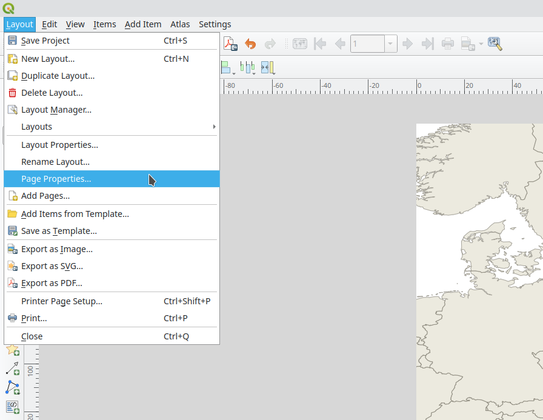

This feature was developed by [Vedran Stojnović](https://github.com/phidrho)

### Feature: Add scale method option for layout scale bars

A new option for selecting a user-defined method of calculating the map scale in print layouts is provided. This exposes options for calculating scale:

-   along the bottom of the map frame
-   along the middle of the map frame
-   along the top of the map frame
-   as an average of all three measurements

By default, new scale bars will utilize the average method (instead of the previously used "along bottom" method), which will better handle scenarios where the scale at the top or bottom of the map cannot be calculated (e.g. when the top or bottom of the map falls outside valid areas for the map CRS).

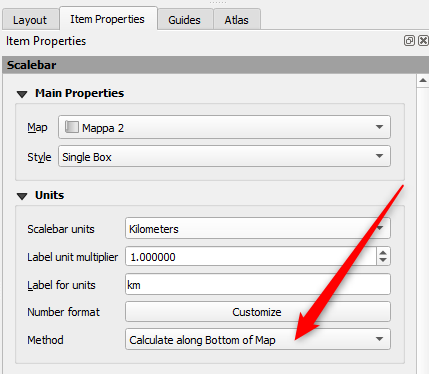

This feature was developed by [Nyall Dawson](https://github.com/nyalldawson)

## Expressions 

### Feature: Add 'Custom Expression' numeric format

This numeric format allows users to craft a custom QGIS expression to format numbers. The expression can use the @value variable to retrieve the value to be formatted, and then use any standard QGIS expression function to format this as desired.

It can be used anywhere QgsNumericFormat is accepted, such as layout scalebars, elevation plots, layout tables, and color ramp legends

This feature was funded by the Swiss QGIS User Group

This feature was developed by [Nyall Dawson](https://github.com/nyalldawson)

### Feature: Add line\_interpolate\_point\_by\_m and line\_locate\_m expressions

Two new functions are provided to the expression engine to work with M values along line strings:

-   `line_interpolate_point_by_m`: returns a point geometry of a matching m value interpolated along a line containing an m dimension.
-   `line_locate_m`: returns a distance from the beginning of a line where a matching m value was found.

These functions are useful when working with temporal data (such as a linestring representing a GPS track, where the M value represents the epoch value), and can be used effectively alongside the temporal controller to create beautiful animations that were previously harder to unlock.

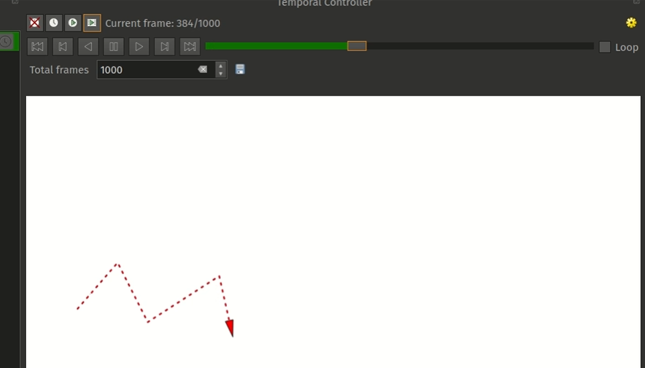

This feature was developed by [Mathieu Pellerin](https://github.com/nirvn)

### Feature: Extended color value support

In line with [QEP\#283](https://github.com/qgis/QGIS-Enhancement-Proposals/issues/283), new expression functions allow for the retrieval of colors that include:

-   color\_rgbf
-   color\_cmykf
-   color\_hsvf
-   color\_hslf

These functions differ from the existing color retrieval expression functions (e.g. color\_rgb) by returning color values with different internal data types. This improves performance and fidelity by avoiding unnecessary color conversions in specific contexts, such as writing PDFs with native CMYK colors derived from expression values.

This feature was funded by Bordeaux Métropôle

This feature was developed by [Julien Cabieces](https://github.com/troopa81)

### Feature: Allow users to save expression functions in QGIS project file

A new `[Project Functions]` element is now available within the expression builder dialog, allowing QGIS to store custom user-defined functions embedded in the project file.

This reduces the need to manually share Python code snippets and copy them to the user profile directory or import them into the expression builder dialog.

Project functions are unloaded when a project is closed, and user functions are reloaded to avoid any potential overwrite by activated project functions.

For security reasons, the handling of whether to load or not load these functions on project startup is configurable in the user settings with the same rationale used for managing project macros.

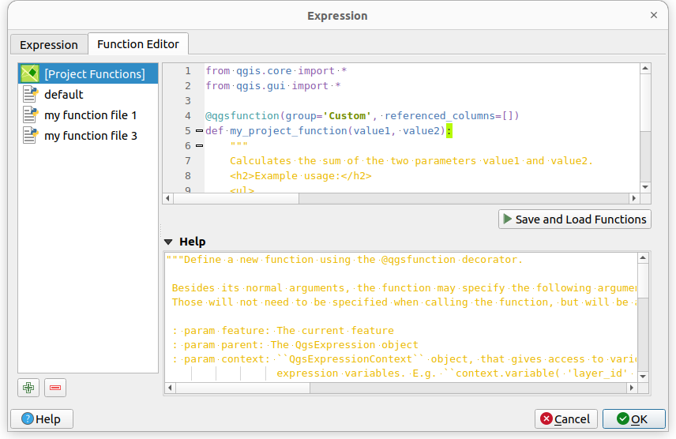

This feature was funded by [the QGIS user group Switzerland](https://qgis.ch)

This feature was developed by [Germán Carrillo](https://github.com/gacarrillor)

### Feature: Add info about usable "expression dialect" to filter dialog

The query builder used for entering filter expressions on vector layers now shows the supported expression dialect.

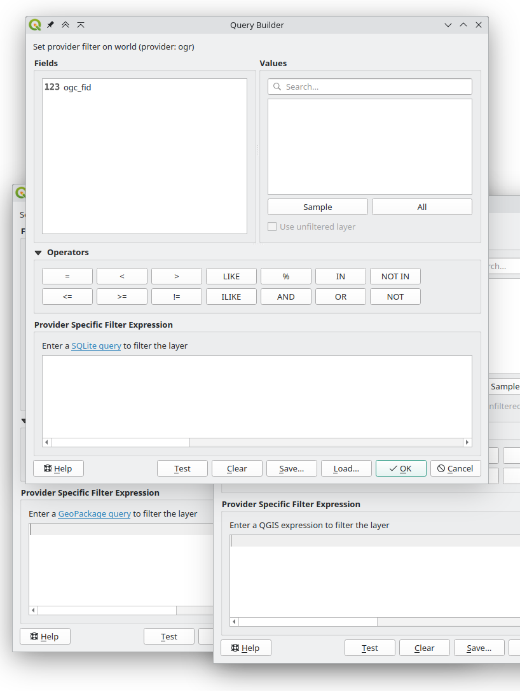

This feature was funded by WhereGroup GmbH.

This feature was developed by [Hannes](https://github.com/kannes)

### Feature: Add project\_color\_object and ramp\_color\_object functions

In line with [QEP\#283](https://github.com/qgis/QGIS-Enhancement-Proposals/issues/283), new expression functions provide support for setting project and ramp colors using CMYK color values using expressions

This feature was funded by Bordeaux Metropole

This feature was developed by [Julien Cabieces](https://github.com/troopa81)

## Digitising 

### Feature: Add circles intersection digitizing tool

A new advanced digitizing tool allows users to pick/ digitize a point at the intersection of two circles

To support this functionality, the QGIS API has been extended with a new abstract class for supporting similar "COGO" development in the future, as well as providing Python bindings for developing advanced digitization utilities and plugins.

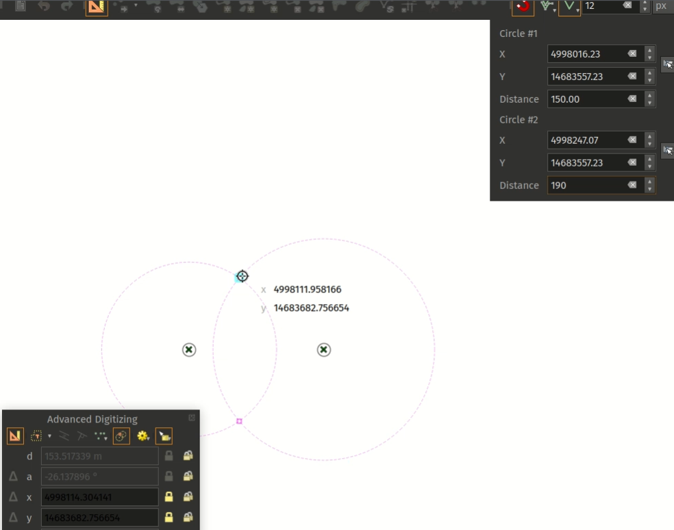

This feature was developed by [Mathieu Pellerin](https://github.com/nirvn)

### Feature: Visual construction guides for advanced digitizing

Visual construction guides have been added to the advanced digitizing dock widget, which builds on the existing CAD construction mode.

When recording construction guides, QGIS will render all construction steps taken as dashed lines which will remain visible for as long as advanced digitizing is enabled. The guides are snap-able, allowing for construction steps to begin mid-way into a previous set of steps too.

The construction guides are stored in a vector layer, which is exposed through the advanced digitizing dock widget, allowing for further customization of the guides via other application processes, such as Python plugins.

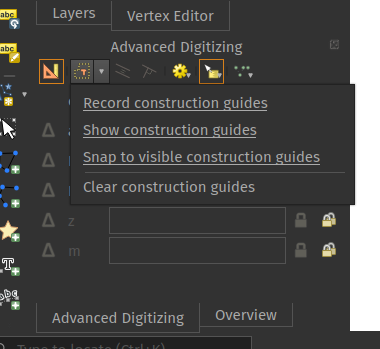

This feature was developed by [Mathieu Pellerin](https://github.com/nirvn)

## Data Management 

### Feature: Allow setting VSI credentials when loading OGR/GDAL layers

VSI credential options are now exposed for user control when adding OGR vector/GDAL raster layers from the Data Source Manager, allowing users to define credentials on a per-layer basis for layers retrieved from cloud services (rather than use a single set of credentials for an entire QGIS session using an environment variable or similar approach).

Requires GDAL 3.5+

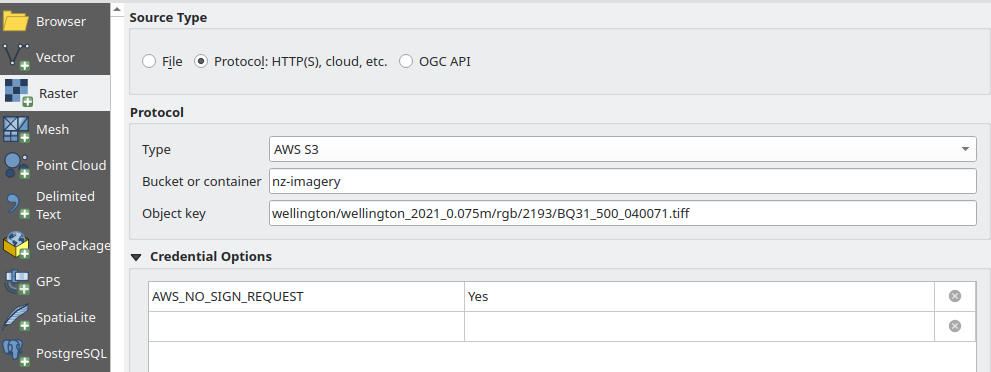

This feature was developed by [Nyall Dawson](https://github.com/nyalldawson)

## Forms and Widgets 

### Feature: Allow reordering fields in new vector layer dialogs

When creating a new vector layer, including scratch, shp, gpkg, and spatialite, users will now be able to reorder the field definitions.

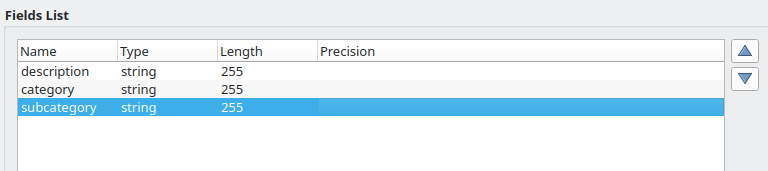

This feature was funded by QGIS User Group Denmark

This feature was developed by [Nyall Dawson](https://github.com/nyalldawson)

### Feature: Add metadata setting to override widget wrapper used for a parameter

While it was possible to add new widget wrappers for Processing parameters, it was not possible to override the standard widget wrappers defined for each parameter type.

A new parameter metadata setting for "widget\_type" has been added, which provides developers to override the standard widget wrapper for a parameter for more control of application dialogues.

`param.setMetadata( } )`

This feature was developed by [Alexander Bruy](https://github.com/alexbruy)

## Processing 

### Feature: Open file or URL Algorithm

A simple native algorithm has been added to allow for the opening of local files using the corresponding system programs, or URLs in a web browser.

Useful in combination with the Download File Algorithm to open the resulting file, or to display results after models triggering external systems.

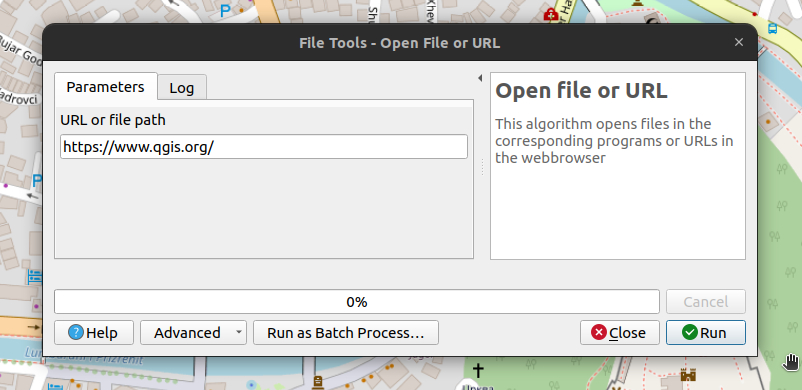

This feature was funded by the [Canton of Solothurn](https://so.ch/verwaltung/bau-und-justizdepartement/amt-fuer-geoinformation/)

This feature was developed by [Dave Signer (OPENGIS.ch)](https://opengis.ch)

### Feature: Add processing parameter types for Area and Volume

Adds dedicated parameter types for Area and Volume values.

Modeled closely off the existing Distance parameter type.

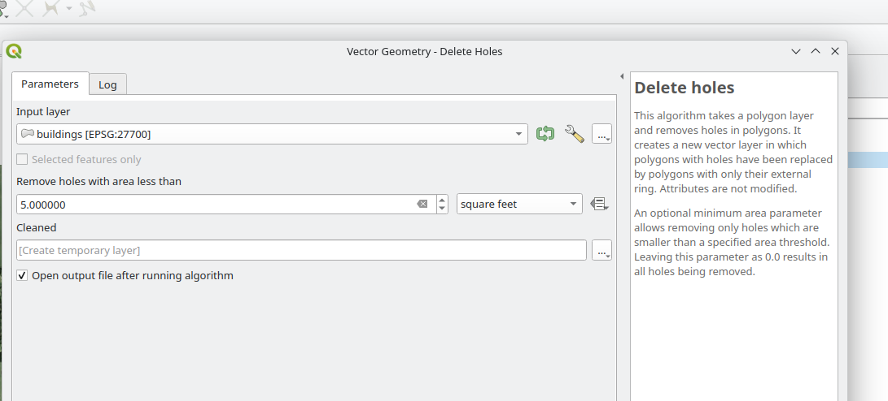

This feature was developed by [Nyall Dawson](https://github.com/nyalldawson)

### Feature: Updated "Vector information" algorithms

The GDAL Processing algorithm for vector information has been modified to support additional command-line parameters, and a new **Vector information (JSON)** algorithm is provided that will use the [`-json`](https://gdal.org/programs/ogrinfo.html#cmdoption-ogrinfo-json) option of ogrinfo to create a JSON file output containing the layer or dataset information.

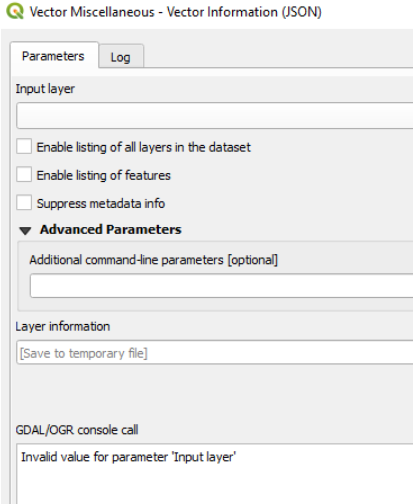

This feature was developed by [Andrea Giudiceandrea](https://github.com/agiudiceandrea)

### Feature: Allow adding Processing tools to Favorites

New 'Favorites' functionality has been added for Processing alogrithms, allowing users to statically pin their chosen algorithms to a dedicated section at the top of the toolbox for ease of access.

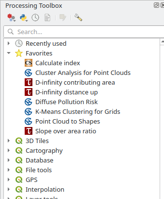

This feature was developed by [Alexander Bruy](https://github.com/alexbruy)

### Feature: Add creation options support to some native raster Processing algorithms

More raster creation options have been added to native Processing algorithms for more control of the output format (compression level, world file generation etc.). Affected algorithms include:

-   Cell statistics
-   Constant raster
-   Export mesh
-   Fill nodata
-   Fuzzify raster
-   Line density
-   Random raster
-   DTM filter (slope-based)
-   Equal to frequency
-   Raster boolean AND/OR
-   Raster stack position
-   Reclassify
-   Rescale
-   Round

This feature was developed by [Alexander Bruy](https://github.com/alexbruy)

### Feature: Support drag and drop for multi-layer parameters

Allows dragging and dropping layers from either the QGIS browser or file explorer onto any multiple-layer parameter panel. Handy when you have to add many layers and it's simpler to make a selection outside of the processing dialog.

This feature was developed by [Nyall Dawson](https://github.com/nyalldawson)

## Application and Project Options 

### Feature: Smart cache size implementation

QGIS now has improved handling of its network disk cache by leveraging smart cache size logic currently utilized by modern web browsers.

This allows the cache to dynamically resize based on available storage space on the cache disk, and will result in most users getting a larger cache size (and improved network performance) by default as well as limiting loads to external providers and XYZ tile services.

Users can disable the smart cache size logic in favor of a static cache size using the updated Options dialog.

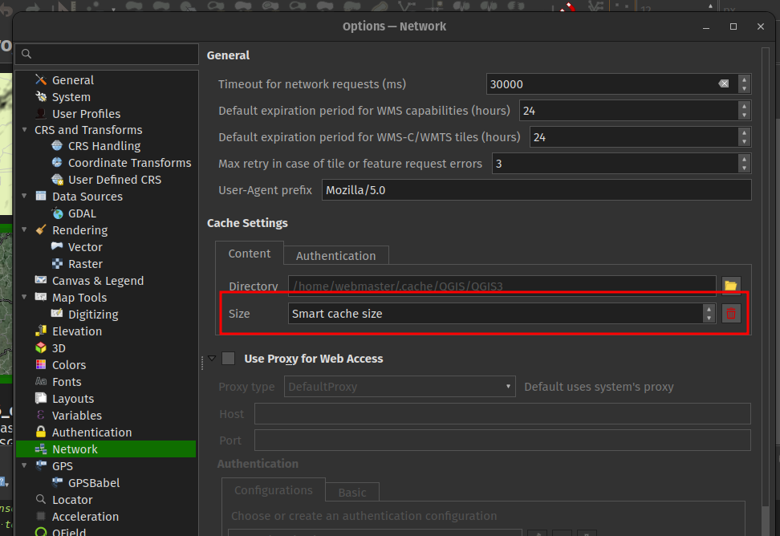

This feature was developed by [Mathieu Pellerin](https://github.com/nirvn)

### Feature: Add vertical CRS selection widget to vector layer properties

Vector layers can now include discrete settings for configuring the vertical reference system.

Application behavior for the definition of vertical reference on a layer will follow the same behavior as the project settings, namely:

-   If the layer has a 3D CRS set, then the widget is disabled with an explanatory note
-   If the layer has a 2D CRS set, then the user can select the appropriate vertical CRS

An explanatory note is included which details the facets of the application where the vertical CRS settings are respected, along with a warning for users to note that plugins and other tools may not respect the layers' vertical CRS configuration.

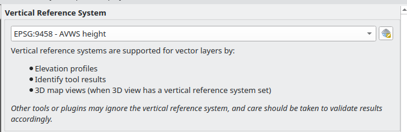

This feature was developed by [Nyall Dawson](https://github.com/nyalldawson)

### Feature: Project color mode properties widget

Project properties configuration widgets have been added for managing color modes and color profiles at the project level.

When loading an ICC profile, QGIS will enforce consistency between the color model and color space.

**The ICC profile widget part is not visible unless QGIS is built with Qt 6.8.0 or greater**

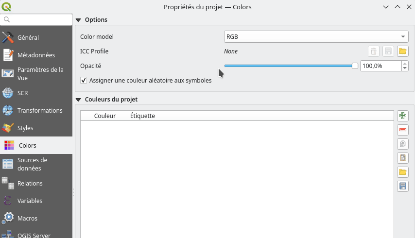

This feature was funded by Bordeaux Métrôpole\*\*

This feature was developed by [Julien Cabieces](https://github.com/troopa81)

## Profile Plots 

### Feature: Change elevation profile name

A "Change Profile Name" menu item in the Options sub-menu of the Elevation Profile widget has been added that allows the user to change the name of the profile window.

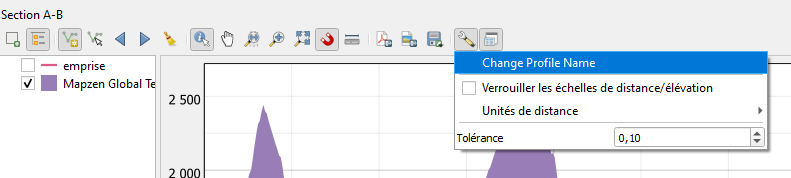

This feature was developed by [Simon](https://github.com/Simon-Lopez)

### Feature: Ensure vector layer elevation profiles respect layer/map vert datums

When the map and/or layer has a vertical reference (3D CRS) configured it will be respected within profile plots

This feature was developed by [Nyall Dawson](https://github.com/nyalldawson)

## Browser 

### Feature: add UX to load MVT layers from style URL only

If a tile vector layer is created with a style URL but not source, the style is fetched and sources are extracted from it.

Here is a demo with a layer having two sources: https://vectortiles.geo.admin.ch/styles/ch.swisstopo.lightbasemap.vt/style.json

https://github.com/user-attachments/assets/948db86c-e79f-40cd-9060-6bc84a31fc2a

This feature was developed by [Denis Rouzaud](https://github.com/3nids)

### Feature: Add duplicate functionality to Browser connection items

QGIS now includes a "Duplicate connection" action in the context menu of Browser connection items. This allows users to quickly make a copy of a connection to the same data source when only a few details differ (for example, a different PostGIS database on the same server).

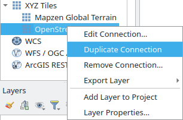

This feature was funded by [NaturalGIS](https://www.naturalgis.pt/)

This feature was developed by [Alexander Bruy](https://github.com/alexbruy)

### Feature: Adjust "Create Database" context menu actions on GeoPackage

In previous versions of QGIS, creating a new SpatiaLite database with this action would create an empty database and add a new connection to the browser, while the same action executed for GeoPackage files would generate a database with a layer.

New actions for "Create Database" and "Create Database and Layer" have been added for more explicit and consistent database creation options.

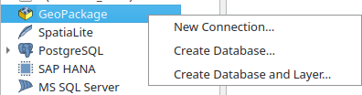

This feature was funded by [NaturalGIS](https://www.naturalgis.pt)

This feature was developed by [Alexander Bruy](https://github.com/alexbruy)

### Feature: Add connections to cloud storage providers to browser

QGIS now natively supports the storing and browsing cloud storage connections within the QGIS browser panel. GDAL supported vector and raster data sources can be loaded directly from cloud providers and all GDAL VSI cloud handlers are supported including (S3, Azure, Google Drive, etc.)

Connections can also be created, modified, removed, and exported/imported to/from XML files.

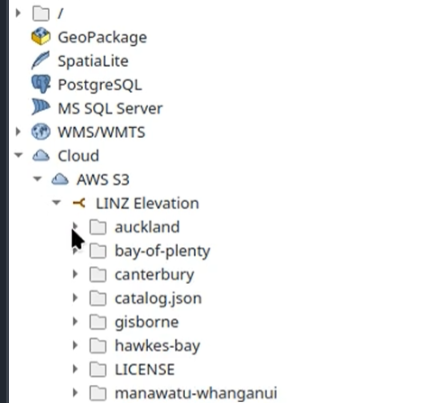

This feature was developed by [Nyall Dawson](https://github.com/nyalldawson)

### Feature: STAC integration

Part one of the [QEP300](https://github.com/qgis/QGIS-Enhancement-Proposals/issues/300) implementation has been completed, allowing users to handle STAC catalogs and elements natively within QGIS using the browser.

A new STAC entry on the browser allows users to connect to static catalogs and STAC API endpoints.

STAC Items that contain cloud-optimized assets (e.g. COG, COPC, EPT) can be added as map layers via the drag-and-drop action.

A Download Assets dialog is provided in the STAC context menu that allows saving items to local storage.

All Catalog, Collection, and Item properties can be examined using the STAC Object Details dialog.

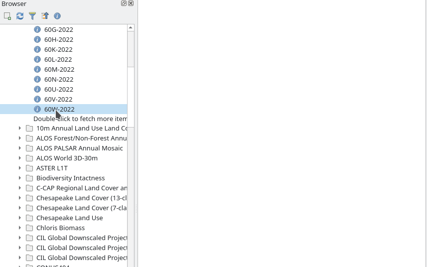

This feature was developed by [Stefanos Natsis](https://github.com/uclaros)

## Data Providers 

### Feature: Support for polyhedral surface and TIN

QGIS now supports the `POLYHEDRALSURFACE` and `TIN` simple features by introducing new geometry types for `QgsPolyhedralSurface` and `QgsTriangulatedSurface`:

-   `QgsPolyhedralSurface` inherits from `QgsSurface`
-   `QgsTriangulatedSurface` inherits from `QgsPolyhedralSurface` as a special case which only contains triangles.

This functionality removes the need for previously used workarounds, such as: - TIN is now the multipart of a triangle - There is no need to convert a polyhedral surface or a TIN to a multipolygon when importing these data types from PostGIS.

This feature was funded by CEA/DAM, CP4SC, Oslandia

This feature was developed by [Jean Felder](https://github.com/ptitjano)

## QGIS Server 

### Feature: WFS title definition for layers

Implemented to service [\#55317](https://github.com/qgis/QGIS/issues/55317), layers now have an additional WFS Title server metadata property to allow users to differentiate between different layer collections on layers served via WFS with QGIS Server.

This feature was developed by [Jürgen Fischer](https://github.com/jef-n)

## Programmability 

### Feature: Exceptions raised on QgsDistanceArea methods

A QgsCsException is now raised when errors occur within QgsDistanceArea methods to prevent misleading analysis results and properly handle error propagation throughout the application

This feature was developed by [Nyall Dawson](https://github.com/nyalldawson)

### Feature: Convert QgsRasterLayer to NumPy Array

Developed in partial fulfillment of [QEP 227](https://github.com/qgis/QGIS-Enhancement-Proposals/issues/227), QGIS now includes a new `as_numpy` method on `QgsRasterLayer` objects in PyQGIS which allow for the easy conversion of a raster layer to NumPy array for improved integration processes and improved analysis of raster data using NumPy (Note that the NumPy library is an optional dependency not shipped with the QGIS Application).

This feature was developed by [Till Frankenbach](https://github.com/merydian)

### Feature: Convert QgsGeometry to Shapely and NumPy

Developed in partial fulfillment of [QEP 227](https://github.com/qgis/QGIS-Enhancement-Proposals/issues/227), QGIS now includes `as_numpy` and `as_shapely` methods on `QgsGeometry` objects in PyQGIS which allow for the easy conversion of a geometry to a (list of) NumPy array(s) or Shapely object(s) for improved integration processes (Note that the relevant libraries are optional dependencies not shipped with the QGIS Application).

This feature was developed by [Till Frankenbach](https://github.com/merydian)

## Notable Fixes 

### Feature: Bug fixes by Even Rouault (Spatialys)

| Bug Title | URL issues.qgis.org (if reported) | URL Commit (Github) | 3.34 backport commit (GitHub) |
|----------|----------------------------------|--------------------|-------------------------------|
| Export of geopackage to File Geodatabase creates fid type real causing subsequent vector conversions to fail | [#58690](https://github.com/qgis/QGIS/issues/58690) | [PR #58705](https://github.com/qgis/QGIS/pull/58705) | N/A |
| In QGIS 3.38.2 when deleting an attribute from a gdb file, all the fields in the remaining attributes get deleted as well | [#58669](https://github.com/qgis/QGIS/issues/58669) | [PR #58733](https://github.com/qgis/QGIS/pull/58733) | [PR #58769](https://github.com/qgis/QGIS/pull/58769) |
| test_provider_ogr.py: do not alter source test data, to keep 'git status' clean | Unreported | [PR #58734](https://github.com/qgis/QGIS/pull/58734) | N/A |
| GeoJSON: edits are not saved | [#58261](https://github.com/qgis/QGIS/issues/58261) | [GDAL PR 10794](https://github.com/OSGeo/gdal/pull/10794) | N/A |
| GeoJSON: edits are not saved | [#58261](https://github.com/qgis/QGIS/issues/58261) | [PR #58740](https://github.com/qgis/QGIS/pull/58740) | N/A |
| In Qgis 3.34.4 Saving vector Temporary Scratch Layer as GeoJSON - Newline Delimited leads to Unavailable Layer! error | [#58760](https://github.com/qgis/QGIS/issues/58760) | [PR #58768](https://github.com/qgis/QGIS/pull/58768) | [PR #58771](https://github.com/qgis/QGIS/pull/58771) |
| parquet file exported from QGIS causes crash when loaded into a project | [#58086](https://github.com/qgis/QGIS/issues/58086) | [GDAL PR 10815](https://github.com/OSGeo/gdal/pull/10815) | N/A |
| In Qgis 3.34.4 / 3.38.3 vector layer saved as KML does not allow deleting of polygon features | [#58780](https://github.com/qgis/QGIS/issues/58780) | [GDAL PR 10840](https://github.com/OSGeo/gdal/pull/10840) | N/A |
| Layer user notes only available for QgsVectorLayer when reading a project with flag QgsProject.FlagDontResolveLayers | [#58818](https://github.com/qgis/QGIS/issues/58818) | [PR #58835](https://github.com/qgis/QGIS/pull/58835) | N/A |
| QgsJsonExporter layer field with ValueMap | [#58861](https://github.com/qgis/QGIS/issues/58861) | [PR #58864](https://github.com/qgis/QGIS/pull/58864) | N/A |
| Geospatial PDF Export for Rasters does NOT work | [#58891](https://github.com/qgis/QGIS/issues/58891) | [PR #58895](https://github.com/qgis/QGIS/pull/58895) | [PR #58903](https://github.com/qgis/QGIS/pull/58903) |
| QGIS not recognizing CRS "EPSG:3301 - Estonian Coordinate System of 1997" in MapInfo mid/mif and tab formats | [#58283](https://github.com/qgis/QGIS/issues/58283) | [GDAL PR 10920](https://github.com/OSGeo/gdal/pull/10920) | N/A |
| Don't use the The Word Which Must Not Be Used | Unreported (well, through hostile channels) | [PR #59017](https://github.com/qgis/QGIS/pull/59017) | N/A |
| In Qgis 3.34.4 / 3.38.3 vector layer saved as KML does not allow deleting of polygon features | [#58780](https://github.com/qgis/QGIS/issues/58780) | [GDAL PR 10991](https://github.com/OSGeo/gdal/pull/10991) | N/A |
| [BUGFIX] [PostgreSQL] Properly take into account 'name' type | Unreported | [PR #59147](https://github.com/qgis/QGIS/pull/59147) | TODO |

This feature was funded by [QGIS.ORG (through donations and sustaining memberships)](https://qgis.org/)

This feature was developed by [Even Rouault (Spatialys)](https://www.spatialys.com/)

### Feature: Bug fixes by Alessandro Pasotti (itOpen / qcooperative)

| Bug Title | URL issues.qgis.org (if reported) | URL Commit (Github) | 3.34 backport commit (GitHub) |
|----------|----------------------------------|--------------------|-------------------------------|
| QGIS Server filter does not work as expected for intersection filters | [#58220](https://github.com/qgis/QGIS/issues/58220) | Cannot reproduce | |
| [Layout] Missing atlas layer attributes in expression "Fields and Values" group for fixed table item | [#58774](https://github.com/qgis/QGIS/issues/58774) | [PR #58778](https://github.com/qgis/QGIS/pull/58778) | No |
| Clearing the default value expression cannot be canceled / undone | [#58767](https://github.com/qgis/QGIS/issues/58767) | [PR #58787](https://github.com/qgis/QGIS/pull/58787) | No |
| PostgreSQL authentication gets back to basic if a layer is opened with "execute SQL" from QGIS explorer panel | [#58784](https://github.com/qgis/QGIS/issues/58784) | Cannot reproduce | |
| QGIS Server: fixed width of 200 px of cascaded WMS layer legends | [#57422](https://github.com/qgis/QGIS/issues/57422) | [PR #58790](https://github.com/qgis/QGIS/pull/58790) | No |
| Random Points in Polygons behaves unexpectedly | [#58737](https://github.com/qgis/QGIS/issues/58737) | [PR #58815](https://github.com/qgis/QGIS/pull/58815) | No |
| When using a computed or virtual field that refers to other layers's fields having the same name, the wrong value is returned | [#49469](https://github.com/qgis/QGIS/issues/49469) | [PR #58819](https://github.com/qgis/QGIS/pull/58819) | TODO |
| QGIS can't search for PostGIS elsewhere than in the public schema | [#58577](https://github.com/qgis/QGIS/issues/58577) | Not a bug (closed by OP) | |
| Advanced digitizing using meters instead of ft if ft are set as default unit | [#58620](https://github.com/qgis/QGIS/issues/58620) | [PR #58844](https://github.com/qgis/QGIS/pull/58844) | queued |
| In layer Filter "lower" function not working with diacritical marks | [#58893](https://github.com/qgis/QGIS/issues/58893) | Cannot reproduce | |
| Delete expression in Default value + click on another field in the attribute form manager = Crash | [#58887](https://github.com/qgis/QGIS/issues/58887) | [PR #58911](https://github.com/qgis/QGIS/pull/58911) | N/A |
| Deleting "all other values" breaks categorised symbology | [#58875](https://github.com/qgis/QGIS/issues/58875) | [PR #58916](https://github.com/qgis/QGIS/pull/58916) | queued |
| SLD, Server - Service=WMS&Request=GetStyles: LabelPlacement/Displacement malfunction | [#58862](https://github.com/qgis/QGIS/issues/58862) | [PR #58945](https://github.com/qgis/QGIS/pull/58945) | queued |
| Creating table on MSSQL sets varchar and nvarchar column lengths as 1 regardless of UI input | [#58809](https://github.com/qgis/QGIS/issues/58809) | [PR #58955](https://github.com/qgis/QGIS/pull/58955) | queued |
| Unwanted unique constraint added when exporting to geopackage, if not null constraint is applied via default style | [#58431](https://github.com/qgis/QGIS/issues/58431) | [PR #58986](https://github.com/qgis/QGIS/pull/58986) | Risky? |
| Georeferencer is not using locale in GCP table | [#58765](https://github.com/qgis/QGIS/issues/58765) | [PR #59025](https://github.com/qgis/QGIS/pull/59025) | queued |
| Basic editing using "Automatic Transaction Groups" generates a critical error | [#58845](https://github.com/qgis/QGIS/issues/58845) | [PR #59076](https://github.com/qgis/QGIS/pull/59076) | queued |

This feature was funded by [QGIS.ORG (through donations and sustaining memberships)](https://qgis.org/)

This feature was developed by [Alessandro Pasotti (itOpen / qcooperative)](https://www.qcooperative.net/)

### Feature: Bug fixes by Julien Cabieces (Oslandia)

| Bug Title | URL issues.qgis.org (if reported) | URL Commit (Github) | 3.34 backport commit (GitHub) |
|----------|----------------------------------|--------------------|-------------------------------|
| Repeated Crash when using Reshape Feature Tool | [#57225](https://github.com/qgis/QGIS/issues/57225) | [PR #58779](https://github.com/qgis/QGIS/pull/58779) | [PR #58792](https://github.com/qgis/QGIS/pull/58792) |
| pyqt5_to_pyqt6.py fails on infinite recursion | [#58659](https://github.com/qgis/QGIS/issues/58659) | [PR #58785](https://github.com/qgis/QGIS/pull/58785) | No |
| Legend in map atlas anchored to bottom left or bottom right will not correctly reposition in PDF | [#37566](https://github.com/qgis/QGIS/issues/37566) (Regression) | [PR #58798](https://github.com/qgis/QGIS/pull/58798) | [PR #58920](https://github.com/qgis/QGIS/pull/58920) |
| Calling several times waitForFinished on task would cause a deadlock | Unreported | [PR #58799](https://github.com/qgis/QGIS/pull/58799) | No |
| Debian sid Qt6 compile fails on sip build, python bindings | [#57760](https://github.com/qgis/QGIS/issues/57760) | Now working with updated debian | |

This feature was funded by [QGIS.ORG (through donations and sustaining memberships)](https://qgis.org/)

This feature was developed by [Julien Cabieces (Oslandia)](https://oslandia.com/)

### Feature: Bug fixes by Nyall Dawson (North Road)

| Bug Title | URL issues.qgis.org (if reported) | URL Commit (Github) | 3.34 backport commit (GitHub) |
|----------|----------------------------------|--------------------|-------------------------------|
| Fix rendering of line direction symbols in labels, cleanup label rendering code a bit | [#59107](https://github.com/qgis/QGIS/issues/59107) | [PR #59114](https://github.com/qgis/QGIS/pull/59114) | N/A |
| [gps] Be tolerant to talker IDs which don't start with 'G' | Reported privately | [PR #59124](https://github.com/qgis/QGIS/pull/59124) | N/A |
| Fix unsafe use of QgsProject::instance from vector layer classes | Unreported | [PR #59118](https://github.com/qgis/QGIS/pull/59118) | Too risky |
| When excluding tests, only exclude exact matches | Unreported | [PR #59116](https://github.com/qgis/QGIS/pull/59116) | N/A |
| When layout scalebar settings are invalid, show warning message | Unreported | [PR #59088](https://github.com/qgis/QGIS/pull/59088) | N/A |
| Many cppcheck fixes to get CI green again | Mark all bool operators as explicit, associated fixes | [PR #59086](https://github.com/qgis/QGIS/pull/59086) | N/A |
| Fix random crashes | [#36125](https://github.com/qgis/QGIS/issues/36125) | [PR #59080](https://github.com/qgis/QGIS/pull/59080) | [PR #59087](https://github.com/qgis/QGIS/pull/59087) |
| Optimise grid decoration rendering | Reported privately | [PR #59044](https://github.com/qgis/QGIS/pull/59044) | N/A |
| Optimise text rendering for a common scenario | Reported privately | [PR #59037](https://github.com/qgis/QGIS/pull/59037) | N/A |
| Don't override cursor in pin labels map tool | [#59016](https://github.com/qgis/QGIS/issues/59016) | [PR #59033](https://github.com/qgis/QGIS/pull/59033) | [PR #59035](https://github.com/qgis/QGIS/pull/59035) |
| Fix hang when searching expressions using regular expressions | [#59002](https://github.com/qgis/QGIS/issues/59002) | [PR #59019](https://github.com/qgis/QGIS/pull/59019) | N/A |
| Fix aggregate function returns incorrect results | [#58221](https://github.com/qgis/QGIS/issues/58221) | [PR #59000](https://github.com/qgis/QGIS/pull/59000) | [PR #59085](https://github.com/qgis/QGIS/pull/59085) |
| Fix slow performance with layout table filtering with atlas point geom filter | [#58274](https://github.com/qgis/QGIS/issues/58274) | [PR #58999](https://github.com/qgis/QGIS/pull/58999) | [PR #59030](https://github.com/qgis/QGIS/pull/59030) |
| Add user-friendly warnings when built without webkit and opening layouts with html items | [#58975](https://github.com/qgis/QGIS/issues/58975) | [PR #58997](https://github.com/qgis/QGIS/pull/58997) | N/A |
| Fix edit/copy/paste symbol action for layers with inverted polygon renderer | [#55426](https://github.com/qgis/QGIS/issues/55426) | [PR #58967](https://github.com/qgis/QGIS/pull/58967) | [PR #59034](https://github.com/qgis/QGIS/pull/59034) |
| Non-default blend mode should force raster render of layer | [#55629](https://github.com/qgis/QGIS/issues/55629) | [PR #58966](https://github.com/qgis/QGIS/pull/58966) | [PR #59036](https://github.com/qgis/QGIS/pull/59036) |
| Only render main annotation layer in main map canvas or docked maps | [#58766](https://github.com/qgis/QGIS/issues/58766) | [PR #58964](https://github.com/qgis/QGIS/pull/58964) | N/A |
| Regenerate primary key when making layer permanent if layer property set | [#58942](https://github.com/qgis/QGIS/issues/58942) | [PR #58954](https://github.com/qgis/QGIS/pull/58954) | N/A |
| QgsMapLayer::setDataSource don't require layer name, provider | Unreported | [PR #58953](https://github.com/qgis/QGIS/pull/58953) | N/A |
| Fix incompatibility between text wrapping and HTML text formatting | Unreported | [PR #58952](https://github.com/qgis/QGIS/pull/58952) | N/A |
| Fix use of custom object values from QGIS expressions in virtual layers | [#58644](https://github.com/qgis/QGIS/issues/58644) | [PR #58939](https://github.com/qgis/QGIS/pull/58939) | N/A |
| [processing] Fix translation of elapsed strings | [#58635](https://github.com/qgis/QGIS/issues/58635) | [PR #58928](https://github.com/qgis/QGIS/pull/58928) | N/A |
| Fix deadlock when exporting atlas with legend via PyQGIS | [#58496](https://github.com/qgis/QGIS/issues/58496) | [PR #58927](https://github.com/qgis/QGIS/pull/58927) | [PR #58969](https://github.com/qgis/QGIS/pull/58969) |
| Fix clipped render when using geometry generator symbol in layout items | [#58909](https://github.com/qgis/QGIS/issues/58909) | [PR #58926](https://github.com/qgis/QGIS/pull/58926) | N/A |
| Show warning in help for algorithms for known issues or security risk | Reported privately | [PR #58925](https://github.com/qgis/QGIS/pull/58925) | N/A |
| [processing] Replace format for saving batch processing parameters | Reported privately | [PR #58923](https://github.com/qgis/QGIS/pull/58923) | N/A |
| Fix missing canvas variables in some expression editors | Unreported | [PR #58907](https://github.com/qgis/QGIS/pull/58907) | [PR #58934](https://github.com/qgis/QGIS/pull/58934) |
| Don't restore corrupted sizes/positions when restoring layout items | [#55240](https://github.com/qgis/QGIS/issues/55240) | [PR #58906](https://github.com/qgis/QGIS/pull/58906) | [PR #59103](https://github.com/qgis/QGIS/pull/59103) |
| Add scale method option for layout scale bars | [#55240](https://github.com/qgis/QGIS/issues/55240) | [PR #58904](https://github.com/qgis/QGIS/pull/58904) | N/A |
| Avoid layout scalebar resizing to huge widths in extreme situations | [#55240](https://github.com/qgis/QGIS/issues/55240) | [PR #58794](https://github.com/qgis/QGIS/pull/58794) | N/A |
| QgsDistanceArea methods should raise QgsCsException when errors occur | Unreported | [PR #58795](https://github.com/qgis/QGIS/pull/58795) | N/A |
| Don't apply reset-to-zero step size logic in spin boxes when no special value text is set | Unreported | [PR #58836](https://github.com/qgis/QGIS/pull/58836) | N/A |

This feature was funded by [QGIS.ORG (through donations and sustaining memberships)](https://qgis.org/)

This feature was developed by [Nyall Dawson (North Road)](https://north-road.com/)

### Feature: Bug fixes by Loïc Bartoletti (Oslandia)

| Bug Title | URL issues.qgis.org (if reported) | URL Commit (Github) | 3.34 backport commit (GitHub) |
|----------|----------------------------------|--------------------|-------------------------------|
| 2-Circle Point Intersection coordinate precision problem | [#59039](https://github.com/qgis/QGIS/issues/59039) | [PR #59155](https://github.com/qgis/QGIS/pull/59155) | N/A |
| Advanced Digitizing Split Tool zeroes M values in a PolyLineZ shapefile | [#49971](https://github.com/qgis/QGIS/issues/49971) | Do not fix (GEOS issue with M) | |
| QGIS tools splitting curved polygons | [#57021](https://github.com/qgis/QGIS/issues/57021) | Do not fix (GEOS issue with Curve support) | |
| Incorrect winding/orientation/order of polygon's vertices in Memory layers | [#58333](https://github.com/qgis/QGIS/issues/58333) | [PR #59156](https://github.com/qgis/QGIS/pull/59156) | Too risky? |

This feature was funded by [QGIS.ORG (through donations and sustaining memberships)](https://qgis.org/)

This feature was developed by [Loïc Bartoletti (Oslandia)](https://oslandia.com/)

### Feature: Bug fixes by Stefanos Natsis (LutraConsulting)

| Bug Title | URL issues.qgis.org (if reported) | URL Commit (Github) | 3.34 backport commit (GitHub) |
|----------|----------------------------------|--------------------|-------------------------------|
| Layer order change does not update the 3D view | [#51291](https://github.com/qgis/QGIS/issues/51291) | [PR #59026](https://github.com/qgis/QGIS/pull/59026) | [PR #59187](https://github.com/qgis/QGIS/pull/59187) |
| Unwanted vertices when tracing | [#52935](https://github.com/qgis/QGIS/issues/52935) | [PR #59055](https://github.com/qgis/QGIS/pull/59055) | N/A |
| Extra vertices form to all layers when using tracing | [#59041](https://github.com/qgis/QGIS/issues/59041) | [PR #59055](https://github.com/qgis/QGIS/pull/59055) | N/A |
| QGIS drops extra byte fields from laz (char and unsigned char) | [#56945](https://github.com/qgis/QGIS/issues/56945) | [PR #59160](https://github.com/qgis/QGIS/pull/59160) | N/A |
| 3D view - completely flat MultiPolygonZ geometries don't show color correctly | [#52832](https://github.com/qgis/QGIS/issues/52832) | pending | |
| Adding more than 250 files or a folder with many files and the Build virtual point cloud (VPC) Tool Fails | [#58894](https://github.com/qgis/QGIS/issues/58894) | [PR #59200](https://github.com/qgis/QGIS/pull/59200) | |

This feature was funded by [QGIS.ORG (through donations and sustaining memberships)](https://qgis.org/)

This feature was developed by [Stefanos Natsis (LutraConsulting)](https://www.lutraconsulting.co.uk/)

### Feature: Bug fixes by Jacky Volpes (Oslandia)

| Bug Title | URL issues.qgis.org (if reported) | URL Commit (Github) | 3.34 backport commit (GitHub) |
|----------|----------------------------------|--------------------|-------------------------------|
| Fix use of QgsReferencedGeometry in expressions | Unreported | [PR #59180](https://github.com/qgis/QGIS/pull/59180) | |

This feature was funded by [QGIS.ORG (through donations and sustaining memberships)](https://qgis.org/)

This feature was developed by [Jacky Volpes (Oslandia)](https://oslandia.com/)

### Feature: Bug fixes by Mathieu Pellerin (OPENGIS)

| Bug Title | URL issues.qgis.org (if reported) | URL Commit (Github) | 3.34 backport commit (GitHub) |
|----------|----------------------------------|--------------------|-------------------------------|
| Clipping of long WKT strings for geometry parameters by using our geometry widget | Unreported | [PR #59209](https://github.com/qgis/QGIS/pull/59209) | N/A |
| Open Sans font installation failed | [#58988](https://github.com/qgis/QGIS/issues/58988) | [PR #59142](https://github.com/qgis/QGIS/pull/59142) | [PR #59152](https://github.com/qgis/QGIS/pull/59152) |
| Print Layout: with a rotated map, turning on Controlled by Atlas (atlasScalingMode = Auto by default) hangs Layout Manager and corrupts project file | [#58245](https://github.com/qgis/QGIS/issues/58245) | [PR #58749](https://github.com/qgis/QGIS/pull/58749) | N/A |
| Additional NoData value not stored correctly in Raster Layer Properties | [#58293](https://github.com/qgis/QGIS/issues/58293) | [PR #58748](https://github.com/qgis/QGIS/pull/58748) | [PR #58751](https://github.com/qgis/QGIS/pull/58751) |
| Do not copy a geometry column from non-geometry layers | [#58725](https://github.com/qgis/QGIS/issues/58725) | [PR #58746](https://github.com/qgis/QGIS/pull/58746) | [PR #58752](https://github.com/qgis/QGIS/pull/58752) |
| Attribute table: crash and weird behavior when a field has an empty name | [#58738](https://github.com/qgis/QGIS/issues/58738) | [PR #58745](https://github.com/qgis/QGIS/pull/58745) | [PR #58757](https://github.com/qgis/QGIS/pull/58757) |
| Bad styling of scrollbars in the plugin manager dialog | Unreported | [PR #58713](https://github.com/qgis/QGIS/pull/58713) | [PR #58721](https://github.com/qgis/QGIS/pull/58721) |
| "Refresh layer at interval" settings are not saved to QML | [#58656](https://github.com/qgis/QGIS/issues/58656) | [PR #58686](https://github.com/qgis/QGIS/pull/58686) | [PR #58714](https://github.com/qgis/QGIS/pull/58714) |
| Unresponsive "Add record" button in non-geometry layer editing | [#55092](https://github.com/qgis/QGIS/issues/55092) | [PR #58680](https://github.com/qgis/QGIS/pull/58680) | [PR #58710](https://github.com/qgis/QGIS/pull/58710) |
|  -- | [PR \#58747](https://github.com/qgis/QGIS/pull/58747) | -- | -- |
| Algorithms having an output directory parameter fail to execute if output directory is set to "Save to temporary folder" | [#58345](https://github.com/qgis/QGIS/issues/58345) | [PR #58619](https://github.com/qgis/QGIS/pull/58619) | [PR #58626](https://github.com/qgis/QGIS/pull/58626) |
| Text in message box 'Font Install Failed' is poorly legible in Night Mapping theme | [#57290](https://github.com/qgis/QGIS/issues/57290) | [PR #58618](https://github.com/qgis/QGIS/pull/58618) | [PR #58628](https://github.com/qgis/QGIS/pull/58628) |
| Bad plugin manager's look on dark themes | Unreported | [PR #58606](https://github.com/qgis/QGIS/pull/58606) | |
| Decorations are too small when exporting temporal controller images on Mac | [#58469](https://github.com/qgis/QGIS/issues/58469) | [PR #58605](https://github.com/qgis/QGIS/pull/58605) | [PR #58613](https://github.com/qgis/QGIS/pull/58613) |
| Layer with data defined symbology does not appear when QGIS opened | [#58508](https://github.com/qgis/QGIS/issues/58508) | [PR #58603](https://github.com/qgis/QGIS/pull/58603) | [PR #58615](https://github.com/qgis/QGIS/pull/58615) |
| QGIS (3.38.1) crashes when trying to show layer labels. QGIS died on signal 11. | [#58570](https://github.com/qgis/QGIS/issues/58570) | [PR #58602](https://github.com/qgis/QGIS/pull/58602) | N/A |
| Fix layout map item preview rendering of XYZ layers with known tile DPI | Unreported | [PR #58543](https://github.com/qgis/QGIS/pull/58543) | [PR #58566](https://github.com/qgis/QGIS/pull/58566) |

This feature was funded by [QGIS.ORG (through donations and sustaining memberships)](https://qgis.org/)

This feature was developed by [Mathieu Pellerin (OPENGIS)](https://www.opengis.ch/)

### Feature: Bug fixes by Jean Felder (Oslandia)

| Bug Title | URL issues.qgis.org (if reported) | URL Commit (Github) | 3.34 backport commit (GitHub) |
|----------|----------------------------------|--------------------|-------------------------------|
| Remaining rubberband and plot data after clearing profile tool | [#50766](https://github.com/qgis/QGIS/issues/50766) | [PR #59181](https://github.com/qgis/QGIS/pull/59181) | N/A |
| Fix issue with vertical lines not visible in the elevation profile tool | unreported | [PR #58959](https://github.com/qgis/QGIS/pull/58959) | N/A |

This feature was funded by [QGIS.ORG (through donations and sustaining memberships)](https://qgis.org/)

This feature was developed by [Jean Felder (Oslandia)](https://oslandia.com/)


