

# Changelog for QGIS 3.42 {#changelog342}

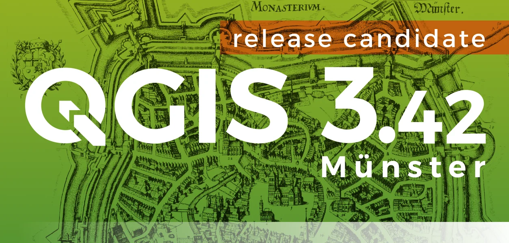

Release date: 2025-02-21

The QGIS Project proudly announces the release of QGIS 3.42, a significant step forward in the development of Free and Open Source Geospatial Information Systems. This release builds upon the solid foundations of previous releases while introducing exciting new features and enhancements that will streamline workflows and empower users in their spatial analysis endeavors.

Notable enhancements have been introduced for features that move beyond the traditional map frame, such as various aspects of 3D Map Views, plots and profiles, as well as a new Virtual Point Cloud overview widget for improved navigation across complex datasets. Greater control is provided for cartographic functionality, such as CSS-based label properties and extensions to the Python API, while advanced data types such as Mesh and Point Clouds have also seen their fair share of improvements.

A new set of Metadata Tools has been added to the Processing toolbox (along with various other new additions and enhancements), whilst a new feature will allow users to label Pixels on Raster data. Layout tools have not been forgotten, and the QGIS Python console also has a new interactive help feature with direct integration with project documentation sources for an enhanced developer experience.

For a whirlwind tour of all the new functionalities introduced, you can view the [highlight reel video on YouTube](https://www.youtube.com/watch?v=v6Ejov4u7xk).

QGIS is a community effort, and we would like to extend a big thank you to the developers, documenters, testers, and the many folks out there who volunteer their time and effort (or fund people to do so) to make these releases possible. From the QGIS community, we hope you enjoy this release! If you wish to donate time, money, or otherwise contribute towards making QGIS more awesome, please wander along to [QGIS.ORG](https://qgis.org) and lend a hand!

QGIS is supported by donors and sustaining members. A current list of donors who have made financial contributions large or small to the project can be seen on our [list of donors](https://qgis.org/en/site/about/sustaining_members.html#list-of-donors). If you would like to become an official project sustaining member, please visit our [sustaining member page](https://qgis.org/en/site/about/sustaining_members.html) for more details. Sponsoring QGIS helps us to fund our regular developer meetings, maintain project infrastructure, and fund bug-fixing efforts. A complete list of current sponsors is provided below - our very big thank you to all of our sponsors!

QGIS is free software and you are under no obligation to pay anything to use it - in fact, we want to encourage people far and wide to use it regardless of their financial or social status - we believe that empowering people with spatial decision-making tools will result in a better society for all of humanity.

## Symbology 

### Feature: Add configurable extent buffer to symbols

In previous versions of QGIS, only features located within the canvas extent were considered for rendering under certain conditions.

This would cause issues with certain symbologies, especially when using complex geometry generators, as users would not see features where the rendered symbol might have appeared within the canvas but the source feature does not.

For example, if using a point feature to generate a buffer polygon such as `buffer(@geometry, 7)`, the buffer would not render if the point was not within the canvas extent.

A new configuration option for symbols allows for a buffer of the canvas extent to envelope these additional features within the user-defined constraints and balance performance with complex data visualization requirements.

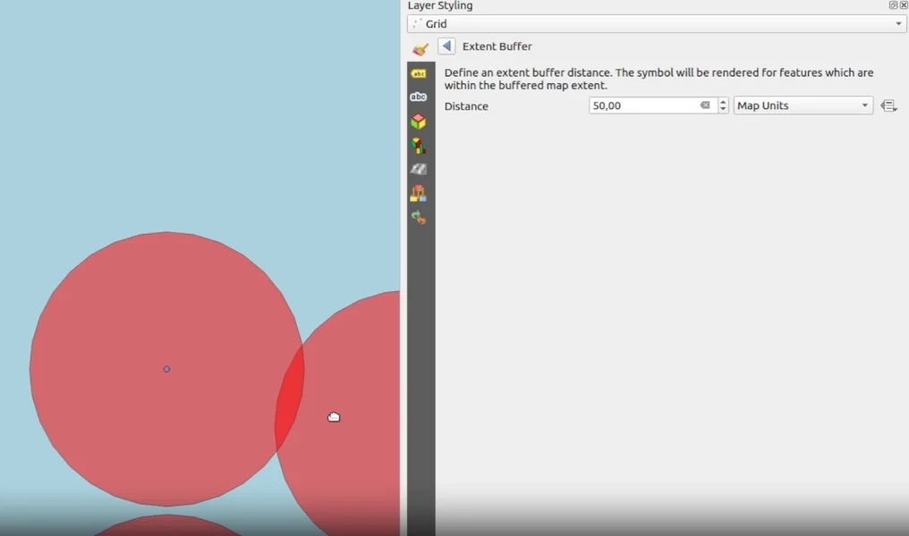

This feature was funded by the National Land Survey of Finland.

This feature was developed by [Juho Ervasti](https://github.com/JuhoErvasti)

## Labelling 

### Feature: Raster labeling

QGIS now allows raster pixels to be labeled with the value taken from a raster band. Labels are registered with the labeling engine, and so will participate in label conflict resolution and overlap avoidance. Options include:

-   Selection of band to take values from
-   Using QgsNumericFormat to customize the number format for the labels
-   Uses text renderer, so supports buffers, shadows, etc
-   Label priority
-   Scale dependant visibility
-   Optional pixel size dependent visibility, i.e. show only when pixels are &gt; 4mm in size
-   Z index control, overlap avoidance mode
-   Option for showing values resampled over neighboring pixels

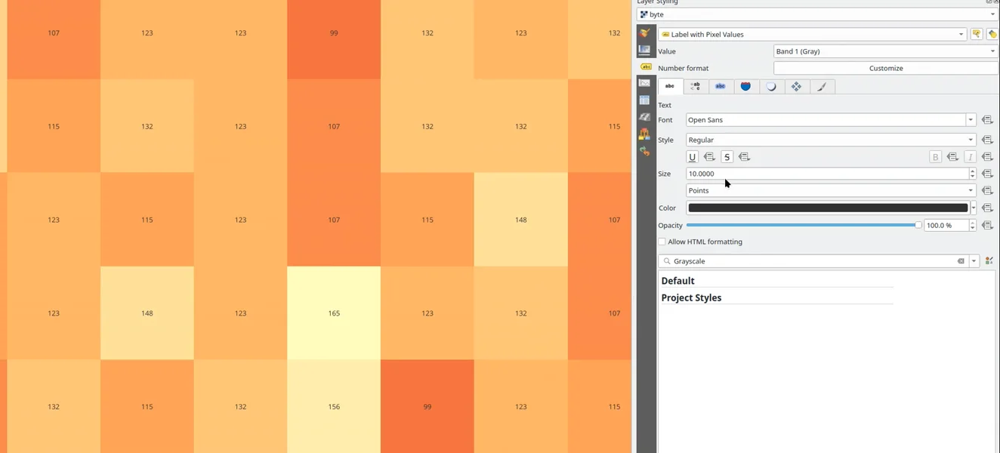

This feature was funded by Canton de Neuchâtel

This feature was developed by [Nyall Dawson](https://github.com/nyalldawson)

### Feature: Custom tab distances for labels

Allows setting a list of custom tab stop distances on labels, instead of just a single distance This allows different thresholds to be used between breaks.

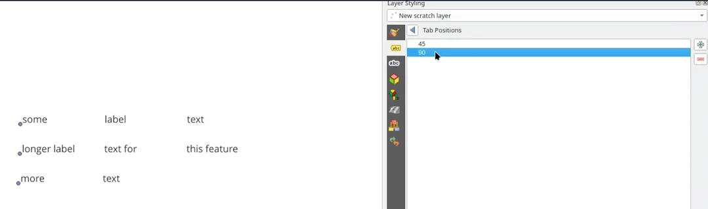

This feature was funded by City of Freiburg im Breisgau

This feature was developed by [Nyall Dawson](https://github.com/nyalldawson)

### Feature: Support CSS background property in labels/text renderer

QGIS now supports CSS background-color and background-image properties when used with HTML labels.

-   Backgrounds are supported for block items (e.g. `
`) or inline items (e.g. ``)
-   For images, the CSS should be formatted as background-image: url(xx). It supports local file paths, http links, or base64 embedded content
-   Backgrounds are not supported for curved text
-   HTML backgrounds are always rendered above any background shape for the label, and below drop shadows/buffers

This feature was funded by City of Freiburg im Breisgau

This feature was developed by [Nyall Dawson](https://github.com/nyalldawson)

### Feature: Support CSS margins for block elements in HTML labels

QGIS has added support for CSS margin properties on block elements in the text renderer. Specifically:

-   This is available for block-type elements only, e.g. DIV, P, H1-H6.
-   Margins are NOT available for spans or other non-block content (due to Qt limitations)
-   Margins can be specified in pt units only
-   Margins can be specified either via "margin-left: 5pt; margin-right: 10pt" etc, or "margin: 5pt 0pt 10pt 0pt"
-   Negative margins are supported for the bottom margin ONLY (due to Qt limitations)

This feature was funded by City of Freiburg im Breisgau

This feature was developed by [Nyall Dawson](https://github.com/nyalldawson)

### Feature: Support CSS line-height in HTML labels

QGIS has added support for the line-height CSS property in HTML formatted labels.

Supports line-height in either points or percent, e.g. "line-height: 40pt" or "line-height: 40%"

This feature was funded by City of Freiburg im Breisgau

This feature was developed by [Nyall Dawson](https://github.com/nyalldawson)

## Mesh 

### Feature: Mesh Render Extent Settings

The renderer setting for Mesh now includes an option for setting the Min/Max limits of the Color Ramp renderer based on the current canvas extent. This can be locked to a specific canvas instance or changed based on the active canvas using the same rendering behaviors as Raster Layers.

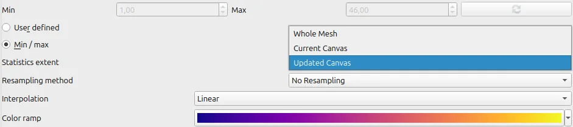

This feature was developed by [Jan Caha](https://github.com/JanCaha)

### Feature: Mesh editing delaunay refinement

Mesh editing now includes a new Delaunay refinement option. When adding a vertex to a mesh face, this feature allows for the automatic refinement of neighboring triangular faces. The algorithm checks if the edges of these adjacent faces meet the Delaunay condition, and if not, it automatically flips the edges to improve the mesh quality.

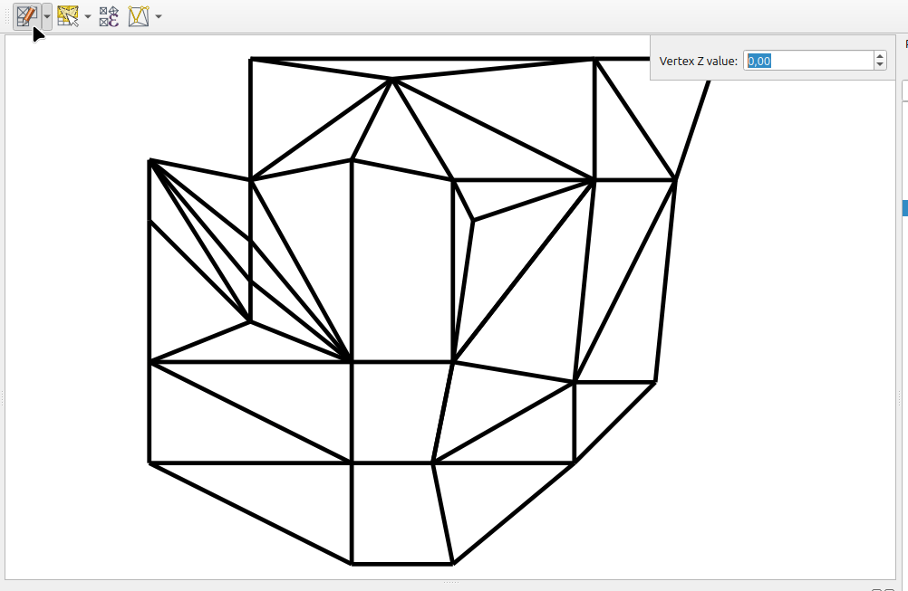

This feature was developed by [Jan Caha](https://github.com/JanCaha)

### Feature: Dataset group controls for mesh layers

Mesh layers now offer more flexible dataset group management. Users can add dataset groups with the same name (though not from the same URI) to a mesh layer. To avoid confusion, these duplicate names will be automatically appended with a number (e.g., "Original Name\_1").

Additionally, users can now remove dataset groups from a mesh layer, however, only added dataset groups (those not associated with the original mesh source file) can be removed, preventing accidental deletion of core data.

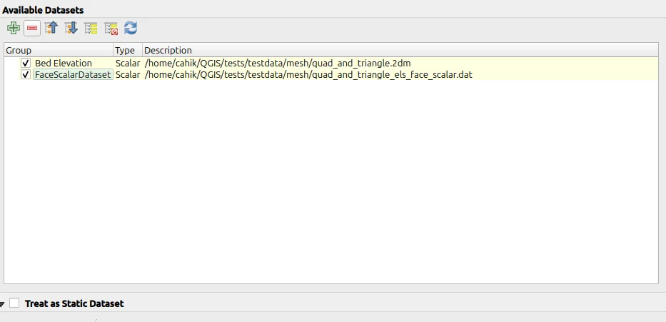

This feature was developed by [Jan Caha](https://github.com/JanCaha)

### Feature: Mesh selection actions

Two new actions have been added for selecting vertices on Mesh layers, namely:

-   select isolated vertices that are not part of any face
-   select all vertices from mesh layer

This allows users more control over the selection criteria of specific vertices.

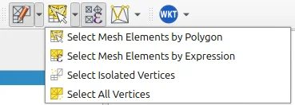

This feature was developed by [Jan Caha](https://github.com/JanCaha)

### Feature: Elevation assignment modes for added mesh vertices

The "Digitize Mesh Element" tool has an additional menu that allows users to select which method to utilize for the assignment of Z values on newly created vertices. New options include:

-   Prefer Mesh, then Z Widget (interpolates z value from mesh if a vertex is inside face of mesh, otherwise uses Z widget value)
-   Prefer Mesh, then Terrain (interpolates z value from mesh if a vertex is inside face of mesh, otherwise uses terrain value)
-   Project Terrain (always uses project terrain Z value)
-   Z Widget (always get Z values from widget)

The "Transform Mesh Vertices" panel also has a new button added that allows users to set the Z value of selected vertices from inferred values based on the project terrain settings.

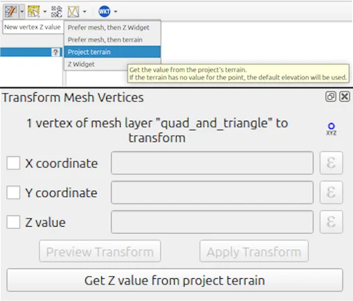

This feature was developed by [Jan Caha](https://github.com/JanCaha)

## 3D Features 

### Feature: Debug widget for 3D views

A new debug side panel for 3D Map Views moves all relevant debug settings into a single location.

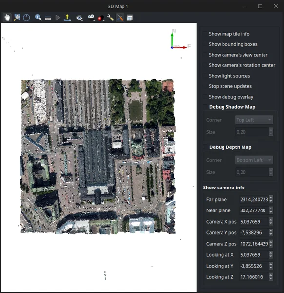

This feature was developed by [Matej Bagar](https://github.com/Withalion)

## Point Clouds 

### Feature: Virtual point cloud overviews in 2D

The default behavior of VPC rendering has been changed so that an overview is rendered when present and alternatively extents are rendered when zooming out. Layer configuration via the styling panel provides advanced control over the user-preferred behavior, allowing users to seamlessly switch between rendering just the extents, just the overview, or a combination of the two.

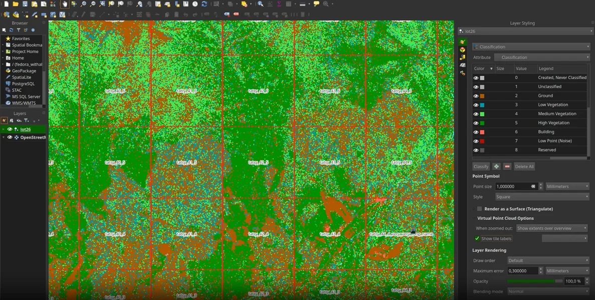

This feature was funded by Klimadatastyrelsen

This feature was developed by [Matej Bagar](https://github.com/Withalion)

## Print Layouts 

### Feature: Double-clicking a mouse handle for a layout label resizes to fit text

Double-clicking a handle will auto-size the label to fit exactly within the contained text (growing or shrinking as needed). The opposite side of the label will remain fixed in place so that, for example, double-clicking the bottom-right handle causes the bottom-right corner of the label to move.

This feature was developed by [Nyall Dawson](https://github.com/nyalldawson)

### Feature: Action on double click layout item

The QGIS API has been extended to add an event to Print Layout elements that are double-clicked, allowing for more advanced functionalities to be introduced in the future (e.g. double-click to edit an item).

This feature was developed by [Yoann Quenach de Quivillic](https://github.com/YoannQDQ)

### Feature: Layout better node item creation

When digitizing shapes with layout tools, the behavior has been modified to align better with the existing user experience in digitizing tools, which allows users the ability to remove incorrectly captured vertices on their shapes.

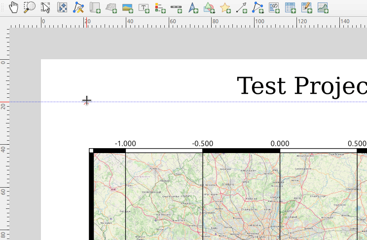

This feature was developed by [Yoann Quenach de Quivillic](https://github.com/YoannQDQ)

### Feature: Apply layout page size to all pages

A new "Apply to all Pages" button has been added to the Page Properties panel for multi-page layouts so that users can more efficiently make changes to complex layout properties.

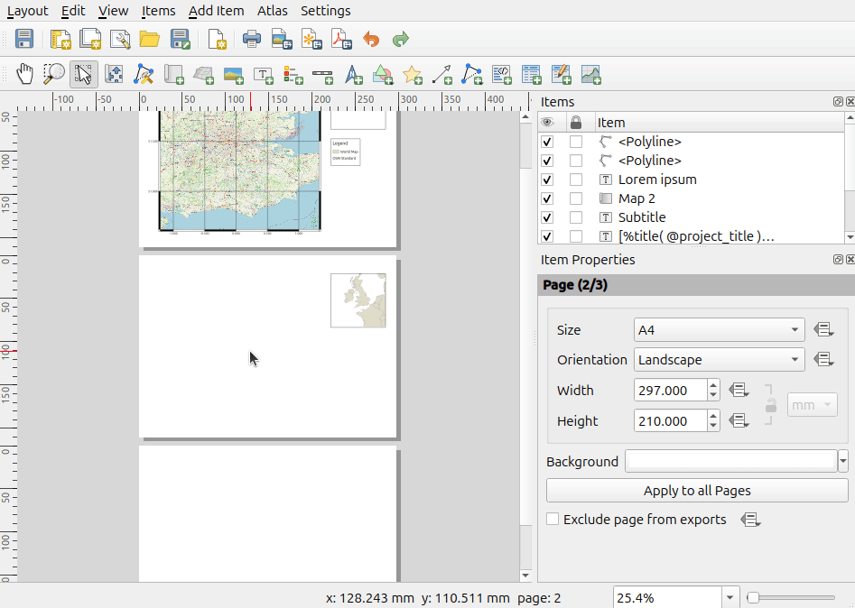

This feature was developed by [Yoann Quenach de Quivillic](https://github.com/YoannQDQ)

### Feature: New quality parameter for layout JPG exports

A new quality parameter has been added to the JPEG/JPG Image export options within print layouts to provide users more control of their export options.

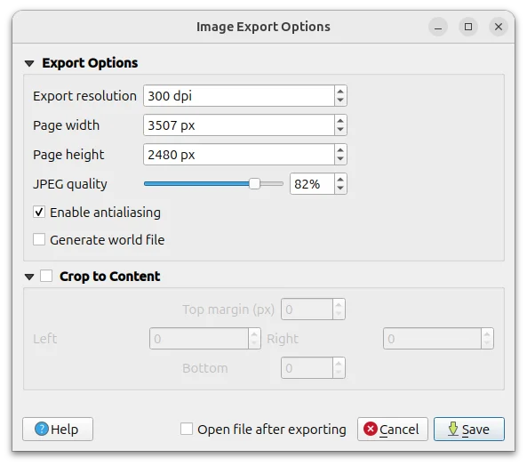

This feature was developed by [Yoann Quenach de Quivillic](https://github.com/YoannQDQ)

## Digitising 

### Feature: Highlight Trim/Extend plane of intersection

The styling and behavior for the Trim/Extend functionality has been modified to more closely align with the UX of the Advanced Digitizing tools so that geometry limits are more clearly represented to users visually.

This feature was developed by [Yoann Quenach de Quivillic](https://github.com/YoannQDQ)

## Data Management 

### Feature: Enable snapping in Georeferencer

The advanced digitizing panel and snapping options have been added to the georeferencer interface to offer users more control over reference points when aligning datasets.

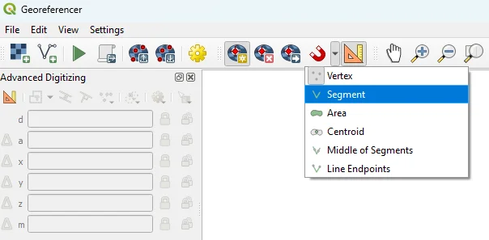

This feature was developed by [Denis Rouzaud](https://github.com/3nids)

### Feature: Data Source Manager STAC enhancements

Building on the STAC Client capabilities introduced in QGIS 3.40 as a part of [QEP\#300](https://github.com/qgis/QGIS-Enhancement-Proposals/issues/300), the QGIS STAC client now supports additional functionalities including:

-   STAC Catalog search functionality within the Data Source Manager
-   Advanced filtering for returned results
-   Display or hide footprints of the search results items in the map canvas
-   Highlight the selected item's footprint

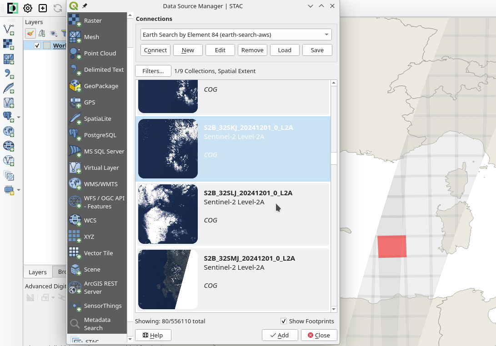

This feature was developed by [Stefanos Natsis](https://github.com/uclaros)

## Forms and Widgets 

### Feature: Additional sorting options on value relation widget

The value relation widget now includes a few new sorting options, including:

-   reverse order
-   order by a specific field

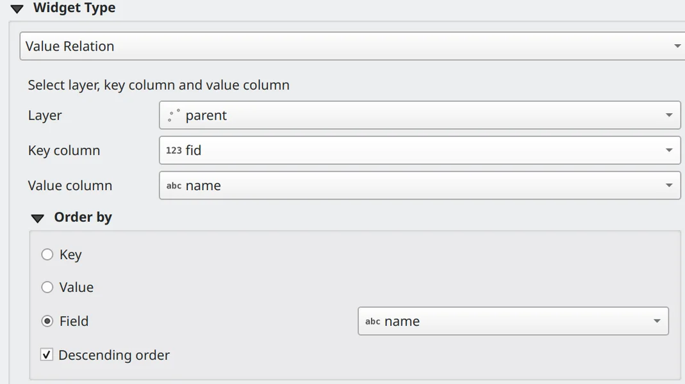

This feature was funded by Consorzio della Bonifica Renana

This feature was developed by [Alessandro Pasotti](https://github.com/elpaso)

### Feature: Copy and paste widget configuration when designing forms

A context menu has been added to the `Available Widgets` panel in the vector layer properties dialog, allowing users to copy & paste widget configurations between fields of the same layer, between fields from different layers in the QGIS project, or between fields from layers in different QGIS instances.

This feature was funded by Ville de Pully (Switzerland)

This feature was developed by [Germán Carrillo](https://github.com/gacarrillor)

## Processing 

### Feature: Processing metadata tools

New native algorithms have been added to the processing toolbox for better handling of layer metadata.

-   Copy layer metadata to copy metadata from an input layer to a target layer
-   Apply layer metadata to set layer metadata from a QMD file
-   Export layer metadata to export layer metadata in a QMD file
-   Add history metadata to add a new history entry to existing entries defined for a layer
-   Update layer metadata to copy non-empty metadata fields from the input layer to a target layer and keep empty fields from input unchanged in the target
-   Set metadata fields to set simple metadata fields (identifier, parent identifier, title, type, encoding, language, CRS, abstract, fees)

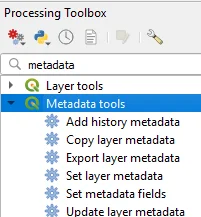

This feature was developed by [Alexander Bruy](https://github.com/alexbruy)

### Feature: Expression based hover content in Scatterplots

New options for the Vector layer scatterplot processing algorithm allow users to optionally add text shown on hover using QGIS expressions.

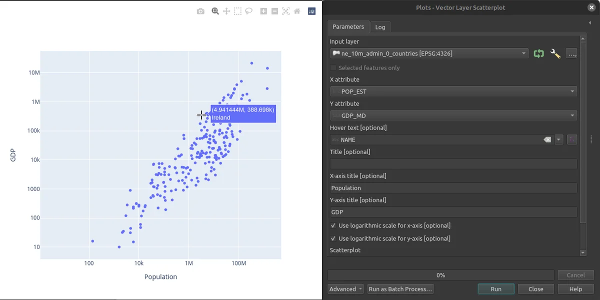

This feature was developed by [Florian Neukirchen](https://github.com/florianneukirchen)

### Feature: Add option to include 'layer' and 'path' attributes in Merge Vector Layers tool

A new checkbox option has been added to the Merge Vector Layers processing tool. This option allows users to choose whether to include the layer and path attributes from the individual input vector layers in the resulting merged layer. By default, this option is enabled to maintain backward compatibility.

This feature was developed by [Nass](https://github.com/lanckmann)

### Feature: Move Geometry Checker into processing tools

In line with the objectives of [QEP\#236](https://github.com/qgis/QGIS-Enhancement-Proposals/issues/236), which seeks to align and unify all geometry and topology verification/ validation methods, the Geometry Checker has now been integrated into the QGIS Processing Toolbox.

These algorithms have been added to the "Check Geometry" and "Fix Geometry" categories accordingly, and each algorithm maintains a consistent experience having a single input layer and two output layers.

For check processing algorithms, the outputs are:

-   a layer of the same type as the input layer with erroneous geometries only
-   a point layer with the error locations and information (feature id, part, and vertex number, etc.)

For fix processing algorithms, the outputs are:

-   a fixed layer of the same type as the input layer with corrected features according to the the chosen method
-   a point layer with the error locations and a report about the fix (fixed or not, and a message about the processed feature)

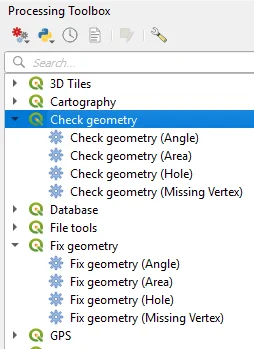

This feature was funded by QGIS (Grant OpenSource 2023) and Oslandia

This feature was developed by [Jacky Volpes](https://github.com/Djedouas)

### Feature: Add title, axis titles, and logarithmic axes to plots

Plotting algorithms in the "Plots" section of the Processing Tools have been extended with new functionalities.

The Scatterplot, Barplot, and Boxplot algorithms now allow for the specification of plot titles as well as axis titles as optional parameters, If axis titles are empty, the name of the field is used as the axis title by default.

If a single space is entered, the axis title is not shown (restoring the current behavior).

Scatterplots now also support using logarithmic scales across either axis.

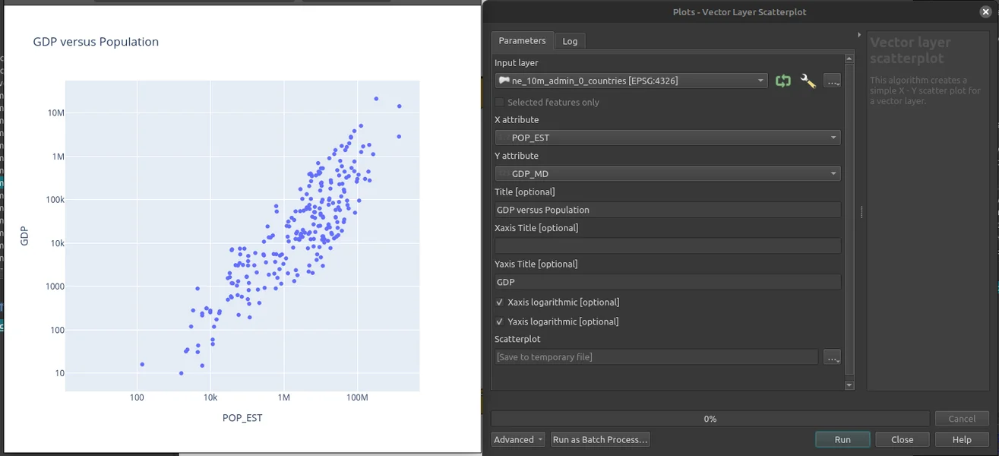

This feature was developed by [Florian Neukirchen](https://github.com/florianneukirchen)

### Feature: Raster zonal min/max algorithm

A new algorithm has been added that extracts point features corresponding to the minimum and maximum pixel values contained within polygon zones.

The output will contain one point feature for the minimum and one for the maximum raster value for every individual zonal feature from a polygon layer.

This feature was developed by [Nyall Dawson](https://github.com/nyalldawson)

### Feature: Algorithm to extract min/max pixel from raster

A new algorithm has been added that extracts extrema (minimum and maximum) values from a given band of the input raster layer.

The output is a vector layer containing point features for the selected extrema, at the center of the associated pixel.

If multiple pixels in the raster share the minimum or maximum value, then only one of these pixels will be included in the output.

The algorithm uses raster iterator to remain efficient on huge rasters, and does not require reading the entire raster to memory

This feature was developed by [Nyall Dawson](https://github.com/nyalldawson)

### Feature: New algorithm to generate elevation profile images

A new processing algorithm has been created which allows users to generate elevation profile images. This can effectively be used within models and will allows users to efficiently output elevation profiles for multiple curves.

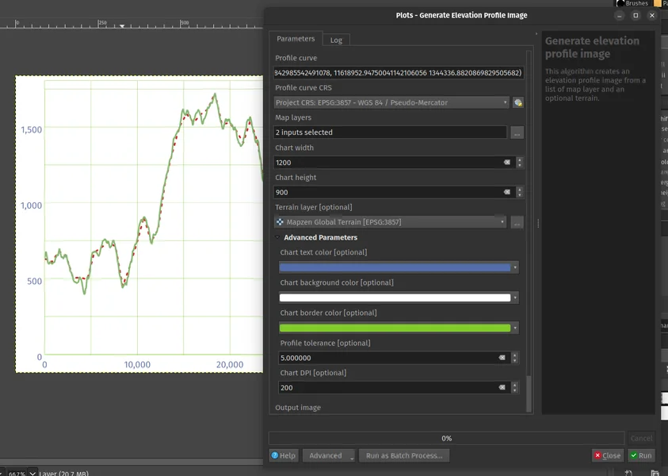

This feature was developed by [Mathieu Pellerin](https://github.com/nirvn)

### Feature: New Mesh: Surface to Polygon Algorithm

A new processing algorithm has been added for Mesh datasets that exports a surface of the mesh to a MultiPolygon output.

This feature was developed by [Jan Caha](https://github.com/JanCaha)

## Profile Plots 

### Feature: Introduce custom tolerance for vector layers

Users can define a custom tolerance by adding a `custom tolerance` property to the layer elevation properties. When set, this will override the global tolerance parameter defined in the elevation profile widget.

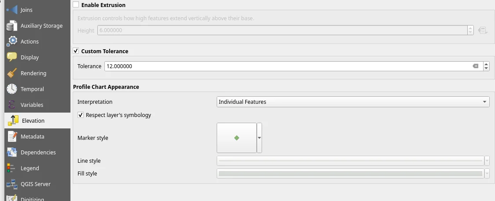

This feature was developed by [Jean Felder](https://github.com/ptitjano)

## Data Providers 

### Feature: Execute SQL from layer context menu

Users can now execute SQL directly across supported layers from within the projects table of contents.

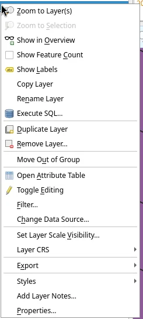

This feature was developed by [Jürgen Fischer](https://github.com/jef-n)

## Programmability 

### Feature: Expose QgsGeos class to PyQGIS

GEOS-specific functionality which is not exposed through the base QgsGeometryEngine class is now directly accessible via the new QgsGeos class.

This feature was developed by [Nyall Dawson](https://github.com/nyalldawson)

### Feature: Make Z and M values accessible via QgsGeometry.as\_numpy()

In previous versions of QGIS, the `QgsGeometry.as_numpy()` method would return coordinates with XY values only.

In this release `as_numpy` has been modified so that the coordinates for geometries with z and/or m values will be returned as xyz, xym, or xyzm accordingly.

This feature was developed by [Till Frankenbach](https://github.com/merydian)

### Feature: Python console interactive help

When pressing F1 within the Python Console, QGIS will automatically open the API page matching:

-   selected text if any OR
-   word at the mouse position (if enabled in settings, see below) OR
-   word at the text cursor position

The documentation will be opened within the new documentation section that has been added to the Debugging and Development tools panel so that developers can have easy access to the API documentation for current code objects directly within the application.

Additional QGIS settings have also been added so that developers can more readily modify this behavior to suit their workflow.

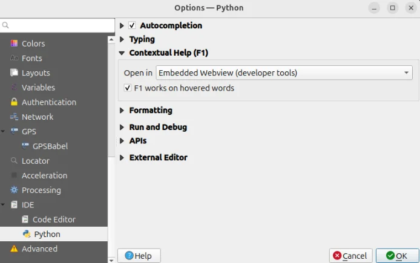

This feature was developed by [Yoann Quenach de Quivillic](https://github.com/YoannQDQ)

## Notable Fixes 

### Feature: Bug fixes by Even Rouault (Spatialys)

| Bug Title | URL issues.qgis.org (if reported) | URL Commit (Github) | 3.40 backport commit (GitHub) |
|----------|----------------------------------|--------------------|-------------------------------|
| Allow additional fields in Cloud Storage Connection credentials (or maybe gdal credentials more broadly) | [#60174](https://github.com/qgis/QGIS/issues/60174) | [GDAL PR 11699](https://github.com/OSGeo/gdal/pull/11699) | N/A |
| Add geometryColumnName() method for WFS and OAPIF providers | [#60055](https://github.com/qgis/QGIS/issues/60055) | [PR #60191](https://github.com/qgis/QGIS/pull/60191) | N/A |
| OAPIF: CQL layer filter expression is not used in request | [#60092](https://github.com/qgis/QGIS/issues/60092) | Not a bug | |
| Add support to export to/convert to .gpkg.zip files | [#59959](https://github.com/qgis/QGIS/issues/59959) | [PR #60202](https://github.com/qgis/QGIS/pull/60202) | N/A |
| WMS-T with Time Value YYYY | [#60264](https://github.com/qgis/QGIS/issues/60264) | [PR #60290](https://github.com/qgis/QGIS/pull/60290) | [PR #60307](https://github.com/qgis/QGIS/pull/60307) |
| GDAL Clip Raster by Layer Mask fails when given GeoPackage layer with diacritics (accents) in the name | [#59573](https://github.com/qgis/QGIS/issues/59573) | Superficial investigation | |
| webconnections xml is invalid due to missing namespace prefix | [#60242](https://github.com/qgis/QGIS/issues/60242) | [PR #60293](https://github.com/qgis/QGIS/pull/60293) | [PR #60353](https://github.com/qgis/QGIS/pull/60353) |
| Unsupported Data Source' adding GDAL AWS S3 raster layers with credential options | [#60288](https://github.com/qgis/QGIS/issues/60288) | [GDAL Commit 4d2e65347ee0207328b14753ee2ea5628ced7d17](https://github.com/OSGeo/gdal/commit/4d2e65347ee0207328b14753ee2ea5628ced7d17) | N/A |
| Create shapefile layer: allow to create Bool fields | [#60324](https://github.com/qgis/QGIS/issues/60324) | [PR #60327](https://github.com/qgis/QGIS/pull/60327) | [PR #60332](https://github.com/qgis/QGIS/pull/60332) |
| [cleanup] Limit number of hardcoded strings for layer type by leveraging QgsMapLayerFactory::typeToString() | None | [PR #60360](https://github.com/qgis/QGIS/pull/60360) | N/A |
| Add Raster Layer: do not include credentials in layer name | [#60292](https://github.com/qgis/QGIS/issues/60292) | [PR #60380](https://github.com/qgis/QGIS/pull/60380) | [PR #60387](https://github.com/qgis/QGIS/pull/60387) |
| QgsMapLayer::publicSource(): make it redact/remove GDAL credentials | [#60292](https://github.com/qgis/QGIS/issues/60292) | [PR #60384](https://github.com/qgis/QGIS/pull/60384) | [PR #60400](https://github.com/qgis/QGIS/pull/60400) |
| QgsLayoutExporter: avoid to print the "ERROR 6: The PNG driver does not support update access to existing datasets." GDAL error message | [PR #60208](https://github.com/qgis/QGIS/pull/60208) | [GDAL PR 11708](https://github.com/OSGeo/gdal/pull/11708) | N/A |

This feature was funded by [QGIS.ORG (through donations and sustaining memberships)](https://qgis.org/)

This feature was developed by [Even Rouault (Spatialys)](https://www.spatialys.com/)

### Feature: Bug fixes by Alessandro Pasotti (QCooperative)

| Bug Title | URL issues.qgis.org (if reported) | URL Commit (Github) | 3.40 backport commit (GitHub) |
|----------|----------------------------------|--------------------|-------------------------------|
| A semicolon after a custom SQL query makes QGIS generate a broken layer | [#56993](https://github.com/qgis/QGIS/issues/56993) | [PR #60209](https://github.com/qgis/QGIS/pull/60209) | [PR #60230](https://github.com/qgis/QGIS/pull/60230) |
| QGIS Server does not respect datum transformation | [#60216](https://github.com/qgis/QGIS/issues/60216) | [PR #60239](https://github.com/qgis/QGIS/pull/60239) | [PR #60302](https://github.com/qgis/QGIS/pull/60302) |
| [OGR] Fix transactional editing for GPKG/SQLite | [PR #60198](https://github.com/qgis/QGIS/pull/60198) | [PR #60198](https://github.com/qgis/QGIS/pull/60198) | No |
| QGIS Server: GetFeatureInfo default tolerance can be too small for line and point features | [#59818](https://github.com/qgis/QGIS/issues/59818) | [PR #60243](https://github.com/qgis/QGIS/pull/60243) | [PR #60259](https://github.com/qgis/QGIS/pull/60259) |
| Missing Update operation for WFS layers without geometry | [#60185](https://github.com/qgis/QGIS/issues/60185) | [PR #60266](https://github.com/qgis/QGIS/pull/60266) | [PR #60271](https://github.com/qgis/QGIS/pull/60271) |
| QGIS Server OGC: Ignoring "Use attribute form settings in GetFeatureInfo response" in GML output | [#59355](https://github.com/qgis/QGIS/issues/59355) | [PR #60281](https://github.com/qgis/QGIS/pull/60281) | No |
| First field in attribute table gets cleared on selection when Widget Type Date/Time is set | [#60223](https://github.com/qgis/QGIS/issues/60223) | Cannot reproduce | No |
| Data Source Manager connects to all PostgreSQL connections on launch | [#60018](https://github.com/qgis/QGIS/issues/60018) | [PR #60319](https://github.com/qgis/QGIS/pull/60319) | [PR #60326](https://github.com/qgis/QGIS/pull/60326) |
| Virtual layer with JOIN on PostGIS layers not working anymore | [#60104](https://github.com/qgis/QGIS/issues/60104) | Cannot reproduce | No |
| Enabling OpenCL acceleration generates erratic behavior in raster operations | [#60077](https://github.com/qgis/QGIS/issues/60077) | [PR #60339](https://github.com/qgis/QGIS/pull/60339) | [PR #60347](https://github.com/qgis/QGIS/pull/60347) |
| QGIS Server OGC: Display name is not provided in GetFeatureInfo json/gml response | [#59353](https://github.com/qgis/QGIS/issues/59353) | [PR #60343](https://github.com/qgis/QGIS/pull/60343) | No |
| Source Multipolygon-geometry reads as Polygon-geometry in MapInfo TAB format | [#60396](https://github.com/qgis/QGIS/issues/60396) | [PR #60410](https://github.com/qgis/QGIS/pull/60410) | No |
| Geometry checker accepts invalid polygon | [#60464](https://github.com/qgis/QGIS/issues/60464) | Cannot reproduce | No |
| Labels with decimal values do not use Locale when decimal is used in a text expression | [#60440](https://github.com/qgis/QGIS/issues/60440) | Not sure this is a bug, open for discussion [PR #60479](https://github.com/qgis/QGIS/pull/60479) | No |
| New Connections to OGC Services Hang in Profiles with PostGIS Connections | [#60335](https://github.com/qgis/QGIS/issues/60335) | [PR #60495](https://github.com/qgis/QGIS/pull/60495) | TODO |
| [Regression] OGC-Features API requests do not send Authorization header in v3.40.3 | [#60473](https://github.com/qgis/QGIS/issues/60473) | [PR #60511](https://github.com/qgis/QGIS/pull/60511) | TODO |

This feature was funded by [QGIS.ORG (through donations and sustaining memberships)](https://qgis.org/)

This feature was developed by [Alessandro Pasotti (QCooperative)](https://www.qcooperative.net/)

### Feature: Bug fixes by Julien Cabieces (Oslandia)

| Bug Title | URL issues.qgis.org (if reported) | URL Commit (Github) | 3.40 backport commit (GitHub) |
|----------|----------------------------------|--------------------|-------------------------------|
| Qt6: migration script forces Qt modules which are not covered by qgis.PyQt | [#59351](https://github.com/qgis/QGIS/issues/59351) | [PR #60280](https://github.com/qgis/QGIS/pull/60280) | [PR #60298](https://github.com/qgis/QGIS/pull/60298) |
| Unable to perform zip or export to PDF/image | [#59911](https://github.com/qgis/QGIS/issues/59911) | Not a bug | N/A |
| QgisVectorLayerEditUtils addTopologicalPoints causes overlaps | [#58350](https://github.com/qgis/QGIS/issues/58350) | Not a bug | N/A |
| QGIS should never poll a PostGIS/WMS/WFS/etc connections unless specifically asked to | [#58303](https://github.com/qgis/QGIS/issues/58303) | Cannot reproduce | N/A |
| Masking labels doesn't work with rule-based labeling | [#46402](https://github.com/qgis/QGIS/issues/46402) | [PR #60325](https://github.com/qgis/QGIS/pull/60325) | [PR #60458](https://github.com/qgis/QGIS/pull/60458) |
| [Clang] Remove some deprecated warnings | Unreported | [PR #60428](https://github.com/qgis/QGIS/pull/60428) | N/A |
| Label mask in Geopackage | [#59245](https://github.com/qgis/QGIS/issues/59245) | Cannot reproduce | N/A |
| QMS plugin crashes in master | [#60286](https://github.com/qgis/QGIS/issues/60286) | [PR #60363](https://github.com/qgis/QGIS/pull/60363) | N/A |
| Sip deprecated annotation makes QGIS crash | Unreported SIP issue | [SIP PR #67](https://github.com/Python-SIP/sip/pull/67) | N/A |
| Masking labels doesn't work with rule-based labeling | [#46402](https://github.com/qgis/QGIS/issues/46402) | [PR #60490](https://github.com/qgis/QGIS/pull/60490) | [PR #60509](https://github.com/qgis/QGIS/pull/60509) |

This feature was funded by [QGIS.ORG (through donations and sustaining memberships)](https://qgis.org/)

This feature was developed by [Julien Cabieces (Oslandia)](https://oslandia.com/en/)

### Feature: Bug fixes by Jacky Volpes (Oslandia)

| Bug Title | URL issues.qgis.org (if reported) | URL Commit (Github) | 3.40 backport commit (GitHub) |
|----------|----------------------------------|--------------------|-------------------------------|
| Rule based symbology sorting with all fields in legend when only linked maps is ticked | [#60383](https://github.com/qgis/QGIS/issues/60383) | [PR #60536](https://github.com/qgis/QGIS/pull/60536) | |
| Fix bad overlaps results with QgsRange objects and derivatives (int range, date range...) | unreported | [PR #60139](https://github.com/qgis/QGIS/pull/60139) | [PR #60532](https://github.com/qgis/QGIS/pull/60532) |

This feature was funded by [QGIS.ORG (through donations and sustaining memberships)](https://qgis.org/)

This feature was developed by [Jacky Volpes (Oslandia)](https://oslandia.com/en/)

### Feature: Bug fixes by Nyall Dawson (North Road)

| Bug Title | URL issues.qgis.org (if reported) | URL Commit (Github) | 3.40 backport commit (GitHub) |
|----------|----------------------------------|--------------------|-------------------------------|
| Fix leaks in layer definition loading code | unreported | [PR #60650](https://github.com/qgis/QGIS/pull/60650) | pending |
| Fix data-defined overrides ignored in legend text format | [#60628](https://github.com/qgis/QGIS/issues/60628) | [PR #60632](https://github.com/qgis/QGIS/pull/60632) | pending |
| Fix normalising constant in quartic kernel | [#60616](https://github.com/qgis/QGIS/issues/60616) | [PR #60631](https://github.com/qgis/QGIS/pull/60631) | [PR #60633](https://github.com/qgis/QGIS/pull/60633) |
| Fix incorrect compilation of "field IN (...) or field NOT IN (...)" | unreported | [PR #60630](https://github.com/qgis/QGIS/pull/60630) | N/A |
| Lots of memory leak fixes | unreported | [PR #60629](https://github.com/qgis/QGIS/pull/60629) | [PR #60651](https://github.com/qgis/QGIS/pull/60651) |
| [stac] Port more API to use unique_ptr | unreported | [PR #60627](https://github.com/qgis/QGIS/pull/60627) | N/A |
| Fix slow performance of raster image marker | [#51273](https://github.com/qgis/QGIS/issues/51273) | [PR #60604](https://github.com/qgis/QGIS/pull/60604) | too risky |
| Fix hang when project with large number of layers has joins to same layers | [#55026](https://github.com/qgis/QGIS/issues/55026) | [PR #60577](https://github.com/qgis/QGIS/pull/60577) | pending |
| Fix some app slowdown when many queries visible in network/db log panel | unreported | [PR #60576](https://github.com/qgis/QGIS/pull/60576) | [PR #60583](https://github.com/qgis/QGIS/pull/60583) |
| Fix render order of symbol layers for filled marker/filled line/arrow subsymbol | unreported | [PR #60575](https://github.com/qgis/QGIS/pull/60575) | [PR #60613](https://github.com/qgis/QGIS/pull/60613) |
| Diamond star marker shape is not closed | unreported | [PR #60574](https://github.com/qgis/QGIS/pull/60574) | [PR #60579](https://github.com/qgis/QGIS/pull/60579) |
| Fix artifacts when rendering filled line symbol | [#59689](https://github.com/qgis/QGIS/issues/59689) | [PR #60554](https://github.com/qgis/QGIS/pull/60554) | [PR #60578](https://github.com/qgis/QGIS/pull/60578) |
| Fix checkbox search widget wrapper for boolean field types | [#60152](https://github.com/qgis/QGIS/issues/60152) | [PR #60552](https://github.com/qgis/QGIS/pull/60552) | [PR #60558](https://github.com/qgis/QGIS/pull/60558) |
| [processing] Use matrix editor panel value if open | [#60442](https://github.com/qgis/QGIS/issues/60442) | [PR #60551](https://github.com/qgis/QGIS/pull/60551) | [PR #60556](https://github.com/qgis/QGIS/pull/60556) |
| [processing] Fix exception when algorithm has no output layers | unreported | [PR #60550](https://github.com/qgis/QGIS/pull/60550) | [PR #60560](https://github.com/qgis/QGIS/pull/60560) |
| Fix status bar coordinate display when project has no CRS | [#56954](https://github.com/qgis/QGIS/issues/56954) | [PR #60549](https://github.com/qgis/QGIS/pull/60549) | [PR #60561](https://github.com/qgis/QGIS/pull/60561) |
| Fixes for layers with a compound crs | [#55173](https://github.com/qgis/QGIS/issues/55173) | [PR #60548](https://github.com/qgis/QGIS/pull/60548) | [PR #60557](https://github.com/qgis/QGIS/pull/60557) |
| [oracle] Fix adding features with null attributes | unreported | [PR #60540](https://github.com/qgis/QGIS/pull/60540) | [PR #60566](https://github.com/qgis/QGIS/pull/60566) |
| [ams] Fix crash when layer ids are not sequential | [#60483](https://github.com/qgis/QGIS/issues/60483) | [PR #60520](https://github.com/qgis/QGIS/pull/60520) | [PR #60538](https://github.com/qgis/QGIS/pull/60538) |
| Fix pasting unsaved changes as temporary scratch layers | [#38913](https://github.com/qgis/QGIS/issues/38913) | [PR #60474](https://github.com/qgis/QGIS/pull/60474) | too risky |
| More descriptive expression parsing errors when a function is not found | unreported | [PR #60472](https://github.com/qgis/QGIS/pull/60472) | [PR #60475](https://github.com/qgis/QGIS/pull/60475) |
| Fix paint effects sometimes result in aliased rendering | unreported | [PR #60453](https://github.com/qgis/QGIS/pull/60453) | [PR #60468](https://github.com/qgis/QGIS/pull/60468) |
| More fixes for use of inline data for SVG content | [#60427](https://github.com/qgis/QGIS/issues/60427) | [PR #60448](https://github.com/qgis/QGIS/pull/60448) | [PR #60452](https://github.com/qgis/QGIS/pull/60452) |
| Fix potential crashes when layer tree insertion target group is deleted | unreported | [PR #60446](https://github.com/qgis/QGIS/pull/60446) | [PR #60449](https://github.com/qgis/QGIS/pull/60449) |
| When changing rect text annotation to fixed size mode, use current size | [#59189](https://github.com/qgis/QGIS/issues/59189) | [PR #60424](https://github.com/qgis/QGIS/pull/60424) | [PR #60451](https://github.com/qgis/QGIS/pull/60451) |
| Fix crash in text renderer when wrapping with one word + small rect | [#60256](https://github.com/qgis/QGIS/issues/60256) | [PR #60423](https://github.com/qgis/QGIS/pull/60423) | [PR #60450](https://github.com/qgis/QGIS/pull/60450) |
| [sensorthings] Offer MultiDatastreams as valid expansion targets | [#59531](https://github.com/qgis/QGIS/issues/59531) | [PR #60420](https://github.com/qgis/QGIS/pull/60420) | [PR #60426](https://github.com/qgis/QGIS/pull/60426) |
| [sensorthings] Fix provider does not work with oauth2 config method | [#60407](https://github.com/qgis/QGIS/issues/60407) | [PR #60419](https://github.com/qgis/QGIS/pull/60419) | [PR #60425](https://github.com/qgis/QGIS/pull/60425) |
| [sensorthings] only allow expansion removal from end of table | [#59532](https://github.com/qgis/QGIS/issues/59532) | [PR #60403](https://github.com/qgis/QGIS/pull/60403) | [PR #60405](https://github.com/qgis/QGIS/pull/60405) |
| [sensorthings] Remove option for basic authentication | [#59721](https://github.com/qgis/QGIS/issues/59721) | [PR #60376](https://github.com/qgis/QGIS/pull/60376) | [PR #60421](https://github.com/qgis/QGIS/pull/60421) |
| [sensorthings] Offer geometry for Datastream entities | [#59525](https://github.com/qgis/QGIS/issues/59525) | [PR #60375](https://github.com/qgis/QGIS/pull/60375) | too risky |
| [sensorthings] Hide proxy fields for interval fields in filter builder | [#59528](https://github.com/qgis/QGIS/issues/59528) | [PR #60374](https://github.com/qgis/QGIS/pull/60374) | [PR #60457](https://github.com/qgis/QGIS/pull/60457) |
| [sensorthings] Offer choices of non-polygon geometry types for multidatastreams | [#59719](https://github.com/qgis/QGIS/issues/59719) | [PR #60373](https://github.com/qgis/QGIS/pull/60373) | too risky |
| [sensorthings] Don't allow expansion back to base entity type | [#59722](https://github.com/qgis/QGIS/issues/59722) | [PR #60372](https://github.com/qgis/QGIS/pull/60372) | [PR #60398](https://github.com/qgis/QGIS/pull/60398) |
| When a layer changes from non-spatial to spatial, update canvas layers | [#59723](https://github.com/qgis/QGIS/issues/59723) | [PR #60371](https://github.com/qgis/QGIS/pull/60371) | too risky |
| Ensure that labeling solutions are deterministic | unreported | [PR #60369](https://github.com/qgis/QGIS/pull/60369) | [PR #60388](https://github.com/qgis/QGIS/pull/60388) |
| Remove an extraneous setting of layer scope for vectors | [#60112](https://github.com/qgis/QGIS/issues/60112) | [PR #60367](https://github.com/qgis/QGIS/pull/60367) | too risky |
| Use font button in annotation widgets instead of full text format widget | unreported | [PR #60354](https://github.com/qgis/QGIS/pull/60354) | [PR #60368](https://github.com/qgis/QGIS/pull/60368) |
| Fix incorrect annotation HTML shown when clicking between annotations | unreported | [PR #60333](https://github.com/qgis/QGIS/pull/60333) | [PR #60365](https://github.com/qgis/QGIS/pull/60365) |
| Delegate bounding box transformation to proj | [#59821](https://github.com/qgis/QGIS/issues/59821) | [PR #60331](https://github.com/qgis/QGIS/pull/60331) | [PR #60439](https://github.com/qgis/QGIS/pull/60439) |
| Fix logic in pdal indexing task relating to progress updates | unreported | [PR #60312](https://github.com/qgis/QGIS/pull/60312) | [PR #60315](https://github.com/qgis/QGIS/pull/60315) |
| Fix handling of multiple consecutive tabs with HTML text rendering | [#60098](https://github.com/qgis/QGIS/issues/60098) | [PR #60299](https://github.com/qgis/QGIS/pull/60299) | [PR #60422](https://github.com/qgis/QGIS/pull/60422) |
| Explicitly block initQgis, exitQgis from within application | [#60025](https://github.com/qgis/QGIS/issues/60025) | [PR #60297](https://github.com/qgis/QGIS/pull/60297) | too risky |
| Fix potential (unlikely) crash in concave hull algorithm | [#59778](https://github.com/qgis/QGIS/issues/59778) | [PR #60296](https://github.com/qgis/QGIS/pull/60296) | |
| Catch transform errors in QgsWFSProvider::getCapabilities | [#60622](https://github.com/qgis/QGIS/issues/60622) | [PR #60653](https://github.com/qgis/QGIS/pull/60653) | pending |

This feature was funded by [QGIS.ORG (through donations and sustaining memberships)](https://qgis.org/)

This feature was developed by [Nyall Dawson (North Road)](https://north-road.com/)

### Feature: Bug fixes by Alexander Bruy (QCooperative)

| Bug Title | URL issues.qgis.org (if reported) | URL Commit (Github) | 3.40 backport commit (GitHub) |
|-----------|----------------------------------|---------------------|------------------------------|
| Zonal histogram unusable results if input raster has many decimal places | [#30822](https://github.com/qgis/QGIS/issues/30822) | [PR#60212](https://github.com/qgis/QGIS/pull/60212) | [PR#60234](https://github.com/qgis/QGIS/pull/60234) |
| PyQGIS / Processing: QgsProcessingParameterMapLayer doesn't respect QgsProcessing.TypeVector | [#56344](https://github.com/qgis/QGIS/issues/56344) | [PR#60213](https://github.com/qgis/QGIS/pull/60213) | [PR#60305](https://github.com/qgis/QGIS/pull/60305) |
| "Layer name" is actually layer title | [#28857](https://github.com/qgis/QGIS/issues/28857) | [PR#60215](https://github.com/qgis/QGIS/pull/60215) | no |
| WMS layers added with the browser panel ignore image format preferences and default to PNG | [#57666](https://github.com/qgis/QGIS/issues/57666) | [PR#60221](https://github.com/qgis/QGIS/pull/60221) | [PR#60309](https://github.com/qgis/QGIS/pull/60309) |
| There seems to be an issue with the way the algorithm for merging pointclouds works in the model builder | [#57550](https://github.com/qgis/QGIS/issues/57550) | [PR#60236](https://github.com/qgis/QGIS/pull/60236) | [PR#60304](https://github.com/qgis/QGIS/pull/60304) |
| TypeError: unsupported operand type(s) for +: 'Modifier' and 'Key' | [#60063](https://github.com/qgis/QGIS/issues/60063) | [PR#60289](https://github.com/qgis/QGIS/pull/60289) | [PR#60294](https://github.com/qgis/QGIS/pull/60294) |
| "TIN interpolation" and "IDW interpolation" algs always output an ASCII grid (AAIGrid) raster regardless of the output file extension | [#56653](https://github.com/qgis/QGIS/issues/56653) | [PR#60320](https://github.com/qgis/QGIS/pull/60320) | [PR#60351](https://github.com/qgis/QGIS/pull/60351) |
| When editing a Scene connection a new Scene connection is created instead | [#57570](https://github.com/qgis/QGIS/issues/57570) | [PR#60321](https://github.com/qgis/QGIS/pull/60321) | [PR#60329](https://github.com/qgis/QGIS/pull/60329) |
| Spatialite execute SQL issues | [#53904](https://github.com/qgis/QGIS/issues/53904) | [PR#60337](https://github.com/qgis/QGIS/pull/60337) | [PR#60348](https://github.com/qgis/QGIS/pull/60348) |
| Selected sub-item of Join doesn't count for editing | [#29709](https://github.com/qgis/QGIS/issues/29709) | [PR#60338](https://github.com/qgis/QGIS/pull/60338) | [PR#60356](https://github.com/qgis/QGIS/pull/60356) |
| Export Layer(s) Information processing tool suggests unsupported Annotations layer as input | [#49010](https://github.com/qgis/QGIS/issues/49010) | [PR#60341](https://github.com/qgis/QGIS/pull/60341) | [PR#60460](https://github.com/qgis/QGIS/pull/60460) |
| Add BIGTIFF writing option to the georeferencer | [#47362](https://github.com/qgis/QGIS/issues/47362) | [PR#60344](https://github.com/qgis/QGIS/pull/60344) | no |
| Raster resampling settings are not applied when importing a style | [#56771](https://github.com/qgis/QGIS/issues/56771) | [PR#60358](https://github.com/qgis/QGIS/pull/60358) | [PR#60377](https://github.com/qgis/QGIS/pull/60377) |
| Switching back to Box style scale bar after having switched to Hollow does not reset the fill brush | [#37413](https://github.com/qgis/QGIS/issues/37413) | [PR#60430](https://github.com/qgis/QGIS/pull/60430) | [PR#60471](https://github.com/qgis/QGIS/pull/60471) |
| Failure when writing to vector file: Path to corresponding vector file is not shown | [#49567](https://github.com/qgis/QGIS/issues/49567) | [PR#60433](https://github.com/qgis/QGIS/pull/60433) | [PR#60444](https://github.com/qgis/QGIS/pull/60444) |
| WFS GetFeature request is not using project CRS despite it is offered by WFS | [#44325](https://github.com/qgis/QGIS/issues/44325) | [PR#60476](https://github.com/qgis/QGIS/pull/60476) | [PR#60505](https://github.com/qgis/QGIS/pull/60505) |
| Fix missed import and incorrect call to getThemeIcon() | unreported | [PR#60480](https://github.com/qgis/QGIS/pull/60480) | [PR#60484](https://github.com/qgis/QGIS/pull/60484) |
| "CRS" variable does not work in Processing/expression calculator when defining an output name in batch mode | [#58313](https://github.com/qgis/QGIS/issues/58313) | [PR#60485](https://github.com/qgis/QGIS/pull/60485) | no |
| [WMS] Not possible to "Ignore reported layer extents" | [#60496](https://github.com/qgis/QGIS/issues/60496) | [PR#60513](https://github.com/qgis/QGIS/pull/60513) | [PR#60529](https://github.com/qgis/QGIS/pull/60529) |
| Alias not exported with algorithm Export to spreadsheet with Value Relation widget | [#59403](https://github.com/qgis/QGIS/issues/59403) | [PR#60542](https://github.com/qgis/QGIS/pull/60542) | [PR#60544](https://github.com/qgis/QGIS/pull/60544) |
| Create "Constant Raster" image size is different compared to "Rasterize" | [#43547](https://github.com/qgis/QGIS/issues/43547) | [PR#60587](https://github.com/qgis/QGIS/pull/60587) | [PR#60608](https://github.com/qgis/QGIS/pull/60608) |
| [browser] "edit" multiple connections at once? | [#31928](https://github.com/qgis/QGIS/issues/31928) | [PR#60639](https://github.com/qgis/QGIS/pull/60639) | [PR#60648](https://github.com/qgis/QGIS/pull/60648) |
| Remove ALL references to plugin | [#56808](https://github.com/qgis/QGIS/issues/56808) | Not a bug | |
| native:savefeatures unable to specify output layer | [#56517](https://github.com/qgis/QGIS/issues/56517) | Cannot reproduce | |
| Processing Raster Calculator not working in Processing Graphical Modeler | [#37831](https://github.com/qgis/QGIS/issues/37831) | Cannot reproduce, fixed in the native algorithm | |
| [processing] Raster calculator in embedded model can't refer to embedded model input | [#42825](https://github.com/qgis/QGIS/issues/42825) | Cannot reproduce, fixed in the native algorithm | |
| Raster calculator in graphical modeler reversing layer definitions every time the program is opened | [#33338](https://github.com/qgis/QGIS/issues/33338) | Cannot reproduce, fixed in the native algorithm | |
| Modeler and Raster Calculator fail to calc | [#32753](https://github.com/qgis/QGIS/issues/32753) | Cannot reproduce, fixed in the native algorithm | |
| Hillshade not created when Save File As is used | [#57247](https://github.com/qgis/QGIS/issues/57247) | Not a bug | |
| Customization: Tools selected with the widget catcher are kept selected even if the dialog is cancelled | [#23199](https://github.com/qgis/QGIS/issues/23199) | [PR#60643](https://github.com/qgis/QGIS/pull/60643) | [PR#60678](https://github.com/qgis/QGIS/pull/60678) |
| Disable default actions for non-spatial tables | [#57916](https://github.com/qgis/QGIS/issues/57916) | [PR#60657](https://github.com/qgis/QGIS/pull/60657) | [PR#60670](https://github.com/qgis/QGIS/pull/60670) |

This feature was funded by [QGIS.ORG (through donations and sustaining memberships)](https://qgis.org/)

This feature was developed by [Alexander Bruy (QCooperative)](https://www.qcooperative.net/)

### Feature: Bug fixes by Mathieu Pellerin (OPENGIS)

| Bug Title | URL issues.qgis.org (if reported) | URL Commit (Github) | 3.40 backport commit (GitHub) |
|-----------|----------------------------------|---------------------|------------------------------|
| Algorithm postprocessing regression failing to add all but one output to the project | Unreported | [PR #60624](https://github.com/qgis/QGIS/pull/60624) | [PR #60626](https://github.com/qgis/QGIS/pull/60626) |
| Expression's `$id` value can overflow due to wrong int casting | Unreported | [PR #60521](https://github.com/qgis/QGIS/pull/60521) | - |
| Symbol selector dialog not passing on its context to its widget | [#58985](https://github.com/qgis/QGIS/issues/58985) | [PR #60482](https://github.com/qgis/QGIS/pull/60482) | [PR #60667](https://github.com/qgis/QGIS/pull/60667) |
| Missing `cluster_size` variable in expression constructor dialog for cluster symbol | [#58985](https://github.com/qgis/QGIS/issues/58985) | [#58985](https://github.com/qgis/QGIS/issues/58985) | [Commit 068e27c](https://github.com/qgis/QGIS/commit/068e27c0d30babc6582e2db511cd848ec6f0095c) |
| Annotation fixed-size units not set correctly in UI | [#59188](https://github.com/qgis/QGIS/issues/59188) | [PR #60392](https://github.com/qgis/QGIS/pull/60392) | [PR #60397](https://github.com/qgis/QGIS/pull/60397) |
| MBtiles Won't Load Zooms Higher Than 14 | [#59309](https://github.com/qgis/QGIS/issues/59309) | [PR #60391](https://github.com/qgis/QGIS/pull/60391) | [PR #60395](https://github.com/qgis/QGIS/pull/60395) |
| Docked Georeferencer does not reopen if closed | [#60382](https://github.com/qgis/QGIS/issues/60382) | [PR #60390](https://github.com/qgis/QGIS/pull/60390) | [PR #60401](https://github.com/qgis/QGIS/pull/60401) |
| Unable to reorder subdiagrams in stacked diagrams dialog | [#59505](https://github.com/qgis/QGIS/issues/59505) | [PR #60278](https://github.com/qgis/QGIS/pull/60278) | [PR #60519](https://github.com/qgis/QGIS/pull/60519) |
| Unable to save after error in Geometry Validation | [#59688](https://github.com/qgis/QGIS/issues/59688) | [PR #60263](https://github.com/qgis/QGIS/pull/60263) | [PR #60303](https://github.com/qgis/QGIS/pull/60303) |
| Barely visible icon within Python editor in grey theme | [#59772](https://github.com/qgis/QGIS/issues/59772) | [PR #60261](https://github.com/qgis/QGIS/pull/60261) | [PR #60352](https://github.com/qgis/QGIS/pull/60352) |
| Help->About window displays not up-to-date active Python plugins list after activating/deactivating or installing/uninstalling plugins | [#59779](https://github.com/qgis/QGIS/issues/59779) | [PR #60257](https://github.com/qgis/QGIS/pull/60257) | [PR #60270](https://github.com/qgis/QGIS/pull/60270) |
| QGIS' handling of network requests' redirects is broken under Qt6 | [#60235](https://github.com/qgis/QGIS/issues/60235) | [PR #60238](https://github.com/qgis/QGIS/pull/60238) | [PR #60269](https://github.com/qgis/QGIS/pull/60269) |
| Data loss for new rows if a column added after row in attribute table | [#59783](https://github.com/qgis/QGIS/issues/59783) | [PR #60226](https://github.com/qgis/QGIS/pull/60226) | [PR #60310](https://github.com/qgis/QGIS/pull/60310) |
| Non-HTML-formatted annotations have their text deleted every time a setting changes | [#59804](https://github.com/qgis/QGIS/issues/59804) | [PR #60222](https://github.com/qgis/QGIS/pull/60222) | [PR #60334](https://github.com/qgis/QGIS/pull/60334) |
| `outputCrs` is an unknown keyword argument in QgsRasterCalculator | [#59890](https://github.com/qgis/QGIS/issues/59890) | [PR #60218](https://github.com/qgis/QGIS/pull/60218) | - |
| Invalid CRS after writing in QgsRasterCalculator | [#59898](https://github.com/qgis/QGIS/issues/59898) | [PR #60214](https://github.com/qgis/QGIS/pull/60214) | [PR #60253](https://github.com/qgis/QGIS/pull/60253) |
| Data-defined expression for labels "tab distance" doesn't seem to work | [#60004](https://github.com/qgis/QGIS/issues/60004) | [PR #60211](https://github.com/qgis/QGIS/pull/60211) | Not needed |
| QGIS crashes due to erroneous extent / invalid CRS in XYZ creation algorithms | [#60069](https://github.com/qgis/QGIS/issues/60069) | [PR #60199](https://github.com/qgis/QGIS/pull/60199) | [PR #60220](https://github.com/qgis/QGIS/pull/60220) |
| The "Selected features only" checkbox is incorrectly disabled / enabled although the layer has / has not selected features | [#60108](https://github.com/qgis/QGIS/issues/60108) | [PR #60197](https://github.com/qgis/QGIS/pull/60197) | [PR #60306](https://github.com/qgis/QGIS/pull/60306) |
| Modeler - Feature iteration does not work | [#60131](https://github.com/qgis/QGIS/issues/60131) | [PR #60194](https://github.com/qgis/QGIS/pull/60194) | [PR #60300](https://github.com/qgis/QGIS/pull/60300) |
| Changes on form are not applied by default | [#60181](https://github.com/qgis/QGIS/issues/60181) | [PR #60192](https://github.com/qgis/QGIS/pull/60192) | [PR #60591](https://github.com/qgis/QGIS/pull/60591) |

This feature was funded by [QGIS.ORG (through donations and sustaining memberships)](https://qgis.org/)

This feature was developed by [Mathieu Pellerin (OPENGIS)](https://opengis.ch/)

### Feature: Bug fixes by Stefanos Natsis (LutraConsulting)

| Bug Title | URL issues.qgis.org (if reported) | URL Commit (Github) | 3.40 backport commit (GitHub) |
|-----------|----------------------------------|---------------------|------------------------------|
| PointCloud - Converting LAZ to COPC.LAZ: CRS information is lost in COPC.LAZ file | [#59662](https://github.com/qgis/QGIS/issues/59662) | [hobuinc/untwine PR #189](https://github.com/hobuinc/untwine/pull/189) | - |
| Losing the CRS in .copc.laz created from .laz using drag and drop | [#57983](https://github.com/qgis/QGIS/issues/57983) | [hobuinc/untwine PR #189](https://github.com/hobuinc/untwine/pull/189) | - |
| Untwine fails if path contains Swedish characters | [#57913](https://github.com/qgis/QGIS/issues/57913) | [hobuinc/untwine PR #191](https://github.com/hobuinc/untwine/pull/191) | - |
| After loading a Mesh in current master, the Layer styling panel is unusable | [#60083](https://github.com/qgis/QGIS/issues/60083) | Already fixed | - |

This feature was funded by [QGIS.ORG (through donations and sustaining memberships)](https://qgis.org/)

This feature was developed by [Stefanos Natsis (LutraConsulting)](https://www.lutraconsulting.co.uk/)

### Feature: Bug Fixes by Loïc Bartoletti (Oslandia)

| Bug Title | URL issues.qgis.org (if reported) | URL Commit (Github) | 3.40 backport commit (GitHub) |
|-----------|----------------------------------|---------------------|------------------------------|
| Add a CMAKE option to completely disable Python | security@ | [PR #60463](https://github.com/qgis/QGIS/pull/60463) | - |
| Allow snapping point with different CRS | [#59792](https://github.com/qgis/QGIS/issues/59792) | [PR #60456](https://github.com/qgis/QGIS/pull/60456) | [PR #60478](https://github.com/qgis/QGIS/pull/60478) |

This feature was funded by [QGIS.ORG (through donations and sustaining memberships)](https://qgis.org/)

This feature was developed by [Loïc Bartoletti (Oslandia)](https://oslandia.com/en/)

### Feature: Bug Fixes by Germán Carrillo (OPENGIS)

| Bug Title | URL issues.qgis.org (if reported) | URL Commit (Github) | 3.40 backport commit (GitHub) |
|-----------|----------------------------------|---------------------|------------------------------|
| Drag and drop of symbology classes is buggy   Cannot move legend items when classifying   Drag and drop in Point cloud classification is confusing | [#50823](https://github.com/qgis/QGIS/issues/50823)   [#55267](https://github.com/qgis/QGIS/issues/55267)   [#60559](https://github.com/qgis/QGIS/issues/60559) | [PR #60546](https://github.com/qgis/QGIS/pull/60546) | TODO |
| (Still) Unable to reorder subdiagrams in stacked diagrams dialog | [#60596](https://github.com/qgis/QGIS/issues/60596) | [PR #60600](https://github.com/qgis/QGIS/pull/60600) | TODO |

This feature was funded by [QGIS.ORG (through donations and sustaining memberships)](https://qgis.org/)

This feature was developed by [Germán Carrillo (OPENGIS)](https://opengis.ch/)


