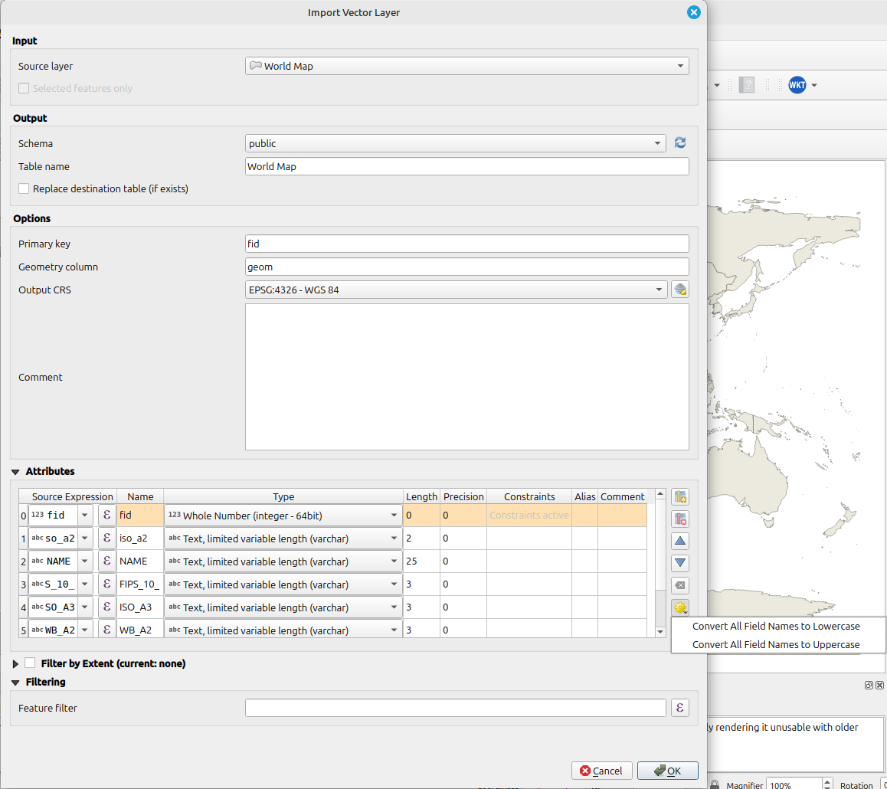
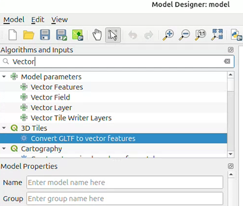



# Changelog for QGIS 3.44 {#changelog344}

Release date: 2025-06-20

The QGIS Project proudly announces the release of QGIS 3.44, a momentous
release that marks the culmination of the QGIS 3 series. This release
arrives within a vibrant and ever-expanding ecosystem of free and
open-source geospatial tools, libraries, and community support that
empowers users worldwide. Building upon the solid foundations of
previous releases, QGIS 3.44 provides a stable and refined experience
for all users as the project transitions to the modern Qt6 framework
with the upcoming release of [QGIS
4.0](https://blog.qgis.org/2025/04/17/qgis-is-moving-to-qt6-and-launching-qgis-4-0/)
in October 2025.

As the final feature release of the QGIS 3.x branch, this version
ensures a reliable environment for existing workflows, and plugin
developers can anticipate a smooth transition between releases, as QGIS
4.0 will retain deprecated APIs to minimize compatibility efforts and
allow the ecosystem to evolve alongside the core application.

While focused on stability and refinement, the release still includes a
range of notable enhancements that refine workflows and empower users in
their geospatial endeavors. Such enhancements include refinements to
database management and connectivity, improved data provider
flexibility, and new project settings. Old favourites such as the
Processing toolbox and QGIS Expressions also see their fair share of
improvements, and cartographic capabilities get a boost with new
labelling and layout updates.

For a whirlwind tour of all the new functionalities introduced, you can
view the [highlight reel video on
YouTube](https://www.youtube.com/watch?v=5a02yaDKAiE).

QGIS is a community effort, and we would like to extend a big thank you
to the developers, documenters, testers, and the many folks out there
who volunteer their time and effort (or fund people to do so) to make
these releases possible. From the QGIS community, we hope you enjoy this
release! If you wish to donate time, money, or otherwise contribute
towards making QGIS more awesome, please wander along to
[QGIS.ORG](https://qgis.org) and lend a hand!

QGIS is supported by donors and sustaining members. A current list of
donors who have made financial contributions large or small to the
project can be seen on our [list of
donors](https://qgis.org/en/site/about/sustaining_members.html#list-of-donors).
If you would like to become an official project sustaining member,
please visit our [sustaining member
page](https://qgis.org/en/site/about/sustaining_members.html) for more
details. Sponsoring QGIS helps us to fund our regular developer
meetings, maintain project infrastructure, and fund bug-fixing efforts.
A complete list of current sponsors is provided below - our very big
thank you to all of our sponsors!

QGIS is free software and you are under no obligation to pay anything to
use it - in fact, we want to encourage people far and wide to use it
regardless of their financial or social status - we believe that
empowering people with spatial decision-making tools will result in a
better society for all of humanity.

## Temporal

### Feature: Allow WMS-T group node to expose time dimension

A new option to allow the layer tree group node to expose the time
dimension has been added on WMS-T layers.

A checkbox on the WMS group properties allows toggling the computation
of this time dimension. If enabled, it would recursively generate the
time dimension based on the child layer time dimensions.

A group whose time dimension computation is disabled would not propagate
the time dimension of its children to its parent.

Date range for the time dimension has also been added in line with the
OGC WMS and ISO8601 standards.

This feature was funded by Ifremer

This feature was developed by [Julien
Cabieces](https://github.com/troopa81)

### Feature: Add fixed date/time to raster temporal mode

Allows the user to select a fixed date/time on a raster layer's temporal
properties, allowing the start and end of a temporal range to be
inferred by a single input value.

This feature was funded by Ifremer

This feature was developed by [Julien
Cabieces](https://github.com/troopa81)

## User Interface

### Feature: Open a specific tab in the Message Log Panel

QGIS now supports opening messages in a specific tab of the Message Log
Panel.

This can be used, for instance, to open a specific tab directly for a
given provider or plugin.

This is achieved by extending the `openMessageLog` method to accept the
tab name as a parameter. If the provided tab name cannot be found, the
panel will be displayed using its existing state.

Included with this change is the extension of the iface method,
`iface.openMessageLog( tab_name )`.

This feature was funded by [City of Frankfurt –
Stadtplanungsamt](https://www.stadtplanungsamt-frankfurt.de/about_us_5645.html)

This feature was developed by [Germán
Carrillo](https://github.com/gacarrillor)

## Symbology

### Feature: Add an option to delete unused categories in the categorized symbol renderer widget

A new option has been added to the categorized symbol widget to allow
users to bulk remove unused categories.

Using this option will automatically identify and remove any categories
which are not matched in the attribute field or expression used to
categorize the layer.

This is especially useful when utilizing a clipped subset of data that
inherited a large set of categorized styles.

This feature was developed by [Ben Wirf](https://github.com/benwirf)

## Labelling

### Feature: Add settings for controlling margin around labels and preventing duplicate labels

Two new settings have been introduced for vector layer labels, namely:

- Margin around labels: This allows setting a margin around a layer's
  labels, which prevents all other labels from being placed closer than
  this margin distance to the layer's labels.
- Prevent duplicate labels: Removes labels within a minimum distance
  across ALL layers using case sensitive matching.

This can be used to improve the appearance of labels in the rendering of
complex geographic situations such as road network data, where elements
such as dual carriageways, service roads, and other entities can result
in many identical label elements appearing close together.

This feature was developed by [Nyall
Dawson](https://github.com/nyalldawson)

## 3D Features

### Feature: Cross-section tool

A new tool has been added for creating cross sections in a 3D scene.
User can pick a region of interest in the 2D map canvas (by clicking
three points - start point, end point and cross-section thickness),
which will make 3D view filter out everything outside of the region. The
camera in the 3D view also gets moved to look at the region of interest
from the side.

Compared to the configuration of the extent of the 3D view, cross
section tool is both faster to use (it does not need to reload the whole
scene when cross section is enabled/disabled) and allows rotated
rectangular regions.

This feature was funded by Septima, Klimadatastyrelsen

This feature was developed by [Matej
Bagar](https://github.com/Withalion)

### Feature: Globe view

There is a new mode for 3D scenes - globe view - in addition to the
traditional 3D view based on a projected CRS.

Any map layer type can be used as a 2D texture for the globe, and 3D
renderers of tiled scene layers and point cloud layers are supported.

Globe view uses the ellipsoid of the project to generate globe mesh. It
is even possible to use other celestial bodies, such as Mars or Moon, if
the project's CRS is set up accordingly.

More info:  
- [QEP \#301 - Large scenes and globe in QGIS
3D](https://github.com/qgis/QGIS-Enhancement-Proposals/issues/301)  
- [Cesium blog
post](https://cesium.com/blog/2025/06/20/3d-globe-view-now-available-in-qgis/)

This feature was funded by Cesium Ecosystem Grant

This feature was developed by Lutra Consulting & North Road

### Feature: Large 3D scene support

In earlier versions of QGIS, 3D map views would not behave correctly
with scenes larger than 50-100 kilometers due to numerical precision
issues - the camera would move erratically (to the point of being
unusable) or features would jitter when zoomed in. This has been fixed
now - for both local scenes and globe scenes, as outlined in [QEP
301](https://github.com/qgis/QGIS-Enhancement-Proposals/issues/301).

This feature was funded by Cesium Ecosystem Grant

This feature was developed by Lutra Consulting & North Road

## Point Clouds

### Feature: Update pdal_wrench to v1.2

This provides:

- Improved support of Virtual Point Clouds (VPC) in processing
  algorithms
- The possibility to output directly to Cloud Optimized Point Cloud
  (COPC) for various formats

See the [pdal_wrench
changelog](https://github.com/PDAL/wrench/releases/tag/v1.2) for more
details on other improvements.

This feature was funded by Landesamt für Vermessung und Geoinformation
Vorarlberg

This feature was developed by [Jan Caha](https://github.com/JanCaha)

### Feature: Allow COPC output for PDAL Algorithms

By leveraging the upgraded pdal_wrench dependency, PDAL Algorithm
outputs can be generated as Cloud Optimized Point Clouds

This feature was funded by Landesamt für Vermessung und Geoinformation
Vorarlberg

This feature was developed by [Jan Caha](https://github.com/JanCaha)

### Feature: Automatic utilization of COPC index files in processing tools

If a COPC file has an index available, QGIS will now automatically
utilize it by default when performing processing operations. This will
make some operations faster (e.g. clip).

This feature was funded by Landesamt für Vermessung und Geoinformation
Vorarlberg

This feature was developed by [Jan Caha](https://github.com/JanCaha)

### Feature: Point cloud editing

It is now possible to edit point cloud layers in the 3D map views. Users
can pick which attribute to modify, the target value and then
interactively select points that should be modified.

There are several map tools to select points for editing:  
- Select by Polygon  
- Select by Paintbrush  
- Select Above/Below Line

Users can set up filtering of edited points using QGIS expressions, so
that only some points get their attribute value modified.

# An error has occurred. {#changelog344}

<a href="https://www.youtube.com/watch?v=TRxW-g0HYjU"
target="_blank">Watch this video on www.youtube.com</a> or
enable JavaScript if it is disabled in your browser.

This feature was funded by Septima, Klimadatastyrelsen

This feature was developed by Lutra Consulting

## Print Layouts

### Feature: Add auto-wrap after setting for layout legends

The auto-wrap setting allows legend text to be automatically wrapped
after a fixed line length (set in millimeters).

This can be used to prevent excessive widths on auto-generated legends.

This feature was funded by North Road, thanks to SLYR

This feature was developed by [Nyall
Dawson](https://github.com/nyalldawson)

## Expressions

### Feature: Add repeat function and reverse variant for strings

New expressions include:

- A new 'repeat' function, which repeats a string a specified number of
  times
- A string variant for 'reverse' that allows the reversing of strings

This feature was developed by [Nyall
Dawson](https://github.com/nyalldawson)

### Feature: Expression functions to create CRS from string definition and to get authid from CRS

New expression functions have been added that support the management of
coordinate reference systems, namely:

- **crs_from_text**: Creates a coordinate reference system from a string
  definition. The string definition can be represented using a CRS code
  in `auth:id` format, a WKT definition, or a PROJ string definition of
  the CRS.
- **crs_to_authid**: Returns the identifier string for a coordinate
  reference system in the format `authority:id`, e.g., `EPSG:4326`.

This feature was developed by [Alexander
Bruy](https://github.com/alexbruy)

## Digitising

### Feature: Add merge policies

Similar to the already existing Split and Duplicate "policies", QGIS now
supports Merge Policies, which can be configured to determine the
initial values in the Merge Features dialog.

Policies can be set per field in the Attributes Form of the Layer
Properties dialog, under the "Policies" section of the field
configuration.

Policy methods include:

- Sum: (Numeric fields only) Sum of values
- Geometry Weighted: (Numeric fields only) Uses weighted average by
  geometry
- Default Value: Uses the default value set in QGIS
- Unset Field: Clears the field and uses the default value from the data
  provider (if it exists). If no value is specified, the value from the
  first feature is used (current default)
- Largest Geometry: Uses the value from the feature with the biggest
  geometry (determined by length (line types), area (polygon types),
  number of parts (multipoint types))
- Minimum Value: (Numeric fields only) Lowest value
- Maximum Value: (Numeric fields only) Highest value
- Set to Null: Sets the value of the field for the feature to NULL

This feature was funded by the National Land Survey of Finland.

This feature was developed by [Juho
Ervasti](https://github.com/JuhoErvasti)

## Data Management

### Feature: Use HEIGHT_AVERAGE from RPC when available

QGIS can now more accurately position satellite images, especially those
from DIMAP / Pleiades NEO products.

This improvement means that these types of satellite images will be
displayed in their correct geographical location with greater precision,
even without additional elevation data.

This feature was developed by [Even Rouault](https://github.com/rouault)

### Feature: Allow field customisation when importing db tables

The database table import dialog has been expanded to include a new
field mapping section, which gives users control over the fields in the
created table.

Users can rename, set the exact destination field types, and tweak the
source expression for each output field.

Fields can also be excluded from the import, or new fields created that
don't exist in the source table.

This feature was funded by City of Canning

This feature was developed by [Nyall
Dawson](https://github.com/nyalldawson)

### Feature: Add optional extent, expression based filter when importing tables to database

When a table is imported to a database via the browser, the user now has
an option to filter the copied records by extent or expression.

This feature was funded by City of Canning

This feature was developed by [Nyall
Dawson](https://github.com/nyalldawson)

### Feature: Add stored query support to Execute SQL window

The "Execute SQL" dialog now supports stored queries, replicating the
functionality from the DB Manager in the new browser tools.

Users can insert stored queries into their current query, save new
stored queries, and remove queries via a new toolbar action.

Queries can be stored in the current project or in the local user
profile.

This feature was funded by City of Canning

This feature was developed by [Nyall
Dawson](https://github.com/nyalldawson)

### Feature: Saving/Loading SQL queries from Execute SQL/Update SQL dialogs

Support has been added to the Execute SQL dialog and Update SQL dialogs
that allows users to save and load SQL queries to/from .sql text files.
This replicates the functionality available in the DB Manager over to
the core browser-based database connection facilities.

The UX has been designed to mimic the same functionality from other
standard parts of QGIS, such as the Processing Script Editor with
Toolbar actions for Save/Load as well as new actions for other standard
operations, including copy, paste, undo, and redo.

This feature was funded by City of Canning

This feature was developed by [Nyall
Dawson](https://github.com/nyalldawson)

### Feature: Allow for extra OAuth2 token(s) to be added into headers

OAuth2 advanced configuration options can now attach extra tokens sent
by the OAuth2 token endpoint as HTTP(S) request headers. This allows for
more flexible handling of OAuth configurations, such as when certain
providers append OpenID tokens to their token replies.

This change is integrated into the credential management and is
available for all OAuth2 services.

This feature was developed by [Mathieu
Pellerin](https://github.com/nirvn)

### Feature: Convert field name Casing when importing vector layers

The Import Vector dialog for migrating vector layers to data sources now
supports the option to automatically transform all field names to
lowercase or uppercase.

This feature was funded by Ocean Winds

This feature was developed by [Jan Caha](https://github.com/JanCaha)

### Feature: Import selected features only to database table

When importing layer features into a database table, a new dialog option
allows for filtering the import to only the selected features. This
option is only available if there is a current selection on the imported
layer.

This feature was funded by Ocean Winds

This feature was developed by [Jan Caha](https://github.com/JanCaha)

## Forms and Widgets

### Feature: Switch between field names and field aliases in forms

In line with [QEP
401](https://github.com/qgis/QGIS-Enhancement-Proposals/blob/master/qep-401-overview-widget-types.md),
the Vector Layer Properties has been switched to model-based tree views.

This has enabled new functionality, including the ability to switch
between field names and field aliases in both the Available Widgets and
Form Layout panels.

Additional enhancements include:

- Orphan fields are highlighted in the Form Layout, emulating the UX of
  broken relations.
- Improvements in broken relations: retain relation names when the
  relation is still available in the relation manager,

This feature was funded by [the QGIS user group
Switzerland](https://qgis.ch/)

This feature was developed by [Germán
Carrillo](https://github.com/gacarrillor)

### Feature: Add a search box to Atrributes Form Designer

In line with
[QEP#401](https://github.com/qgis/QGIS-Enhancement-Proposals/blob/master/qep-401-overview-widget-types.md),
the Drag and Drop form designer now includes a search box to filter
items by name or alias, making it much easier to work with tables and
datasets that include a lot of attribute fields.

This filter works across both the Available Widgets and the Form Layout
panels.

This feature was funded by [the QGIS user group
Switzerland](https://qgis.ch)

This feature was developed by [Germán
Carrillo](https://github.com/gacarrillor)

## Analysis Tools

### Feature: Add input parameters to the toolbox in the modeler

A single "Toolbox" panel has been added to the Graphical Modeler, which
merges the objects from the Input and Algorithm panels into a single
panel. This simplifies the UX of the Graphical Modeler, allowing users
to use the search filters rather than manage separate tabs for modeelr
tools.

This feature was funded by
[Hauts-de-France](https://www.hautsdefrance.fr/)

This feature was developed by [Valentin
Buira](https://github.com/ValentinBuira)

## Processing

### Feature: Port SAGA "Fill Sinks Wang & Liu" to native tool

This highly in-demand tool seemed to be fragile and error-prone when run
via the SAGA Processing Plugin.

A new native tool has been provided to provide an optimized
out-of-the-box tool that is stable and effective.

Note that, as this implementation is a clone of the SAGA implementation,
bugs present in the source will be present in the new native tool.

This feature was developed by [Nyall
Dawson](https://github.com/nyalldawson)

### Feature: Add creation options UI to raster calculator

Raster creation options are now exposed in the raster calculator UI for
both the native dialog and within the Processing Algorithm dialog.

This feature was developed by [Alexander
Bruy](https://github.com/alexbruy)

### Feature: Batch processing temporary output

Temporary output layers are now supported in the Batch processing
utility, improving the ability to generate intermediate data sources or
perform experiments more efficiently.

This feature was funded by Ocean Winds

This feature was developed by [Jan Caha](https://github.com/JanCaha)

### Feature: Add basic drag and drop support in the model designer

The QGIS Graphical Modeler now supports independent sockets connected to
model nodes, which can be interactively connected via drag and drop.

This allows users to quickly and easily connect an output from one node
to a specified input on another without configuring each node's inputs
individually.

This feature was developed by [Valentin
Buira](https://github.com/ValentinBuira)

### Feature: Processing raster rank algorithm

The new "Raster rank" algorithm takes a collection of rasters as input
and creates an output with cell values matching the rank order of a list
of cell values taken from the input collection of rasters.

For example, if the list of input values for a given cell is
\[10,20,30,40\] and the rank is 2, the output value will be 20.

The algorithm also allows for a negative index rank. Given the same list
of input values, \[10,20,30,40\], and using the rank value -2, the
output value would be 30.

Finally, the algorithm offers to nodata handling behavior. By default,
nodata values are excluded from the list, and a given output cell will
only be set to nodata if the rank is greater than the values list size.
Users can also pick an alternative behavior, whereas one or more nodata
values for a given cell in the input layers will result in a nodata
value for that output cell.

This feature was developed by [Mathieu
Pellerin](https://github.com/nirvn)

## Application and Project Options

### Feature: Add project setting for scale calculation, including new "scale at equator" method

A new project-level setting for the scale calculation method has been
added, with choices for:

- at top of map
- at bottom of map
- at middle of map
- horizontal average
- scale at equator

Changing the scale method impacts numerous system behaviors, including:

- New layout scale bars will default to the project's scale calculation
  method
- The scale calculations will be adjusted, affecting project aspects
  including:
  - status bar widget map renders
  - `@map_scale` and similar scale-related API methods
  - scale based visibility of layers and symbols
- Processing algorithms which render maps will respect the project scale
  calculation method
- Scale method affects QGIS server map rendering

Note that symbology sizes determined in map units are NOT affected by
this setting.

The new "scale at equator "scale calculation method always calculates
the scale at the equator, regardless of the actual visible map extent.
It can be used to provide a consistent, static scale for maps in
geographic reference systems, regardless of the latitudes actually
visible in the map. Note that this method is only applicable when
calculating scales with a degree-based reference system.

This feature was developed by [Nyall
Dawson](https://github.com/nyalldawson)

### Feature: Add multiple country codes filter to Nominatim Geocoder Locator

A new optional configuration value for the Nominatim Geocoder Locator
allows filtering results to one or more countries by providing a
comma-separated string of the [Two-letter country
codes](https://wiki.openstreetmap.org/wiki/Nominatim/Country_Codes) a
user would like to restrict their results to.

This feature was funded by [level2](https://level2.si/)

This feature was developed by [Uroš Preložnik](https://github.com/uprel)

## Profile Plots

### Feature: Add support for subsections indicator

Profile plots now support the display of subsection indicators, which
are rendered as vertical lines in the profile tool. This is based on
outcomes from
[QEP#260](https://github.com/qgis/QGIS-Enhancement-Proposals/issues/260)
and supports custom indicator symbology as well as providing subsection
indicators on both the Elevation Profile view and Print Layout elements.

This feature was funded by BRGM

This feature was developed by [Jean Felder](https://github.com/ptitjano)

## Browser

### Feature: Port SQL Query History to Browser

The database query history panel is now displayed in the Execute SQL
dialog on the browser, in line with
[QEP#332](https://github.com/qgis/QGIS-Enhancement-Proposals/blob/master/qep-332-sql-query-history.md).

This adds a new top-level action to open the query history window.

This feature was funded by QGIS grant program 2025

This feature was developed by [Nyall
Dawson](https://github.com/nyalldawson)

### Feature: Improved project management for PostgreSQL stored Projects

QGIS now includes options in the browser that allow manipulating QGIS
Projects stored in a PostGIS database. New functionalities include the
ability to:

- Rename Project
- Delete Project
- Duplicate Project
- Move Project to Schema

This feature was funded by Ocean Winds

This feature was developed by [Jan Caha](https://github.com/JanCaha)

### Feature: Show dialog when importing tables via browser and give users options to control import

A new dialog will prompt users for more comprehensive import
configuration when dragging layers into data sources in the QGIS
Browser, emulating functionality provided by the DB Manager Plugin for
data imports.

Note that this only works when a single layer is selected, and using
multiple selections will continue to execute an immediate import.

A new "Import Vector Table.." context menu item is also provided to
allow importing directly from the current project layers into a target
schema.

The dialog options include:

- Renaming the destination table
- Replace destination
- Set primary key
- Set geometry column
- Set destination CRS
- Set output table comment

This work entailed refactoring a number of internal architectural
elements regarding the implementation of the QGIS Browser and data
providers. It partly based on efforts by
[@JanCaha](https://github.com/JanCaha) to port the DB Manager Postgres
import functionality to the QGIS Browser.

Note that this feature does not currently support Oracle databases, due
to legacy functionality leveraged by the oracle data provider.

This feature was funded by City of Canning

This feature was developed by [Nyall
Dawson](https://github.com/nyalldawson)

### Feature: Move table to another schema for PostgreSQL Provider

PostgreSQL Tables can now be moved to another schema directly in the
QGIS Browser.

This feature was funded by Ocean Winds

This feature was developed by [Jan Caha](https://github.com/JanCaha)

### Feature: Enable field rename for PostgreSQL

QGIS now supports renaming fields for PostgreSQL tables directly in the
QGIS Browser interface.

This feature was funded by Ocean Winds

This feature was developed by [Jan Caha](https://github.com/JanCaha)

## Data Providers

### Feature: Add a WFS parameter for featureMode

The WFS Provider URI and UI now support a "featureMode" parameter, which
supports options for :

- default (Use the server default configuration)
- SimpleFeatures (Enable simplification on returned features)
- ComplexFeatures (Disable simplification on returned features)

This feature was developed by [Even Rouault](https://github.com/rouault)

### Feature: Add connection setting for restricting PostgreSQL Schema

This feature allows users to specify a single schema to limit a Postgres
connection to, much like the equivalent Oracle provider setting.

When set, only tables from the matching schema will be included in the
browser panel and data source select for the connection.

This can be used to limit the database work required to populate tables
for a connection pointing to a large database store.

This feature was funded by Regiodata

This feature was developed by [Nyall
Dawson](https://github.com/nyalldawson)

### Feature: Add option to use POST requests for WFS connections

By default, connecting to a WFS server will be done using GET requests;
however, users will now be able to switch specific WFS connections to
utilize the POST HTTP method, allowing more flexibility in web service
configurations.

This feature was funded by Dorset Council

This feature was developed by [Nyall
Dawson](https://github.com/nyalldawson)

### Feature: Allow SQL queries as layer sources from SQL Server

QGIS now allows loading SQL Server queries as map layers from the
browser and updating the SQL for existing query layers.

This feature was funded by City of Canning

This feature was developed by [Nyall
Dawson](https://github.com/nyalldawson)

## QGIS Server

### Feature: Allow configuring the server project cache size

A new `QGIS_SERVER_PROJECT_CACHE_SIZE` environment variable has been
added, which allows the configuration of the QCache cost, which was
previously a hardcoded value.

This feature was developed by [Sandro
Mani](https://github.com/manisandro)

### Feature: Add server properties on layer tree group

Users can now edit additional server properties on a layer tree group
that will be returned in the GetCapabilities request. Available
properties have been extended beyond the previous options of short name,
title, and abstract to include:

- Keywords
- Data URL (with format)
- Attribution title and URL
- Metadata URLs
- Legend URL and format (by default, one will be generated)

This feature was funded by Ifremer

This feature was developed by [Julien
Cabieces](https://github.com/troopa81)

## Programmability

### Feature: Add method to convert shapely geometry to QGIS Geometry

In line with
[QEP#227](This%20is%20part%20of%20https://github.com/qgis/QGIS-Enhancement-Proposals/issues/227),
a new `QgsGeometry.from_shapely()` method for generating a QgsGeometry
object from a shapely object has been provided to improve integration
with the shapely geometry library, while keeping it an optional
dependency.

This feature was developed by [Till
Frankenbach](https://github.com/merydian)

### Feature: Expose QGIS GPS Tools to Python API and Plugins

The GPS tools class is now available in the PyQGIS API via a brand new
`QgsAppGpsTools` class, accessed via `QgisInterface::gpsTools()`, so
that plugins have more control on the QGIS GPS tracking session.

From QGIS 3.44 on, plugins can create a vector layer feature from the
current GPS track, using the method
`iface.gpsTools().createFeatureFromGpsTrack()`.

This also exposes additional functionalities, such as setting the GPS
track line symbol by changing the corresponding setting in `QgsOptions`
and updating the eventual current GPS track geometry accordingly, e.g.
`iface.gpsTools().setGpsTrackLineSymbol( line_symbol )`

This feature was funded by [the Danish Nature Agency,
Naturstyrelsen](https://naturstyrelsen.dk/)

This feature was developed by [Germán
Carrillo](https://github.com/gacarrillor)

## Notable Fixes

### Feature: Bug fixes by Even Rouault (Spatialys)

| Bug Title | URL issues.qgis.org (if reported) | URL Commit (Github) | 3.40 backport commit (GitHub) |
|----|----|----|----|
| CSV Import to Geopackage ( x/y data) ignores more than 5 Mio rows | [\#60966](https://github.com/qgis/QGIS/issues/60966) | Not reproducible |  |
| OGC API: Feature Creation Request Fails When Location Header is in Lowercase | [\#61729](https://github.com/qgis/QGIS/issues/61729) | [PR \#61814](https://github.com/qgis/QGIS/pull/61814) | [PR \#61835](https://github.com/qgis/QGIS/pull/61835) |
| \[Backport 3.40\] Pick missing commits | [mailing list](https://lists.osgeo.org/pipermail/qgis-developer/2025-May/067555.html) |  | [PR \#61843](https://github.com/qgis/QGIS/pull/61843) |
| Processing : unable to import non spatial table into PostGreSQL with OGR command with processing | [\#61655](https://github.com/qgis/QGIS/issues/61655) | [PR \#61868](https://github.com/qgis/QGIS/pull/61868) | [PR \#62023](https://github.com/qgis/QGIS/pull/62023) |
| Impossibility to save a Null value in a Interger64 field for geopackage files | [\#61787](https://github.com/qgis/QGIS/issues/61787) | can't reproduce |  |
| Error in GML handling in response to a GetFeature request in the WFS service | [\#60879](https://github.com/qgis/QGIS/issues/60879) | [PR \#61872](https://github.com/qgis/QGIS/pull/61872) | [PR \#61895](https://github.com/qgis/QGIS/pull/61895) |
| \[Tests\] Fix and unblock PyQgsLayerDefinition on QT6 |  | [PR \#61874](https://github.com/qgis/QGIS/pull/61874) | N/A |
| \[Tests\] Fix test_core_ogcutils on QT6 |  | [PR \#61876](https://github.com/qgis/QGIS/pull/61876) | N/A |
| \[Tests\] Fix PyQgsDelimitedTextProvider on QT6 |  | [PR \#61877](https://github.com/qgis/QGIS/pull/61877) | N/A |
| \[Tests\] Fix PyQgsSymbolLayerReadSld on QT6 |  | [PR \#61878](https://github.com/qgis/QGIS/pull/61878) | N/A |
| weird include paths including cmake keywords | [\#61887](https://github.com/qgis/QGIS/issues/61887) | [PR \#61894](https://github.com/qgis/QGIS/pull/61894) | N/A |
| QGIS Server GetProjectSettings doesn't output the EX_GeographicBoundingBox anymore for reverse axis projectsions | [\#61999](https://github.com/qgis/QGIS/issues/61999) | [PR \#62002](https://github.com/qgis/QGIS/pull/62002) | [PR \#62036](https://github.com/qgis/QGIS/pull/62036) |
| Spilhaus not displayed complete in QGIS 3.42.1 | [\#61318](https://github.com/qgis/QGIS/issues/61318) | [PR \#62002](https://github.com/qgis/QGIS/pull/62002) | [PR \#62036](https://github.com/qgis/QGIS/pull/62036) |
| QT6 tests: fix PyQgsServerAccessControlWFSTransactional |  | [PR \#62034](https://github.com/qgis/QGIS/pull/62034) | N/A |
| OAPIF: CQL layer filter expression is not used in request | [\#60092](https://github.com/qgis/QGIS/issues/60092) | [PR \#62156](https://github.com/qgis/QGIS/pull/62156) | [PR \#62186](https://github.com/qgis/QGIS/pull/62186) |

This feature was funded by [QGIS.ORG (through donations and sustaining
memberships)](https://qgis.org/)

This feature was developed by [Even Rouault
(Spatialys)](https://www.spatialys.com/)

### Feature: Bug fixes by Alessandro Pasotti (QCooperative)

| Bug Title | URL issues.qgis.org (if reported) | URL Commit (Github) | 3.40 backport commit (GitHub) |
|----|----|----|----|
| Qgis server - Labels background get transparent based on layer transparency | [\#61801](https://github.com/qgis/QGIS/issues/61801) | Won't fix (not a bug) |  |
| Inconsistent contents in ogcapi openapi spec | [\#61848](https://github.com/qgis/QGIS/issues/61848) | [PR \#61903](https://github.com/qgis/QGIS/pull/61903) | [PR \#61922](https://github.com/qgis/QGIS/pull/61922) |
| QGIS Server does not list one layer in WMS GetCapabilities if datum transformation is used | [\#61293](https://github.com/qgis/QGIS/issues/61293) | Feedback |  |
| QGIS server 3.40.4 - Invalid cache strategy | [\#60947](https://github.com/qgis/QGIS/issues/60947) | [PR \#61907](https://github.com/qgis/QGIS/pull/61907) | N/A |
| Server LTR: OAPIF/WFS3 describe collections malfunction - empty pg layer with UTM zone SRID | [\#60686](https://github.com/qgis/QGIS/issues/60686) | can't reproduce |  |
| Wrong rendering for HIGHLIGHT_LABEL_ROTATION above 89° | [\#54598](https://github.com/qgis/QGIS/issues/54598) | Old issue: asked the OP and put on feedback |  |
| CGIDIR default for UNIX is wrong (bin, should be libexec/cgi-bin or at least not bin) | [\#54424](https://github.com/qgis/QGIS/issues/54424) | Old issue: asked for feedback |  |
| Performance issue on editing large PostGIS layers. | [\#61879](https://github.com/qgis/QGIS/issues/61879) | Not enough info: put on feedback and recommended to hire a consultant |  |
| New HTTP (WMS & friends) connection dialog too tall | [\#61867](https://github.com/qgis/QGIS/issues/61867) | [PR \#61912](https://github.com/qgis/QGIS/pull/61912) | Not critical |
| Problems with \<NULL\> value in Value map | [\#61865](https://github.com/qgis/QGIS/issues/61865) | [PR \#61915](https://github.com/qgis/QGIS/pull/61915) | [PR \#61939](https://github.com/qgis/QGIS/pull/61939) |
| Expression constraint requires case-sensitive field names while form is open | [\#61740](https://github.com/qgis/QGIS/issues/61740) | [PR \#61928](https://github.com/qgis/QGIS/pull/61928) | [PR \#61949](https://github.com/qgis/QGIS/pull/61949) |
| JSON array attribute fields are not supported | [\#61728](https://github.com/qgis/QGIS/issues/61728) | [PR \#61938](https://github.com/qgis/QGIS/pull/61938) | Risky |
| WMS: The parser incorrectly assumes that PositionType contains only a single space (but multiple spaces may exist) | [\#61399](https://github.com/qgis/QGIS/issues/61399) | [PR \#61963](https://github.com/qgis/QGIS/pull/61963) | [PR \#61986](https://github.com/qgis/QGIS/pull/61986) |
| Graduated classification offers date/datetime fields but does not support them | [\#61767](https://github.com/qgis/QGIS/issues/61767) | [PR \#61964](https://github.com/qgis/QGIS/pull/61964) | [PR \#61987](https://github.com/qgis/QGIS/pull/61987) |
| Advanced Digitizing: Floater not working correctly | [\#61587](https://github.com/qgis/QGIS/issues/61587) | [PR \#61979](https://github.com/qgis/QGIS/pull/61979) | [PR \#62114](https://github.com/qgis/QGIS/pull/62114) |
| QGis Server quotes html maptip | [\#61380](https://github.com/qgis/QGIS/issues/61380) | won't fix (not a bug) |  |
| Hidden coverage layer option remains active after disabling atlas generation in layout | [\#61946](https://github.com/qgis/QGIS/issues/61946) | [PR \#61993](https://github.com/qgis/QGIS/pull/61993) | [PR \#62066](https://github.com/qgis/QGIS/pull/62066) |
| Distance/area user selected unit unwanted reset in processing tools | [\#61470](https://github.com/qgis/QGIS/issues/61470) | [PR \#61997](https://github.com/qgis/QGIS/pull/61997) | [PR \#62021](https://github.com/qgis/QGIS/pull/62021) |
| PG: Can't add/update feature when numeric field with numeric default is set to default | [\#61529](https://github.com/qgis/QGIS/issues/61529) | [PR \#62010](https://github.com/qgis/QGIS/pull/62010) | Risky |
| In Refactor Fields algorithm, field for "Source Expression" are loaded from the wrong layer when "selected features only" option is checked | [\#62019](https://github.com/qgis/QGIS/issues/62019) | [PR \#62124](https://github.com/qgis/QGIS/pull/62124) | [PR \#62235](https://github.com/qgis/QGIS/pull/62235) |
| Wrong timezone from default value when adding child feature | [\#62121](https://github.com/qgis/QGIS/issues/62121) | won't fix (not a bug) |  |
| Ellipsoidal measurement not working when the project is using a custom CRS | [\#61299](https://github.com/qgis/QGIS/issues/61299) | [PR \#62212](https://github.com/qgis/QGIS/pull/62212) | [PR \#62252](https://github.com/qgis/QGIS/pull/62252) |
| \[Processing\] "Select by Expression" doesn't works with some expressions | [\#62231](https://github.com/qgis/QGIS/issues/62231) | [PR \#62233](https://github.com/qgis/QGIS/pull/62233) | N/A |

This feature was funded by [QGIS.ORG (through donations and sustaining
memberships)](https://qgis.org/)

This feature was developed by [Alessandro Pasotti
(QCooperative)](https://www.qcooperative.net/)

### Feature: Bug fixes by Jacky Volpes (Oslandia)

| Bug Title | URL issues.qgis.org (if reported) | URL Commit (Github) | 3.40 backport commit (GitHub) |
|----|----|----|----|
| QgsOptions: Locale value is saved only if it is not empty | [\#52359](https://github.com/qgis/QGIS/issues/52359) | [PR \#62137](https://github.com/qgis/QGIS/pull/62137) | [PR \#62171](https://github.com/qgis/QGIS/pull/62171) |
| Extent not updated after digitizing features in a memory layer | [\#60830](https://github.com/qgis/QGIS/issues/60830) | [PR \#62159](https://github.com/qgis/QGIS/pull/62159) | [PR \#62189](https://github.com/qgis/QGIS/pull/62189) |
| Issue with the geometry combine and mergeLines | [\#61136](https://github.com/qgis/QGIS/issues/61136) | [PR \#62184](https://github.com/qgis/QGIS/pull/62184) |  |
| Atlas activation crash | [\#59610](https://github.com/qgis/QGIS/issues/59610) | [PR \#62260](https://github.com/qgis/QGIS/pull/62260) | [PR \#62288](https://github.com/qgis/QGIS/pull/62288) |

This feature was funded by [QGIS.ORG (through donations and sustaining
memberships)](https://qgis.org/)

This feature was developed by [Jacky Volpes
(Oslandia)](https://oslandia.com/en/)

### Feature: Bug fixes by Jean Felder (Oslandia)

| Bug Title | URL issues.qgis.org (if reported) | URL Commit (Github) | 3.40 backport commit (GitHub) |
|----|----|----|----|
| QgsOptions: Locale value is saved only if it is not empty | [\#52359](https://github.com/qgis/QGIS/issues/52359) | [PR \#62137](https://github.com/qgis/QGIS/pull/62137) | [PR \#62171](https://github.com/qgis/QGIS/pull/62171) |
| Extent not updated after digitizing features in a memory layer | [\#60830](https://github.com/qgis/QGIS/issues/60830) | [PR \#62159](https://github.com/qgis/QGIS/pull/62159) | [PR \#62189](https://github.com/qgis/QGIS/pull/62189) |
| Issue with the geometry combine and mergeLines | [\#61136](https://github.com/qgis/QGIS/issues/61136) | [PR \#62184](https://github.com/qgis/QGIS/pull/62184) |  |
| Atlas activation crash | [\#59610](https://github.com/qgis/QGIS/issues/59610) | [PR \#62260](https://github.com/qgis/QGIS/pull/62260) | [PR \#62288](https://github.com/qgis/QGIS/pull/62288) |

This feature was funded by [QGIS.ORG (through donations and sustaining
memberships)](https://qgis.org/)

This feature was developed by [Jean Felder
(Oslandia)](https://oslandia.com/en/)

### Feature: Bug fixes by Alexander Bruy (QCooperative)

| Bug Title | URL issues.qgis.org (if reported) | URL Commit (Github) | 3.40 backport commit (GitHub) |
|----|----|----|----|
| Better support for SQL and virtual layers as inputs in Processing | [\#39138](https://github.com/qgis/QGIS/issues/39138) | [PR \#61880](https://github.com/qgis/QGIS/pull/61880) | [PR \#61902](https://github.com/qgis/QGIS/pull/61902) |
| Using virtual layer gives error in GDAL processing algorithms | [\#59364](https://github.com/qgis/QGIS/issues/59364) | [PR \#61880](https://github.com/qgis/QGIS/pull/61880) | [PR \#61902](https://github.com/qgis/QGIS/pull/61902) |
| enable GdalAlgorithmsVectorTest on QT6 |  | [PR \#61882](https://github.com/qgis/QGIS/pull/61882) | N/A |
| fix PyQgsFloatingWidget test on Qt6 |  | [PR \#61885](https://github.com/qgis/QGIS/pull/61885) | N/A |
| fix PyQgsNetworkAccessManager test on Qt6 |  | [PR \#61886](https://github.com/qgis/QGIS/pull/61886) | N/A |
| enable QGIS algorithms tests (part 2) on Qt6 |  | [PR \#61888](https://github.com/qgis/QGIS/pull/61888) | N/A |
| Geopackage vocabulary harmonization | [\#60990](https://github.com/qgis/QGIS/issues/60990) | [PR \#61893](https://github.com/qgis/QGIS/pull/61893) | N/A |
| unbalanced QSettings.beginReadArray/endArray calls | [\#61373](https://github.com/qgis/QGIS/issues/61373) | [PR \#61904](https://github.com/qgis/QGIS/pull/61904) | [PR \#61923](https://github.com/qgis/QGIS/pull/61923) |
| Mesh styling, precision seems too small? | [\#50950](https://github.com/qgis/QGIS/issues/50950) | [PR \#61905](https://github.com/qgis/QGIS/pull/61905) | [PR \#61926](https://github.com/qgis/QGIS/pull/61926) |
| Inconsistency in PostgreSQL / PostGIS connection / layer dialog windows | [\#59886](https://github.com/qgis/QGIS/issues/59886) | [PR \#61908](https://github.com/qgis/QGIS/pull/61908) | N/A |
| Translate geometry does not create a 3D vector from 2D if deltaZ is an expression | [\#56495](https://github.com/qgis/QGIS/issues/56495) | [PR \#61906](https://github.com/qgis/QGIS/pull/61906) | [PR \#61933](https://github.com/qgis/QGIS/pull/61933) |
| After deleting the newly added XYZ layer...still exists | [\#53933](https://github.com/qgis/QGIS/issues/53933) | can't reproduce |  |
| TypeError: EnumType.**call**()... | [\#58312](https://github.com/qgis/QGIS/issues/58312) | can't reproduce |  |
| projects/anonymize\_\*\_projects doesn't affect projectMetadata.author | [\#42413](https://github.com/qgis/QGIS/issues/42413) | [PR \#61945](https://github.com/qgis/QGIS/pull/61945) | [PR \#61959](https://github.com/qgis/QGIS/pull/61959) |
| Inconsistencies in providers connection dialogs | [\#43951](https://github.com/qgis/QGIS/issues/43951) | [PR \#61948](https://github.com/qgis/QGIS/pull/61948) | N/A |
| Source manager and WMS configuration dialog too tall | [\#60477](https://github.com/qgis/QGIS/issues/60477) | [PR \#61948](https://github.com/qgis/QGIS/pull/61948) | N/A |
| New HTTP (WMS & friends) connection dialog too tall | [\#61867](https://github.com/qgis/QGIS/issues/61867) | [PR \#61948](https://github.com/qgis/QGIS/pull/61948) | N/A |
| duplicated objectName in the oracle dialog | unreported | [PR \#61944](https://github.com/qgis/QGIS/pull/61944) | N/A |
| "Save as" does not work... | [\#30130](https://github.com/qgis/QGIS/issues/30130) | [PR \#61960](https://github.com/qgis/QGIS/pull/61960) | N/A |
| Modifying project CRS...does not update coordinate CRS display | [\#61684](https://github.com/qgis/QGIS/issues/61684) | [PR \#61995](https://github.com/qgis/QGIS/pull/61995) | N/A |
| CRS selection widget not updated when project CRS changes | [\#56454](https://github.com/qgis/QGIS/issues/56454) | [PR \#61989](https://github.com/qgis/QGIS/pull/61989) | [PR \#62022](https://github.com/qgis/QGIS/pull/62022) |
| Choice for default/project styles missing... | [\#58653](https://github.com/qgis/QGIS/issues/58653) | [PR \#62012](https://github.com/qgis/QGIS/pull/62012) | N/A |
| Changing a new project's CRS does not change the annotation CRS | [\#48046](https://github.com/qgis/QGIS/issues/48046) | can't reproduce, already fixed |  |
| "editable" property misleading in JSON view | [\#47755](https://github.com/qgis/QGIS/issues/47755) | [PR \#62064](https://github.com/qgis/QGIS/pull/62064) | N/A |
| ‘Current CRS’ icon shows previous CRS | [\#53768](https://github.com/qgis/QGIS/issues/53768) | [PR \#62209](https://github.com/qgis/QGIS/pull/62209) | [PR \#62236](https://github.com/qgis/QGIS/pull/62236) |
| Crash when clicking on relation table node | [\#56481](https://github.com/qgis/QGIS/issues/56481) | can't reproduce |  |
| Documentation file grass7.txt is not up-to-date | [\#29140](https://github.com/qgis/QGIS/issues/29140) | [PR \#62210](https://github.com/qgis/QGIS/pull/62210) | N/A |
| AttributeError: 'NoneType' object has no attribute 'fields' | [\#62224](https://github.com/qgis/QGIS/issues/62224) | [PR \#62253](https://github.com/qgis/QGIS/pull/62253) | [PR \#62291](https://github.com/qgis/QGIS/pull/62291) |
| Selected field not cleared when changing layer in processing | [\#39351](https://github.com/qgis/QGIS/issues/39351) | [PR \#62241](https://github.com/qgis/QGIS/pull/62241) | [PR \#62305](https://github.com/qgis/QGIS/pull/62305) |
| pyqgis: QgsGraph | [\#56172](https://github.com/qgis/QGIS/issues/56172) | [PR \#62316](https://github.com/qgis/QGIS/pull/62316) | N/A |
| qgsidentifyresultsdialog.cpp: ‘best approach’ vs. ‘old fragile approach’ | [\#61499](https://github.com/qgis/QGIS/issues/61499) | can't reproduce |  |
| exporting to .dxf sets units to imperial inch | [\#50579](https://github.com/qgis/QGIS/issues/50579) | works for me, fixed upstream |  |

This feature was funded by [QGIS.ORG (through donations and sustaining
memberships)](https://qgis.org/)

This feature was developed by [Alexander Bruy
(QCooperative)](https://www.qcooperative.net/)

### Feature: Bug fixes by Stefanos Natsis (LutraConsulting)

| Bug Title | URL issues.qgis.org (if reported) | URL Commit (Github) | 3.40 backport commit (GitHub) |
|----|----|----|----|
| STAC client connection failing | [\#62232](https://github.com/qgis/QGIS/issues/62232) | [PR \#62258](https://github.com/qgis/QGIS/pull/62258) | N/A |
| \[browser\] Inappropriate menus in Postgres connection context menu | [\#62183](https://github.com/qgis/QGIS/issues/62183) | [PR \#62270](https://github.com/qgis/QGIS/pull/62270#discussion_r2149355232) | N/A |
| QGIS master crashes when trying to use reshape features tool | [\#55859](https://github.com/qgis/QGIS/issues/55859) | [PR \#62295](https://github.com/qgis/QGIS/pull/62295) | [PR \#62326](https://github.com/qgis/QGIS/pull/62326) |
| Reshape Features can't handle resulting exclaves | [\#24884](https://github.com/qgis/QGIS/issues/24884) | [PR \#62312](https://github.com/qgis/QGIS/pull/62312) |  |
| Reshape tool doesn't obey 'Avoid Overlaps' when a feature is selected. | [\#61720](https://github.com/qgis/QGIS/issues/61720) | [PR \#62312](https://github.com/qgis/QGIS/pull/62312) |  |
| Fix reshaping when snapping to segment | unreported | [PR \#62315](https://github.com/qgis/QGIS/pull/62315) |  |
| Unhandled GEOS exception when reshaping | unreported | [PR \#62322](https://github.com/qgis/QGIS/pull/62322) |  |
| Reshape returns Success instead of NothingHappened | unreported | [PR \#62323](https://github.com/qgis/QGIS/pull/62323) | [PR \#62336](https://github.com/qgis/QGIS/pull/62336) |
| Reshape tool tries to run with a single digitized point | unreported | [PR \#62324](https://github.com/qgis/QGIS/pull/62324) |  |
| Fix crash when undoing first digitized point in shape map tools | unreported | [PR \#62335](https://github.com/qgis/QGIS/pull/62335) |  |
| Fix crashing shape tools when not enough points digitized | unreported | [PR \#62338](https://github.com/qgis/QGIS/pull/62338) |  |
| Crash any time I try to modify a polygon with "Enable tracing" activated. | [\#60856](https://github.com/qgis/QGIS/issues/60856) | [PR \#62345](https://github.com/qgis/QGIS/pull/62345) |  |
| trace function on snap toolset causes QGIS to shutdown when initiated | [\#60978](https://github.com/qgis/QGIS/issues/60978) | [PR \#62345](https://github.com/qgis/QGIS/pull/62345) |  |
| Crash on vector digitizing with trace tool | [\#62163](https://github.com/qgis/QGIS/issues/62163) | [PR \#62345](https://github.com/qgis/QGIS/pull/62345) |  |
| QGIS 3.40.7 Bratislava crashes every time I try to use the tracing tool to create polygons | [\#62342](https://github.com/qgis/QGIS/issues/62342) | [PR \#62345](https://github.com/qgis/QGIS/pull/62345) |  |
| Misbehavior of advanced topology settings on independant layers | not a bug |  |  |

This feature was funded by [QGIS.ORG (through donations and sustaining
memberships)](https://qgis.org/)

This feature was developed by [Stefanos Natsis
(LutraConsulting)](https://www.lutraconsulting.co.uk/)

### Feature: Bug Fixes by Germán Carrillo (OPENGIS)

| Bug Title | URL issues.qgis.org (if reported) | URL Commit (Github) | 3.40 backport commit (GitHub) |
|----|----|----|----|
| Old relations in form (after exporting layer to new file and applied old style) can't be deleted | [\#44683](https://github.com/qgis/QGIS/issues/44683) | Can't reproduce |  |
| \[Processing toolbox\] Search box (result) not updated when list of providers change | [\#26435](https://github.com/qgis/QGIS/issues/26435) | [PR \#62162](https://github.com/qgis/QGIS/pull/62162) | No |
| Ambiguous JSON errors | [\#42832](https://github.com/qgis/QGIS/issues/42832) | [PR \#62247](https://github.com/qgis/QGIS/pull/62247) | [PR \#62262](https://github.com/qgis/QGIS/pull/62262) |
| Disallow point layer as input to Oriented Minimum Bounding Box | [\#62126](https://github.com/qgis/QGIS/issues/62126) | [PR \#62300](https://github.com/qgis/QGIS/pull/62300) | [PR \#62330](https://github.com/qgis/QGIS/pull/62330) |
| When saving SLD to DB, make sure errors are reported to callers (like Package layers algorithm) | unreported | [PR \#62332](https://github.com/qgis/QGIS/pull/62332) |  |

This feature was funded by [QGIS.ORG (through donations and sustaining
memberships)](https://qgis.org/)

This feature was developed by [Germán Carrillo
(OPENGIS)](https://opengis.ch/)

### Feature: Bug fixes by Mathieu Pellerin (OPENGIS)

| Bug Title | URL issues.qgis.org (if reported) | URL Commit (Github) | 3.40 backport commit (GitHub) |
|----|----|----|----|
| QGIS fails to import sprites from OpenStreetMap vector tile styles | unreported | [PR \#62175](https://github.com/qgis/QGIS/pull/62175) |  |
| Menu bar not respecting set font size on qt6 build | [\#62007](https://github.com/qgis/QGIS/issues/62007) | [PR \#62086](https://github.com/qgis/QGIS/pull/62086) |  |
| QGIS Qt6 the gui to select the Profile is not well visible | [\#61557](https://github.com/qgis/QGIS/issues/61557) | [PR \#62083](https://github.com/qgis/QGIS/pull/62083) |  |
| Clip by extent prints error on console | [\#61365](https://github.com/qgis/QGIS/issues/61365) | [PR \#62075](https://github.com/qgis/QGIS/pull/62075) | [PR \#62094](https://github.com/qgis/QGIS/pull/62094) |
| QGIS freeze/is not responding, big CPU usage when setting horizontal and vertical spacing units in "point pattern fill" to "meters at scale" | [\#53550](https://github.com/qgis/QGIS/issues/53550) | [PR \#62074](https://github.com/qgis/QGIS/pull/62074) | [PR \#62106](https://github.com/qgis/QGIS/pull/62106) |
| Project translation only happening for .qgs, not .qgz | [\#61485](https://github.com/qgis/QGIS/issues/61485) | [PR \#62070](https://github.com/qgis/QGIS/pull/62070) | [PR \#62101](https://github.com/qgis/QGIS/pull/62101) |
| Stuck in pan mode when using both middle mouse and space pan in model or layout | [\#61528](https://github.com/qgis/QGIS/issues/61528) | [PR \#62069](https://github.com/qgis/QGIS/pull/62069) | [PR \#62093](https://github.com/qgis/QGIS/pull/62093) |
| Unchecking "Include Z-dimension" still includes Z when Geometry Type is Automatic | [\#61554](https://github.com/qgis/QGIS/issues/61554) | [PR \#62068](https://github.com/qgis/QGIS/pull/62068) | [PR \#62092](https://github.com/qgis/QGIS/pull/62092) |
| Label font style reverts to Regular in non_english UI (LTR, Qt5) | [\#61660](https://github.com/qgis/QGIS/issues/61660) | [PR \#62067](https://github.com/qgis/QGIS/pull/62067) | [PR \#62080](https://github.com/qgis/QGIS/pull/62080) |
| Custom shortcuts are not replacing default ones when imported from XML | [\#61717](https://github.com/qgis/QGIS/issues/61717) | [PR \#62063](https://github.com/qgis/QGIS/pull/62063) |  |
| QGIS fails to handle of source containing a relative path to the root of the server hosting the style json | unreported | [PR \#62062](https://github.com/qgis/QGIS/pull/62062) | [PR \#62084](https://github.com/qgis/QGIS/pull/62084) |
| Can't save layers as gpkg.zip | [\#61773](https://github.com/qgis/QGIS/issues/61773) | [PR \#62049](https://github.com/qgis/QGIS/pull/62049) | [PR \#62185](https://github.com/qgis/QGIS/pull/62185) |
| appearance input attributes box do not appear checked | [\#61994](https://github.com/qgis/QGIS/issues/61994) | [PR \#62047](https://github.com/qgis/QGIS/pull/62047) | [PR \#62056](https://github.com/qgis/QGIS/pull/62056) |
| QGIS-Locator, Behavior changed between 3.22 and 3.4x | [\#62013](https://github.com/qgis/QGIS/issues/62013) | [PR \#62043](https://github.com/qgis/QGIS/pull/62043) | [PR \#62058](https://github.com/qgis/QGIS/pull/62058) |
| Various new connection dialog spacing and size issues | unreported | [PR \#62041](https://github.com/qgis/QGIS/pull/62041) |  |

This feature was funded by [QGIS.ORG (through donations and sustaining
memberships)](https://qgis.org/)

This feature was developed by [Mathieu Pellerin
(OPENGIS)](https://opengis.ch/)

### Feature: Bug fixes by Julien Cabieces (Oslandia)

| Bug Title | URL issues.qgis.org (if reported) | URL Commit (Github) | 3.40 backport commit (GitHub) |
|----|----|----|----|
| Colours in PDF outputs appear washed out and don't render properly | [\#61674](https://github.com/qgis/QGIS/issues/61674) | [PR \#62091](https://github.com/qgis/QGIS/pull/62091) | [PR \#62107](https://github.com/qgis/QGIS/pull/62107) |
| \[Oracle\] Fix PyQgsProviderRegistry test | qt6 test failing | [PR \#62109](https://github.com/qgis/QGIS/pull/62109) | No |
| Model Designer - Python Converter not generating unique keys | [\#54150](https://github.com/qgis/QGIS/issues/54150) | [PR \#62261](https://github.com/qgis/QGIS/pull/62261) | [PR \#62329](https://github.com/qgis/QGIS/pull/62329) |

This feature was funded by [QGIS.ORG (through donations and sustaining
memberships)](https://qgis.org/)

This feature was developed by [Julien Cabieces
(Oslandia)](https://oslandia.com/en/)

### Feature: Bug fixes by Nyall Dawson (North Road)

| Bug Title | URL issues.qgis.org (if reported) | URL Commit (Github) | 3.40 backport commit (GitHub) |
|----|----|----|----|
| Fix walk mode key handling | Unreported | [PR \#62331](https://github.com/qgis/QGIS/pull/62331) | N/A |
| Increase QImageReader allocation limit for qt6 builds | Unreported | [PR \#62320](https://github.com/qgis/QGIS/pull/62320) | N/A |
| Don't try to pass unset attributes to ArcGIS REST backends | [\#61673](https://github.com/qgis/QGIS/issues/61673) | [PR \#62061](https://github.com/qgis/QGIS/pull/62061) | [PR \#62249](https://github.com/qgis/QGIS/pull/62249) |
| Fix serious regression in boolean handling in expressions | [\#61072](https://github.com/qgis/QGIS/issues/61072) | [PR \#62217](https://github.com/qgis/QGIS/pull/62217) | [PR \#62248](https://github.com/qgis/QGIS/pull/62248) |
| Don't render effects which require rasterisation when forcing vector | [\#58230](https://github.com/qgis/QGIS/issues/58230) | [PR \#62218](https://github.com/qgis/QGIS/pull/62218) | N/A |
| Fix categorized symbol renderer feature counts for null values | [\#52690](https://github.com/qgis/QGIS/issues/52690) | [PR \#62174](https://github.com/qgis/QGIS/pull/62174) | [PR \#62203](https://github.com/qgis/QGIS/pull/62203) |
| Try to extract only polygons from Voronoi results | [\#62158](https://github.com/qgis/QGIS/issues/62158) | [PR \#62173](https://github.com/qgis/QGIS/pull/62173) | [PR \#62194](https://github.com/qgis/QGIS/pull/62194) |
| \[processing\] Fix show feature count option, output layer ordering | [\#61146](https://github.com/qgis/QGIS/issues/61146) | [PR \#62143](https://github.com/qgis/QGIS/pull/62143) | [PR \#62172](https://github.com/qgis/QGIS/pull/62172) |
| Don't finalize string stats after every value addition | [\#62122](https://github.com/qgis/QGIS/issues/62122) | [PR \#62170](https://github.com/qgis/QGIS/pull/62170) | [PR \#62192](https://github.com/qgis/QGIS/pull/62192) |
| Fix build with SIP \>= 6.11 | [\#61951](https://github.com/qgis/QGIS/issues/61951) | [PR \#62113](https://github.com/qgis/QGIS/pull/62113) | [PR \#62142](https://github.com/qgis/QGIS/pull/62142) |
| Use protected, not private virtual methods for map tool classes | Unreported | [PR \#62097](https://github.com/qgis/QGIS/pull/62097) | [PR \#62112](https://github.com/qgis/QGIS/pull/62112) |
| Avoid corrupted overlapping docks when first changing from dialog to dock | Unreported | [PR \#62102](https://github.com/qgis/QGIS/pull/62102) | N/A |
| Fix jumpy scroll area when using mouse wheel on qt6 builds | Unreported | [PR \#62099](https://github.com/qgis/QGIS/pull/62099) | N/A |
| Fix comparators | [\#62045](https://github.com/qgis/QGIS/issues/62045) | [PR \#62081](https://github.com/qgis/QGIS/pull/62081) | [PR \#62118](https://github.com/qgis/QGIS/pull/62118) |
| \[processing\] Fix execution of nested models | [\#60883](https://github.com/qgis/QGIS/issues/60883) | [PR \#62079](https://github.com/qgis/QGIS/pull/62079) | [PR \#62100](https://github.com/qgis/QGIS/pull/62100) |
| Fix calculation of cost for speed strategy with null/negative values | [\#61667](https://github.com/qgis/QGIS/issues/61667) | [PR \#62044](https://github.com/qgis/QGIS/pull/62044) | [PR \#62059](https://github.com/qgis/QGIS/pull/62059) |
| Fix variables available for grid annotations missing for grid symbol | Unreported | [PR \#61943](https://github.com/qgis/QGIS/pull/61943) | [PR \#61957](https://github.com/qgis/QGIS/pull/61957) |
| Add new enum for rasterised rendering policy | [\#58230](https://github.com/qgis/QGIS/issues/58230) | [PR \#61942](https://github.com/qgis/QGIS/pull/61942) | N/A |
| Fix blend modes ignored when label masking is enabled | [\#43141](https://github.com/qgis/QGIS/issues/43141) | [PR \#61901](https://github.com/qgis/QGIS/pull/61901) | N/A |
| Delimited text test can be run on qt6 now | Unreported | [PR \#61900](https://github.com/qgis/QGIS/pull/61900) | N/A |
| Fix mesh layer labeling tests not actually run | Unreported | [PR \#61899](https://github.com/qgis/QGIS/pull/61899) | [PR \#61909](https://github.com/qgis/QGIS/pull/61909) |
| \[ogr\] Handle auto addition of vsizip prefix for vsicurl archives | [\#61561](https://github.com/qgis/QGIS/issues/61561) | [PR \#61854](https://github.com/qgis/QGIS/pull/61854) | [PR \#61896](https://github.com/qgis/QGIS/pull/61896) |

This feature was funded by [QGIS.ORG (through donations and sustaining
memberships)](https://qgis.org/)

This feature was developed by [Nyall Dawson (North
Road)](https://north-road.com/)


