---
# ⚠️  AUTOMATED FILE - DO NOT EDIT MANUALLY! {#changelog40}
# Generated by: scripts/changelog_harvest.py {#changelog40}
# Source: https://changelog.qgis.org {#changelog40}
# To update: Run 'scripts/changelog_harvest.py --version 4.0 --release 2026-03-06' {#changelog40}
# See CONTRIBUTING.md section: Automated Content and Manual Edit Guidelines {#changelog40}

title: "Changelog for QGIS 4.0"
draft: false
HasBanner: false
sidebar: true
releaseDate: "2026-03-06"
section: "project"
type: "visual-changelog"

---



# Changelog for QGIS 4.0 {#changelog40}

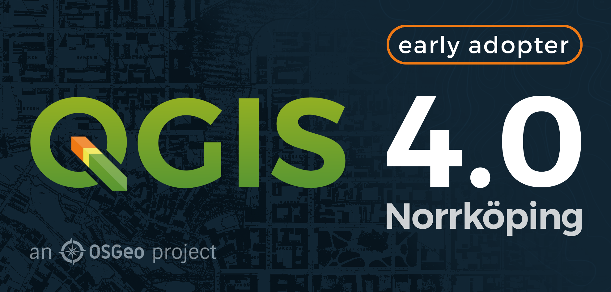

Release date: 2026-03-06

The wait is over! QGIS 4.0 is here!

[QGIS](https://qgis.org) (<https://qgis.org>) is the world's most
popular (open source) desktop Geographical Information System (GIS). It
is used by people around the world to view, edit, analyse and share
spatial data. It can produce professional-grade cartography products and
supports hundreds of spatial data formats. QGIS is a member project of
OSGEO, the Open Source Geospatial Foundation that is democratising
access to spatial platforms (<https://osgeo.org>).

Since our humble beginnings over 20 years ago, our project keeps growing
stronger - both in terms of the software offering and in terms of our
strong, diverse and vibrant community that supports and benefits from
QGIS around the world.

We are really pleased to announce the new major release of QGIS 4.0,
which represents the successful culmination of a long-planned technical
migration, transitioning the core of QGIS onto the Qt6 framework.

On the surface, existing users should expect to engage with a GIS
experience familiar to what they have come to know and love from
previous QGIS releases. Under the hood, however, it introduces
significant changes to maintainability and usability. These changes
ensure that QGIS 4.0 can unlock additional access to modern libraries
while bringing much-needed performance and security improvements to the
codebase.

To ensure a smooth transition for our vibrant ecosystem, we have
retained deprecated APIs where possible, minimising the effort required
for plugin developers to update their tools. While some legacy APIs
(such as the Processing API from QGIS 2.x) will not be guaranteed future
support and backwards compatibility throughout the lifespan of the QGIS
4.x series, developers supporting existing plugins can easily ensure
their plugins are compatible with the new release using the [Qt6
compatibility
guide](https://github.com/qgis/QGIS/wiki/Plugin-migration-to-be-compatible-with-Qt5-and-Qt6).

While preparation for the QGIS 4.0 migration has been underway, the
developer community has added over 100 new features across the
application, making QGIS more powerful, more flexible, more secure, and
generally just more awesome. Adjacent to developments associated with
the codebase, the budding community of QGIS users has continued to share
resources, including projects, styles, scripts, and more, leading to an
exciting period of growth for the revamped [QGIS
Hub](https://hub.qgis.org/) and associated community sites.

If you want to see more about our release, check out our [community
sharing the announcement](https://youtu.be/SQJZm5Y0EKs)!

For a whirlwind tour of all the new functionalities introduced in this
release, you can view the [highlight reel video on
YouTube](https://youtu.be/wTK1exokBA8), and for a detailed rundown of
the new features and improvements, please check out the [visual
changelog](https://qgis.org/project/visual-changelogs/visualchangelog40/)
for this release.

QGIS is a community effort, and we would like to extend a big thank-you
to the developers, documenters, testers, and the many folks out there
who volunteer their time and effort (or fund others to do so) to make
these releases possible. From the QGIS community, we hope you enjoy this
release!

If you wish to donate time, money, or otherwise contribute towards
making QGIS more awesome, please wander along to
[QGIS.ORG](https://qgis.org/) and lend a hand!

QGIS is supported by donors and sustaining members. A current list of
donors who have made financial contributions, large or small, to the
project can be seen on our [list of
donors](https://qgis.org/en/site/about/sustaining_members.html#list-of-donors).
If you would like to become an official project sustaining member,
please visit our [sustaining member
page](https://qgis.org/en/site/about/sustaining_members.html) for more
details. Sponsoring QGIS helps us to fund our regular developer
meetings, maintain project infrastructure, and fund bug-fixing efforts.
A complete list of current sponsors is provided below - our very big
thank you to all of our sponsors!

QGIS is free software, and you are under no obligation to pay anything
to use it - in fact, we want to encourage people far and wide to use it
regardless of their financial or social status - we believe that
empowering people with spatial decision-making tools will result in a
better society for all of humanity.

## Temporal

### Feature: Add new accumulate pixels setting to the represent temporal values mode

A new accumulate pixels option has been added that is available when a
raster layer temporal mode is set to represent temporal values. This
mimics the vector layer counterpart, where features can accumulate over
time when a feature's temporal state is represented by a single
date/time field.  
This is especially useful in animated temporal navigation when
intertwining vector and raster layers.

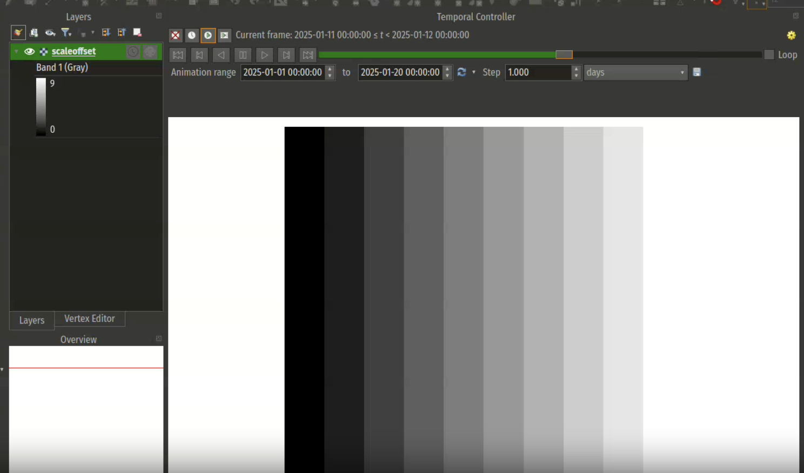

This feature was developed by [Mathieu
Pellerin](https://github.com/nirvn)

## Map Tools

### Feature: Add map tool to edit blank segments

A new map tool to edit blank segments has been added, as described in
[QEP
\#345](https://github.com/qgis/QGIS-Enhancement-Proposals/pull/345)  
It allows users to define blank segments per feature, based on a
templated line symbology, and prevents Hashes or Markers from being
drawn inside these segments.  
The blank segments are stored within a data-defined property (data field
or auxiliary storage field). This tool allows users to:  
- Click in the neighborhood of the line to start creating a segment,
click again to finish editing  
- Select a segment, and press the Del key to remove it  
- Drag the start/end of an already existing segment and move it along
the line to reduce/enlarge it

This feature was funded by Stadt Frankfurt am Main and Oslandia

This feature was developed by [Julien
Cabieces](https://github.com/troopa81)

### Feature: Copy features in an array along a line

A new map tool allows users to copy features in an array along a line,
and is available for polygon/linestring/point geometry types.

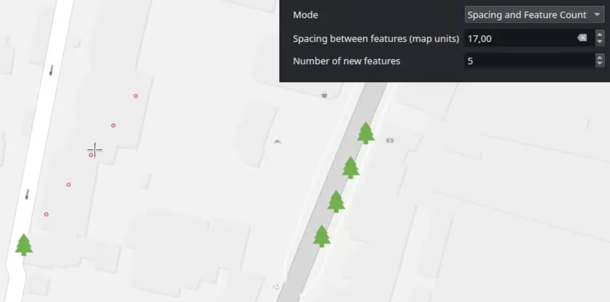

This feature was funded by Stadt Frankfurt am Main

This feature was developed by [Jacky
Volpes](https://github.com/Djedouas)

## User Interface

### Feature: New Design for the Welcome Page

QGIS 4.0 features a shiny new welcome page, with an extensible design
for an enhanced user experience in line with [QEP
347](https://github.com/qgis/QGIS-Enhancement-Proposals/pull/351).

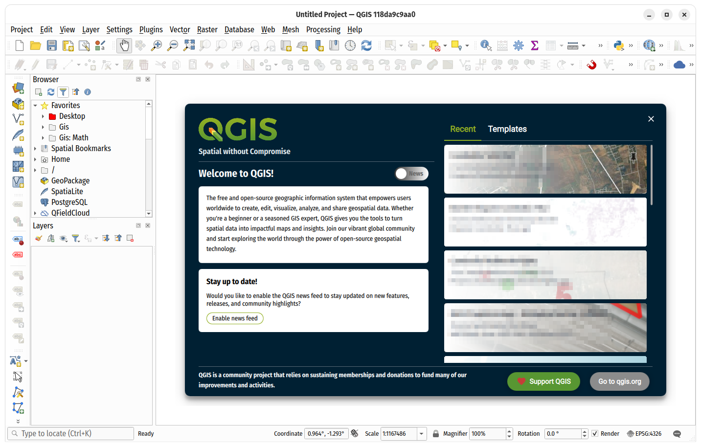

This feature was developed by [Mathieu
Pellerin](https://github.com/nirvn)

### Feature: Unlock shipping themes through plugins

Adding new themes shipped within QGIS core (such as Night Mapping and
Blend of Gray) comes with high maintenance costs and limits the amount
of creativity that authors can exercise, as they typically need to be
neutral, generic, and accessible.  
QGIS has now been extended to support themes through the plugins API, so
that the community can apply themes and custom application styles
without changes to the QGIS Core Application, unlocking an entirely new
dimension to the QGIS UX.

This feature was funded by [free time, inspired by
:)](https://github.com/qgis/QGIS/pull/64495)

This feature was developed by [Mathieu
Pellerin](https://github.com/nirvn)

### Feature: Create user defined ToolBar and Menu

QGIS now allows users to create user-defined menus and toolbars to
provide powerful customization options.  
This implements [QEP
\#343](https://github.com/qgis/QGIS-Enhancement-Proposals/blob/master/qep-343-customized-toolbars-and-menus.md).

This feature was funded by Stadt Frankfurt am Main and Oslandia

This feature was developed by [Julien
Cabieces](https://github.com/troopa81)

### Feature: Attribute table double click zoom

Users can now double-click an item in the attribute table to instantly
select a feature and zoom to the selected feature.

This feature was developed by [Nass](https://github.com/lanckmann)

## Symbology

### Feature: Allow copying/pasting all styles from a layer to another

When a layer has multiple styles, the layer tree context menu now
contains a new "Copy All Styles" action. Triggering this will copy the
definition of ALL the layer's styles to the clipboard.  
Users can open the context menu on another layer and use the new "Paste
All Styles" feature in order to paste copies of ALL of the original
layer's styles to the target, removing the need to manually iterate
through the existing styles on the original layer and paste styles
one-by-one.

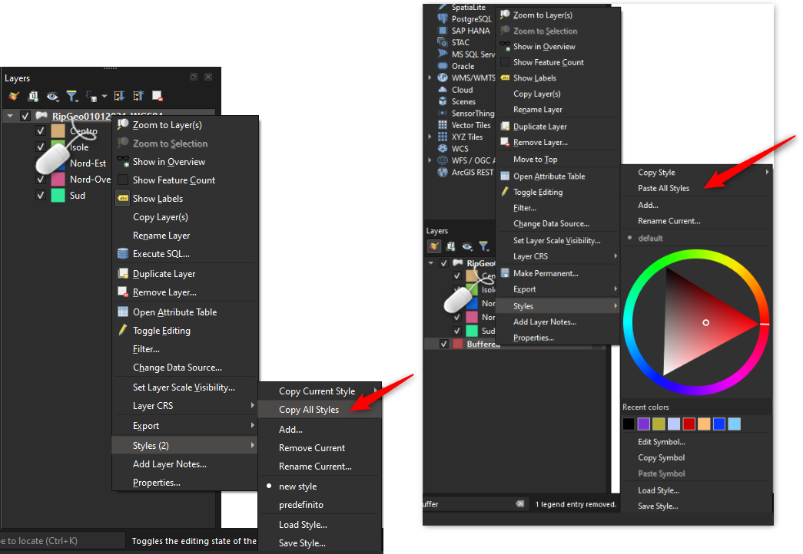

This feature was funded by City of Canning

This feature was developed by [North Road](https://north-road.com/)

### Feature: Introduce additional grouped style categories in copy/pasting UI

New grouped categories shortcuts have been added to the layer tree
menu's copy/paste style sub-menu. This allows users to rapidly
copy/paste a set of grouped categories across layers.

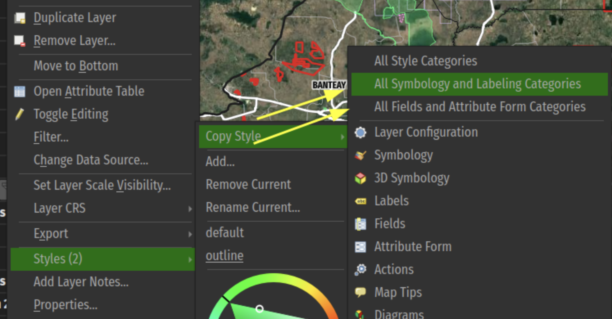

This feature was developed by [Mathieu
Pellerin](https://github.com/nirvn)

## Annotations

### Feature: Brand new annotations selection tool

As a part of the implementation for [QEP
\#344](https://github.com/qgis/QGIS-Enhancement-Proposals/pull/344),
which aims to introduce functionality to copy, move, and rotate
annotation layers, the new selection tool provides interactive
operations for annotation items, including:

- selection of annotation item(s), with shift modifier to toggle
  selection of additional item(s)
- mouse and keyboard movement of selected item(s)
- deletion of selected item(s)
- resizing of selected item(s) using the mouse handlers
- rotation of selected item(s) using the mouse handlers

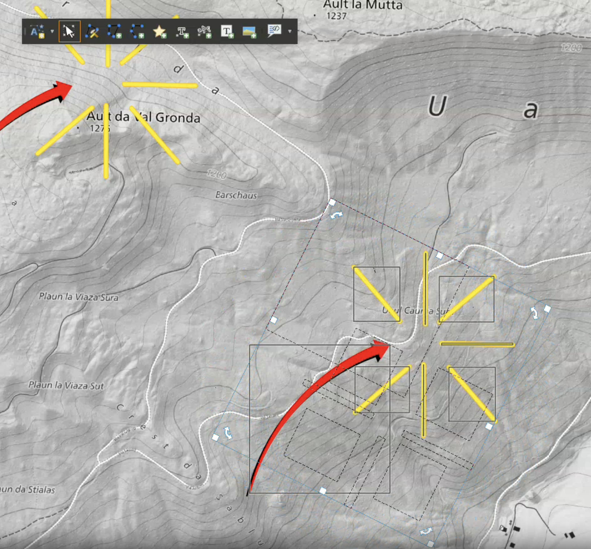

This feature was developed by [Mathieu
Pellerin](https://github.com/nirvn)

### Feature: Show text annotations in 3D map views

When an annotation layer is set to render as 3D billboards, it also
renders text annotations as billboards.  
For line/rectangle text annotations, the billboard is placed at the
center of the line/rectangle. Users can control the text format used for
the 3D billboard. The original 2d annotation text format is ignored,
allowing users  
to design a readable/more appropriate text format for the 3D text alone.

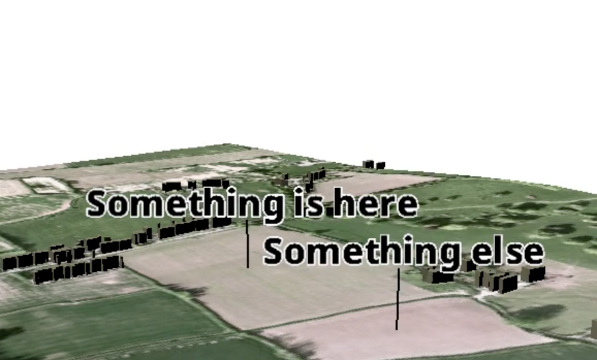

This feature was developed by [North Road](https://north-road.com/)

### Feature: Support rendering annotation layer markers as 3D billboards

A new option for showing annotation layers in 3D maps has been added.
From the annotation layer properties, 3D tab, users can set the layer to
render as 3D billboards. When activated, all MARKERS from the layer will
be shown as floating billboard symbols above the 3D map (lines and
polygons from the layer are ignored).  
Users have control over the terrain clamping and offset for the
billboards, and whether or not "callout" lines should be shown (vertical
lines joining the billboard to the corresponding location on the terrain
surface).

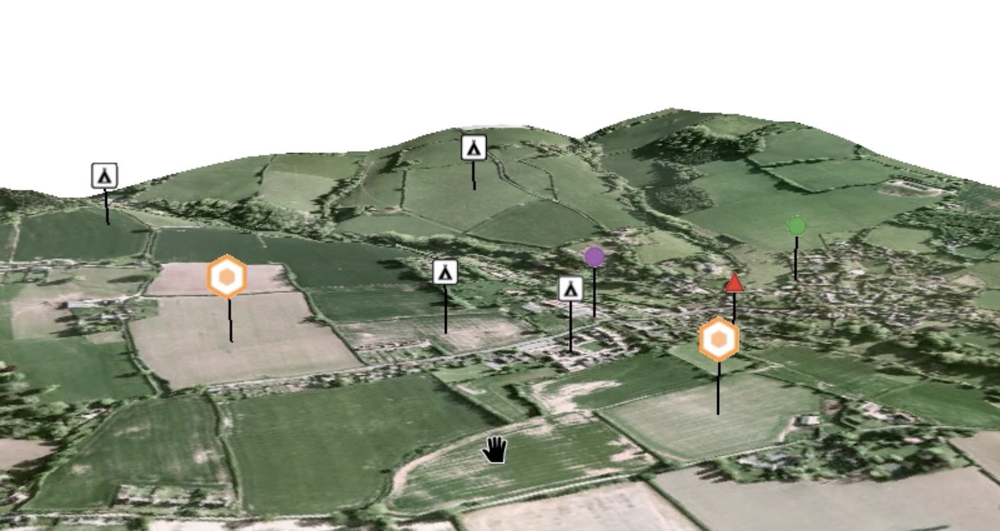

This feature was developed by [North Road](https://north-road.com/)

## Labelling

### Feature: Add option to ignore whitespace when detecting label collisions

This new option (which is available ONLY for curved label placement
modes) controls how QGIS treats whitespace (i.e., spaces or tabs) in
label text when determining whether two labels collide (or when a label
collides with an obstacle feature). The existing (and default) behavior
is that spaces are treated the same as text characters, and a label is
not permitted to overlap spaces in another label.  
When the new "Ignore label whitespace when detecting collisions" option
is checked, then whitespace in the text will be ignored when checking
for overlapping labels (or labels colliding with obstacles).  
This is useful when labeling long line features, when the word spacing
is large, and it is desirable to allow text or other features to sit
within the label spaces. (e.g., when labeling rivers or roads). The
setting can be data-defined, enabling advanced expression-driven
functionality, such as allowing it to be enabled only for features of
sufficient length, etc.

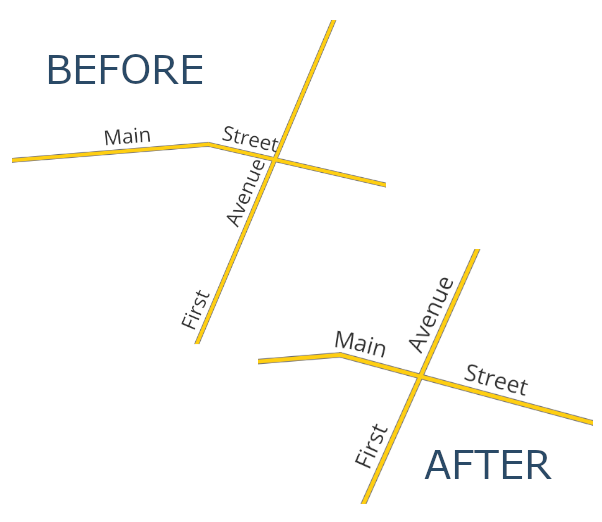

This feature was funded by [LINZ](https://www.linz.govt.nz/)

This feature was developed by [North Road](https://north-road.com/)

### Feature: Rework multipart geometry labeling

The existing checkbox for “Label every part of multi-part features” has
been re-worked to use a combobox to expose the choice of multi-part
handling options.  
The available options are:

- **Label largest part only**: This corresponds to the current default
  behavior, i.e., when the user has left the "label every part" checkbox
  unchecked.
- **Label every part with same text**: This corresponds to the current
  behavior that is activated when the user manually checks the "label
  every part" checkbox.
- **Split label text lines over parts**: This is a brand new behavior,
  which splits the label text over the parts of a multi-geometry
  feature. The label text will be split at new line characters, and each
  line will be placed separately over the corresponding parts from the
  input feature geometry. Note that the splitting will occur AFTER the
  existing setting for "Wrap on character" is applied, so any custom new
  line character the user has configured for that setting will be
  respected when placing labels for multipart geometries. If the
  multipart geometry does not contain sufficient parts for the label
  text, then the excess lines will be ignored.

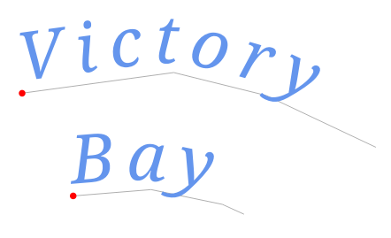

This feature was funded by [LINZ](https://www.linz.govt.nz/)

This feature was developed by [North Road](https://north-road.com/)

### Feature: Placement modes for curved label placement

Newly added placement "modes" are now available for use with curved
labels, allowing for much more fine-grained control over how text is
positioned when using curved labels, in line with [QEP
404](https://github.com/qgis/QGIS-Enhancement-Proposals/blob/master/qep-404-curved-placement-modes.md).  
These additional modes are exposed as options that are visible and
enabled whenever a line geometry type layer is set to curved label
placement. A data-defined override is available for the new curved
placement modes, allowing mixed use of different modes for features
within a single layer.  
New modes include:

- **Default**: Existing behavior, no change. Glyphs are placed at
  regular character and word spacing along the curved line geometry.
- **Place characters at vertices**: When this mode is selected, each
  individual character from the label text is placed such that their
  left-baseline position is located at a corresponding vertex from the
  curved line geometry, i.e., the first character will be placed at the
  start of the line, the second at the second vertex, the third at the
  third vertex, etc. If the curved line geometry does not contain
  sufficient vertices for the characters present in the label text, then
  the excess characters are ignored and will not be rendered. If the
  label’s “distance” setting is non-zero, then the character will be
  vertically offset from the vertex position by this distance.
  Characters are rotated to follow the line angle at the vertex.
- **Stretch character spacing to fit line**: When selected, this mode
  increases (or decreases) the character spacing used for each label in
  order to fit the entire text over the actual length of the curved line
  geometry.
- **Stretch word spacing to fit line**: When selected, this mode
  increases (or decreases) the word spacing used for each label in order
  to fit the entire text over the actual length of the curved line
  geometry.

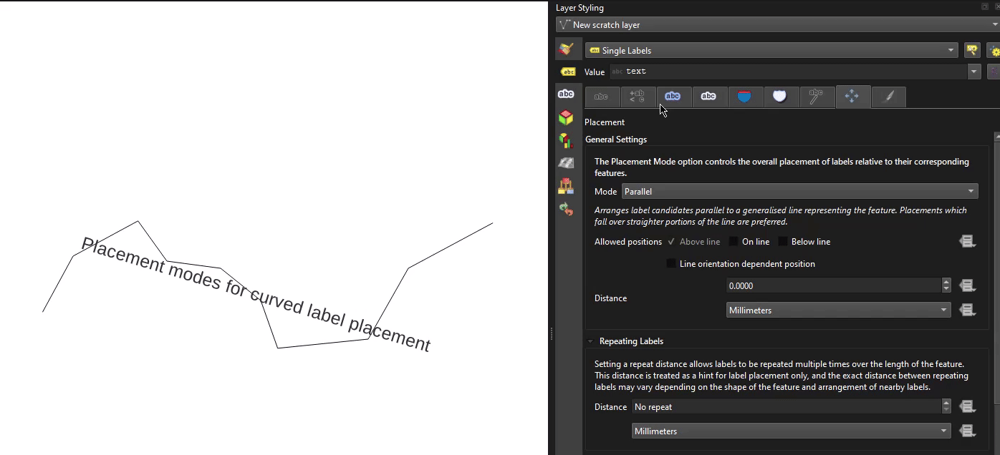

This feature was funded by [LINZ](https://www.linz.govt.nz/)

This feature was developed by [North Road](https://north-road.com/)

## Rendering

### Feature: Introduce selective masking presets

Users can now use a drop-down under Mask Sources when configuring a
layer's masking and select from a number of presets to efficiently apply
masking without complex management. This is especially useful for large
projects when many different layers need to reference the same complex
set of mask sources, such when many layers are masked by the same set of
distinct labeled layers.  
The default value is "custom", which replicates the existing ad-hoc
per-layer configuration, but users are able to create, rename, or remove
selective masking sets as needed, and any changes to a preset's checked
sources will automatically apply the changes to ALL layers linked to the
preset.

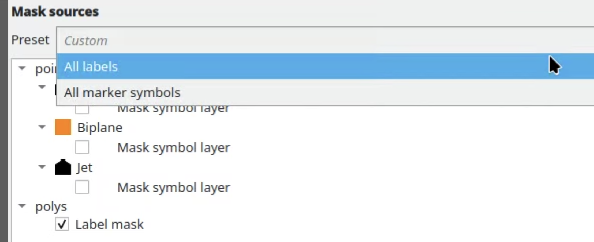

This feature was funded by [LINZ](https://www.linz.govt.nz/)

This feature was developed by [North Road](https://north-road.com/)

## 3D Features

### Feature: Add an option to disable terrain export on 3D scene exports

A new option to enable or disable terrain export is provided on the
dialog for 3D scene exports. Terrain options are always activated, even
when terrain rendering is disabled. The `terrain resolution` option is
only relevant for DTM or online terrain - it must be disabled for other
terrain types.

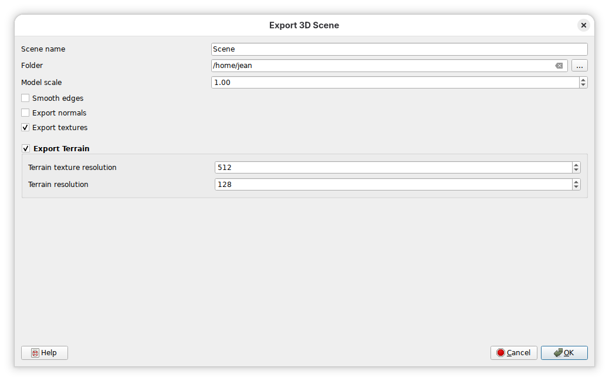

This feature was funded by Stadt Frankfurt am Main

This feature was developed by [Jean Felder](https://github.com/ptitjano)

### Feature: Highlight identified features in 3d views

QGIS now supports highlighting of vector features in 3D Views. The
identified polygon features are highlighted in 3D views using a
semi-transparent overlay and a thick silhouette line, similar to the
highlight effect in the 2D map canvas, with a matching color and
transparency. The highlight effect is always rendered on top of other
entities. When highlighted features overlap in the current point of
view, one aggregated silhouette is rendered at the perceived perimeter.

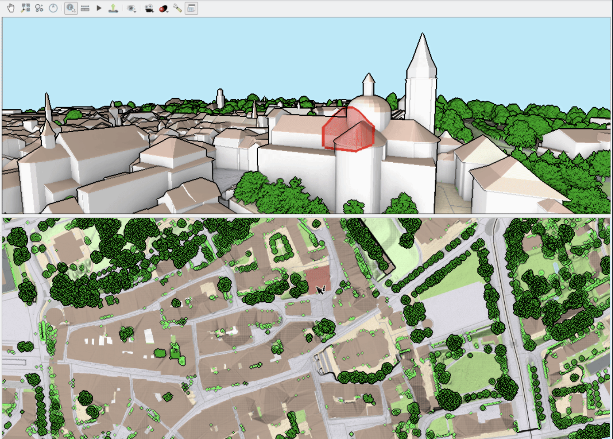

This feature was funded by [QGIS 3D for Open Source Digital Twins
(crowdfunding
campaign)](https://www.lutraconsulting.co.uk/crowdfunding/qgis-3d-for-open-source-digital-twins)

This feature was developed by [Stefanos Natsis (Lutra
Consulting)](https://github.com/uclaros)

### Feature: Cross sections: use fixed tolerance (width) and nudge left/right

When defining a cross section, user normally picks two endpoints, and
then with the third mouse click, cross section width (tolerance) is
chosen. The new version allows to lock the tolerance, so that user only
picks two endpoints, without having to pick the width (tolerance) every
time. Moreover, it is possible to modify tolerance of the active cross
section by editing the tolerance value in the GUI.  
3D map views now also allow nudging the active cross-section left or
right in the same fashion as the elevation profile widget does (either
via menu buttons or using keyboard shortcuts).

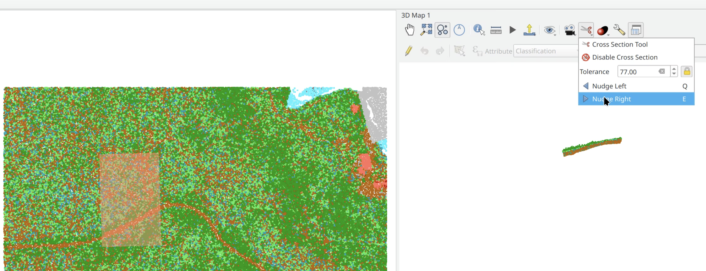

This feature was funded by [Danish Agency for Climate
Data](https://www.klimadatastyrelsen.dk/)

This feature was developed by [Dominik Cindric (Lutra
Consulting)](https://github.com/ViperMiniQ)

### Feature: Dynamic vector chunking

In previous versions of QGIS, vector layers were chunked in 3D views
using fixed zoom levels. This behaviour has been modified to dynamically
adjust the depth of the quadtree, and each zoom level will only load a
maximum number of features constrained by the user-specified "Maximum
features per chunk" value. This allows rendering larger layers without
needing to load all their features when zoomed out.

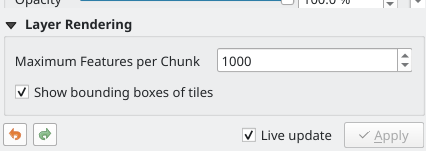

This feature was funded by [QGIS 3D for Open Source Digital Twins
(crowdfunding
campaign)](https://www.lutraconsulting.co.uk/crowdfunding/qgis-3d-for-open-source-digital-twins)

This feature was developed by [Stefanos Natsis (Lutra
Consulting)](https://github.com/uclaros)

### Feature: Render floors of extruded polygons

Polygon 3D symbols can now optionally include floors when rendering
features. These were previously not included, and rendering of
volumetric data as boxes would miss the lower part.

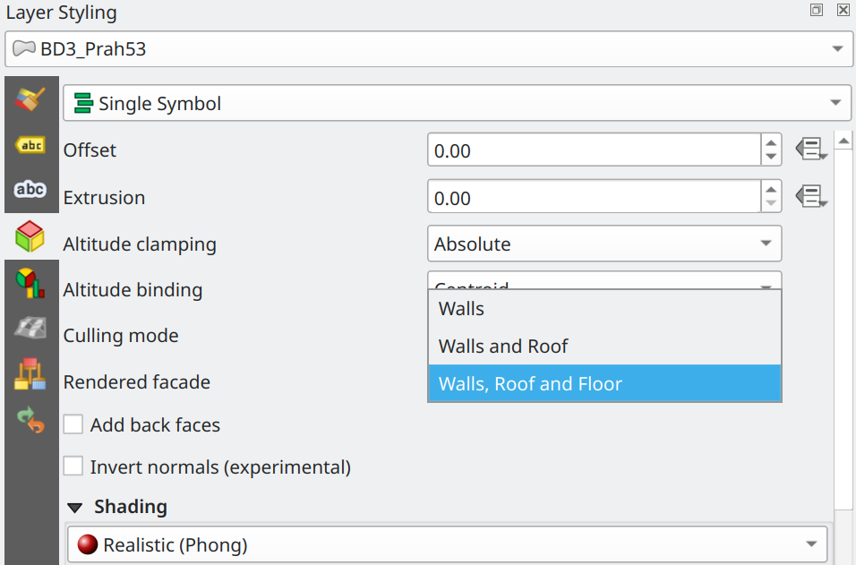

This feature was funded by [QGIS 3D for Open Source Digital Twins
(crowdfunding
campaign)](https://www.lutraconsulting.co.uk/crowdfunding/qgis-3d-for-open-source-digital-twins)

This feature was developed by [Dominik Cindric (Lutra
Consulting)](https://github.com/ViperMiniQ)

### Feature: Add support for a 2d map overlay

A new feature for 3D map views allows users to display an overlay of the
2d map, centered around the position of the 3D camera, and optionally
display the camera frustum.

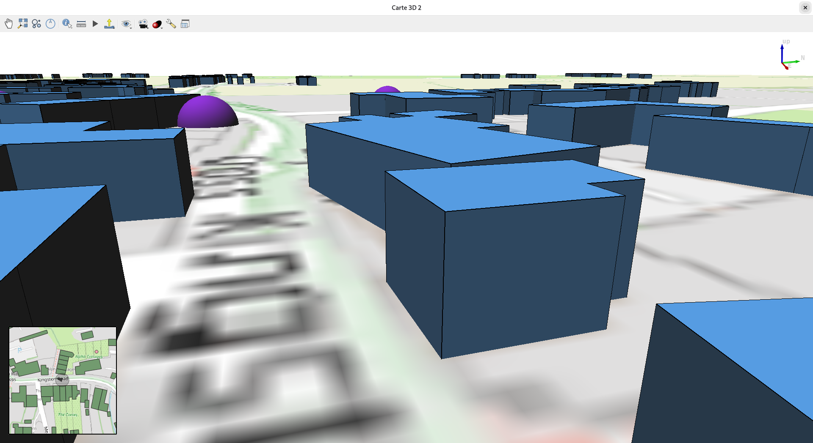

This feature was developed by [Jean Felder](https://github.com/ptitjano)

### Feature: Esri Scene Layers

A new data provider for tiled scene layers has been added for ESRI I3S
(aka "scene layers" / "scene servers"). Rendering of data is available
in both 2D and 3D map views.  
How to load I3S data:  
- from ArcGIS REST servers - via data sources manager or browser dock
(previously the scene layers would not show up, now they do)  
- open a local SLPK file - via drag'n'drop from file browser, or using
browser dock, or data sources manager (Scene tab)  
Notes:  
- supporting I3S \>= 1.7  
- supporting 3DObject and IntegratedMesh layer types  
- supporting datasets both in "global" mode (i.e. EPSG:4326) and "local"
mode (i.e. any projected CRS)

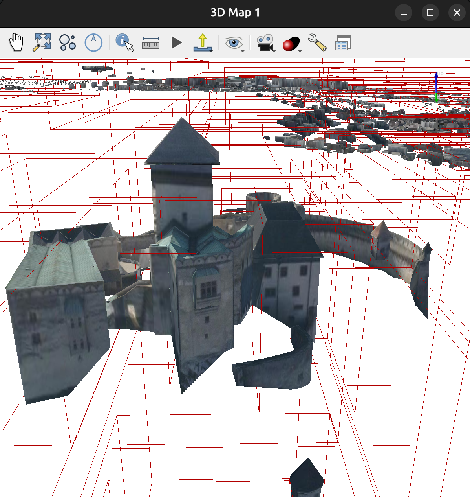

This feature was funded by [QGIS 3D for Open Source Digital Twins
(crowdfunding
campaign)](https://www.lutraconsulting.co.uk/crowdfunding/qgis-3d-for-open-source-digital-twins)

This feature was developed by [Martin Dobias (Lutra
Consulting)](https://github.com/wonder-sk)

### Feature: Make orthographic camera work

3D views already had an option to use orthographic camera instead of
perspective camera, but that option has been broken for many releases.
The support for orthographic camera is usable now, and it can be very
practical when using cross sections.

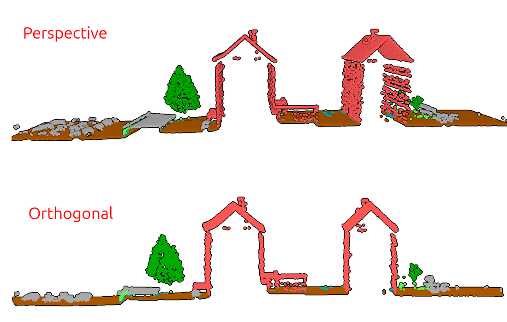

This feature was funded by [QGIS 3D for Open Source Digital Twins
(crowdfunding
campaign)](https://www.lutraconsulting.co.uk/crowdfunding/qgis-3d-for-open-source-digital-twins)

This feature was developed by [David Konarik (Lutra
Consulting)](https://github.com/dvdkon)

## Point Clouds

### Feature: Build virtual point cloud (VPC) algorithm enhancements

The Build virtual point cloud (VPC) algorithm will warn users when a LAS
or LAZ files are included as inputs for a VPC (such VPC cannot be fully
displayed in QGIS without conversion of input files to COPC format). The
algorithm also provides the option to **Convert input files to COPC
format** - it will automatically convert all input files (e.g. LAS/LAZ)
into COPCs, making the VPC suitable for 2D/3D rendering in QGIS.

This feature was funded by [Danish Agency for Climate
Data](https://www.klimadatastyrelsen.dk/)

This feature was developed by [Jan Caha (Lutra
Consulting)](https://github.com/JanCaha)

### Feature: New processing algorithm: Compare point clouds (M3C2)

A new algorithm for comparison of two point cloud layers is available.  
M3C2 algorithm (Multiscale Model to Model Cloud Comparison) computes
distances between two 3D point clouds along locally estimated surface
normals, rather than using a fixed projection direction. It operates at
multiple scales to robustly estimate both the surface orientation and
the signed distance, making it well-suited for detecting change on
complex 3D surfaces like rock faces or riverbanks.  
Note: the algorithm uses `filters.m3c2` from PDAL - and it will only
work if the QGIS installation ships with PDAL version \>2.10.

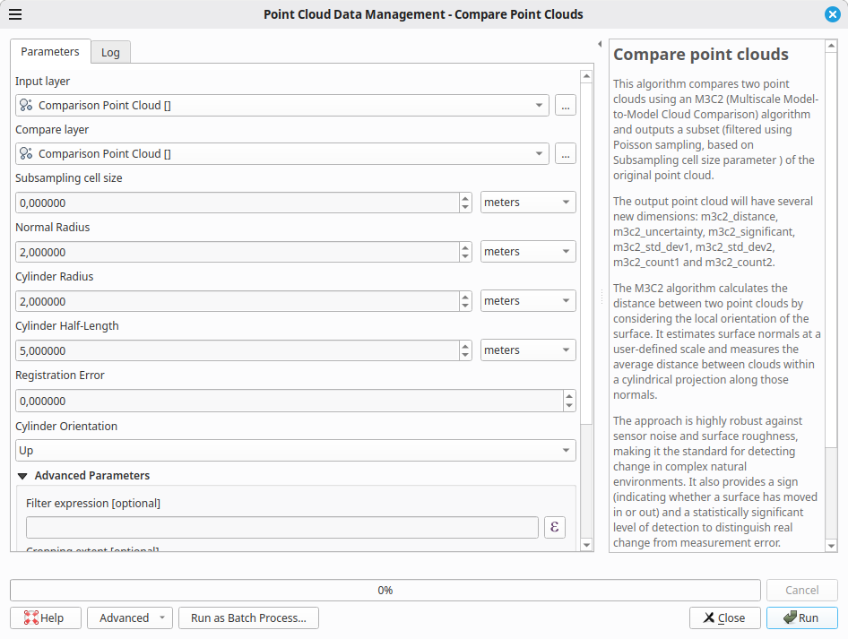

This feature was funded by [Danish Agency for Climate
Data](https://www.klimadatastyrelsen.dk/)

This feature was developed by [Jan Caha (Lutra Consulting) + PDAL
implementation by Hobu Inc.](https://github.com/JanCaha)

### Feature: Choose at what zoom level VPC will show actual points

A new combo box is provided in the 2D/3D style properties for VPCs,
which controls zoom level at which QGIS will switch from rendering tile
extent or overview point cloud to rendering of points from the data
files linked from VPC. This provides users with more granular control
over the trade-offs of performance and detail for rendering point
clouds, and provides options for:

- Later
- Normal
- Earlier
- Much earlier

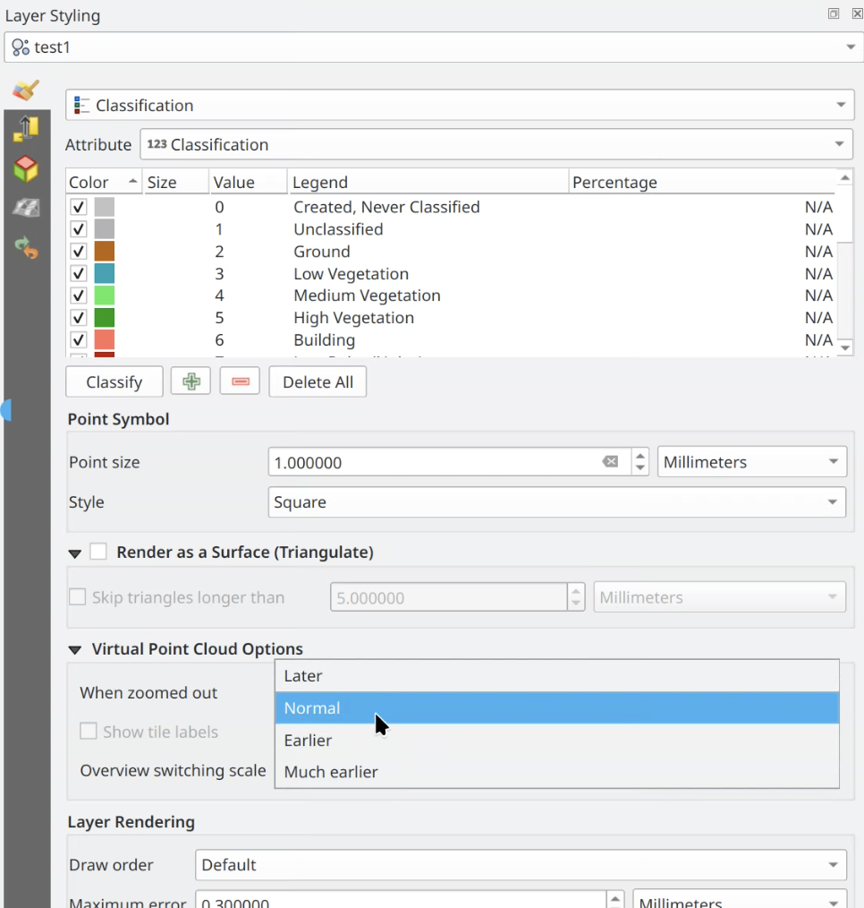

This feature was funded by [Danish Agency for Climate
Data](https://www.klimadatastyrelsen.dk/)

This feature was developed by [Dominik Cindric (Lutra
Consulting)](https://github.com/ViperMiniQ)

### Feature: Add virtual point cloud remote dataset support

QGIS is now able to load virtual point clouds hosted on a remote server.
This lowers friction when distributing large point cloud datasets -
users do not need to download the .vpc file in advance as QGIS will take
care of that automatically.

This feature was funded by [QGIS 3D for Open Source Digital Twins
(crowdfunding
campaign)](https://www.lutraconsulting.co.uk/crowdfunding/qgis-3d-for-open-source-digital-twins)

This feature was developed by [Dominik Cindric (Lutra
Consulting)](https://github.com/ViperMiniQ)

### Feature: Editing of virtual point clouds

It is now possible to edit point cloud data within virtual point clouds
(VPC). The requirement is that VPC and its linked data files are
available as local COPC files (not hosted on a remote server).

This feature was funded by [Danish Agency for Climate
Data](https://www.klimadatastyrelsen.dk/)

This feature was developed by [Dominik Cindric (Lutra
Consulting)](https://github.com/ViperMiniQ)

### Feature: New processing algorithm: Height above ground

The "Height above ground" algorithm computes each point's vertical
distance from an estimated ground surface, which is essential for
normalizing elevation data across varying terrain. This is useful for
tasks like building height extraction or vegetation height estimation.  
The algorithm outputs the same point cloud, with a new attribute added
("HeightAboveGround") with the calculated altitude. Optionally, user can
choose to replace Z values of points by the calculated height above
ground - which is sometimes useful for 3D visualization or further
processing.  
There are two variants of the algorithm - the basic one estimates ground
surface from a number of nearby ground points, the other variant creates
triangulation of ground points and estimates height from it.  
The input point cloud needs to have some of the points classified as
ground (classification=2).

This feature was funded by [QGIS 3D for Open Source Digital Twins
(crowdfunding
campaign)](https://www.lutraconsulting.co.uk/crowdfunding/qgis-3d-for-open-source-digital-twins)

This feature was developed by [Jan Caha (Lutra
Consulting)](https://github.com/JanCaha)

### Feature: New processing algorithm: Classify ground points

This algorithm classifies ground points using the Simple Morphological
Filter (SMRF) algorithm.  
SMRF is a ground filtering algorithm that uses progressive morphological
operations to separate ground points from non-ground points (like
vegetation and buildings) in lidar point clouds. It iteratively applies
opening operations at increasing window sizes combined with an elevation
threshold, making it computationally efficient and effective for
generating bare-earth digital terrain models.

This feature was funded by [QGIS 3D for Open Source Digital Twins
(crowdfunding
campaign)](https://www.lutraconsulting.co.uk/crowdfunding/qgis-3d-for-open-source-digital-twins)

This feature was developed by [Jan Caha (Lutra
Consulting)](https://github.com/JanCaha)

### Feature: New processing algorithm: Filter noise

There are two new algorithms for noise filtering of point clouds (using
statistical method or using radius).  
Noise filtering algorithms identify and remove outlier points in a point
cloud that result from sensor errors, multipath reflections, or
atmospheric interference. They analyze each point's local neighborhood
and flag points that deviate significantly from their surroundings.

This feature was funded by [QGIS 3D for Open Source Digital Twins
(crowdfunding
campaign)](https://www.lutraconsulting.co.uk/crowdfunding/qgis-3d-for-open-source-digital-twins)

This feature was developed by [Jan Caha (Lutra
Consulting)](https://github.com/JanCaha)

### Feature: New processing algorithm: Transform point cloud

The transformation algorithm applies translation, rotation, and scaling
to align a point cloud layer, without changing its shape.  
This is commonly used for correcting systematic offsets between surveys,
using known control points or correspondences.

This feature was funded by [QGIS 3D for Open Source Digital Twins
(crowdfunding
campaign)](https://www.lutraconsulting.co.uk/crowdfunding/qgis-3d-for-open-source-digital-twins)

This feature was developed by [Jan Caha (Lutra
Consulting)](https://github.com/JanCaha)

## Print Layouts

### Feature: Add horizontal alignment control for layout map grid annotations

Instead of always left-aligning grid annotations on layout maps, a new
control allows users to choose the alignment. This is especially useful
for multi-line annotations, which may be unappealing when left-aligned
on the left side of the map.

This feature was funded by [LINZ](https://www.linz.govt.nz/)

This feature was developed by [North Road](https://north-road.com/)

### Feature: Rework handling of initial layer set and synchronization on Layout Legends

QGIS has introduced layer synchronisation modes for the legends in Print
Layouts, in line with [QEP
253](https://github.com/qgis/QGIS-Enhancement-Proposals/issues/253).  
This removes the existing "Auto update" checkbox for layout legends, and
instead introduces a user-friendly combobox showing legend population
modes, including:

- **Synchronize to All Project Layers**: This option matches the current
  behaviour of the "Auto sync" checkbox. If selected, then all new
  layers added to the project will appear immediately in the legend, and
  any changes made to these layers will immediately be applied to the
  legend.
- **Synchronize to Visible Layers**: This option will consider which
  layers are currently visible in the map linked to the legend item (or
  main project layer tree, if no map is linked to the legend). When this
  mode is active, any changes to the set of layers visible in the map
  will cause the legend layers to be matched to this set of visible
  layers. Note that this mode differs from the existing "Only show items
  in the linked map" option because the "Synchronize to Visible Layers"
  mode does not consider the linked map extent at all - if a layer is
  checked and visible for the map, then it will be shown in the legend
  regardless of whether or not all features in the layer fall outside
  the visible map extent. Like the "Synchronize to All Project Layers"
  option, any changes made to the names or other legend-related settings
  in the main project layer tree will automatically be propagated to the
  layout legend.
- **Manual Layer Selection**: All content for the legend can be
  controlled manually by the user, and no auto-synchronization of which
  layers are included will apply. This is the same behaviour as
  currently happens in QGIS if the "auto update" option is unchecked.

The previous "Update All" operation on legends has been changed to a new
"Reset" function, which will restore the legend configuration respecting
the selected mode.  
This change includes a new global setting that has been added to the
Options - Layout page, allowing users to control the default mode for
newly created legends. By default, QGIS will use the "Synchronize to
Visible Layers" mode in order to provide a better out-of-the-box
experience for users with large projects; however, users can restore the
previous default behaviour by changing this setting accordingly.

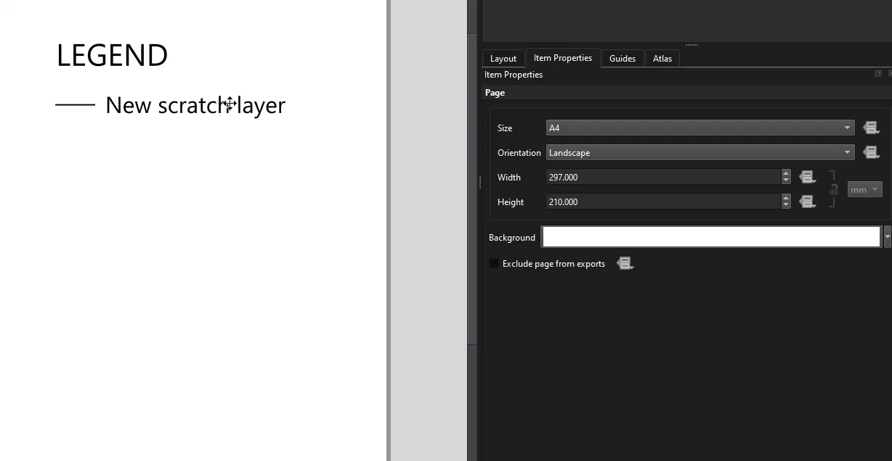

This feature was funded by QGIS Danish User Group

This feature was developed by [North Road](https://north-road.com/)

### Feature: Add data-defined control over layout map grid annotation visibility, and additional expression variables for grids

This allows for PER-ANNOTATION control over the map grid text
visibility. i.e., it allows for individual grid annotations to be
selectively hidden or shown. The `@grid_axis` and `@grid_number`
expression variables are available for use in the expression. New
expression variables have also been introduced, making it easy to do
things like hide the first/last grid annotations selectively:

- @grid_count: Total number of visible grid lines for the current grid
  axis.
- @grid_index: The index of the grid line currently being drawn
  (starting at 1 for the first grid line). The index is specific to the
  current grid axis.

This feature was funded by [LINZ](https://www.linz.govt.nz/)

This feature was developed by [North Road](https://north-road.com/)

### Feature: Allow for atlas geometries to reshape the frame of map items

A new clip frame function has been added that, when enabled, reshapes
layout map items frames to match the (polygon) geometry of the current
atlas feature. This allows flexible clipping and masking in atlas items,
especially where canvas background color is an integral part of the
rendering (e.g., vector tile base maps).

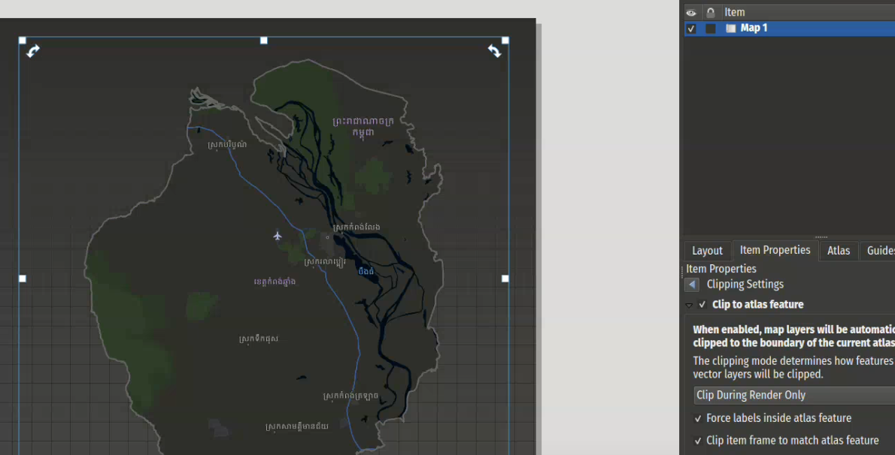

This feature was developed by [Mathieu
Pellerin](https://github.com/nirvn)

### Feature: Brand new pie chart plot type

A new pie chart has been added to the available plot types in QGIS and
its layout designer.

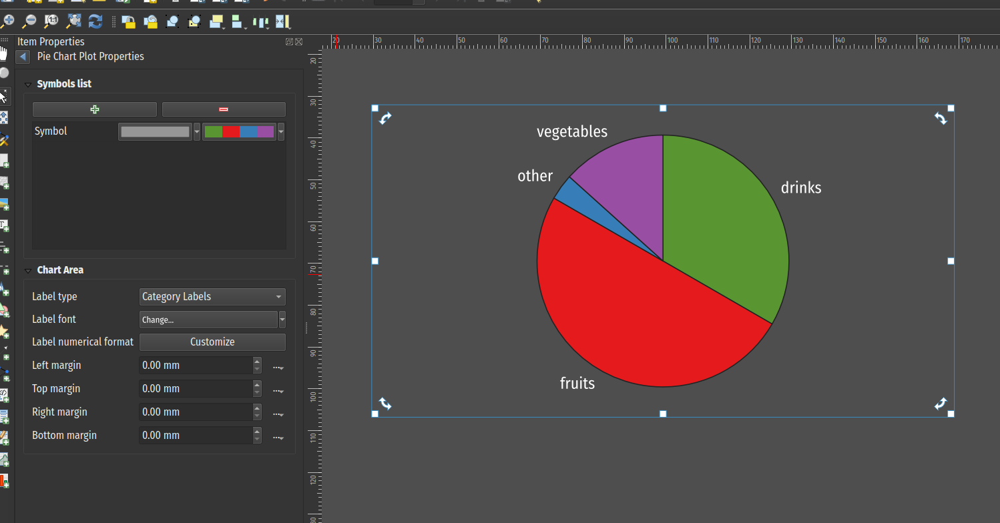

This feature was developed by [Mathieu
Pellerin](https://github.com/nirvn)

### Feature: Print Layout Charts Implementation

A new layout chart item has been added, which allows users to leverage
chart rendering into their print and atlas layouts. Chart configurations
are defined using an extensive set of properties provided in the
properties panel and a number of sub-panels.  
The chart item builds visualizations from data series of X and Y values,
which are derived from a source layer that is configured through the
item properties' data source group. Each series is defined using
expressions to evaluate the X and Y values, as well as the possibility
to filter the source layer, with each property configured via a
subpanel. Iteration through the source layer can be ordered, which will
be taken into account by the bar/line charts.

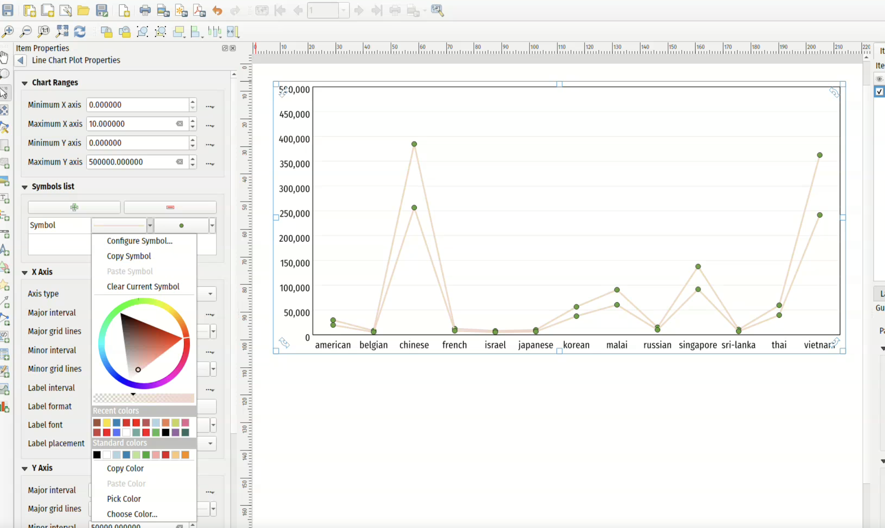

This feature was developed by [Mathieu
Pellerin](https://github.com/nirvn)

### Feature: Add an atlas option to limit coverage layer rendering to the current feature only

A new atlas option was added to limit rendering of features on the
coverage layer to the current feature only, allowing the dynamic
exclusion of other features without requiring complex expressions using
the active atlas feature.

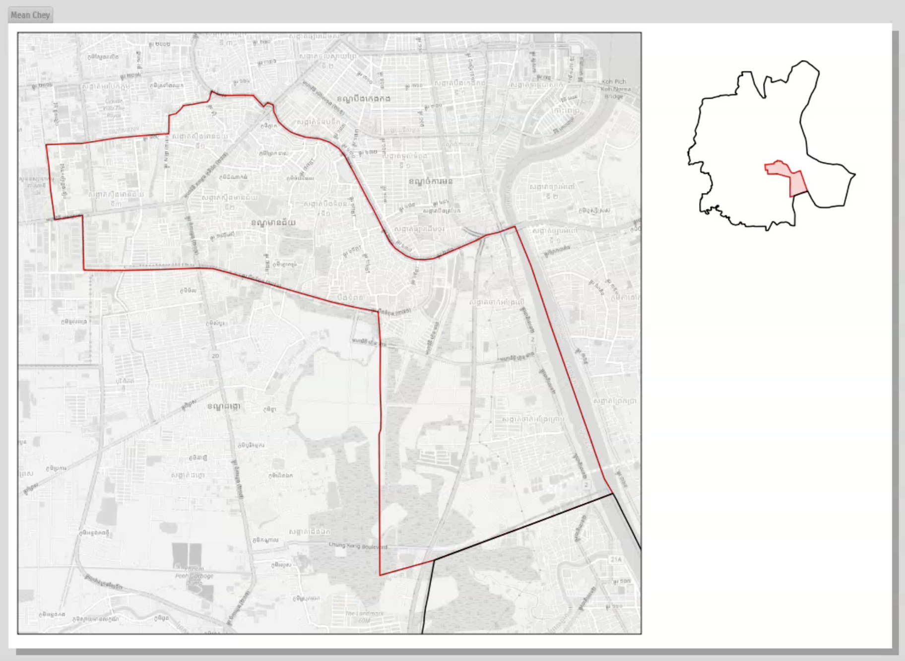

This feature was developed by [Mathieu
Pellerin](https://github.com/nirvn)

### Feature: Add set extent to layer item in the map item's toolbar menu

A new menu action has been added to the toolbar for layout maps that
allows users to quickly set a given map item's extent to match the
extent of a spatial layer in the project.

This feature was developed by [Mathieu
Pellerin](https://github.com/nirvn)

### Feature: Brand new layout item rotation handles

Rotation handles have been added for selected layout item(s), allowing
users to tweak item rotation and perfect their layouts.

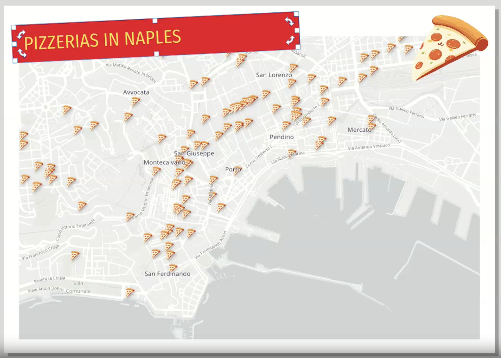

This feature was developed by [Mathieu
Pellerin](https://github.com/nirvn)

## Expressions

### Feature: Add "equals" geometry function

A new `equals(geometry1, geometry2)` geometry function has been added,
which will test the equality of two geometries (in the same manner as
`overlay_equals`).

This feature was developed by [Andrea
Giudiceandrea](https://github.com/agiudiceandrea)

### Feature: Add expression functions for working with magnetic models

New expressions for handling magnetic model details are now available,
including::

- magnetic_declination: Returns the declination of a magnetic field at a
  point, in degrees east of north
- magnetic_inclination: Returns the inclination of a magnetic field at a
  point, in degrees down from horizontal
- magnetic_declination_rate_of_change: Returns the rate of change of the
  declination of a magnetic field at a point, in degrees per year
- magnetic_inclination_rate_of_change: Returns the rate of change of the
  inclination of a magnetic field at a point, in degrees per year

This is highly useful for metadata in print layouts and

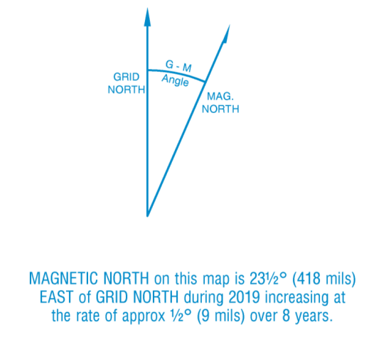

This feature was funded by [LINZ](https://www.linz.govt.nz/)

This feature was developed by [North Road](https://north-road.com/)

### Feature: Add extract_degrees, extract_minutes, extract_seconds functions

These functions are designed to make it easy to customise the display of
a degree-based grid annotation, by allowing easy extraction of the
individual components of the decimal degree value for individual
formatting (e.g., displaying the degrees in bold)

- extract_degrees: Extracts the integer number of degrees from a decimal
  degrees value. The minutes and seconds components are ignored. The
  extracted degrees values will be truncated towards zero (not rounded).
- extract_minutes: Extracts the integer number of minutes from a decimal
  degrees value. The degrees and seconds components are ignored. The
  extracted minutes values will be truncated towards zero (not rounded),
  and will always be a positive value.
- Extracts the decimal number of seconds from a decimal degrees value.
  The degrees and minutes components are ignored. The extracted seconds
  value will always be a positive value.

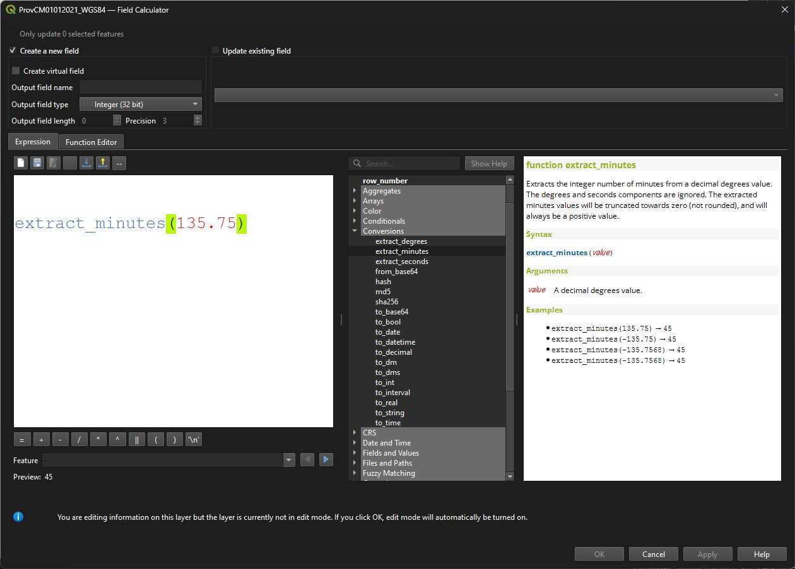

This feature was funded by [LINZ](https://www.linz.govt.nz/)

This feature was developed by [North Road](https://north-road.com/)

### Feature: Add unaccent function based on PostgreSQL unaccent

A new unaccent method is provided that removes accents (diacritic signs)
from lexemes, e.g `unaccent( "ï" )`.

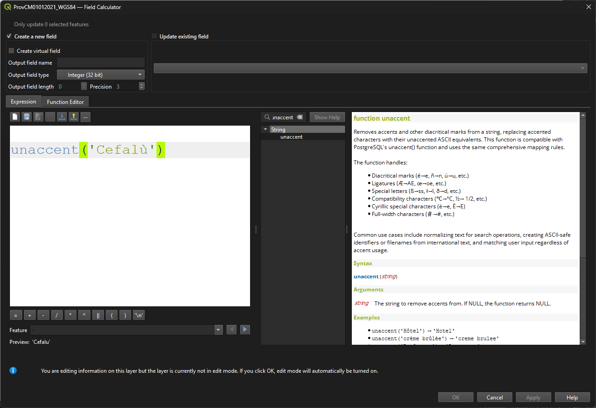

This feature was developed by [Tudor
Barascu](https://github.com/tudorbarascu)

### Feature: Add substr_count expression

The new `substr_count` expression simply allows users to count the
occurrences of a substring within a string.

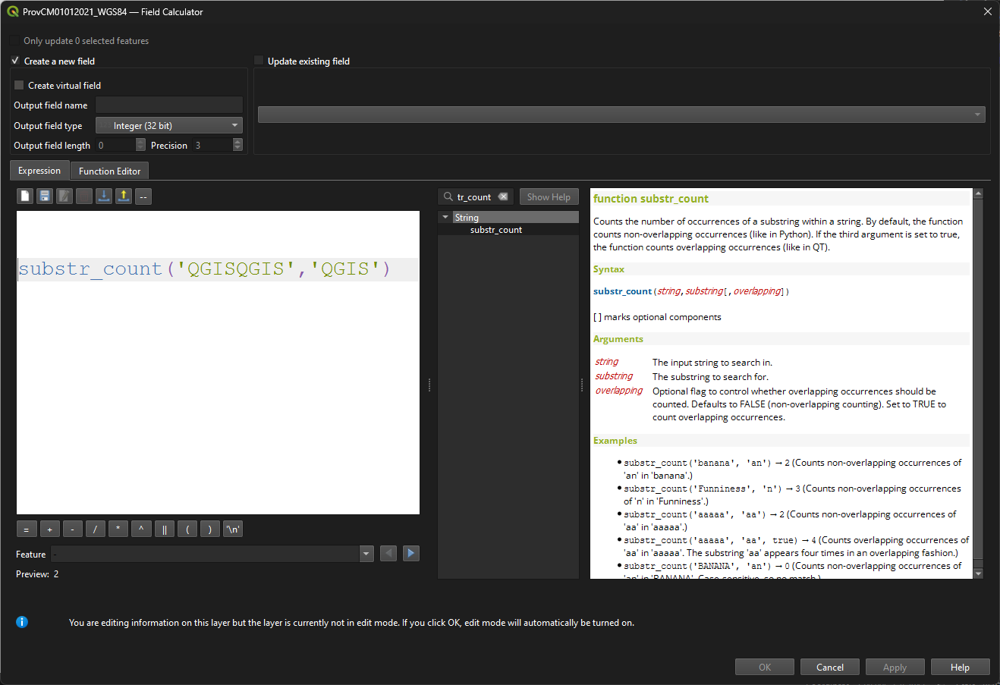

This feature was developed by [Tudor
Barascu](https://github.com/tudorbarascu)

### Feature: Add some timezone related expression functions

Adds some functions for working with timezones in expressions:

- `timezone_from_id`: Creates a timezone object from a string ID (from
  the IANA timezone database).
- `timezone_id`: Returns the ID string for a timezone object, using IDs
  from the IANA timezone database.
- `get_timezone`: Returns the timezone object associated with a datetime
  value.
- `convert_timezone`: Converts a datetime object to a different
  timezone.
- `set_timezone`: Sets the timezone object associated with a datetime
  value, without changing the date or time components. This function can
  be used to replace the timezone for a datetime.

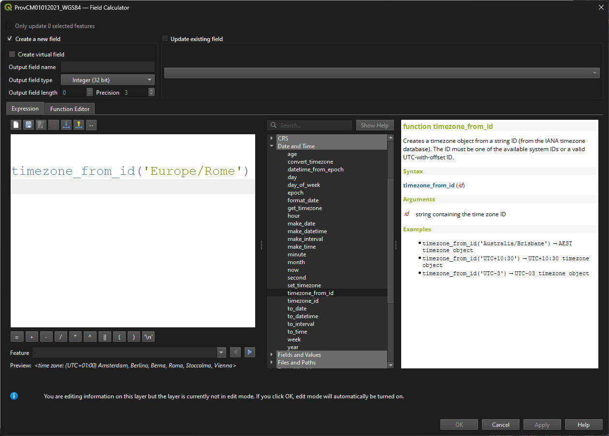

This feature was funded by [North Road](https://north-road.com/)

This feature was developed by [North Road](https://north-road.com/)

## Digitising

### Feature: Bézier maptool

New GUI controls for part digitization using NURBS curves are provided
by adding the "poly-bézier" / "freeform" curve mode, which uses anchors
and handles to control curve shape in a manner similar to many graphic
design tools.  
Users can click and drag ot add a point with handles, and reset handles
on a point using `alt+click`.

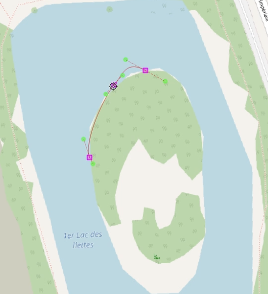

This feature was funded by Stadt Frankfurt am Main and Oslandia

This feature was developed by [Loïc
Bartoletti](https://github.com/lbartoletti)

### Feature: Add area and total length/perimeter CAD dock floater values

New floater values are provided on the advanced digitizing CAD Tools
interface, providing the option to show area and total length/perimeter
values using Cartesian or Ellipsoidal calculations based on user
selection (note that CAD tools uses Cartesian coordinates for
digitization, which may result in differences between the displayed
ellipsoidal values).

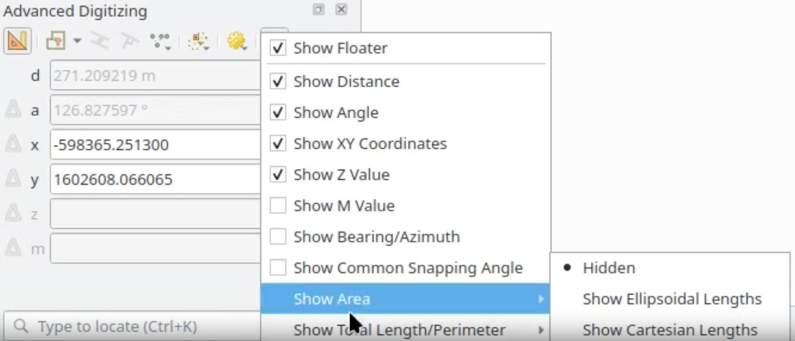

This feature was funded by [QGIS Danish User Group](https://qgis.dk/)

This feature was developed by [North Road](https://north-road.com/)

### Feature: Add Maptool to handle chamfer and fillet of polygons

A new digitizing Maptool allows users to chamfer or fillet polygons.  
Development supported by:

- Stadt Frankfurt am Main
- Oslandia

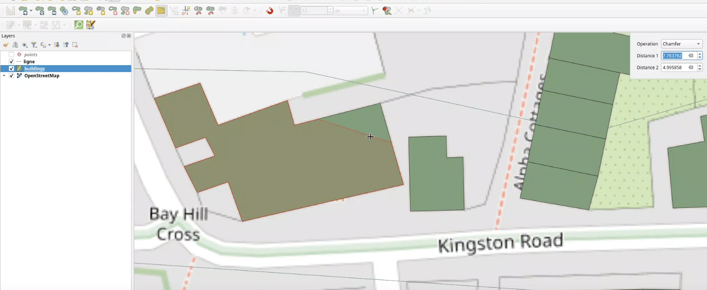

This feature was funded by Stadt Frankfurt am Main

This feature was developed by [Benoit D.-M. -
oslandia](https://github.com/benoitdm-oslandia)

## Data Management

### Feature: Enhanced COG support for raster exports

The Raster Exports and Save dialogs now support explicit options to
specify that the output should be exported with Cloud Optimized GeoTiff
optimization, with additional COG-specific pyramid features, including
improvements for:

- progress reporting
- error handling
- pyramid generation operations

Note that this requires GDAL \>= 3.13.0

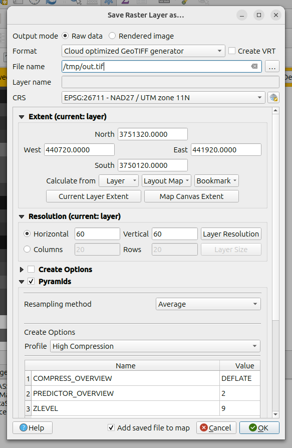

This feature was funded by QGIS Anwendergruppe Deutschland

This feature was developed by [Even Rouault](https://github.com/rouault)

### Feature: Copy raw attribute values

QGIS now makes the raw (original) attribute values visible and copyable
in both Attribute tables and the Identify Result interface.  
In previous versions, data values were copied only in their
"represented" form, i.e., the values that are evaluated by locale
settings, expressions, or display values (e.g, foreign key values).  
The new "Copy Raw Cell Content" option, available from the context menu,
will copy literal values from the source data to the clipboard.

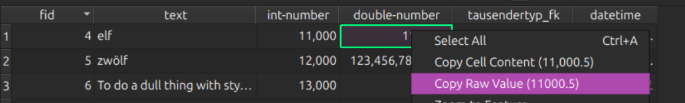

This feature was funded by Ct. Solothurn

This feature was developed by [signedav](https://github.com/signedav)

### Feature: Allow storing Comments in QGIS Projects stored in PostgreSQL

QGIS projects stored in PostgreSQL can now include comments with
additional information, which is displayed in the browser using a
Tooltip.

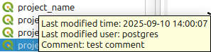

This feature was funded by Ocean Winds

This feature was developed by [Jan Caha](https://github.com/JanCaha)

### Feature: Allow named layers as temporary output

This functionality allows the user to name a temporary output layer that
is the result of a processing algorithm. The fact that the layer is
temporary is identifiable by the temporary icon (memory chip) displayed
before the user defined layer name.

This feature was funded by QGIS DK user group

This feature was developed by [Jan Caha](https://github.com/JanCaha)

### Feature: Possibility to change the layer name in the layer panel when saving a scratch layer

When saving a scratch layer as a permanent layer with a new name (a
different file name than the name in the layer panel), a message bar is
shown. In this message bar, the user can choose to automatically change
the name in the layer panel to the new layer name.  
This message bar is only shown if the layer is saved with a new name,
and currently, this only works for some filetypes (it works for
geopackages but not for shapefiles).

This feature was funded by QGIS DK user group

This feature was developed by [Jan Caha](https://github.com/JanCaha)

### Feature: Suggest a file name when exporting layer or group as layer definition file

When saving a layer or a layer group as a layer definition file (.qlr),
the filename field was left empty by default. QGIS now populates the
name of the layer or group as a suggestion for the filename to reduce
friction for style exports.

This feature was developed by [pgipper](https://github.com/pgipper)

## Forms and Widgets

### Feature: Add the ability to preview the attributes form within the vector layer properties dialog

QGIS now provides the ability to preview an attributes form while
configuring it within the vector layer properties dialog.

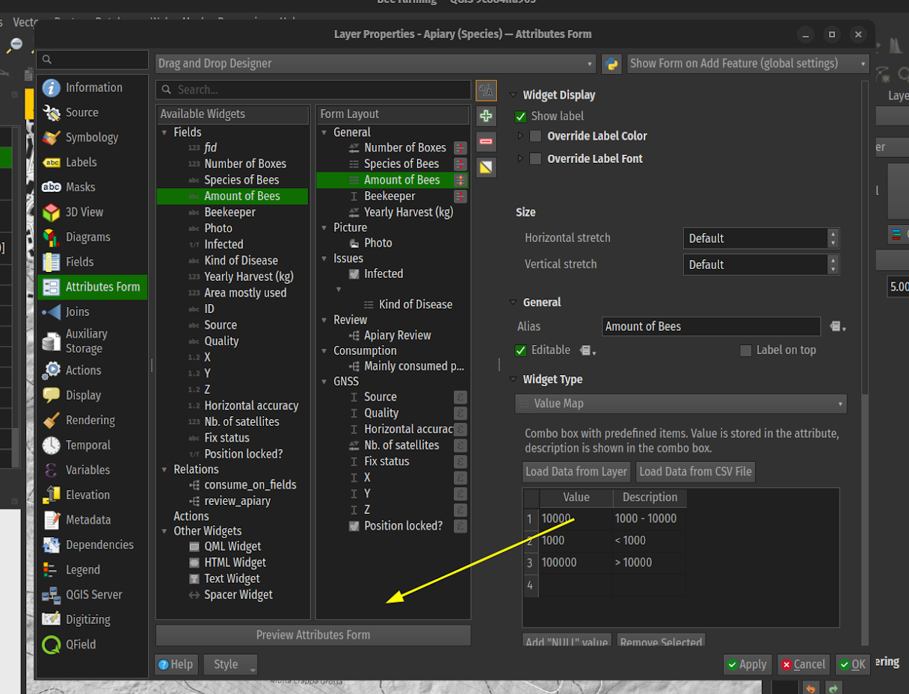

This feature was developed by [Mathieu
Pellerin](https://github.com/nirvn)

### Feature: Refine reuse of last value and introduce remembrance toggle

QGIS Attribute Forms now include an enhanced user experience for
handling the reuse of "last captured" values in forms. A pin icon on
forms will give users visual feedback on whether a field's value will be
remembered and reused, and provide an active toggle to control whether
it should continue to be reused. Additional enhancements to the form
configuration allow session-level reuse policies to be set, the default
behavior for reuse policies (enabled/disabled), and the ability to
disable reuse policies across all fields in a layer.

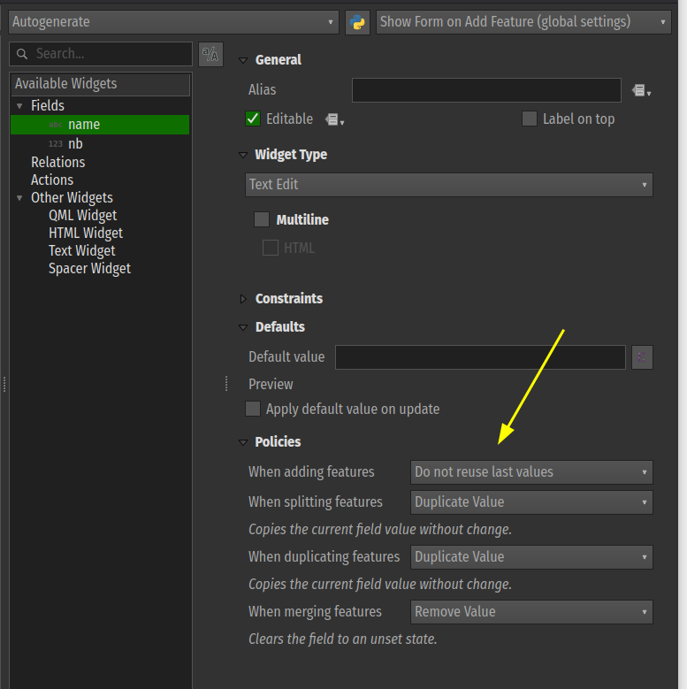

This feature was funded by Funded by DB Fahrwegdienste GmbH

This feature was developed by [Mathieu
Pellerin](https://github.com/nirvn)

## Layer Legend

### Feature: Add control over whether layers are included in automatic print layout legends

A new setting has been added in the layer properties legend tab (for
vector, raster, mesh, and point cloud layers) for "Include automatically
in print layout legend items". This setting is checked by default. Users
must uncheck to exclude that layer from print layout legends.  
This has also been added to the legend page for mesh and point cloud
layers, with the generic setting for controlling embedded legend
widgets.

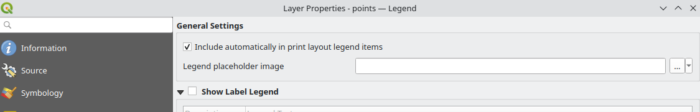

This feature was funded by [QGIS Danish User Group](https://qgis.dk/)

This feature was developed by [North Road](https://north-road.com/)

### Feature: Custom Elevation Profile Sources

QGIS now includes more powerful interactive behaviors for Elevation
Profiles, including changing the layer visibility and rendering order on
related canvases and linking the project layer tree to the profile plot
sources.  
This functionality is enabled by the introduction of the
`QgsLayerTreeCustomNode` class, which enables the representation of
application objects (other than layers and groups) in QGIS layer trees.

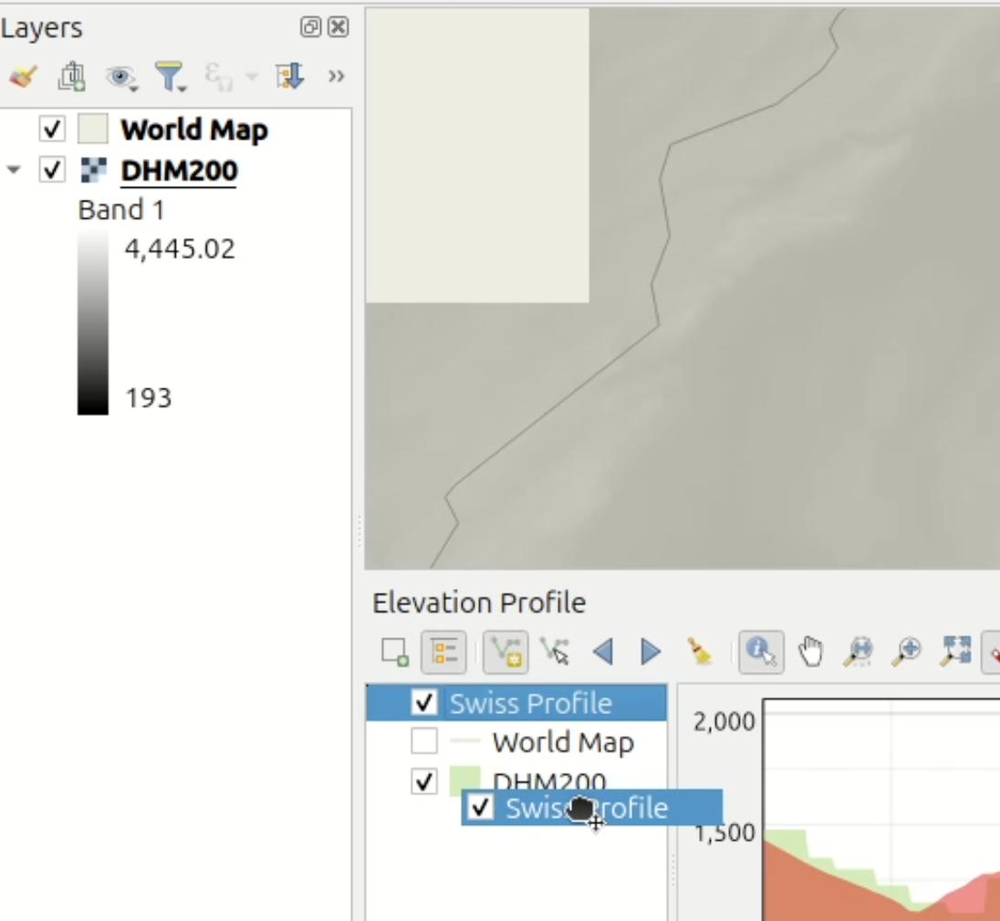

This feature was funded by [the QGIS user group
Switzerland](https://qgis.ch/)

This feature was developed by [Germap](https://github.com/gacarrillor)

## Processing

### Feature: Native polygon orientation algorithms

New algorithms for **Force polygons clockwise** (`native:forcecw`) and
**Force polygons counter-clockwise** (`native:forceccw`) have been added
to processing algorithms.  
Force polygons clockwise replicates the existing "Force right-hand-rule"
operation, and forces polygon geometries to respect the convention where
the exterior ring is oriented in a clockwise direction and the interior
rings in a counter-clockwise direction.  
Force polygons counter-clockwise performs the inverse, and forces
polygon geometries to respect the convention where the exterior ring is
oriented in a counter-clockwise direction and the interior rings in a
clockwise direction.

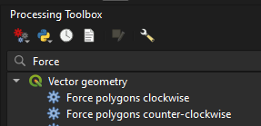

This feature was developed by [Andrea
Giudiceandrea](https://github.com/agiudiceandrea)

### Feature: Configure model components using an inline panel instead of modal dialogs

A new configuration panel has been added, docked to the right-hand side
of the Processing model designer, which allows editing of model
components without the modal dialogs, and replicating the user
experience from the Layer Styling Panel. This improves the UX for model
editing and prevents model configuration modals from blocking user
interaction with other QGIS elements while model components are being
edited. Users can still access the dialogs when double-clicking an item.

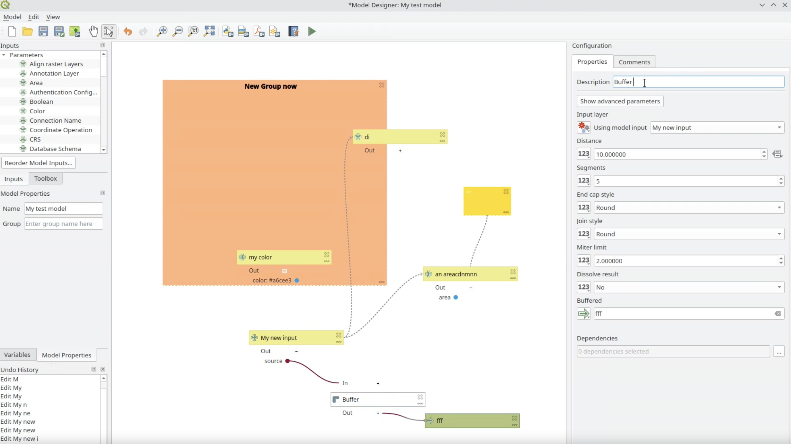

This feature was funded by [City of
Canning](https://www.canning.wa.gov.au/)

This feature was developed by [North Road](https://north-road.com/)

### Feature: Add network analysis validation algorithms

Two new algorithms useful for validating networks have been added:

- Validate network
- Extract network endpoints

**Validate network**  
This algorithm analyzes a network vector layer to identify data and
topology errors that may affect network analysis tools (like shortest
path). Optional checks include:

1.  Validating the 'Direction' field to ensure all direction field
    values in the input layer match the configured forward/backward/both
    values. Errors will be reported if the direction field value is
    non-null and does not match one of the configured values.
2.  Checking node-to-node separation. This check identifies nodes from
    the network graph that are closer to other nodes than the specified
    tolerance distance. This often indicates missed snaps or short
    segments in the input layer. In the case that a node violates this
    condition with multiple other nodes, only the closest violation will
    be reported.
3.  Checking node-to-segment separation: This check identifies nodes
    that are closer to a line segment (e.g. a graph edge) than the
    specified tolerance distance, without being connected to it. In the
    case that a node violates this condition with multiple other edges,
    only the closest violation will be reported.

Two layers are output by this algorithm:

1.  An output containing features from the original network layer that
    failed the direction validation checks.
2.  An output representing the problematic node locations with an
    'error' field explaining the error. This is a line layer, where the
    output features join the problematic node to the node or segment
    that failed the tolerance checks.

**Extract network endpoints**  
This algorithm extracts the endpoints (nodes) from a network line layer.
Two definitions are available for identifying endpoints:

1.  Nodes with only all incoming or all outgoing edges: Identifies
    'Source' or 'Sink' nodes based on the direction of flow. These are
    nodes where flow can start (only outgoing) or stop (only incoming).
2.  Nodes connected to a single edge: Identifies topological 'dead-ends'
    or 'dangles', regardless of directionality. This checks if the node
    is connected to only one other distinct node.

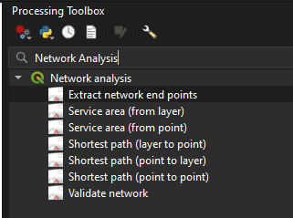

This feature was funded by [City of
Canning](https://www.canning.wa.gov.au/)

This feature was developed by [North Road](https://north-road.com/)

### Feature: Add feature preserving raster smoothing algorithm

This is a port of the Whitebox tool's equivalent algorithm, implementing
the logic described in Lindsay, John et al (2019): LiDAR DEM Smoothing
and the Preservation of Drainage Features.  
It is effective at removing surface roughness from DEM) without
significantly altering sharp features such as breaks-in-slope, stream
banks, or terrace scarps.  
This makes it superior to standard low-pass filters (e.g., mean, median,
Gaussian) or resampling, which often blur distinct topographic
features.  
The algorithm works in three steps:

1.  Calculating surface normal 3D vectors for each grid cell.
2.  Smoothing the normal vector field using a filter that applies more
    weight to neighbors with similar surface normals (preserving edges).
3.  Iteratively updating the elevations in the DEM to match the smoothed
    normal field.

This feature was funded by [North Road](https://north-road.com/)

This feature was developed by [North Road](https://north-road.com/)

### Feature: Add native raster gaussian blur algorithm

Allows applying a gaussian blur to a raster layer

This feature was funded by [North Road](https://north-road.com/)

This feature was developed by [North Road](https://north-road.com/)

### Feature: Add native total curvature algorithm from the terrain analysis library

Adds the Total curvature algorithm to Processing. The total curvature
filter has existed in the terrain analysis library for years, but it was
never exposed in the GUI. It is now exposed to the Processing framework
alongside the existing terrain analysis filters.

This feature was developed by [Alexander
Bruy](https://github.com/alexbruy)

### Feature: Expose NODATA and raster creation options for outputs in the terrain analysis tools

Expose output NODATA and raster creation options in the native raster
terrain analysis tools (slope, aspect, hillshade, ruggedness index).

This feature was developed by [Alexander
Bruy](https://github.com/alexbruy)

### Feature: Add Dataset Identification GDAL Processing Algorithm

A new Data Identification algorithm allows for the automated extraction
of metadata using GDAL.  
This algorithm requires GDAL \>= 3.13.0, as it uses the new capabilities
of [gdal dataset
identify](https://gdal--13506.org.readthedocs.build/en/13506/programs/gdal_dataset_identify.html).

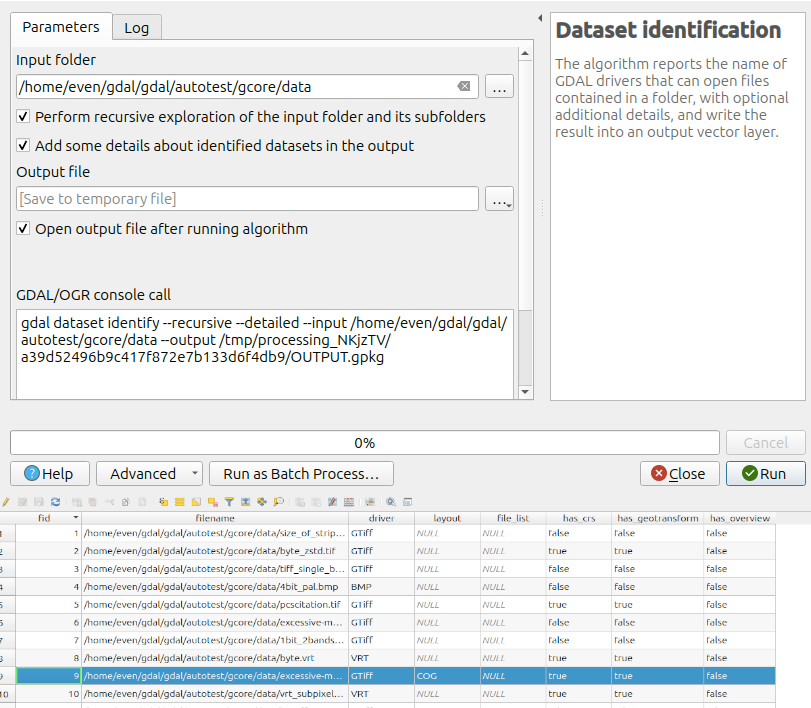

This feature was funded by QGIS Anwendergruppe Deutschland

This feature was developed by [Even Rouault](https://github.com/rouault)

### Feature: Add a way to specify the raster format in processing algorithm outputs

This feature allows specifying the output format for rasters using GDAL
configuration flags, primarily for enforcing Cloud Optimized GeoTiff
outputs.  
In previous versions, the output format was based on file format
extension, which breaks for COG since both GDAL GTiff and COG drivers
use the extension of `.tif/.tiff`. Users can now explicitly specify
`-of COG` to enforce COG exports.

This feature was funded by QGIS Anwendergruppe Deutschland

This feature was developed by [Even Rouault](https://github.com/rouault)

### Feature: Show the feature count flowing through a model inside the model designer

The long-requested ability to show the number of features flowing
through the model has been added. The number of features is attached to
the link going in and out between the algorithms, and it only applies to
vector layers. The display of the feature count can be disabled using
the "Show Feature Count" option in the view menu.  
Note: To be able to display the feature count, the model needs to be run
first at least once.

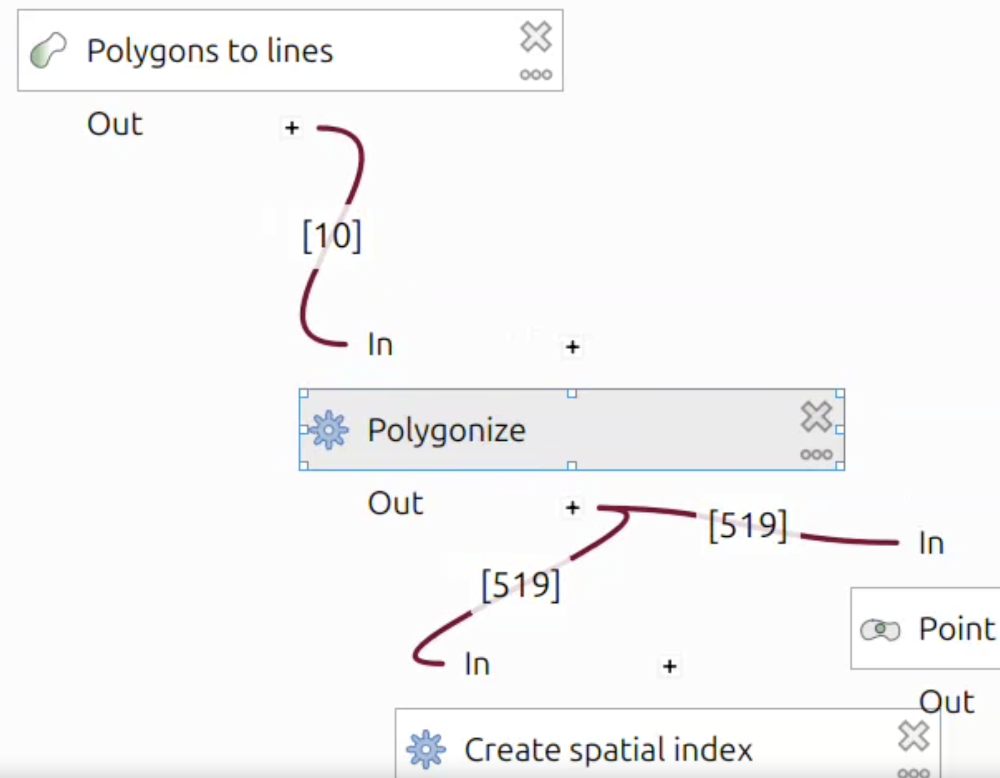

This feature was funded by the QGIS Switzerland user group

This feature was developed by [Valentin
Buira](https://github.com/ValentinBuira)

### Feature: support max-triangle-edge-length in PDAL Export to raster (TIN) algorithm

Support for max-triangle-edge-length parameter has been added to the
PDAL Export to raster (TIN) algorithm, so that triangles where the edge
length is bigger than the specified threshold can be ignored.  
This feature needs PDAL \>= 2.6.0 and wrench \>=1.2.2.

This feature was developed by [Alexander
Bruy](https://github.com/alexbruy)

### Feature: Model designer update

The QGIS Model Designer has had a significant update applied to the way
in which it handles the input and output values between nodes to provide
visual feedback in much more meaningful ways.  
Individual parameters for node configuration are now exposed, and the
connections between values from tools and variables are connected to
nodes at the specific parameters where they are input and output
accordingly.  
Parameter Values are color-coded by data type (including generic data
types like integer and string, but also complex QGIS-specific types such
as vector and raster layers), allowing for enhanced visual indexing and
traceability of data operations as they flow through the model.

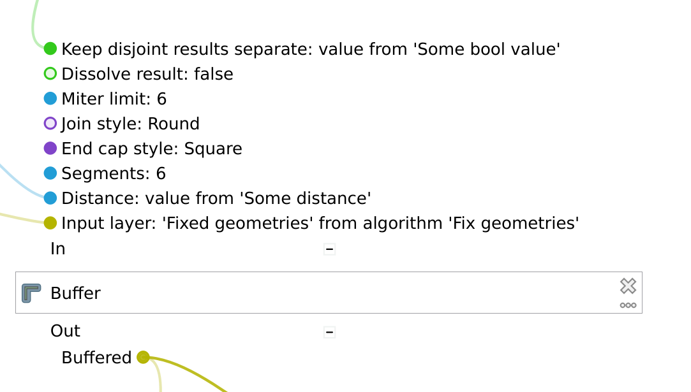

This feature was funded by camptocamp

This feature was developed by [Jonathan
Lurie](https://github.com/jonathanlurie)

### Feature: Allow Reproject Layer algorithm to transform Z coordinates

An optional bool parameter to the *Reproject layer* algorithm has been
added that allows for the transformation of Z coordinates.

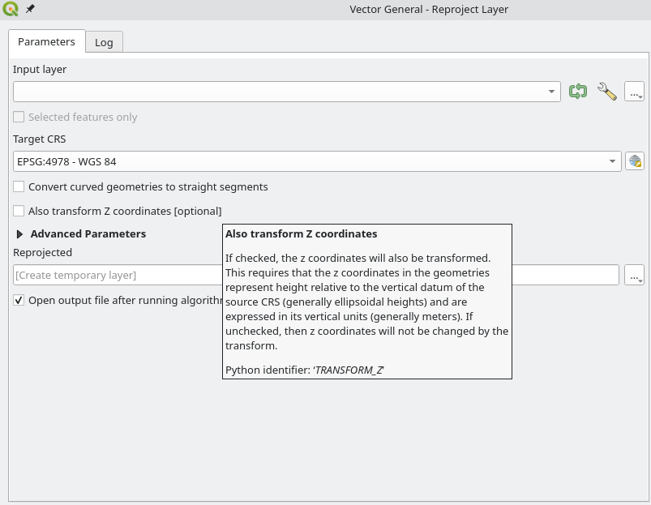

This feature was developed by [Stefanos
Natsis](https://github.com/uclaros)

### Feature: Add algorithm to create Cloud Optimized GeoTiffs from directory source

A new algorithm for Create Cloud Optimized GeoTIFF has been added that
allows the creation of COGs for a set of input raster files provided in
a dedicated folder and uses GDAL to perform a bulk conversion of the
input files.

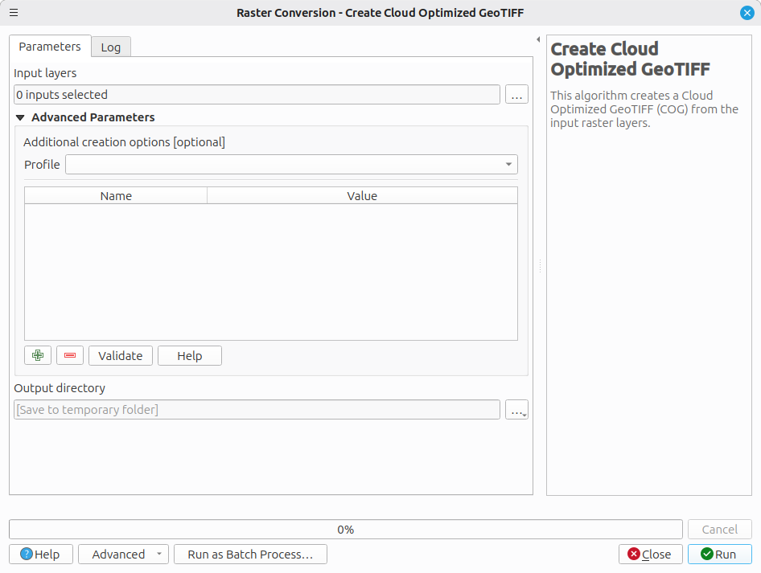

This feature was funded by Ocean Winds

This feature was developed by [Jan Caha](https://github.com/JanCaha)

### Feature: Add SFCGAL approximate medial axis processing algorithm

A new processing algorithm to approximate medial axis has been added
which is based on the newly integrated SFCGAL backend.  
The Approximate Medial Axis algorithm generates a simplified skeleton of
a shape by approximating its medial axis. The output is a collection of
lines that follow the central structure of the shape. The result is a
thin, stable set of curves that capture the main topology while ignoring
noise. This algorithm ignores the Z dimensions. If the geometry is 3D,
the approximate medial axis will be calculated from its 2D projection.

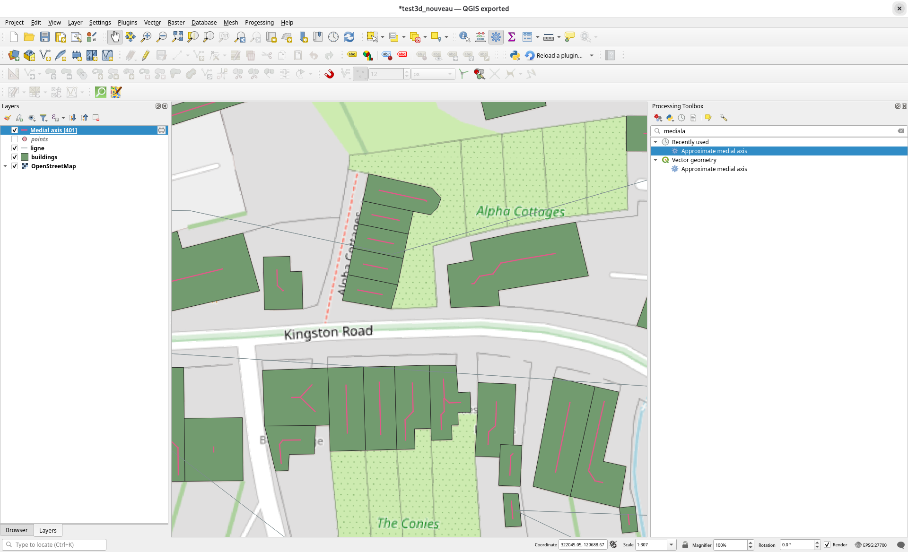

This feature was funded by Stadt Frankfurt am Main

This feature was developed by [Jean Felder](https://github.com/ptitjano)

### Feature: Scale and Resolution settings for WMS extraction

QGIS now enables Raster Extraction algorithms to work with WMSs
requested at a given scale, so that scale-dependent rendering
(symbology/labeling) is preserved in the output raster.  
The improved algorithms are `Clip raster by extent` and
`Clip raster by mask layer`.  
A new advanced options panel is provided on WMS layers when used as a
source in these algorithms, which provides options for:  
- **Reference scale**: The scale at which the WMS raster should be
requested/rendered.  
- **Service resolution**: The resolution (in DPI) used by the server to
render the WMS raster (by default 96 dpi).  
These changes were enabled by the introduction of the
`QgsProcessingRasterLayerDefinition` and `QgsWmsUtils` classes.

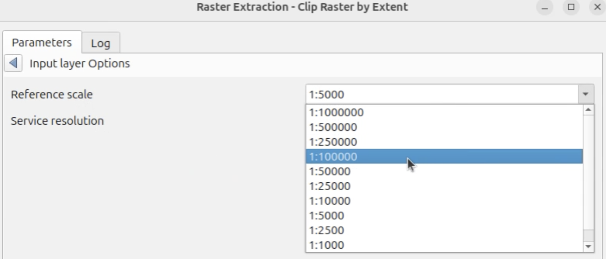

This feature was funded by [City of Frankfurt –
Stadtplanungsamt](https://www.stadtplanungsamt-frankfurt.de/about_us_5645.html)

This feature was developed by [Germap](https://github.com/gacarrillor)

### Feature: Add duplicate features output layer parameter to Delete duplicate geometries Algorithm

This feature extends the "Delete duplicate geometries" processing
algorithm so that the identified duplicate features that are deleted can
be extracted and saved as a distinct file for further analysis.

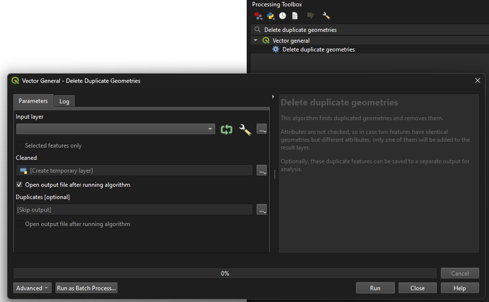

This feature was developed by [Andrea
Giudiceandrea](https://github.com/agiudiceandrea)

### Feature: Add algorithms to filter parts by length/area

These new algorithms, "Remove parts by length" and "Remove parts by
area", filter out parts of geometries from a vector layer by checking
their area or length against a minimum size parameter.  
If the input geometry is a multipart geometry, then the parts will be
filtered by their individual sizes. If no parts match the required
minimum size, then the feature will be skipped and omitted from the
output layer. If the input geometry is a singlepart geometry, then the
feature will be skipped if the geometry's size is below the required
size and omitted from the output layer. Attributes are not modified.

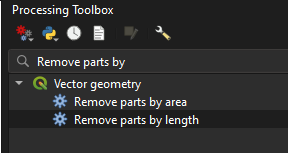

This feature was funded by [North Road](https://north-road.com/)

This feature was developed by [North Road](https://north-road.com/)

### Feature: Add optional destination CRS for Package Layers algorithm

Allows for layers to be transformed into a specific output CRS, if set.

This feature was funded by [North Road](https://north-road.com/)

This feature was developed by [North Road](https://north-road.com/)

### Feature: Package Layers algorithm - only export features intersecting a given extent

An optional parameter for `Extent` has been added to the Package Layers
algorithm, allowing users to only export features that intersect a given
extent from all the selected layers. If none of the features of a
specific selected layer intersect the given extent, the layer will still
be created and will be empty in the output GeoPackage.

This feature was funded by [City of Frankfurt –
Stadtplanungsamt](https://www.stadtplanungsamt-frankfurt.de/about_us_5645.html)

This feature was developed by [Germap](https://github.com/gacarrillor)

### Feature: Unlimited model canvas size in the model designer

Previous versions of the QGIS model designer had a fixed canvas size of
4000 x 4000, and new models were started at the top left of the canvas,
which could lead to frustration when elements went out of bounds. The
QGIS model builder will now dynamically manage the scroll area and
enable a much smoother user experience.

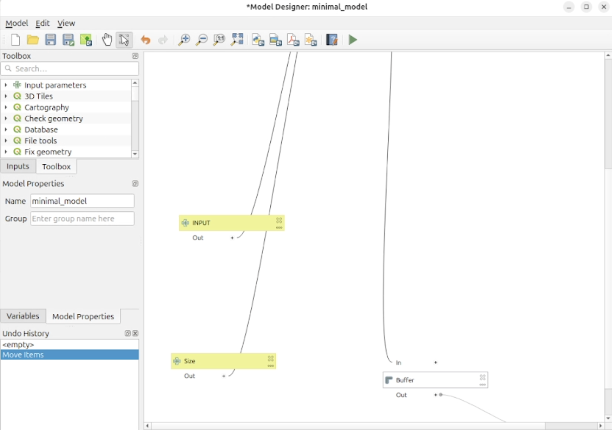

This feature was funded by Hauts-de-France region

This feature was developed by [Valentin
Buira](https://github.com/ValentinBuira)

## Application and Project Options

### Feature: OAuth2 auto refresh

QGIS now includes an auto-refresh mechanism for OAuth2 connections.  
A cache cleanup to stop the auto refresh is triggered periodically, and
when a layer is removed from the project. This is required to avoid
unnecessary, endless refreshing of unused tokens.

This feature was developed by [Alessandro
Pasotti](https://github.com/elpaso)

### Feature: Project trust for embedded code enhancement

QGIS now includes a project-level "trust" mechanism that grants or
denies execution of embedded Python code within projects. This is
implemented in line with the [Trusted Projects and Folders
QEP](https://github.com/qgis/QGIS-Enhancement-Proposals/blob/master/qep-336-trusted-projects-and-folders.md).  
As established in the QEP, the embedded code types covered are:

- macros;
- expression functions;
- actions; and
- attribute form init code

This gives users the ability to allow for granular code execution at the
project level instead of global settings limited only by user profile
configuration.  
QGIS will provide users with a project trust dialog to offer the user
generic information on what features to allow as well as preview code
accordingly. Global settings are provided to allow or deny execution of
features at project and path levels.

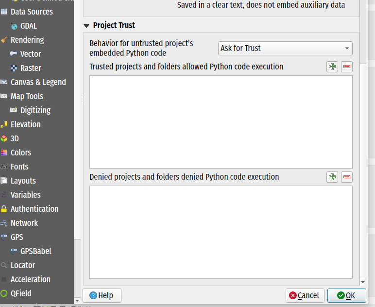

This feature was developed by [Mathieu
Pellerin](https://github.com/nirvn)

### Feature: Elevation Profile Manager

QGIS now links the app handling of elevation profiles to a new
project-level elevation profile manager. Now, elevation profiles stored
in the project can be reopened after opening a project, and changes made
to the profile will be stored in the project.  
There is also a fully functional elevation profile manager dialog, which
is able to display/rename/remove elevation profiles from the project.

This feature was funded by [Erftverband](https://www.erftverband.eu/)

This feature was developed by [North Road](https://north-road.com/)

### Feature: Project/layer metadata localization support

Translation support has been added for some key project and layer
metadata values to QGIS' project translation system. This enhancement
ensures that project translation can use the relevant metadata values
for layout items such as labels, map canvas decorations, etc.  
*This is funded through an ongoing effort to add support for
localized/translated projects into QField*

This feature was developed by [Mathieu
Pellerin](https://github.com/nirvn)

### Feature: Add project setting to enable HTML GetFeatureInfo maptip-only mode

A new project setting for QGIS Server is provided to enable HTML
GetFeatureInfo maptip-only mode.  
[This allows QGIS Server to use the WMS vendor
parameter](https://docs.qgis.org/3.40/en/docs/server_manual/services/wms.html#with-maptip)
`WITH_MAPTIP=HTML_FI_ONLY_MAPTIP` and use only the maptip for the HTML
GetFeatureInfo response.

This feature was developed by [Björn](https://github.com/pathmapper)

## Profile Plots

### Feature: Add option to sync elevation profile layers with project layers

This new option is available from an elevation profile's settings menu
as "Synchronize Layers to Project". It is unchecked by default, but when
checked, the elevation profile's layers will always exactly match the
project's main canvas layer structure, including groups and layer
orders.  
Groups cannot be created in the elevation profile. Any changes made to
the main project's layer tree will immediately be reflected in the
elevation profile's layer setup.

This feature was funded by [Lutra](https://www.lutraconsulting.co.uk/)

This feature was developed by [North Road](https://north-road.com/)

### Feature: Render point cloud as a continuous elevation line

QGIS profile plots now include the ability for the elevation profile of
a point cloud layer to be displayed as a continuous elevation line
instead of individual points, allowing point clouds to be rendered
similarly to vector or raster layers. Users can adjust the tolerance
setting to improve results when too few points are present within the
view, without triangulating the entire layer

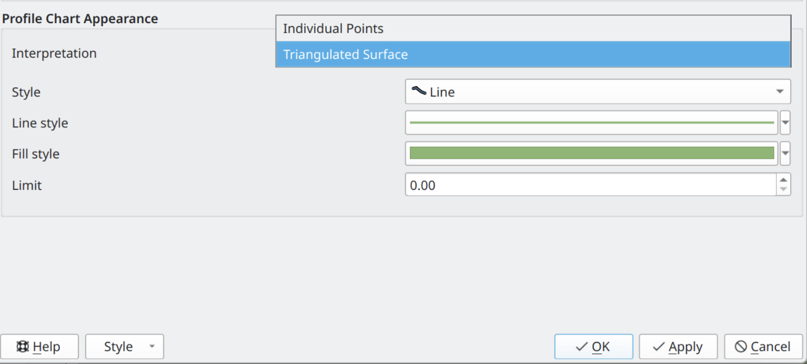

This feature was funded by [Danish Agency for Climate
Data](https://www.klimadatastyrelsen.dk/)

This feature was developed by [Dominik Cindric (Lutra
Consulting)](https://github.com/ViperMiniQ)

### Feature: Show distance:elevation scale ratio in profile settings menu

A new widget has been added for the displaying of the current
distance:elevation scale ratio for elevation profile plots. The widget
can also be used to set a specific ratio. If the "lock" option is
enabled for the plot, then this scale ratio will be used instead of the
default 1:1 ratio when zooming and navigating the plot.

This feature was funded by [Erftverband](https://www.erftverband.eu/)

This feature was developed by [North Road](https://north-road.com/)

## Browser

### Feature: Move multiple tables in Database to another Schema

Allow multiple tables to be moved into the specified schema at once.

This feature was funded by Ocean Winds

This feature was developed by [Jan Caha](https://github.com/JanCaha)

### Feature: Browser DB Table Comment

The QGIS Browser now includes the option to directly edit **Table
comment** for databases that support this functionality.

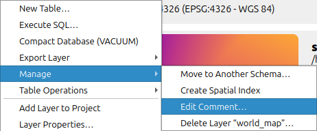

This feature was funded by Ocean Winds

This feature was developed by [Jan Caha](https://github.com/JanCaha)

### Feature: Add create or delete Spatial Index to the Manage menu in Browser

A new context menu option has been added to **create** or **delete**
Spatial Indexes on providers that support it.

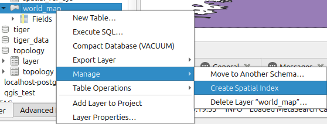

This feature was funded by Ocean Winds

This feature was developed by [Jan Caha](https://github.com/JanCaha)

## Data Providers

### Feature: Add support for GML as a feature format for OAPIF

The OGC API for Features source configuration now includes support for
GML outputs. Users may select it in the combo box in the "Modify WFS
Connection" dialog if the server exposes it as a feature format.  
Several scenarios are supported:

- Sources can be accessed with or without an XML schema available
  (through a rel=describedby link). As with WFS, the XML schema can be
  examined with the QGIS simple schema parser, or with GDAL GMLAS one,
  depending on the selected "Feature mode".
- Features can be retrieved with or without a bulk download link
  available (provided through a rel=enclosure link)

This feature was developed by [Even Rouault](https://github.com/rouault)

### Feature: Allow OAPIF users to select an alternate format than GeoJSON with which to download features

Feature Services served from OGC API for Features sources that honour
the `outputFormat` parameter in connection URIs should support
additional output formats for retrieving features (e.g., FlatGeoBuf,
GeoJSON, etc.). This allows users to select feature retrieval options
other than GeoJSON from sources that support it for improved
performance, compatibility, or extensibility according to their needs.  
In the service connection dialog, users can use the new combo box to
select their preferred output format. In addition, a new global setting
for configuring "lastFeatureFormatEncoding" allows the previously
defined value as the default for new connections.

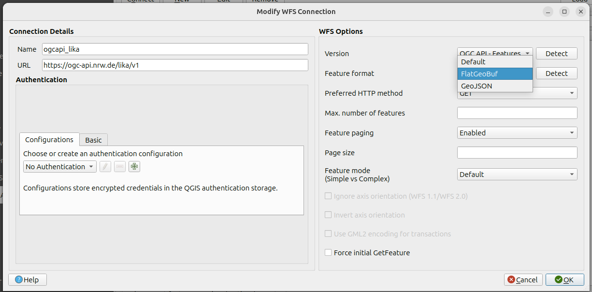

This feature was funded by QGIS Anwendergruppe Deutschland

This feature was developed by [Even Rouault](https://github.com/rouault)

### Feature: Allow update and delete for Field Domains in GPKG

New menu items allow users to update and delete Field Domains on GPKG
data sources. Requires GDAL \>= 3.12

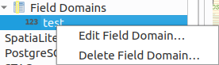

This feature was funded by Ocean Winds

This feature was developed by [Jan Caha](https://github.com/JanCaha)

### Feature: Save QGIS projects to PostgreSQL

QGIS now natively supports the ability to save the current QGIS project
to a PostgreSQL database, as well as import QGIS projects from a folder
into a PostgreSQL database.  
Two new menu entries for PostgreSQL connections are added:  
- One for saving the currently opened QGIS project directly to the
schema.  
- The second item allows batch import of QGIS projects to the schema.
Project names are checked for name collisions, and autoincrementing
suffix values (e.g. `_1`, `_2`, etc.) are added if the project name
already exists in the schema.

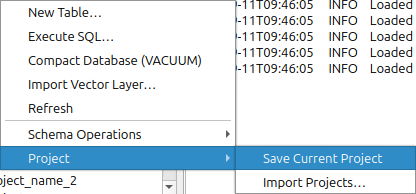

This feature was funded by Ocean Winds

This feature was developed by [Jan Caha](https://github.com/JanCaha)

### Feature: Add Layer Properties info to PostgreSQL provider

QGIS includes additional information in the **Layer Properties** for
PostgreSQL layers, including:

- Privileges for the user regarding the table
- Estimation of rows
- Information about spatial indexes

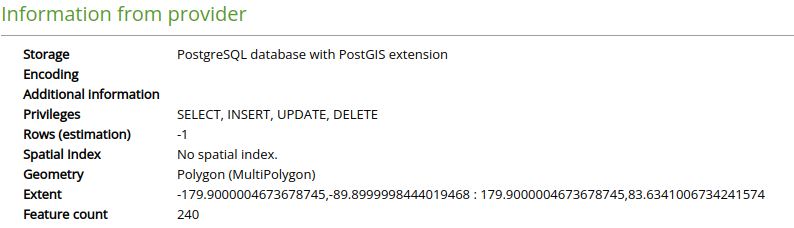

This feature was funded by Ocean Winds

This feature was developed by [Jan Caha](https://github.com/JanCaha)

### Feature: Add auth method for Planetary computer

A new auth method is provided for use with the Microsoft Planetary
Computer STAC catalog. The planetary computer requires using SAS sign
tokens to access most assets' data, something that was implemented on
the old STAC plugin but was missing from the core STAC implementation.  
There are two modes for the new auth method:  
- One is for the Open version of Planetary Computer, performing the SAS
signing for assets  
- The second is for Planetary Computer Pro GeoCatalogs, where, in
addition to the SAS signing of assets, an OAuth2 authentication is also
required  
The new auth method can be used with STAC connections, or applied
directly to individual gdal or point cloud layers whose data source is
on the planetary computer. When a layer is added from a STAC catalog or
directly using the data source manager, the `authcfg` will be appended
to its URI so QGIS will use that config for the network requests.
Authcfg encoding/decoding was also added to point cloud layers.

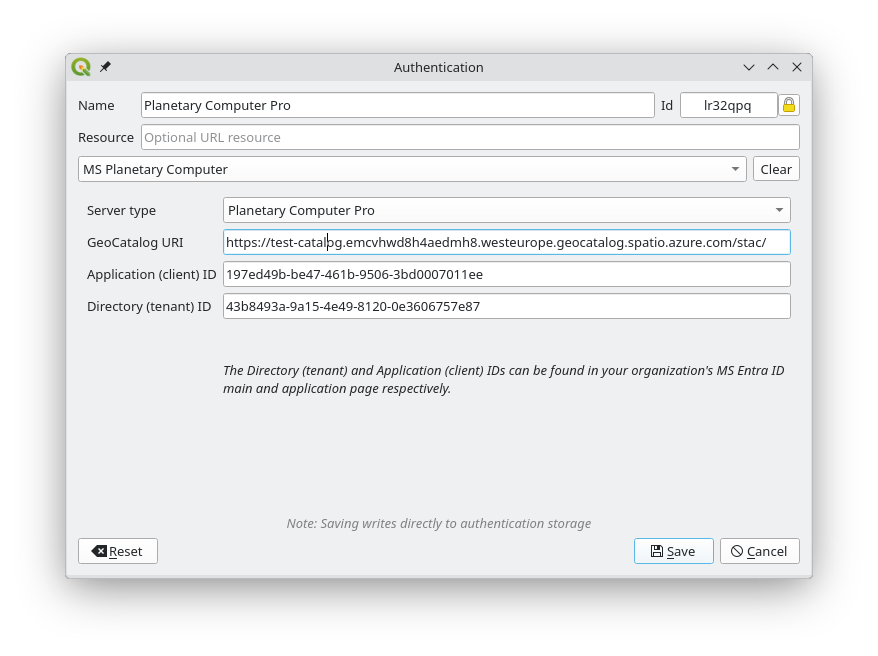

This feature was funded by Microsoft

This feature was developed by [Stefanos Natsis (Lutra
Consulting)](https://github.com/uclaros)

### Feature: QGIS Project Versioning in PostgreSQL

For QGIS Projects that leverage the new functionality to be stored
directly in PostgreSQL, automatic version control can be enabled, which
allows users to save, load, edit, and restore historic copies of their
project. The process is mostly handled by a function and a trigger
operation in the PostgreSQL Database, and multiple new menu items and
dialogs have been provided to allow users granular control over the
version management process.

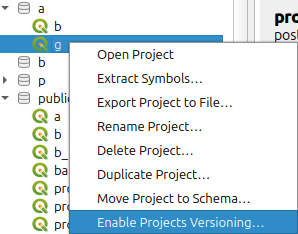

This feature was funded by Ocean Winds

This feature was developed by [Jan Caha](https://github.com/JanCaha)

## QGIS Server

### Feature: Try to reload invalid project layers

In QGIS Server, there is an option to ignore bad layers; however, layers
identified as bad may become available later on, such as a failed
network service that recovers (web server/ database, etc.).  
QGIS Server therefore has a new option for
`QGIS_SERVER_RETRY_BAD_LAYERS`. If this option is set to true, the
server checks upon each request if the bad layers are available again.
If a layer is available, it is marked as valid and will be used by the
server.

This feature was funded by Stadtwerke München (SWM)

This feature was developed by [mhugent](https://github.com/mhugent)

### Feature: Implement GetFeatureInfo for mesh layers

QGIS Server now provides responses for GetFeatureInfo requests on Mesh
Layers.

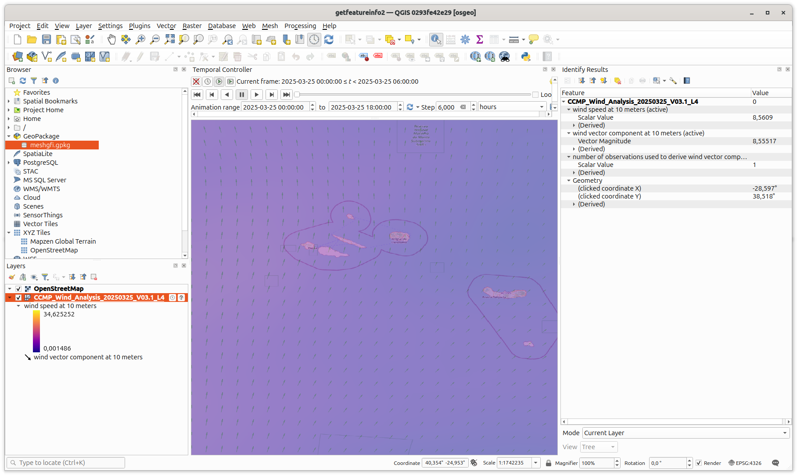

This feature was developed by [Jorge Gustavo
Rocha](https://github.com/jgrocha)

## Programmability

### Feature: Add support for area3D to QgsGeometry

The QgsGeometry Class is extended to include `area3D`, which is the
3-dimensional surface area of the geometry.

- For a Point or a LineString, it is always equal to 0.
- For a Polygon, it is equal to the 3D area of the exterior ring minus
  the 3d area of the interior rings.
- For a Polyhedral and a TIN, it is equal to the sum of the 3d areas of
  all its patches.
- For a GeometryCollection, it is equal to the sum of the 3d areas of
  all its geometries.

This feature was developed by [Jean Felder](https://github.com/ptitjano)

### Feature: Add support for 3d points in pointsAreCollinear method of QgsGeometryutils

Previous versions of the `QgsGeometryUtilsBase::pointsAreCollinear`
method only worked for 2D points; it has now been extended to support 2D
and 3D points and calls the corresponding `QgsGeometryUtilsBase`
function. A new `QgsGeometryUtilsBase::points3DAreCollinear` has also
been introduced, which works for 3D points.

This feature was funded by Stadt Frankfurt am Main\*\*

This feature was developed by [Jean Felder](https://github.com/ptitjano)

### Feature: Implement QgsVectorLayer.as_geopandas()

The PyQgis API now provides a method to natively convert QgsVectorLayer
objects to Geopandas dataframes, including the attributes. Note that
this requires the GeoPandas library as a dependency in the QGIS
Environment.

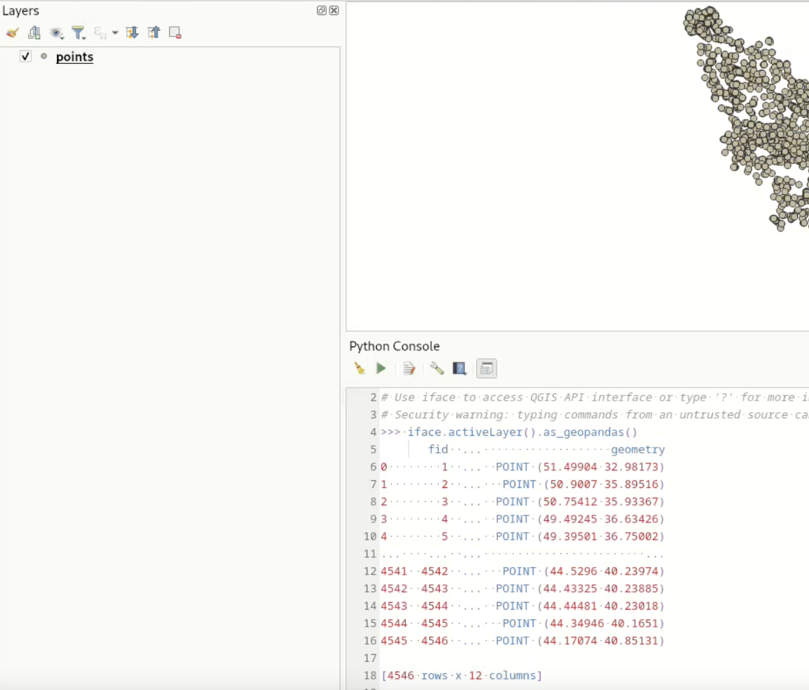

This feature was developed by [Till
Frankenbach](https://github.com/merydian)

### Feature: Expose 3D map tools to PyQgis API

Users can now create custom map tools to interact with the 3D map canvas
using the `Qgs3DMapTool` base class.

This feature was funded by [SIGNON Deutschland
GmbH](https://signon-group.com/en)

This feature was developed by [Stefanos
Natsis](https://github.com/uclaros)

### Feature: Expose 3D map canvas cross section mode to PyQgis API

The 3D *Cross section tool* functionality is now exposed to the PyQgis
API. One can now easily create and apply the four clipping planes to a
3D map view using Python and a 3D view's map coordinates.

This feature was funded by [SIGNON Deutschland
GmbH](https://signon-group.com/en)

This feature was developed by [Stefanos
Natsis](https://github.com/uclaros)

### Feature: Refactor ray casting and expose to PyQgis API

The duplicated `Ray3D` class has been removed in favor of `QgsRay3D`,
which has had missing methods added accordingly. The exposure of
`Qgs3DMapCanvas::castRay()` to the PyQgis API will effectively allow
Python plugins to perform ray casting in 3D map canvases and manage the
resulting hits.

This feature was funded by [SIGNON Deutschland
GmbH](https://signon-group.com/en)

This feature was developed by [Stefanos
Natsis](https://github.com/uclaros)

### Feature: TemplatedLineSymbolLayer to enable blank areas implementation

The QGIS API was extended to support the implementation of blank area
operations in line with [QEP
\#345](https://github.com/qgis/QGIS-Enhancement-Proposals/pull/345).

This feature was funded by Stadt Frankfurt am Main\*\*

This feature was developed by [Julien
Cabieces](https://github.com/troopa81)

### Feature: Port Hub distance algorithm to C++

The Processing Hub distance algorithm has been ported from Python to
C++.  
This algorithm replaces Distance to nearest hub (points) and Distance to
nearest hub (line to hub) algorithms as it produces two optional outputs
as these two algorithms. The original algorithms are marked as
deprecated.

This feature was developed by [Alexander
Bruy](https://github.com/alexbruy)

### Feature: Add support for SFCGAL library

Native support for SFCGAL, an advanced geometric computations library,
has been added to QGIS in line with [QEP
\#340](https://github.com/qgis/QGIS-Enhancement-Proposals/pull/340).  
This feature adds two primary additional classes to the QGIS API:  
- QgsSfcgalEngine: Exposes SFCGAL C API to QGIS. Also adds memory and
error management.  
- QgsSfcgalGeometry: Keeps a handle to SFCGAL geometry representation to
reduce geometry conversion between QGIS and SFCGAL  
Developed with support from:

- CEA/DAM
- CP4SC/France Relance/European Union
- Stadt Frankfurt am Main
- Oslandia
- OPENGIS.ch

This feature was developed by [Benoit D.-M. -
oslandia](https://github.com/benoitdm-oslandia)

## Notable Fixes

### Feature: Bug fixes by Alessandro Pasotti (QCooperative)

| Bug Title | URL issues.qgis.org (if reported) | URL Commit (Github) | 3.40 backport commit (GitHub) |
|----|----|----|----|
| QGIS Server won't render VRT in WMS requests | [\#64733](https://github.com/qgis/QGIS/issues/64733) | Not a bug: local issue with setting the environment |  |
| QGIS Server ignores MAP override when QGIS_PROJECT_FILE is set | [\#64723](https://github.com/qgis/QGIS/issues/64723) | Won't fix (not a bug) |  |
| Server: landingpage webapp only functions if built with server python plugins support | [\#64556](https://github.com/qgis/QGIS/issues/64556) | [PR \#64763](https://github.com/qgis/QGIS/pull/64763) | No |
| Raster calculator fails when OpenCL acceleration is turned on | [\#64574](https://github.com/qgis/QGIS/issues/64574) | [PR \#64779](https://github.com/qgis/QGIS/pull/64779) | No |
| Singleband Gray Shader should create 32 bit values not just 16 bit | [\#64560](https://github.com/qgis/QGIS/issues/64560) | Won't fix (not a bug) |  |
| Virtual raster provider memory leak - memory not released until QGIS closed | [\#64559](https://github.com/qgis/QGIS/issues/64559) | [PR \#64785](https://github.com/qgis/QGIS/pull/64785) | TODO |
| \[gdal\] Consider mask bands as a normal alpha band | [\#64642](https://github.com/qgis/QGIS/issues/64642) | [PR \#64795](https://github.com/qgis/QGIS/pull/64795) |  |
| Raster Attribute Table for S-102 does not display correctly | [\#64797](https://github.com/qgis/QGIS/issues/64797) | [PR \#64811](https://github.com/qgis/QGIS/pull/64811) | TODO |
| Arrow symbol layer data-defined properties not using defaults for NULL |  | [PR \#64680](https://github.com/qgis/QGIS/pull/64680), [PR \#64828](https://github.com/qgis/QGIS/pull/64828) |  |
| "Reuse last entered value" not applied when using PyQGIS | [\#64655](https://github.com/qgis/QGIS/issues/64655) | Won't fix (not a bug) |  |
| SpatiaLite provider returns wrong schema for views (caches columns from underlying joined tables instead of view definition) | [\#64742](https://github.com/qgis/QGIS/issues/64742) | [PR \#64902](https://github.com/qgis/QGIS/pull/64902) | TODO |
| Updated Canvas gives inconsistent Min / Max values and colour ranges for a local raster vs. the same raster in postgres | [\#64917](https://github.com/qgis/QGIS/issues/64917) | [PR \#64953](https://github.com/qgis/QGIS/pull/64953) | [PR \#64998](https://github.com/qgis/QGIS/pull/64998) |
| Bands get cleared after attribute table creation fails, causing rendering issues and crashes | [\#65040](https://github.com/qgis/QGIS/issues/65040) | [PR \#65052](https://github.com/qgis/QGIS/pull/65052) |  |
| \[ogr\]\[gpkg\] Fix wrong row count when attribute filter | [\#65067](https://github.com/qgis/QGIS/issues/65067) | [PR \#65097](https://github.com/qgis/QGIS/pull/65097) | No |
| \[ogr\] Add OGR_L_GetAttributeFilter | [\#65067](https://github.com/qgis/QGIS/issues/65067) | [PR \#14005](https://github.com/OSGeo/gdal/pull/14005) | N/A |
| visualizing GDAL raster with band scale and offset values will introduce very large histograms into the raster | [\#59461](https://github.com/qgis/QGIS/issues/59461) | [PR \#63294](https://github.com/qgis/QGIS/pull/63294) |  |
| Rendering of PostGIS rasters ignores Transparency NoData value setting | [\#63171](https://github.com/qgis/QGIS/issues/63171) | [PR \#63258](https://github.com/qgis/QGIS/pull/63258) | Yes |
| Add additional QStringLiteral entries to SQLite utils | [\#50553](https://github.com/qgis/QGIS/issues/50553) | [PR \#63105](https://github.com/qgis/QGIS/pull/63105) |  |
| 'Fixed Interval' and 'Pretty Breaks' Graduated Renderers don't work when field has all the same values | [\#63277](https://github.com/qgis/QGIS/issues/63277) | [PR \#63298](https://github.com/qgis/QGIS/pull/63298) |  |
| Identify Features tool ignores Transparency NoData value setting on PostGIS rasters | [\#63133](https://github.com/qgis/QGIS/issues/63133) | [PR \#63321](https://github.com/qgis/QGIS/pull/63321) |  |
| Raise warning when trying to modify read-only layer with field calculator | [\#63111](https://github.com/qgis/QGIS/issues/63111) | [PR \#63337](https://github.com/qgis/QGIS/pull/63337) |  |
| QGIS Server does not list one layer in WMS GetCapabilities if datum transformation is used | [\#61293](https://github.com/qgis/QGIS/issues/61293) | Cannot reproduce (again) |  |
| QGIS Server Layer(s) not valid Exception with multiple projects using same WMS Layer | [\#62608](https://github.com/qgis/QGIS/issues/62608) | Cannot reproduce |  |
| Adjusting min/max cumulative count cuts for rasters in layer styling panel | [\#63075](https://github.com/qgis/QGIS/issues/63075) | Cannot reproduce (feedback) |  |
| Refresh layer at interval has no effect after loading project | [\#63007](https://github.com/qgis/QGIS/issues/63007) | [PR \#63389](https://github.com/qgis/QGIS/pull/63389) |  |
| Browser not showing CurvePolygons in LTR or Latest |  | [PR \#63404](https://github.com/qgis/QGIS/pull/63404) |  |
| Copy one style category and paste it collectively to multiple layers removes the settings of the other style categories | [\#63167](https://github.com/qgis/QGIS/issues/63167) | [PR \#63408](https://github.com/qgis/QGIS/pull/63408) |  |
| Value relation widget does excessive calls to PostGIS database | [\#63410](https://github.com/qgis/QGIS/issues/63410) | [PR \#63418](https://github.com/qgis/QGIS/pull/63418) |  |
| Adding a network file vector layer ends with a lot of server calls for the same data | [\#63407](https://github.com/qgis/QGIS/issues/63407) | Cannot reproduce (feedback) |  |
| Sld export error with expression based labels | [\#63402](https://github.com/qgis/QGIS/issues/63402) | [PR \#63419](https://github.com/qgis/QGIS/pull/63419) |  |
| Selective pasting style does not change the ‘Automatically insert into print layout legend elements’ setting in raster layers | [\#63346](https://github.com/qgis/QGIS/issues/63346) | [PR \#63430](https://github.com/qgis/QGIS/pull/63430) |  |
| Value Relation with current_value() not updating when changes made outside of the attribute form | [\#63448](https://github.com/qgis/QGIS/issues/63448) | [PR \#63468](https://github.com/qgis/QGIS/pull/63468) |  |
| @current_feature VS @feature | [\#63488](https://github.com/qgis/QGIS/issues/63488) | Not a code bug (maybe documentation) |  |
| Qgis Desktop does not honor layer order in get capabilites in external wms | [\#62918](https://github.com/qgis/QGIS/issues/62918) | [PR \#63492](https://github.com/qgis/QGIS/pull/63492) |  |
| Using "Subset filter" from the "Execute SQL" dialog is not applied | [\#62542](https://github.com/qgis/QGIS/issues/62542) | [PR \#63605](https://github.com/qgis/QGIS/pull/63605) |  |
| SQL editor allow undo after clear | [mail thread](https://lists.osgeo.org/pipermail/qgis-developer/2025-October/067839.html) | [PR \#63621](https://github.com/qgis/QGIS/pull/63621) |  |

This feature was funded by [QGIS.ORG (through donations and sustaining
memberships)](https://qgis.org/)

This feature was developed by [Alessandro Pasotti
(QCooperative)](https://www.qcooperative.net/)

### Feature: Bug fixes by Even Rouault (Spatialys)

| Bug Title | URL issues.qgis.org (if reported) | URL Commit (Github) | 3.40 backport commit (GitHub) |
|----|----|----|----|
| qgis/gdal garbage collection causes segfault | [\#58724](https://github.com/qgis/QGIS/issues/58724) | [PR \#64766](https://github.com/qgis/QGIS/pull/64766) | No |
| NetCDF with EPSG:3416 misaligned is latest qgis ltr | [\#64873](https://github.com/qgis/QGIS/issues/64873) | [PR \#13886](https://github.com/OSGeo/gdal/pull/13886) | N/A |
| Bug in QgsVectorFileWriter when providing the name of the FID field | [\#63320](https://github.com/qgis/QGIS/issues/63320) | [PR \#64878](https://github.com/qgis/QGIS/pull/64878) | [PR \#64903](https://github.com/qgis/QGIS/pull/64903) |
| QgsVectorFileWriter: fix writing NurbsCurve to OGR, by converting them to LineString | Unreported | [PR \#64906](https://github.com/qgis/QGIS/pull/64906) | N/A |
| Build issue on NixOS | [\#64937](https://github.com/qgis/QGIS/issues/64937) | Invalid |  |
| Float16 rasters do not render correctly | [\#64923](https://github.com/qgis/QGIS/issues/64923) | [PR \#64990](https://github.com/qgis/QGIS/pull/64990) | [PR \#65024](https://github.com/qgis/QGIS/pull/65024) |
| building master in pkgsrc; mostly ok! | [mail thread](https://lists.osgeo.org/pipermail/qgis-developer/2026-February/068072.html) | Not a bug |  |
| Rasters with GCPs and overviews render incorrectly when zoomed out | [\#65011](https://github.com/qgis/QGIS/issues/65011) | [PR \#13968](https://github.com/OSGeo/gdal/pull/13968) | N/A |
| Huge Performance Regression using VRTs on Versions \> 3.40.6 | [\#63293](https://github.com/qgis/QGIS/issues/63293) | [PR \#13116](https://github.com/OSGeo/gdal/pull/13116) | N/A (GDAL fix) |
| Problème lecture shapefile | [\#63787](https://github.com/qgis/QGIS/issues/63787) | [PR \#4599](https://github.com/OSGeo/PROJ/pull/4599) | N/A (PROJ fix) |
| USE_PRECOMPILED_HEADERS related issue | [mail thread](https://lists.osgeo.org/pipermail/qgis-developer/2025-November/067871.html) | [PR \#63794](https://github.com/qgis/QGIS/pull/63794) | [PR \#63811](https://github.com/qgis/QGIS/pull/63811) |
| Crash trying to open a shapefile | [\#63826](https://github.com/qgis/QGIS/issues/63826) | [PR \#13350](https://github.com/OSGeo/gdal/pull/13350) | N/A (GDAL fix) |
| Replace all remaining uses of connect(,SIGNAL,,SLOT) in src/ | Unreported | [PR \#63832](https://github.com/qgis/QGIS/pull/63832) | N/A |
| Crash with invalid WMS/WMTS source | [\#62372](https://github.com/qgis/QGIS/issues/62372) | [PR \#63833](https://github.com/qgis/QGIS/pull/63833) | [PR \#64016](https://github.com/qgis/QGIS/pull/64016) |
| JSON column from GeoPackage is not read correctly | [\#62377](https://github.com/qgis/QGIS/issues/62377) | No longer reproducible / likely fixed |  |
| Fix build warnings on Fedora | Unreported | [PR \#63910](https://github.com/qgis/QGIS/pull/63910) | N/A |
| Fix cppcheck missingOverride and functionConst warnings | Unreported | [PR \#63913](https://github.com/qgis/QGIS/pull/63913) | N/A |
| \[CI\] Port OGC tests to ubuntu:25.10 Qt6 | Unreported | [PR \#64135](https://github.com/qgis/QGIS/pull/64135) | N/A |

This feature was funded by [QGIS.ORG (through donations and sustaining
memberships)](https://qgis.org/)

This feature was developed by [Even Rouault
(Spatialys)](https://www.spatialys.com/)

### Feature: Bug fixes by Julien Cabieces (Oslandia)

| Bug Title | URL issues.qgis.org (if reported) | URL Commit (Github) | 3.40 backport commit (GitHub) |
|----|----|----|----|
| pyqt5_to_pyqt6.py: Some known incompatibilities do not lead to error exit code | [\#62559](https://github.com/qgis/QGIS/issues/62559) | [PR \#63526](https://github.com/qgis/QGIS/pull/63526) | No |
| \[PyQt5_to_PyQt6\] Fix all imports coming from Qt module | Unreported | [PR \#63565](https://github.com/qgis/QGIS/pull/63565) |  |
| QgsLayoutExporter.exportToPdf() does not have the same return value type if an iterator is passed or not | [\#62501](https://github.com/qgis/QGIS/issues/62501) | Won't fix? |  |
| Broken themes in geospatial PDF | [\#62014](https://github.com/qgis/QGIS/issues/62014) | [PR \#63580](https://github.com/qgis/QGIS/pull/63580) | TODO |
| pyqt5_to_pyqt6.py produces broken syntax for imports | [\#64185](https://github.com/qgis/QGIS/issues/64185) | [PR \#64926](https://github.com/qgis/QGIS/pull/64926) | [PR \#64941](https://github.com/qgis/QGIS/pull/64941) |
| pyqt5_to_pyqt6.py does not catch "from PyQt5 import QtWidgets" etc | [\#63711](https://github.com/qgis/QGIS/issues/63711) | [PR \#64930](https://github.com/qgis/QGIS/pull/64930) | [PR \#64939](https://github.com/qgis/QGIS/pull/64939) |
| The "Session Role" function is not applied to loaded layers | [\#62930](https://github.com/qgis/QGIS/issues/62930) | Already fixed |  |
| set session role not working on creation of tables and schema | [\#63866](https://github.com/qgis/QGIS/issues/63866) | Failed to reproduce |  |
| Layout export to GeoPDF: incorrect layers' order when a "PDF Group" is set | [\#63475](https://github.com/qgis/QGIS/issues/63475) | [PR \#64983](https://github.com/qgis/QGIS/pull/64983) | TODO |
| pyqt5_to_pyqt6.py: Some suggestions reference wrong class | [\#64462](https://github.com/qgis/QGIS/issues/64462) | [PR \#64989](https://github.com/qgis/QGIS/pull/64989) | TODO |
| \[GeoPdfExport\] Avoid map theme contaminate non-map-theme items | Reported directly without issue | [PR \#65008](https://github.com/qgis/QGIS/pull/65008) | [PR \#65108](https://github.com/qgis/QGIS/pull/65108) |

This feature was funded by [QGIS.ORG (through donations and sustaining
memberships)](https://qgis.org/)

This feature was developed by [Julien Cabieces
(Oslandia)](https://oslandia.com/en/)

### Feature: Bug Fixes by Denis Rouzaud (OPENGIS)

| Bug Title | URL issues.qgis.org (if reported) | URL Commit (Github) | 3.40 backport commit (GitHub) |
|----|----|----|----|
| Attribute table forced to be dockable and non modal - Crash several times | [\#62416](https://github.com/qgis/QGIS/issues/62416) | [PR \#64954](https://github.com/qgis/QGIS/pull/64954) | [PR \#64954](https://github.com/qgis/QGIS/pull/64954) |
| \- | \- | [PR \#65055](https://github.com/qgis/QGIS/pull/65055) | ? |
| With composite foreign keys, all widgets are configured by default | [\#32048](https://github.com/qgis/QGIS/issues/32048) | [PR \#65059](https://github.com/qgis/QGIS/pull/65059) | no |

This feature was funded by [QGIS.ORG (through donations and sustaining
memberships)](https://qgis.org/)

This feature was developed by [Denis Rouzaud
(OPENGIS)](https://opengis.ch/)

### Feature: Bug Fixes by Germán Carrillo (OPENGIS)

| Bug Title | URL issues.qgis.org (if reported) | URL Commit (Github) | 3.40 backport commit (GitHub) |
|----|----|----|----|
| Project functions in editor, save doesn't really save...? | [\#62752](https://github.com/qgis/QGIS/issues/62752) | [PR \#63425](https://github.com/qgis/QGIS/pull/63425) |  |
| Diagram properties related to variables and expressions are not saved | [\#62936](https://github.com/qgis/QGIS/issues/62936) | [PR \#63479](https://github.com/qgis/QGIS/pull/63479) |  |
| Crash in layer styling panel when closing a project if DD Property Assistant is open | Unreported | [PR \#63549](https://github.com/qgis/QGIS/pull/63549) |  |
| QGIS crashes when opening print layout | [\#64218](https://github.com/qgis/QGIS/issues/64218) | [PR \#64813](https://github.com/qgis/QGIS/pull/64813) | N/A |
| Fix custom node initialization for custom elevation profiles | [\#65058](https://github.com/qgis/QGIS/issues/65058) | [PR \#64762](https://github.com/qgis/QGIS/pull/64762) | N/A |
| Diagrams: histograms with only negative values don't render | [\#63980](https://github.com/qgis/QGIS/issues/63980) | [PR \#64992](https://github.com/qgis/QGIS/pull/64992) | [PR \#65211](https://github.com/qgis/QGIS/pull/65211) |
| Attributes Form is not the same when called via GUI or when called via PyQGIS | [\#65010](https://github.com/qgis/QGIS/issues/65010) | Not a bug |  |
| Layers added using a .qlr file cannot be added to an open Elevation Profile View | [\#58533](https://github.com/qgis/QGIS/issues/58533) | Already fixed |  |
| Group title not updated in .qgs | [\#65085](https://github.com/qgis/QGIS/issues/65085) | Invalid bug, issue related to a plugin |  |

This feature was funded by [QGIS.ORG (through donations and sustaining
memberships)](https://qgis.org/)

This feature was developed by [Germán Carrillo
(OPENGIS)](https://opengis.ch/)

### Feature: Bug Fixes by Till Frankenbach (OPENGIS)

| Bug Title | URL issues.qgis.org (if reported) | URL Commit (Github) | 3.40 backport commit (GitHub) |
|----|----|----|----|
| Tabbing to start of custom formatted Date/Time field in attribute form not working | [\#65022](https://github.com/qgis/QGIS/issues/65022) | [PR \#65023](https://github.com/qgis/QGIS/pull/65023) |  |
| Plugin manager shows changelog of current version, even for upgradable plugins | [\#64792](https://github.com/qgis/QGIS/issues/64792) | tbd |  |
| QGIS does not request default style for WMS layer when in group/container | [\#63754](https://github.com/qgis/QGIS/issues/63754) | [PR \#65081](https://github.com/qgis/QGIS/pull/65081) |  |
| Several issues with a temporal WMS (only one image is displayed using the Temporal Controller) I | [\#64099](https://github.com/qgis/QGIS/issues/64099) | [PR \#64925](https://github.com/qgis/QGIS/pull/64925) |  |
| Several issues with a temporal WMS (only one image is displayed using the Temporal Controller) II | [\#64099](https://github.com/qgis/QGIS/issues/64099) | [PR \#64863](https://github.com/qgis/QGIS/pull/64863) |  |
| \[mvt\] WMS raster sources are not working | [\#61040](https://github.com/qgis/QGIS/issues/61040) | [PR \#65087](https://github.com/qgis/QGIS/pull/65087) |  |
| Add unit tests for unzip function in pyplugin installer | Requested in [PR \#65051](https://github.com/qgis/QGIS/pull/65051) | [PR \#65119](https://github.com/qgis/QGIS/pull/65119) |  |
| Fix WMTS-T layers temporal capabilities resourceURL selection | [\#54043](https://github.com/qgis/QGIS/issues/54043) | [PR \#65190](https://github.com/qgis/QGIS/pull/65190) |  |
| Set selected section to the first section on focus in QgsDateTimeEdit | [\#65022](https://github.com/qgis/QGIS/issues/65022) | [PR \#65023](https://github.com/qgis/QGIS/pull/65023) |  |

This feature was funded by [QGIS.ORG (through donations and sustaining
memberships)](https://qgis.org/)

This feature was developed by [Till Frankenbach
(OPENGIS)](https://opengis.ch/)

### Feature: Bug fixes by Stefanos Natsis (LutraConsulting)

| Bug Title | URL issues.qgis.org (if reported) | URL Commit (Github) | 3.40 backport commit (GitHub) |
|----|----|----|----|
| 'Identify' function in a 'QgsMapToolIdentify' descendant crashes | [\#61372](https://github.com/qgis/QGIS/issues/61372) |  |  |
| VPC Virtual Point Cloud - Do not show the point cloud or really lately in Vue2D | [\#59793](https://github.com/qgis/QGIS/issues/59793) |  |  |
| Curl SSL error | [\#33](https://github.com/PDAL/wrench/issues/33) |  |  |
| VPC Virtual Point Cloud - Error when creating VPC from HTTPS/URI sources | [\#59802](https://github.com/qgis/QGIS/issues/59802) | [PR \#66](https://github.com/PDAL/wrench/pull/66) |  |
| LAS/LAZ file without CRS fails to load | [\#50438](https://github.com/qgis/QGIS/issues/50438) |  |  |
| PDAL prevents LAS/LAZ 1.4 from opening if global_encoding set as 1 | [\#51862](https://github.com/qgis/QGIS/issues/51862) |  |  |
| Fix 3d view shortcuts | Unreported | [PR \#63523](https://github.com/qgis/QGIS/pull/63523) |  |
| Fix zooming with right mouse button in 3D views | Unreported | [PR \#63537](https://github.com/qgis/QGIS/pull/63537) |  |
| Fix 3d point lights | Unreported | [PR \#63525](https://github.com/qgis/QGIS/pull/63525) |  |
| 3D map view does not update on layer filter changes | [\#62925](https://github.com/qgis/QGIS/issues/62925) | [PR \#63477](https://github.com/qgis/QGIS/pull/63477) | [PR \#63511](https://github.com/qgis/QGIS/pull/63511) |
| Fix 2d rendering of remote COPC files in virtual point clouds | [comment](https://github.com/qgis/QGIS/issues/59793#issuecomment-3351352812) | [PR \#63471](https://github.com/qgis/QGIS/pull/63471) |  |
| 3D Tiles in 3D View: Loading 2 tiles | [\#63340](https://github.com/qgis/QGIS/issues/63340) | [PR \#63469](https://github.com/qgis/QGIS/pull/63469) |  |
| 3.44.1 hangs after exporting 256 images of 3D animation | [\#62959](https://github.com/qgis/QGIS/issues/62959) | [PR \#63469](https://github.com/qgis/QGIS/pull/63469) |  |
| Update untwine to 1.5.1 |  | [PR \#63543](https://github.com/qgis/QGIS/pull/63543) |  |
| Update pdal_wrench to 1.2.2 from upstream |  | [PR \#63544](https://github.com/qgis/QGIS/pull/63544) |  |
| Update MDAL to 1.3.2 from upstream |  | [PR \#63546](https://github.com/qgis/QGIS/pull/63546) |  |
| \[3D\] Avoid clamping vertices to actual nodata value | Unreported | [PR \#64845](https://github.com/qgis/QGIS/pull/64845) |  |
| Data corruption using "Split Features" on a LineStringZ in GeoJSON | [\#63581](https://github.com/qgis/QGIS/issues/63581) | [PR \#64986](https://github.com/qgis/QGIS/pull/64986) | Pending |
| Changing styling of a VPC layer resets the previous styling | [\#59419](https://github.com/qgis/QGIS/issues/59419) | [PR \#64988](https://github.com/qgis/QGIS/pull/64988) | [PR \#65020](https://github.com/qgis/QGIS/pull/65020) |
| Fix sip_include.sh after pyqt5 removal | Unreported | [PR \#64974](https://github.com/qgis/QGIS/pull/64974) | N/A |
| Make the extent widget hold the full precision of the chosen extent | Unreported | [PR \#64919](https://github.com/qgis/QGIS/pull/64919) |  |
| Fix endless terrain levels generation | Unreported | [PR \#64875](https://github.com/qgis/QGIS/pull/64875) |  |
| Always check pointer initialized inside if initializer | Unreported | [PR \#64871](https://github.com/qgis/QGIS/pull/64871) |  |
| No "Style manager" tab for point clouds in Layer styling panel | [\#64789](https://github.com/qgis/QGIS/issues/64789) | [PR \#64868](https://github.com/qgis/QGIS/pull/64868) |  |
| Tidy includes in point clouds and 3d code | Unreported | [PR \#64820](https://github.com/qgis/QGIS/pull/64820) |  |
| Remove code for QT version \< 6.6 | Unreported | [PR \#64809](https://github.com/qgis/QGIS/pull/64809) |  |
| Plugin installer can leave a plugin in a broken state on failed upgrade | [\#64790](https://github.com/qgis/QGIS/issues/64790) | [PR \#64807](https://github.com/qgis/QGIS/pull/64807) | TODO |
| Avoid module wide QtConcurrent imports | Unreported | [PR \#64775](https://github.com/qgis/QGIS/pull/64775) |  |
| Avoid crash when edit-in-place layer is removed | Unreported | [PR \#65107](https://github.com/qgis/QGIS/pull/65107) | Topo |
| 3D Map View crashes QGIS when project uses UTM projection | [\#41171](https://github.com/qgis/QGIS/issues/41171) | No longer reproducible |  |
| Simple lines rendered incorrectly in 3D | [\#51286](https://github.com/qgis/QGIS/issues/51286) | No longer reproducible |  |
| Some feature are not rendered in a 3d map view when using rule based renderer | [\#47581](https://github.com/qgis/QGIS/issues/47581) | Already fixed |  |

This feature was funded by [QGIS.ORG (through donations and sustaining
memberships)](https://qgis.org/)

This feature was developed by [Stefanos Natsis
(LutraConsulting)](https://www.lutraconsulting.co.uk/)

### Feature: Bug fixes by Jean Felder (Oslandia)

| Bug Title | URL issues.qgis.org (if reported) | URL Commit (Github) | 3.40 backport commit (GitHub) |
|----|----|----|----|
| qgs3daxis: Fix axis label visibility in qt6 | Unreported | [PR \#63585](https://github.com/qgis/QGIS/pull/63585) |  |
| qgs3daxis: Fix cube picking in qt6 when clicking on a label | Unreported | [PR \#63585](https://github.com/qgis/QGIS/pull/63585) |  |
| \[3D\] fix terrain obj export | Unreported | [PR \#63173](https://github.com/qgis/QGIS/pull/63173) |  |

This feature was funded by [QGIS.ORG (through donations and sustaining
memberships)](https://qgis.org/)

This feature was developed by [Jean Felder
(Oslandia)](https://oslandia.com/en/)

### Feature: Bug fixes by Alexander Bruy (QCooperative)

| Bug Title | URL issues.qgis.org (if reported) | URL Commit (Github) | 3.40 backport commit (GitHub) |
|----|----|----|----|
| PDAL processing are not exposed if QGIS is build without PDAL support | [\#63106](https://github.com/qgis/QGIS/issues/63106) | [PR \#63181](https://github.com/qgis/QGIS/pull/63181) |  |
| Georeferencer: "Trasformation Settings" window is too tall and it disappears when trying to resize it | [\#63157](https://github.com/qgis/QGIS/issues/63157) | [PR \#63192](https://github.com/qgis/QGIS/pull/63192) |  |
| Vector "Layer Properties -\> Legend" window is too tall and it disappears when trying to resize it | [\#63159](https://github.com/qgis/QGIS/issues/63159) | [PR \#63204](https://github.com/qgis/QGIS/pull/63204) | [PR \#63290](https://github.com/qgis/QGIS/pull/63290) |
| Unclear message for incompatible plugins in Plugin Manager | [\#62606](https://github.com/qgis/QGIS/issues/62606) | [PR \#63205](https://github.com/qgis/QGIS/pull/63205) |  |
| ExecuteSQL algorithm does not allow input layers without geometry | [\#63218](https://github.com/qgis/QGIS/issues/63218) | [PR \#63229](https://github.com/qgis/QGIS/pull/63229) | [PR \#63237](https://github.com/qgis/QGIS/pull/63237) |
| Import Geotagged Photos tool not reading HEIC EXIF data | [\#60853](https://github.com/qgis/QGIS/issues/60853) |  |  |
| Casting point geometry of a feature to QgsPointXY crashes Qgis 3.40 | [\#60963](https://github.com/qgis/QGIS/issues/60963) |  |  |
| qgis renders single band paletted image with valid data mask as multiband | [\#61283](https://github.com/qgis/QGIS/issues/61283) | [PR \#63254](https://github.com/qgis/QGIS/pull/63254) | [PR \#63363](https://github.com/qgis/QGIS/pull/63363) |
| "No" notification when activating "GRASS GIS Processing Provider" without GRASS installed | [\#61672](https://github.com/qgis/QGIS/issues/61672) | [PR \#63303](https://github.com/qgis/QGIS/pull/63303) |  |
| Fix handling of tiled scene and vector tile layers in Processing | Unreported | [PR \#63323](https://github.com/qgis/QGIS/pull/63323) | [PR \#63343](https://github.com/qgis/QGIS/pull/63343) |
| Processing "Output folder" parameter seems unreliable if left to default value | [\#61965](https://github.com/qgis/QGIS/issues/61965) | [PR \#63328](https://github.com/qgis/QGIS/pull/63328) | [PR \#63396](https://github.com/qgis/QGIS/pull/63396) |
| No layer name in "force by selected geometries" contextual menu if overlapping vector features | [\#50049](https://github.com/qgis/QGIS/issues/50049) | [PR \#63342](https://github.com/qgis/QGIS/pull/63342) |  |
| Temporary layers are invisible in canvas QGIS 3.28+ | [\#52149](https://github.com/qgis/QGIS/issues/52149) |  |  |
| QGIS GUI not displaying IAU codes in UI when in PROJ.db | [\#54514](https://github.com/qgis/QGIS/issues/54514) |  |  |
| Better control the scope of the "Run sipify" action | [\#62313](https://github.com/qgis/QGIS/issues/62313) | [PR \#63403](https://github.com/qgis/QGIS/pull/63403) |  |
| "Recent fonts" list is always empty | [\#52169](https://github.com/qgis/QGIS/issues/52169) | [PR \#63423](https://github.com/qgis/QGIS/pull/63423) | [PR \#63485](https://github.com/qgis/QGIS/pull/63485) |
| Copy-pasting a "label settings" item turns it into a "text format" item | [\#40217](https://github.com/qgis/QGIS/issues/40217) | [PR \#63440](https://github.com/qgis/QGIS/pull/63440) | [PR \#63490](https://github.com/qgis/QGIS/pull/63490) |
| Project Settings Panel - Can't Reach Dialog Buttons For Large Font Sizes | [\#58290](https://github.com/qgis/QGIS/issues/58290) |  |  |
| "Data source encoding" dropdown not shown in layer properties for delimited text layer | [\#55443](https://github.com/qgis/QGIS/issues/55443) | [PR \#63478](https://github.com/qgis/QGIS/pull/63478) | [PR \#63552](https://github.com/qgis/QGIS/pull/63552) |
| Addition of an option to select favourite tools in the processing menu | [\#56806](https://github.com/qgis/QGIS/issues/56806) |  |  |
| Undo/redo in Styling panel does not refresh canvas with labelling change | [\#60250](https://github.com/qgis/QGIS/issues/60250) | [PR \#63493](https://github.com/qgis/QGIS/pull/63493) | [PR \#63506](https://github.com/qgis/QGIS/pull/63506) |
| Check geometry (angle) does not check whether feature ID is unique | [\#61398](https://github.com/qgis/QGIS/issues/61398) | [PR \#63304](https://github.com/qgis/QGIS/pull/63304) |  |
| Building master (63a8d7b) fails on "call of overloaded (... QByteArray ...) is ambiguous" | [\#63560](https://github.com/qgis/QGIS/issues/63560) | [PR \#63574](https://github.com/qgis/QGIS/pull/63574) | [PR \#63606](https://github.com/qgis/QGIS/pull/63606) |
| Optional "Gap errors" output not really optional | [\#63614](https://github.com/qgis/QGIS/issues/63614) | [PR \#63616](https://github.com/qgis/QGIS/pull/63616) |  |
| Fix crash and wrong coordinate order in the WCS source widget | Unreported | [PR \#63615](https://github.com/qgis/QGIS/pull/63615) | [PR \#63632](https://github.com/qgis/QGIS/pull/63632) |
| Fix several issues with geometry check algorithms | Unreported | [PR \#63304](https://github.com/qgis/QGIS/pull/63304) |  |
| WCS Request fails due to wrong BBox using "Map Canvas Extent" or "Draw on Canvas" | [\#62528](https://github.com/qgis/QGIS/issues/62528) | [PR \#63542](https://github.com/qgis/QGIS/pull/63542) | TODO |
| wcs spatial extent uses wrong projection | [\#50432](https://github.com/qgis/QGIS/issues/50432) |  |  |
| String aggregate-related functions treat NULL and empty strings interchangeably | [\#35433](https://github.com/qgis/QGIS/issues/35433) | [PR \#63324](https://github.com/qgis/QGIS/pull/63324) | TODO |

This feature was funded by [QGIS.ORG (through donations and sustaining
memberships)](https://qgis.org/)

This feature was developed by [Alexander Bruy
(QCooperative)](https://www.qcooperative.net/)

### Feature: Bug fixes by Nyall Dawson (North Road)

## Nyall Dawson

| Bug Title | URL issues.qgis.org (if reported) | URL Commit (Github) | 3.40 backport commit (GitHub) |
|----|----|----|----|
| Fix nothing happens when zooming to very small line feature extent | Unreported | [PR \#65215](https://github.com/qgis/QGIS/pull/65215) | [PR \#65274](https://github.com/qgis/QGIS/pull/65274) |
| Don't immediately validate child algorithms in models | Unreported | [PR \#65183](https://github.com/qgis/QGIS/pull/65183) | N/A |
| \[browser\] Don't permit renaming tables which are open in the current project | Unreported | [PR \#65182](https://github.com/qgis/QGIS/pull/65182) | N/A |
| Extend timeout for processing executable tests | Unreported | [PR \#65161](https://github.com/qgis/QGIS/pull/65161) | [PR \#65224](https://github.com/qgis/QGIS/pull/65224) |
| Downgrade thread safety check to non-fatal | Unreported | [PR \#65148](https://github.com/qgis/QGIS/pull/65148) | N/A |
| Fix network fetching tasks triggered by rendering of map layers using raster marker symbol layer never complete | [\#65137](https://github.com/qgis/QGIS/issues/65137) | [PR \#65147](https://github.com/qgis/QGIS/pull/65147) | Too risky, potential backport after 3.44.10? |
| \[server\] Fix completely broken service url setting handling | Unreported | [PR \#65117](https://github.com/qgis/QGIS/pull/65117) | [PR \#65226](https://github.com/qgis/QGIS/pull/65226) |
| Fix broken value range when calling deprecated setComponentValue int variant | Unreported | [PR \#65115](https://github.com/qgis/QGIS/pull/65115) | [PR \#65135](https://github.com/qgis/QGIS/pull/65135) |
| \[wms\] Fix regression in encode/decodeUri | Unreported | [PR \#65114](https://github.com/qgis/QGIS/pull/65114) | N/A |
| Fix a bunch of python tests weren't actually run on CI | Unreported | [PR \#65113](https://github.com/qgis/QGIS/pull/65113) |  |
| Fix assert triggered on qt6 builds | Unreported | [PR \#65079](https://github.com/qgis/QGIS/pull/65079) | N/A |
| \[gdal\] Fix openfilegdb raster path decoding/encoding | Unreported | [PR \#65078](https://github.com/qgis/QGIS/pull/65078) | [PR \#65096](https://github.com/qgis/QGIS/pull/65096) |
| Fix mdb files not shown in browser for non-windows platforms | Unreported | [PR \#65077](https://github.com/qgis/QGIS/pull/65077) | [PR \#65098](https://github.com/qgis/QGIS/pull/65098) |
| Fix failing dock widget test on newer Qt versions | Unreported | [PR \#65073](https://github.com/qgis/QGIS/pull/65073) | N/A |
| \[browser\] Prevent deletion or rename of fields when table is open in project | Unreported | [PR \#64958](https://github.com/qgis/QGIS/pull/64958) | Not suitable |
| Fix strict curved label anchoring when placement is on line | Unreported | [PR \#64736](https://github.com/qgis/QGIS/pull/64736) | [PR \#64801](https://github.com/qgis/QGIS/pull/64801) |
| Move to QGIS4 settings storage, add migration from QGIS3 | [\#61636](https://github.com/qgis/QGIS/issues/61636) | [PR \#64752](https://github.com/qgis/QGIS/pull/64752) | N/A |
| Ensure QString and Qt::StringLiterals namespace are present when needed | Unreported | [PR \#64724](https://github.com/qgis/QGIS/pull/64724) | N/A |

This feature was funded by [QGIS.ORG (through donations and sustaining
memberships)](https://qgis.org/)

This feature was developed by [Nyall Dawson (North
Road)](https://north-road.com/)

