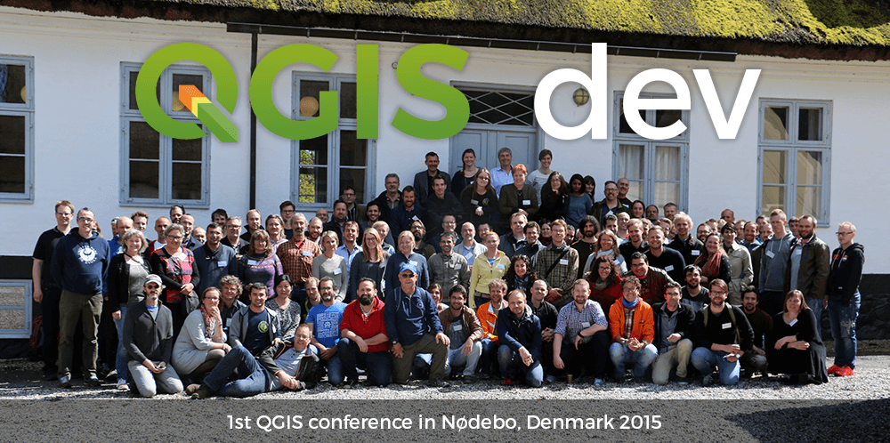



# Thank you for choosing QGIS!

## Your freshly baked copy of QGIS is downloading. 





##### Monitor Your Download
Downloads may take a while. Please **monitor the progress** using your **download manager**.

If your download didn't start, you can manually download QGIS from the [QGIS.org hosted downloads](https://download.qgis.org/downloads/).











##### Tips for first launch
If you have any questions while starting QGIS, welcome to our complete guide to installing for the first time.
<a href="/resources/installation-guide">Installation guide  </a>



## What's next?

For testing and learning purposes, [a sample dataset is available](https://docs.qgis.org/latest/en/docs/user_manual/introduction/getting_started.html#downloading-sample-data), which contains collections of data from different sources and in different formats.

You can also look at the cases - there are many inspiring stories there.



### Case Studies

We gather inspiring stories from actual users that showcase the versatility and power of the QGIS solution

[Find out more]()

  






### Local user groups

Join a community of like-minded individuals in your region.

[Local groups list]()

  





