# Shortcodes

Each shortcode described in corresponding `shortcodes/<name>.md` file.

    <h2>CSV Tables Shortcode</h2>
    
Can render a html table from CSV file or inner content.

    <a href="shortcodes/csv-table.md">
        
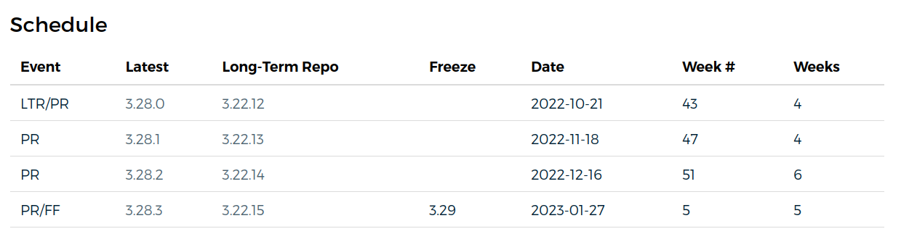

        
csv-table

    </a>

    <h2>Features Blocks Shortcode</h2>
    
Visually appealing feature sections with titles, descriptive text, and accompanying images on the main page.

    <a href="shortcodes/feature.md">
        
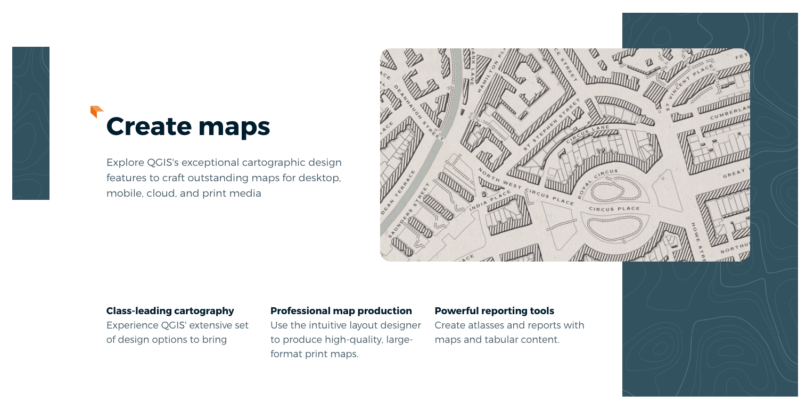

        
feature

    </a>

    <h2>Flickr Images Shortcode</h2>
    
The flickr-images shortcode allows you to display images fetched from content/flickr-images directory.

    <a href="shortcodes/flickr-images.md">
        
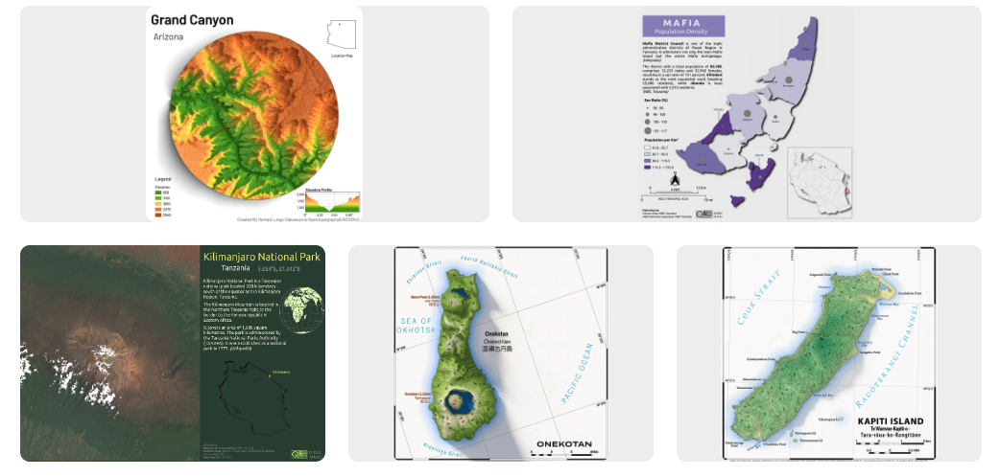

        
flickr-images

    </a>

    <h2>Full view of supporters list</h2>
    
Display detailed grid of supporters

    <a href="shortcodes/fund.md">
        
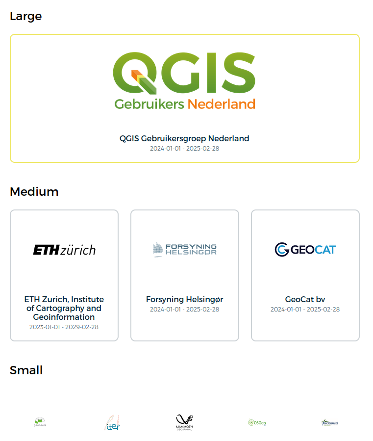

        
fund

    </a>

    <h2>Simple view of supporters list</h2>
    
Display short version grid of supporters(for the main page).

    <a href="shortcodes/funders-simple.md">
        
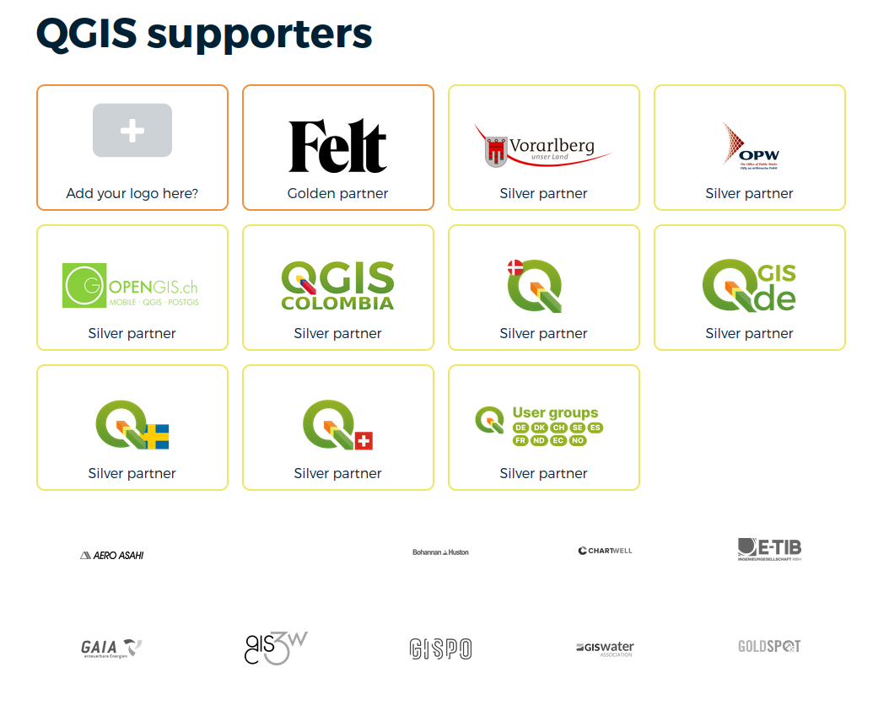

        
funders-simple

    </a>

    <h2>Paypal button</h2>
    
Inserts a button that leads to PayPal checkout.

    <a href="shortcodes/paypal-button.md">
        
paypal-button

    </a>

    <h2>Rich-box, Tips Shortcodes</h2>
    
Allows you to create structured layouts for displaying content with customizable sections and backbrounds.

    <a href="shortcodes/rich-box.md">
        

        
rich-box

    </a>

    <h2>Rich-list Shortcode</h2>
    
Customizable rich list items.

    <a href="shortcodes/rich-list.md">
        

        
rich-list

    </a>

    <h2>Roadmap Timer Shortcode</h2>
    
Visual representation of a project's roadmap, including various phases such as initial release, point releases, packaging, and availability of installers.

    <a href="shortcodes/roadmap.md">
        
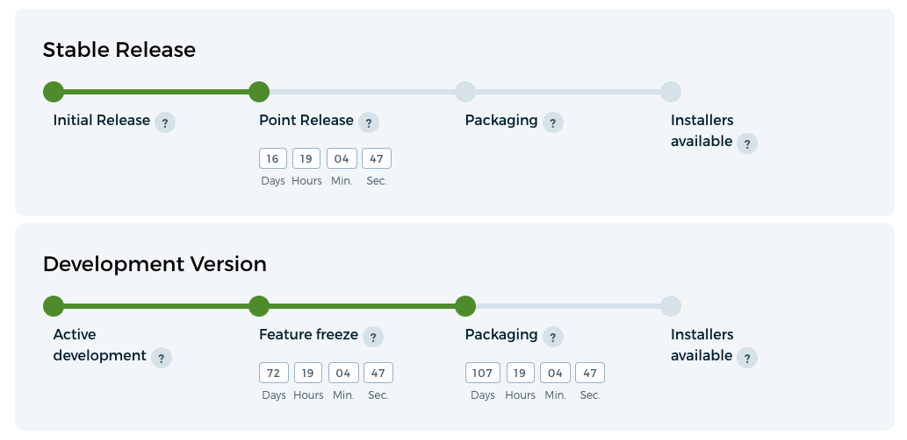

        
roadmap

    </a>

    <h2>Spoiler Shortcode</h2>
    
Foldable section. May contain md, html and other shortcodes inside.

    <a href="shortcodes/spoiler.md">
        

        
spoiler

    </a>

    <h2>Stripe-widget Shortcode</h2>
    
Inserts a donation form integrated with Stripe.

    <a href="shortcodes/stripe-widget.md">
        
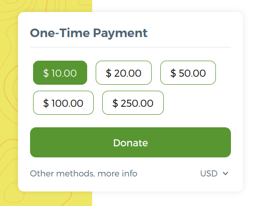

        
stripe-widget

    </a>

    <h2>Table of Contents Shortcode</h2>
    
Creates a list with links to anchor-headers from the current page. Currently used in visual changelogs.

    <a href="shortcodes/table-of-contents.md">
        
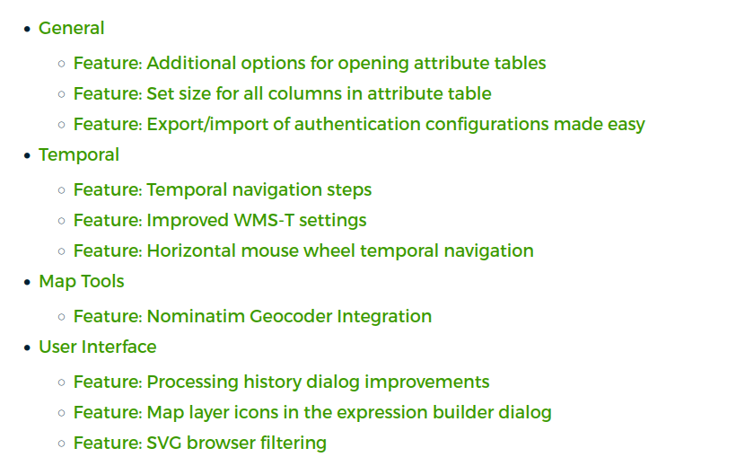

        
table-of-contents

    </a>

    <h2>Tabs Shortcode</h2>
    
Tabbed interface where content can be organized into separate tabs.

    <a href="shortcodes/tabs.md">
        
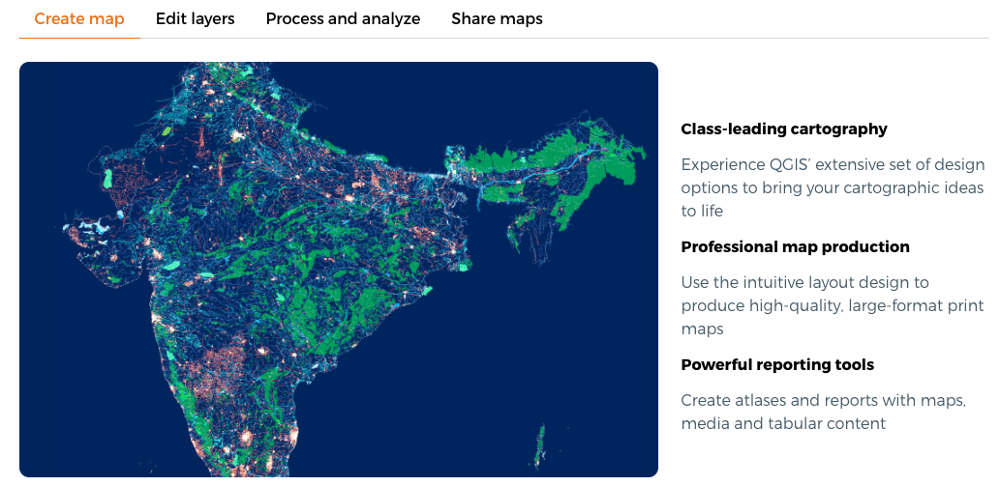

        
tabs

    </a>

    <h2>Usecases List Shortcode</h2>
    
Creates a grid with images and links to all case studies from content/product/case-studies

    <a href="shortcodes/usecases.md">
        
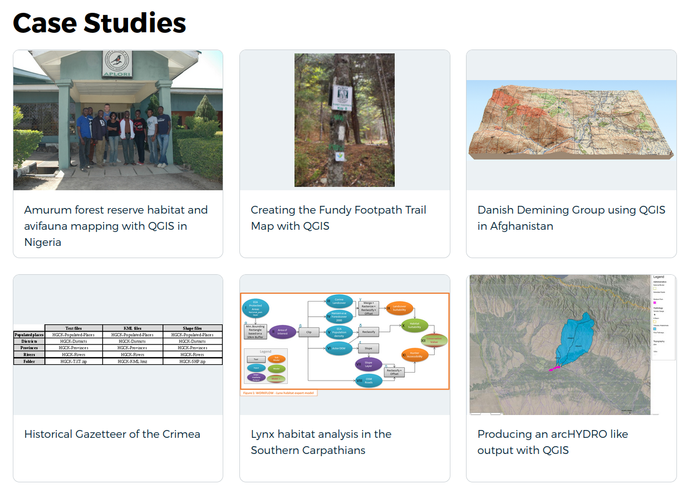

        
usecases 

    </a>

    <h2>Usecase Card Shortcode</h2>
    
Creates a card with the first case study from content/product/case-studies. 

    <a href="shortcodes/usecase.md">
        
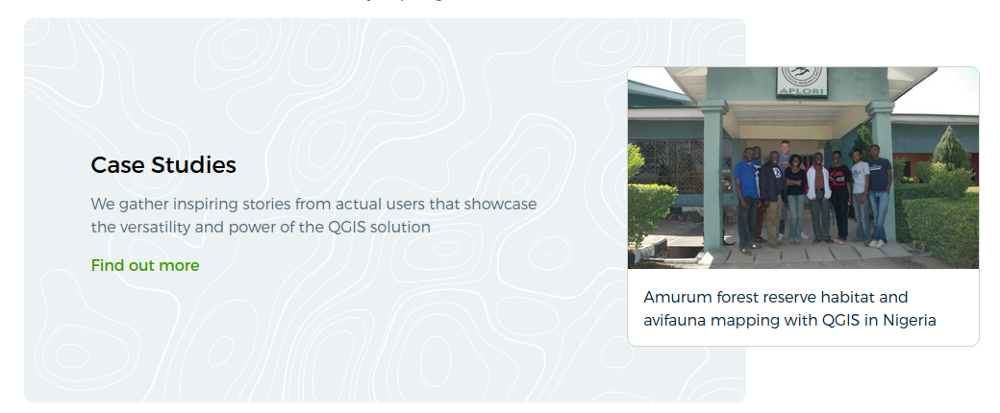

        
usecase

    </a>

    <h2>List of Visual Changelogs Shortcode</h2>
    
Creates a list of Visual Changelogs from content/product/visual-changelogs ordered by release date.

    <a href="shortcodes/visualchangelogs.md">
        
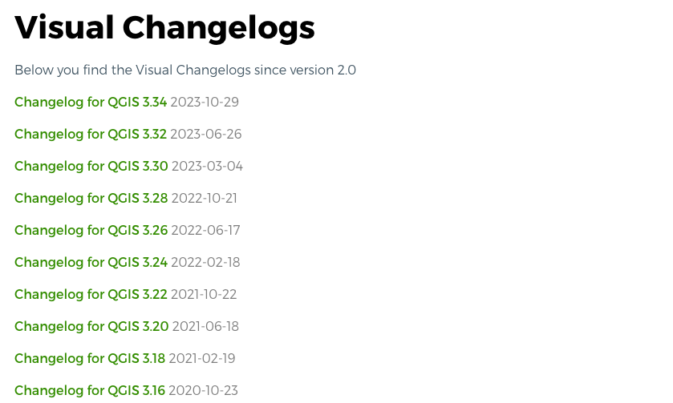

        
rich-list

    </a>

    <h2>Links parameters</h2>
    <a href="shortcodes/param-link.md">
        
param-link

    </a>

    <h2>Config parameters</h2>
    <a href="shortcodes/param-link.md">
        
param

    </a>

