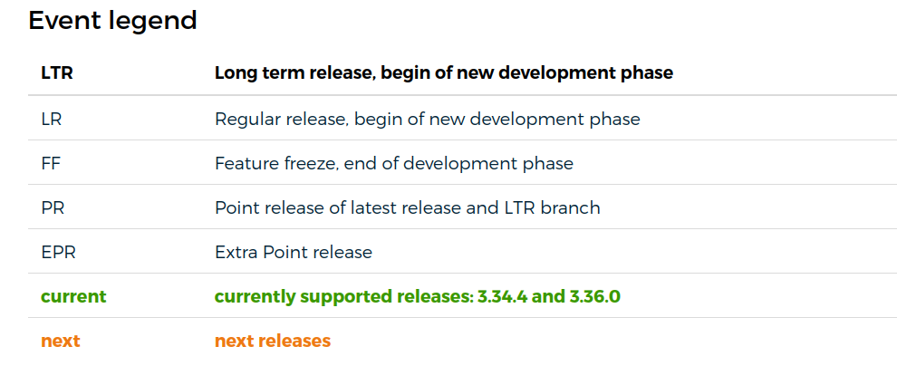

## csv-table

Can render a html table from CSV file or inner content

```

```


Example usage with inner content CSV:

```

"LTR","Long term release, begin of new development phase"
"LR","Regular release, begin of new development phase"
"FF","Feature freeze, end of development phase"
"PR","Point release of latest release and LTR branch"
"EPR","Extra Point release"
":rm-current:current",":rm-current:currently supported releases:  and "
":rm-next:next",":rm-next:next releases"

```

Note: `param` can be used inside to substitute dynamic vars



`:rm-next:`, `:rm-current:`, etc. are transformed into CSS classes from themes/hugo-bulma-blocks-theme/assets/sass/bulma/components/roadmap.sass. Currently this shortcode is used only for roadmap tables, that's why it's called roadmap.sass
