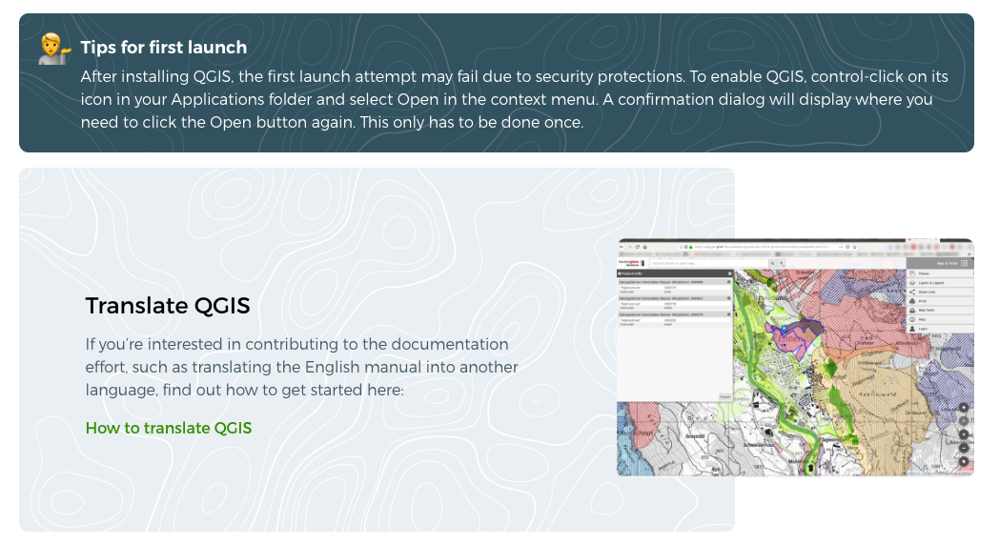
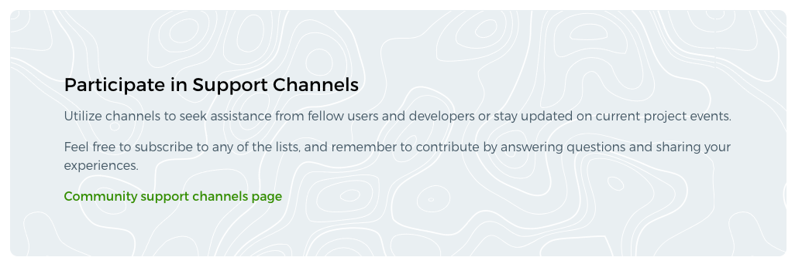
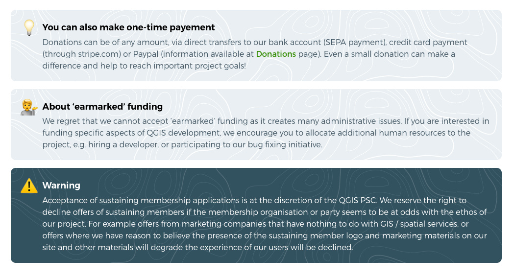
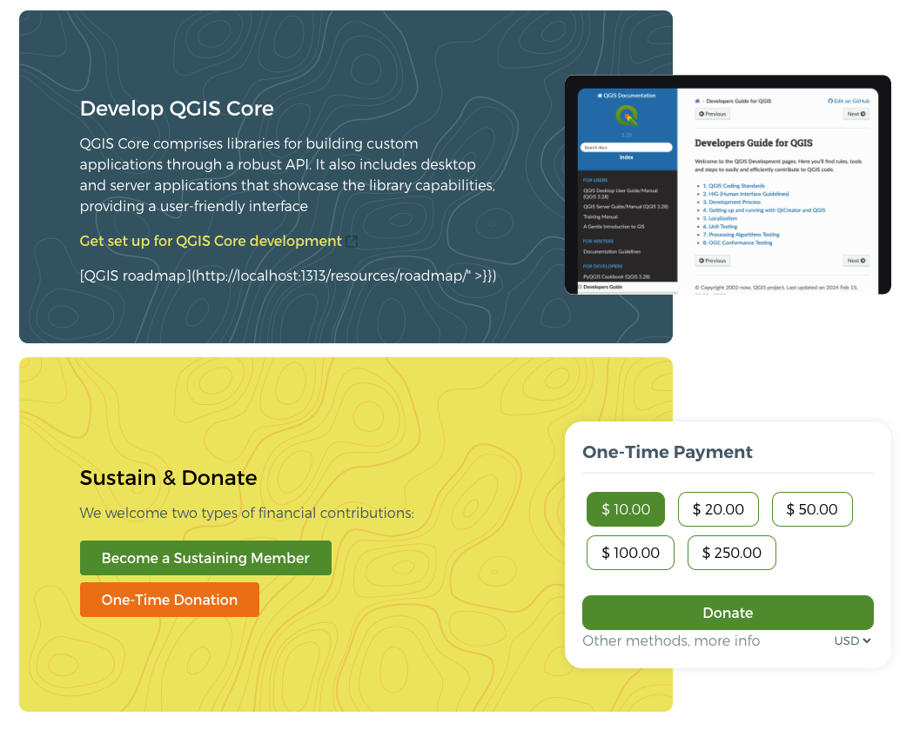

## ## Rich Box Shortcode



The rich box shortcodes allows you to create structured layouts for displaying rich content, with customizable sections to suit your needs.

**3 types of rich-boxes** 
- Block with content only
- Tips 
- Block with right part 


### Structure of shortcodes usage
```
|rich-box-start 
||rich-content-start 
|||content with markdown support 
||rich-content-end
||rich-right-start 
|||image im markdown view like  or another shortcode 
||rich-right-end
|rich-box-end
```

### Block with content only


#### Shortcodes structure
```
|rich-box-start 
||rich-content-start 
|||content with markdown support 
||rich-content-end
|rich-box-end
```

#### Parameters
- **layoutClass:** (Optional) Additional CSS classes to customize the layout of the rich box. Aplicable to rich-content-start shortcode. Supports various layout classes `coloring-1`, `coloring-2`,... `coloring-6` for flexible styling. 
- **id:** (Optional) Adds an HTML id attribute to the rich box container for targeted styling or scripting purposes.

**Example**

```


### Participate in Support Channels

Utilize channels to seek assistance from fellow users and developers or stay updated on current project events.

Feel free to subscribe to any of the lists, and remember to contribute by answering questions and sharing your experiences.

[Community support channels page](#)



```

### Tips


#### Shortcodes structure
```
|rich-box-start 
||rich-content-start 
|||content with markdown support 
||rich-content-end
|rich-box-end
```
#### How to use:

- To turn on the tips appearance you need to add ``layoutClass="tips"`` parameter to rich-box-start srotcode
- Add icon="💁" to display emoji in the tip
- We often used following icons: 💁💭💬🤔🧑‍🎓🤓🖖✌️🦄🦸⭐🌀🔮🪄🛟💡🕶️
- Also supports various rich-content-start classes `coloring-1`, `coloring-2`,... `coloring-6` for flexible styling.  

**Example**
```


##### Tips for first launch
After installing QGIS, the first launch attempt may fail due to security protections. To enable QGIS, control-click on its icon in your Applications folder and select Open in the context menu. A confirmation dialog will display where you need to click the Open button again. This only has to be done once.


```
### Block with right part


#### Shortcodes structure
```
|rich-box-start 
||rich-content-start 
|||content with markdown support 
||rich-content-end
||rich-right-start 
|||image im markdown view like  or another shortcode 
||rich-right-end
|rich-box-end
```

#### How to use:

- To turn on the correct appearance you need to add ``layoutClass="has-right"`` parameter to rich-box-start srotcode
- Also supports various rich-content-start classes `coloring-1`, `coloring-2`,... `coloring-6` for flexible styling. 
- rich-right-start has no additional parameters

**Example**
```


### QGIS Documentation

Creating documentation offers an ideal starting point for your first contribution to the project. If you're interested in joining the documentation effort, you can find a gentle introduction and guidelines here:

[How to write documentation](#)

  



```