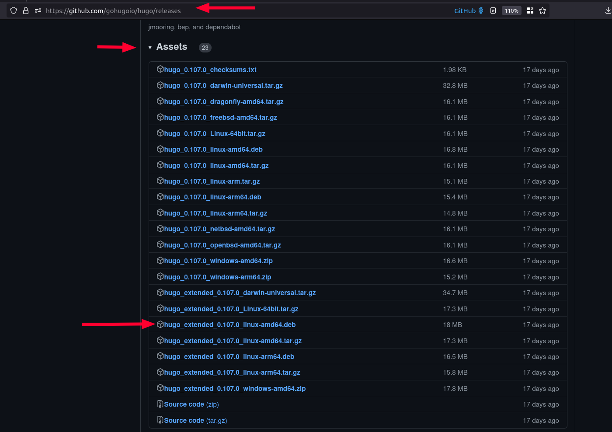
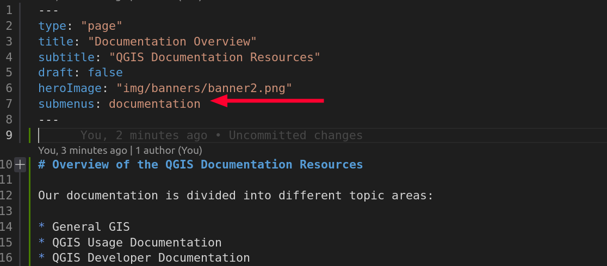
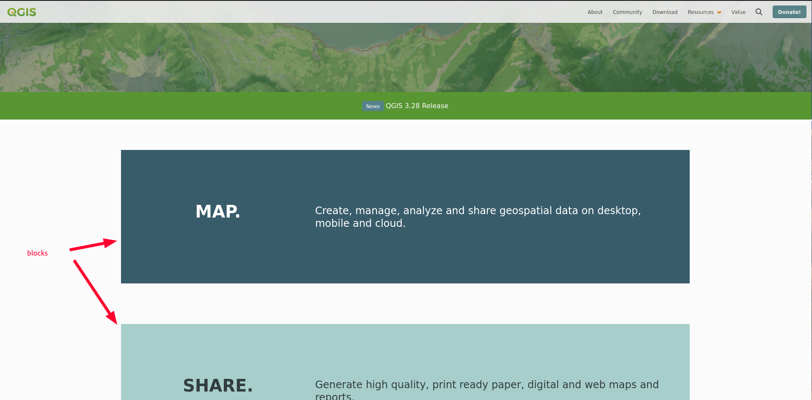
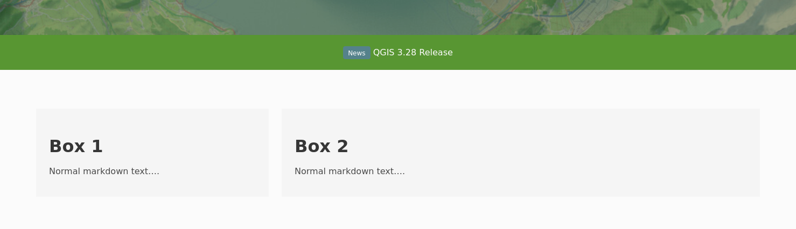
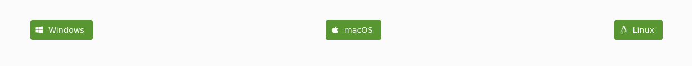
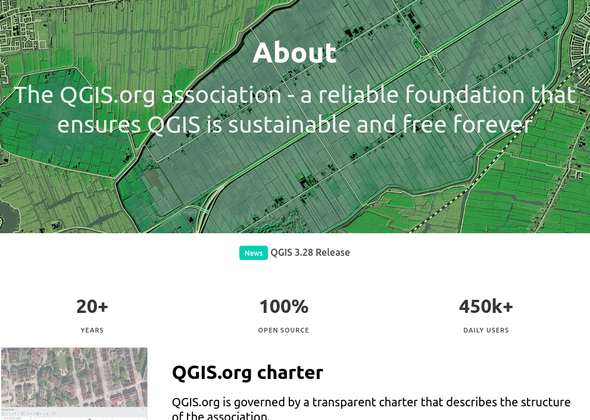
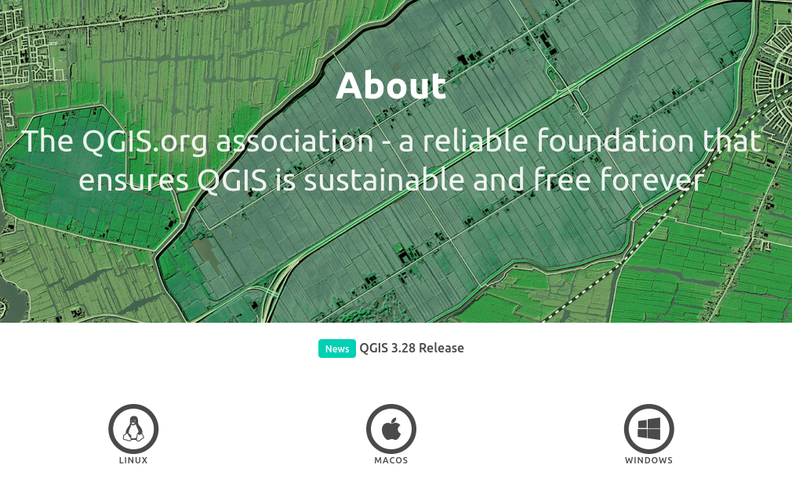
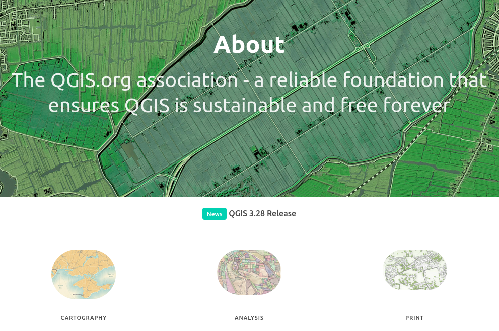
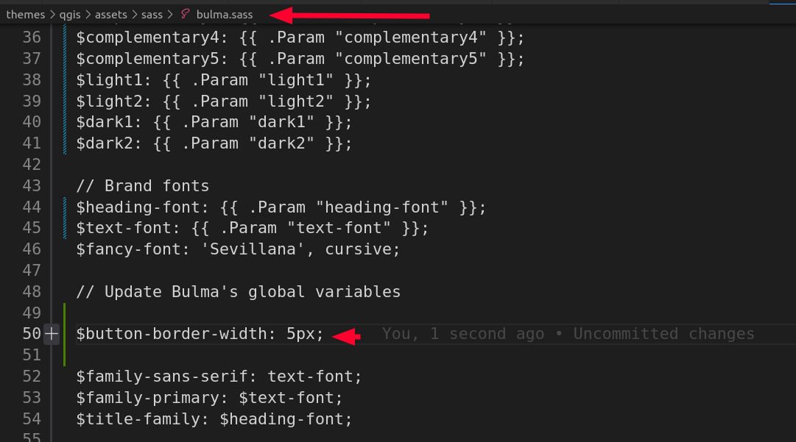

# Hugo Bulma Blocks Theme


By Tim Sutton

## Project Status

[](https://github.com/kartoza/hugo-bulma-blocks-theme/actions/workflows/e2e.yml)
[](https://github.com/kartoza/hugo-bulma-blocks-theme/actions/workflows/hugo.yml)


Project stars:


## TLDR

There is a lot of information in the README but you are probably too impatient
to read it and just want to test this theme out so try this:

```
hugo new site YOURSITENAME
cd YOURSITENAME
git init
git submodule add git@github.com:kartoza/hugo-bulma-blocks-theme.git themes/hugo-bulma-blocks-theme
git submodule update --init --recursive
cp themes/hugo-bulma-blocks-theme/exampleSite/config.toml .
vim config.toml 
hugo server
```

Here is an example of how you should structure your content folder if you want all the default menus etc. to work.


```
exampleSite/content
├── about
│   ├── index.md
│   ├── image1.png
│   └── image2.png
├── community
│   ├── index.md
│   └── image1.png
├── community-blogs
│   ├── index.md
│   ├── article1.md
├── documentation
│   └── overview.md
├── download
│   ├── download.md
│   ├── linuxbutton.png
│   ├── linux.md
│   ├── macbutton.png
│   ├── macos.md
│   ├── os-selection.md
│   ├── windowsbutton.png
│   └── windows.md
├── flagship-users
│   ├── corporation1.md
│   ├── corporation1.png
│   ├── corporation2.md
│   ├── corporation2.png
│   └── index.md
├── flickr-images
│   ├── example1.jpg
│   ├── example1.md
│   └── index.md
├── funders
│   ├── funder1.md
│   ├── funder1-logo.png
│   ├── funder2.md
│   ├── funder2-logo.png
│   ├── index.md
├── funding
│   ├── donate
│   │   ├── index.md
│   │   └── image.png
│   ├── shop
│   ├── sustaining-members
│   │   └── index.md
│   └── _index.md
├── hub
│   ├── index.md
│   └── example.png
├── license
│   └── index.md
├── news
│   ├── amy.md
│   ├── _index.md
│   └── kartoza3.28.md
├── people
│   ├── _index.md
│   └── tim-sutton.md
├── posts
│   └── _index.md
├── roadmap
│   └── roadmap.md
├── search
│   └── _index.html
├── showcase
│   ├── case-studies
│   │   ├── example1
│   │   │   ├── image.jpg
│   │   │   └── index.md
│   │   ├── example2
│   │   │   ├── image.jpg
│   │   │   ├── index.md
│   │   └── _index.md
│   ├── community-blogs.md
│   ├── _index.md
│   ├── maps.md
│   ├── overview.md
│   ├── screenshots.md
│   └── user-group-events.md
├── value-proposition
│   └── index.md
├── charter.md
├── _index.md
```

You can create this structure using the script provided:

```
./create-content-folders.sh
```

The script above also copies the stock footer.html from the theme into
```layouts\partials\footer.html``` which you can then modify according to your
needs.

Also put your logo in ```static/img/logo.png```:


Occasionally you may wish to update the theme, you can do so using:

```
git submodule update --remote
```


Ok now you should really read the rest of this document because this theme
provides a rich set of shortcodes and other niceties to make your site.

## 🏃Before you start

This web site is a static site built using [Hugo](https://gohugo.io/).


If you want to understand Hugo and the other technologies we used to build this site, there is some recommended reading for you below:

* Read [this article](https://cloudcannon.com/blog/the-ultimate-guide-to-hugo-sections/) on templates if you are looking to understand how templates work.

* Read [this article](https://www.regisphilibert.com/blog/2018/07/hugo-pipes-and-asset-processing-pipeline/) on hugo pipes, minifying content etc.

* Read [this article](https://blog.fullstackdigital.com/how-to-use-hugo-template-variables-in-scss-files-in-2018-b8a834accce) to see how you can use Hugo variables in your SCSS.

* Read [this article](https://versions.bulma.io/0.7.0/documentation/overview/customize/) to see the general process of customizing bulma with SASS. Note that in addition to this workflow, we also generate our SASS primary file (bulma.sass) from a Hugo template.

* This theme uses the [Bulma CSS framework](https://bulma.io/), which you should familiarise
yourself with if you want to change the theme.

* The relationship between some of the key concepts in Hugo is shown below:


The following key skills are needed for theme developers (DEV) and content creators (CC):

Technology | Notes | Who?
-----------|--------|-------
 | Essential skill for content creators. | DEV / CC
 | Streamlines your workflow. You can work directly in the GitHub website too. | DEV / CC
-----------|--------|-------
 | Needed for creating templates (shortcodes & partials). | DEV
 | Note that we also use Bulma. | DEV
 | We are trying to use as little javascript as possible. | DEV
 | A few utility scripts only. Mostly not needed. | DEV
 | Customising Bulma mainly. | DEV
 | Mainly Go templating via HUGO. | DEV
 | A few utility scripts only. | DEV

### Quickstart

To quickly check out the theme with our provided sample site, do this:

```
git clone https://github.com/kartoza/hugo-bulma-blocks-theme
cd hugo-bulma-blocks-theme/exampleSite
hugo server -t ../..
```


# open http://localhost:1313/

### Hugo Terminology Glossary

Term | Description
-----|---------------
content | Top level folder for your user created web site content
section | Any subfolder of content containing an ```_index.md``` file. e.g. the section ```content/about/``` would have within it a file called ```content/about/_index.md``` making it a section and resolvable at the URL ```https://your domain/about/```.
nested section | As above, creating a subsection, for example ```content/about/staff/_index.md```. Note that if the subsection contains only a single page, it will will be navigable as a page at e.g. ```https://your domain/about/staff/```
section template | By default a section with nested subfolders of content will render as a list. If you want to customize the section (i.e. not render as a list) you can make a section template in layouts/-section name-/section.html

## 🏺 Background & Design Philosopy

We are building for a web site that receives a **lot** of traffic so our website is designed to be fast, privacy respecting and open source.

* 💨 Fast: all pages are statically generated, there is no database, no bulky javascript or CSS frameworks etc.
* 🔒 Privacy respecting: as much as possible we avoid things that can be used to track you - no resources loaded from other web sites, no cookies, no trackers, no sessions etc.
* 🖊️Open source: The theme provided here is published under a permissive 🔑 [MIT License](LICENSE). 

**👏 A quick acknowledgement:** The starting point for this site was the web site created by the community around [jupiterbroadcasting.com](https://jupiterbroadcasting.com) . you can find their GitHub Repo [here](https://github.com/JupiterBroadcasting/jupiterbroadcasting.com) - although we have made so many changes, there probably isn't much left of the site we derived from in this repo.

## 🛒 Getting the Code

Navigate to your development directory

```
git clone https://github.com/kartoza/hugo-bulma-blocks-theme.git
```

## 🧑🏽‍💻 Development

First install hugo for your local machine:

**📝 Note:** we need to install the 'extended' hugo version which includes a SASS compiler. If you don't install the extended version you will get errors like this when compiling:

```
ERROR 2022/12/11 07:33:37 Rebuild failed: TOCSS: failed to transform 
"css/style.scss" (text/x-scss). Check your Hugo installation; you need 
the extended version to build SCSS/SASS.: this feature is not available 
in your current Hugo version, see https://goo.gl/YMrWcn for more information
```

You can find the extended version in the [releases page](https://github.com/gohugoio/hugo/releases).




### 🐧 Linux: 

Download the deb above and then do 

``sudo dpkg -i hugo_extended_<latest>_linux-amd64.deb``

### 🪟 Windows: 

[Follow these notes](https://gohugo.io/installation/windows/)

### 🍏 macOS: 

[Follow these notes](https://gohugo.io/installation/macos/)

## ⚙️ Setting up VSCode

If you are using VSCode, I recommend the following extensions:

* Hugo Language and Syntax Support
* Color Highlight

Clone the repo:

```
git clone https://github.com/kartoza/hugo-bulma-blocks-theme.git
```

Run the site:

Press ```Ctl-Shift-D``` then choose the following runner:

'Run dev using locally installed Hugo'

the click the green triangle next to  the runner to start it.

Once the site is running, you can open it at:

<http://localhost:1313>

The site will automatically refresh any page you have open if you edit it and save your work. Magical eh?

## Running End to End (e2e) Tests

Test files are located in ```test/e2e```.

You need to have these extras installed:

```
pip install pytest pytest-base-url playwright
```

These tests exist to make sure code changes to this repository do not break how the site currently functions.
They are intended to run on each commit to verify the site is working in expected order.

Read more on testing [here](https://github.com/kartoza/hugo-bulma-blocks-theme/blob/main/test/Readme.md).

## Creating and Running Tests

1. Navigate to the e2e test folder which is located in ```test/e2e```.
2. Create or edit a test file for the page or section you want to test and get coding, test files should start with the name test follow by the file name, example ```test_about_page.py```.

### Running tests in VSCode

We can enable built in pytest support in VSCode. 

**Note:** Before running the tests, you need to install the dependencies listed in REQUIREMENTS.txt:

```
pip install -r REQUIREMENTS.txt
```

And playwright:

```
pip install playwright
```


These should be set up by default when you open this project under VSCode, but if needed you can configure the VSCode settings to set the base-url (search for @id:python.testing.pytestArgs Testing in the settings filter):


Start the live debug server:


Now open the test explorer and run your tests:


Any failed tests will be marked in red as shown above.

### Running from the command line:

```
pytest --base-url=http://localhost:1313
```

### Running tests in docker

3. Start the hugo server in a terminal window ```make dev```.
4. Run test in terminal window ```make tests```

> **Note:** To run the tests as described above, you need to have docker installed on your machine and the appropriate permissions to run docker commands.

### Running as github action

There is a github action that will run the tests automatically on PR submission, merge.

See ```.github/workflows/e2e.yml```

## Content Harvesting

You can harvest data from various feeds using the fetch_feeds.py script. By default
flickr harvesting is disabled in this script so run it manually and review the content
to see if it is suitable for publication on our site.

```bash
./fetch_feeds.py --flickr=yes
```

This script is run nightly as a github action (see .github/workflows/update-feeds.yml).

## Search Functionality 
The search functionality uses both [FuseJS](https://fusejs.io/) and [MarkJS](https://markjs.io/).

The search functionality code is based on this [Blog Post](https://makewithhugo.com/add-search-to-a-hugo-site/) and [GitHub Gist](https://gist.github.com/eddiewebb/735feb48f50f0ddd65ae5606a1cb41ae) by [Eddie Webb](https://twitter.com/eddturtle).

Content folders need to be excluded from search, by making them [headless bundles](https://gohugo.io/content-management/page-bundles/#headless-bundle) - which we have done for the sustaining member and flagship user folders in content/. To make other content folders which are not rendererd and included in search results, add an ```index.md``` file with the following content: ```headless = true```.

## Referencing URLs in templates

The site needs to work in production, where the links of the site are all below the root URL, and in staging, where the site is deployed to GitHub pages in a subpath. To ensure both deployment strategies work, please use the following method of constructing URLs in templates.

```html
<a class="button is-primary" href="{{ "donate/" | absURL }}">
```

**Note:** We do not use a leading slash, only an ending slash.
## 📁 File naming conventions

* Separate words in file names with hyphens e.g. windows-download.md
* Avoid abbreviations in the words of your files
* Write file names in lower case only
* No spaces in file names

## 🤝 Contributing to this project

We welcome your contributions! All contributors are expected to sign a contributor license agreement (CLA) which you can see [here](https://gist.github.com/timlinux/cc20c0b8860648da977a261d46b170d4). This process is automatically enabled when you create your first pull request via https://cla-assistant.io/.

[](https://cla-assistant.io/kartoza/hugo-bulma-blocks-theme)

## 💮 Changing the templates

Page type | Path
----------|---------------
Landing Page | layouts/index.html
Top Level Pages | layouts/_default/single.html

## 🏠 Editing the landing (home) page

The ``content/_index.md`` is the content for the landing page. Just edit whatever you like there. The blocks shortcodes are described below.

## 📃 Adding a top level page

### Create the content

Content pages are stored in the ``content`` folder. The top level documents there will be rendered with the top level page theming.

For example to add an about page, create ``content/about.md``

The page will be accessible then at /about/

### 🖼️ Referencing Images and Media

Place images and media in ```stati./README-images```. Everything in ```static``` is referenced
from the top level of the site e.g.  ```stati./README-images/foo.png``` would be referenced in
markdown as ``./README-images/foo.png```.
## 🌶️ Working with menus

There are two menus, the primary (1) menu which appears at the top of the page, and the secondary menu (2) which may appear beneath it depending on context.


### Primary Menu Pages

For pages to appear in the top menu, you need to add an entry to
``config.toml`` for example the menu for the above about page will be:

```
[[menu.main]]
  name = "About"
  url = "/about/"
  weight = -110
  # pre = "<i class='fa-solid fa-clipboard-question mr-1'></i>"
```

**Note:** The ```pre``` item is commented out. If you uncomment it, it will place a font awesome icon before the text of the menu item.


### Secondary Menu Pages

For pages to appear in the secondary menu, you need to add an entry to
``config.toml`` for example the menu for the documentation page will be:

```
[[menu.learning]]
  name = "Documentation"
  url = "/documentation/documentation-overview/"
  weight = -110
  #pre = "<i class='fa-solid fa-clipboard-question mr-1'></i>"
  [menu.learning.params]
    submenu = "documentation"
```

Use the ```submenu``` parameter to define which submenu the menu entry shouldn be shown in. You can create as many submenu terms as you like, and then associate pages to these submenus in the front matter of your markdown documents.

### Displaying a secondary menu

In order for a secondary menu to be displayed, your content page needs to specify the submenu name in the front matter e.g.:



Example front matter listing:

```
---
type: "page"
title: "Documentation Overview"
subtitle: "Documentation Resources"
draft: false
heroImage: "img/banners/banner2.png"
submenus: documentation
---
```

**Note:** Despite the pluralised name, you should only specify one submenu name.

All of the menu entries specified in config.toml with a matching submenus term will be shown in the secondary menu when you add this to the front matter. If you specify no submenus= entry in the front matter, the secondary menu will not be rendered.

### Modifying the menu templates

The primary menu template is implemented in ```layouts/partials/menu.html```.

The secondary menu template is implemented in ```layouts/partials/submenu.html```.

**Note:** You typically will not need to edit the above files unless you are a developer.

## 🚧 Working with blocks

Blocks span the page from left to right and contain sub elements for title, description, link etc.



Blocks are defined in ```layouts/shortcodes/block```. To use a block, simply add it to your markdown as per this example:

```

```

If you want to include markdown content inside the block you can do it as inner content like this:

```

More details khdkjhksj dhjfhs dkj hsfdjkh fsd

```

The options for a block are:

Name | Description
-----|-------------
title | Title for the block
subtitle | Subtitled for the block
link | Optional: URL to have a link to at the bottom left of the block
link-text | Mandatory if link  provided: Text to show with the hyperlink.
class | defaults to is-primary. Use this to set the bulma class for the block.
animate | defaults to false. Experimental support for animating blocks into place as they enter the viewport.
sub-block-side | defaults to 'cover'. Choose which side (left, right) or cover. Use cover to span the content across the whole block. If an image is set, the image will cover the block or be placed left or right as indicated here.
image | optional. Place your images into the same folder as the markdown file (so that they are 'bundle resources in hugo terminology') and then reference by the file name only e.g. "some-image.png". 


**Note:** Do not include a leading slash in the image path!

## 🪪 Working with Boxes and Columns

We carry over the idea of [boxes](https://bulma.io/documentation/elements/box/) and [columns](https://bulma.io/documentation/columns/) from bulma. They can be used to arrange content in a side by side fashion or a grid of content boxes.

First a simple example:

```



# Box 1

Normal markdown text....




# Box 2

Normal markdown text....





```

Will render like this:


To render the blocks side by side, we can make a small tweak like this:


```




# Box 1

Normal markdown text....






# Box 2

Normal markdown text....






```

Above you can see we close each column before setting the nextWill render like this:


One last column arrangement example shows how we can use the [bulma column sizes](https://bulma.io/documentation/columns/sizes/) to define specific column sizes:

```




# Box 1

Normal markdown text....






# Box 2

Normal markdown text....






```

Above you can see we use the is-one-third / is-two-thirds classes on each column so they render like this:



The content you write within boxes can be normal markdown and can use any of the shortcode components described in this readme.  Here is an example from the download page showing a QR code block and a content card side by side in the grid.


### 🎬 Starting a box

Before starting your markdown content, start a card using the ```box-start``` shortcode so it lays out nicely in our grid:

```


This is the all-in-one stable release installer. The software 
you receive with the free download link and the download and
donate link is identical. For other Windows installer variants 
see here.
```

A ```box-start``` shortcode can take the following parameters:

Name | Description
-----|-------------
header | A short piece of text to display in the card header
classes | (Optional) Any bulma classes you want to have applied to the internal content section of the card.
ribbon | A word or two to display at the top left of the box.
ribbon-classes | A bulma class such as ``is-primary`` to set the style of the ribbon. See also the [Bulma Ribbon](https://github.com/Wikiki/bulma-ribbon) page for other modifier classes that can be used.

Here is an example of a box with ribbon set:

```


Acceptance of sustaining members shall be subject to the discretion and approval of The Board,
who reserve the right to accept or reject applications for sustaining membership and
ongoing support memberships as deemed appropriate.


```


### 🔚 Ending a box

When you are done writing your content, end a box using the ```box-end``` shortcode:

```

```

A ```box-end``` shortcode takes no parameters:

## Content

If you are writing plain markdown, you can also wrap it in content shortcodes (instead of the card shortcode described above) like this:

```


# Markdown header

Markdown content


```

Name | Description
-----|-------------
classes | (Optional) Any bulma classes you want to have applied to the internal content section of the card.
## Button 

The ```button``` shortcode is a way to put a single button link element onto your page:



```

```

**Note:** We do not use a leading slash for internal links, only an ending slash. If you want the link to open in a new tab, start the link with https: or mailto:


## Info Bar

The ```info-bar``` shortcode is a way to put a infographic style element onto your page:



```

```

To use info-bar, pass it a collection of key-value pairs separated by ``:`` colons as
illustrated above.

## Icon Bar

The ```info-icons``` shortcode is a way to put a row of circular fontawesome icon elements onto your page:



```

```

To use icon-bar, pass it a collection of key-value pairs separated by ``:`` colons as illustrated above. The second value should be a [fontawesome image name](https://fontawesome.com/search).


## Image Bar

The ```image-bar``` shortcode is a way to put a row of circular image elements onto your page:



```

```

To use image-bar, pass it a collection of key-value pairs separated by ``:`` colons as
illustrated above. The second value should be a path to an image.

## Image Block Bar

The ```image-block-bar``` shortcode is a way to put a row of image elements with titles and subtitles onto your page:


```

```

To use image-block-bar, pass it a collection of key-value tipleets separated by ``:`` colons as illustrated above. The first value in each triplet is the title. The second value should be a subtitle. The third should be a path to an image.


## Button Bar

The ```button-bar``` shortcode is a way to put a row of button link elements onto your page:


```

```

**Note:** We do not use a leading slash for internal links, only an ending slash. If you want the link to open in a new tab, start the link with https: or mailto:

To use button-bar, pass it a collection of key-value triplets separated by ``:`` colons as
illustrated above. 

1. The first value should be a [fontawesome image name](https://fontawesome.com/search).
2. The second value should be the label for the button.
3. The third value should be the link that clicking the button will lead to.

You can add as many buttons as you like to the bar, and they will be distributed evenly accross the page.

## Steps Bar

The ```steps-bar``` shortcode is a way to put a row of steps onto your page:


```

```

To use steps-bar, pass it a collection of key-value triplets separated by ``:`` colons as
illustrated above. 

1. The first value should be a [fontawesome image name](https://fontawesome.com/search).
2. The second value should be the label for the step.
3. The third value should be true or false indicating which step is active.

You can add as many steps as you like to the bar, and they will be distributed evenly accross the page.

## Example using them together

```





```

## 🩳 Customising CSS

### Brand Identity

Brand colours are established in ```config.toml```.


These are compiled into the SASS theme when Hugo builds the site. You can further
modify the branding by overriding bulma variables. To do this, edit ```assets/sass/bulma.sass``` and add your variables. Each bulma page includes a list of variables at the bottom of the page which can be used to override the default bulma styling for the various elements they provide. For example, we can to the [variable list](https://bulma.io/documentation/elements/button/#variables) for bulma buttons and choose a property to modify:


Next, set a value for that variable in ```assets/sass/bulma.sass```:



Finally, to rather use the parameter defined in ```config.toml```, you can use this syntax:


```$navbar-background-color: {{ .Param "light2" }};```


## Bulma Extensions

We use various bulma css framework extension. If you need to add more, place them with the others in ```assets/sass``` and then reference the addition in ```assets/sass/bulma.sass``` (as shown in the example below). Always use the SASS version so that the them branding is properly applied. More bulma extensions can be found in 

```sass
/* Extensions */
/* Steps - see https://github.com/aramvisser/bulma-steps */
@import "bulma-steps.sass"
/* Pricing table - see https://github.com/Wikiki/bulma-pricingtable */
@import "bulma-pricing-table.sass"
/* Badge - see https://github.com/CreativeBulma/bulma-badge/ */
@import "bulma-pricing-table.sass"
```

## Other CSS Customizations

Put your customizations in ```assets/css/custom.css```.

We use a hugo minification and combining  workflow - see the header layout in ```layouts/partials/header.html```.
